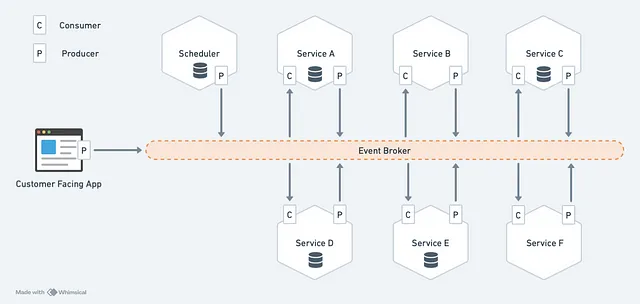
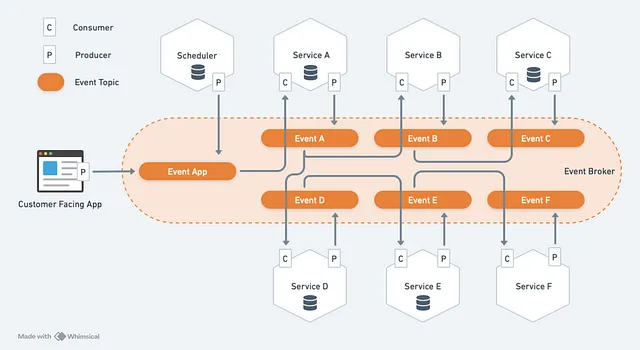
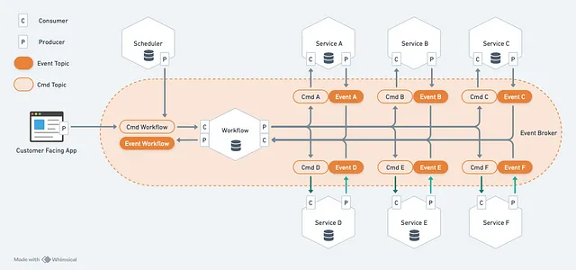
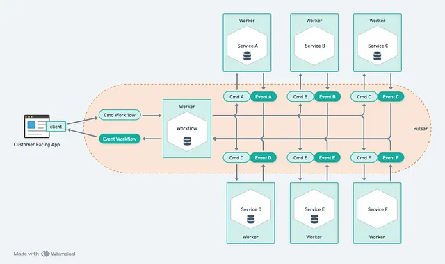
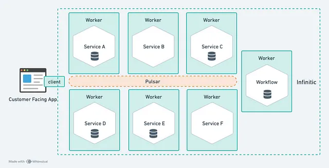
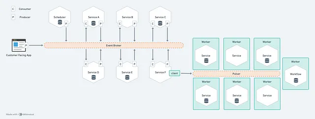

# Event-Driven Data Architecture

!!! quote

    I believe that the way the industry is often building asynchronous event-driven
    applications is misguided and can be greatly improved.[^1]

Online businesses (online food ordering and delivery, ride-hailing, financial applications,
e-commerces, etc.) often have business processes implemented with services
(Orders, Notifications, Tracking, Payments, Users, etc.) communicating through
an event broker (e.g. Kafka, NATS, Solace, RabbitMQ or Pulsar):

<figure markdown="span">
  { loading=lazy width="700" }
  <figcaption>Business process running through services exchanging events</figcaption>
</figure>

**Using events has many advantages**:

- Unlike API-driven services, event-driven services can function independently
  of each other, passing messages that are stored durably in the event brokers.
  This makes business processes very reliable by design: even if a service is down,
  it will be able to resume when it’s back up again.
- You do not need to oversize your infrastructure: adding more process instances
  will increase latency in their execution but will not break your services
  (as long as your event broker can handle new messages).
- It’s flexible enough that you can easily add an action by “hooking” a service to an event. To do this, you don’t need to update the service that issued the event. From an organizational point of view, it’s an appreciable flexibility.

!!! warning

    However, this event-driven pattern does not simplify your life.

---

## :material-arrow-down-right: Getting Started

:material-page-last: Asynchronous communication is much more complex than it appears.
You must not only operate an event broker, but also write a lot of boilerplate code,
as you have to define your queues, define your messages (types and schemas),
learn the event broker APIs and write specific consumers and producers,
implement error handling, and be extra careful not to break anything during updates.

### The Choreography Pattern

Vendors like Confluent try to convince you that a central event broker cleans up
the mess created by direct inter-service HTTP communications.
But in practice, each event-driven service reacts to other service events and
produces its own events (this is why it’s called the _choreography_ pattern).
So instead of API-driven services calling other ones, we have event-driven services
pulling messages from other ones:

<figure markdown="span">
  { loading=lazy width="700" }
  <figcaption>Choreography Pattern</figcaption>
</figure>

**Despite being ubiquitous, this pattern has important issues**:

- There is no easy way to understand how a specific business process is actually
  implemented. The whole process is defined by how each service reacts to others.
  ==There is no central repository, and the implementation details of business
  processes are scattered everywhere.==
- For the same reason as above, there’s no easy way to understand what business
  processes are running. Your customer-support and customer-success teams will
  soon be forcing you to set up some kind of tracing system to be able to do this.
- A service must know the structure of the events it must react to.
  A modification to an event can break the services that use it downstream.
  It’s an important issue, especially if multiple teams are evolved.
- “Fan-in” situations where a service wants to react to multiple events combined
  are complex to implement as they require storing states.
- Implementing transactions (when multiple service executions must be successful
  together or none) is challenging as well.
- Updating the code of a business process without breaking ongoing ones is really
  difficult.

---

### The Orchestrator Pattern

As we can see above, event-driven applications based on the choreography pattern
are efficient when running, but complex to implement and very complex to maintain.

!!! note

    For these reasons, I think an “orchestration” model is preferable.
    In this pattern, a service called “orchestrator” or “workflow” is responsible
    for managing service executions based on the business process definition.

Historically, these orchestrators were rather cumbersome, low-performance software,
like BPM engines. But _today an orchestrator can be lightweight and event-based_
to keep all the benefits described above:

<figure markdown="span">
  { loading=lazy width="700" }
  <figcaption>Orchestrator Pattern</figcaption>
</figure>

Conceptually, this pattern it simpler:

- Each service has a command and an event topic. The service reacts to commands (“create invoice”) by producing events (“invoice created”).
- Each workflow service pilots business processes by producing commands to services (potentially to other workflows) and consuming the corresponding events. A workflow service has its own database to store the current state of processes, that are now visible.
- Workflow services are horizontally scalable. But for consistency we should no have race condition when updating a state — either by locking the corresponding row in the database — or by ensuring that a specific process instance will always be handled by the same workflow service instance. I prefer the latter, which is more scalable and allows also to cache the state in-memory.

The benefits of this pattern are:

- The services are better decoupled, as they no longer need to know what events the other services are producing. (The workflow services need to know about other services, but it is precisely their role to ensure the smooth flow of data between services).
- It’s easy to understand how a process is implemented, as it’s described within the workflow service.
- The workflow services can easily implement sophisticated workflows, including compensations if needed.
- The workflow services can be versioned to ensure the smooth updates of business processes.

---

### Infinitic Framework

In practice, nevertheless, this pattern is more complex to implement,
and I believe this is why it’s more rarely implemented, despite its many benefits.
That’s why we created [Infinitic](https://www.infinitic.io/),
a framework to make event-driven applications easy using the orchestrator pattern.

This is what an event-driven application using Infinitic looks like:

<figure markdown="span">
  { loading=lazy width="700" }
  <figcaption>Infinitic Framework</figcaption>
</figure>

Where everything in green is provided by Infinitic:

- The topics topology with their schemas are managed for you
- A Client to start and interact with workflows.
- The Service workers wrapping your Java services (removing the need for you to implement consumers and producers, and to manage data serialization and deserialization).
- The Workflow workers providing an easy way to implement your business logic
  in full Java. (_This will be the subject of another article._)

The scheduler has disappeared from the diagram because Infinitic provides its own,
simplifying the architecture even further.

As you do not need to know the internals of Infinitic to run it, we can simplify
the above illustration to:

<figure markdown="span">
  { loading=lazy width="700" }
  <figcaption>Infinitic Framework Internals</figcaption>
</figure>

By providing all the boilerplate code, Infinitic makes it easier to build an
event-based application using an orchestration pattern with the following
benefits:

- Excellent scalability and resilience
- Horizontally scalable event-driven services that are entirely decoupled
- Horizontally scalable workflow services
- Built-in error-management (retries, dead letter queues, error propagation, etc.)
- Ability to code the more complex business processes (e.g. including timers or signals)
- Centralized and git-versioned definitions for workflows.
- Ability to update workflows without breaking running ones.
- Built-in observability of workflows states.

Note that you do not need to switch your entire infrastructure to Infinitic
to start using it.
You can easily start with an isolated process:

<figure markdown="span">
  { loading=lazy width="700" }
  <figcaption>Use of Infinitic for an isolated sub-process</figcaption>
</figure>

Infinitic is currently based on [Apache Pulsar](https://pulsar.apache.org/),
which has the right features for an ideal implementation
(message queues, key-shared subscriptions, delayed messages).
Other platforms like Kafka or RabbitMQ could be added later as they add
those features.

_You do not need to know Pulsar at all to use Infinitic_.
You just need a running instance.
If you are not familiar with it, you will find managed instances at companies
such as [StreamNative](https://streamnative.io/), [Datastax](https://www.datastax.com/products/astra-streaming),
or [CleverCloud](https://www.clever-cloud.com/product/pulsar/).

---

## :material-source-commit-end: Conclusion

While the choreography pattern for event-driven applications is widely used,
the orchestrator pattern offers significant advantages by centralizing process
flow management within dedicated workflow services.
This approach promotes better decoupling of services, easier comprehension of
business process implementations, and simpler handling of complex workflows,
transactions, and process versioning. However, implementing the orchestrator
pattern can be challenging due to increased complexity. Thankfully, frameworks like Infinitic
greatly simplify adoption by providing the necessary boilerplate code allowing
developers to focus on implementing business logic while enjoying the benefits
of an orchestrator pattern with minimal overhead.

---

## Read Mores

- [:simple-medium: An Easy Path From API-Based Microservices to An Event-Driven Architecture For Improved Reliability and Consistency](https://gillesbarbier.medium.com/an-easy-path-from-api-based-microservices-to-an-event-driven-architecture-for-improved-reliability-00d7d0bc3828)

[^1]: The Way We Are Building Event-Driven Applications is Misguided. [:simple-medium: This is Why We Created Infinitic](https://gillesbarbier.medium.com/the-way-we-are-building-event-driven-applications-is-misguided-7f7c5f1a9061)
