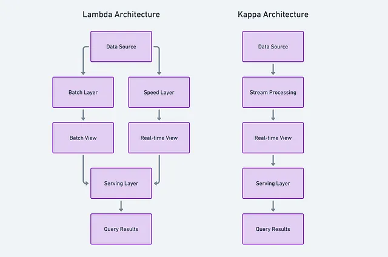

# Lambda and Kappa Architecture

Data Engineers and Architects are constantly seeking ways to build scalable,
fault-tolerant, and efficient data processing systems.
Two prominent architectures that have emerged to address these challenges are
**Lambda and Kappa Architecture**.
In this article, we will explore these architectures, their key components,
and how they relate to the traditional Data Warehouse.

## Reference

- [Lambda and Kappa Architecture](https://medium.com/@nydas/lambda-and-kappa-architecture-594c54d7c81f)
