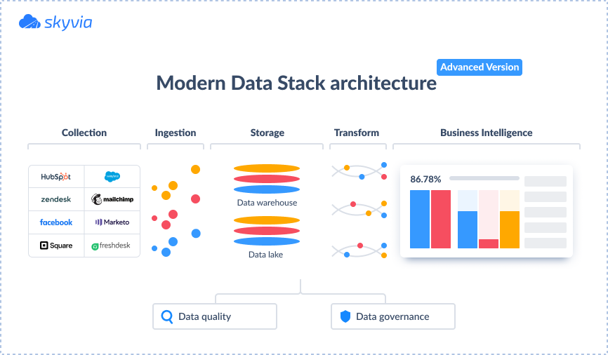

# Modern Data Stack

:material-format-list-group: **Modern Data Stack (MDS)** is a collection of _Software Tools_
and _Cloud Services_ that used to Collect, Process, Store, and Analyze data.

<figure markdown="span">
  { loading=lazy width="700" }
  <figcaption><a href="https://bitestreams.com/blog/modern-data-stack/">DBT Ecosystem Overview</a></figcaption>
</figure>

You can see the below diagram show a ==Modern Data Stack Ecosystem== that include
the [Cloud Services](../../services/index.md) more than the [Open-Source Stacks](../../tools/index.md).

<figure markdown="span">
  { loading=lazy width="700" }
  <figcaption><a href="https://atlan.com/modern-data-stack-101/">Modern Data Stack Ecosystem</a></figcaption>
</figure>

:material-page-last: As such, the definition of a **Modern Data Stack** cannot
be clearly stated since every business tries to adapt modern technologies to
their requirements.

However, there are definite features of the modern data stack that identify it:

- It’s **Cloud-Based**, requires very little maintenance, is easy to install,
  and can scale quickly with little effort.
- It can be used by **Small and Medium-Sized Data Teams**, as it has a lot of
  out-of-the-box functionality and doesn't rely on the number of data professionals.
- It offers a **Lot of Integration Opportunities** for creating a comprehensive
  data ecosystem.

---

## :material-arrow-down-right: Getting Started

:material-page-last: **Modern Data Stack** advocates a lot of changes, but if not
done right they can be painful, expensive, and risky. Most often when I talk to
data stack owners in the enterprise, the question is not so much how one tool
compares to another but whether they can live with the status quo or Have a strong
enough desire to change.

**The Key Concepts**:

- Easy to Try & Deploy
- Massive Scalability; _Data_, _Users_, and _Use-Cases_
- Composable Data Stack
- Flexible Pricing

---

<figure markdown="span">
  { loading=lazy width="700" }
  <figcaption><a href="https://www.datafold.com/blog/the-modern-data-stack-open-source-edition#instrumentation/">The Modern Open-Source Data Stack</a></figcaption>
</figure>

:material-page-last: **Modern Data Stack** allows you to build on top of the software
of giants instead of adopting the "^^**not invented here syndrome**^^".
Consider whether the business value from your analytics solution is coming from
how well you manage your data pipelines and data infrastructure, versus how well
you build analytics and AI products on top of your infrastructure.

---

Overall, the **Modern Data Stack** centerpiece is about democratizing data usage:
^^Making data more accessible, covering different dimensions of business, improving
analytics capabilities, and simplifying the infrastructure^^.

<figure markdown="span">
  { loading=lazy width="650" }
  <figcaption><a href="https://blog.skyvia.com/modern-data-stack/">Modern Data Stack Architecture</a></figcaption>
</figure>

:material-page-last: If the advantages of Modern Data Stack do not seem convincing
enough, let's have a look at how it differs from the **Traditional Data Stack**.

| **Traditional Data Stack**             | **Modern Data Stack**                                     |
|----------------------------------------|-----------------------------------------------------------|
| Has coupled structure                  | Has modular structure                                     |
| Complex setup requiring large IT teams | Less time on technical configuration                      |
| Requires serious technical background  | Suitable for users without extensive technical background |
| Contains traditional RDBMS             | Works with RDBMS as well as big data, unstructured data   |

The Modern Data Stack provides businesses with a bias for action.
Creating a Modern Data Stack enables organizations to devote more time to analyzing
their data and less time engineering their data processing pipelines.

---

## :material-playlist-plus: Read Mores

-
