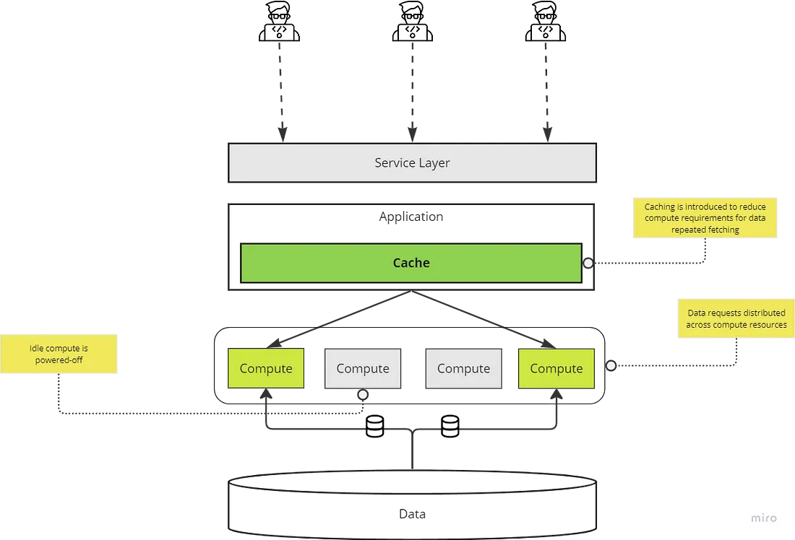
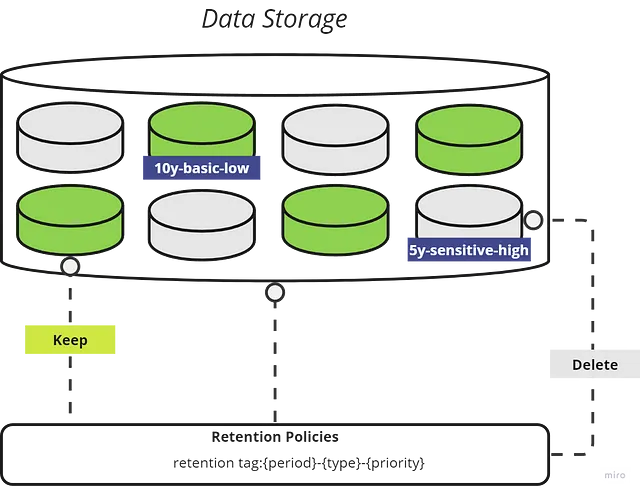
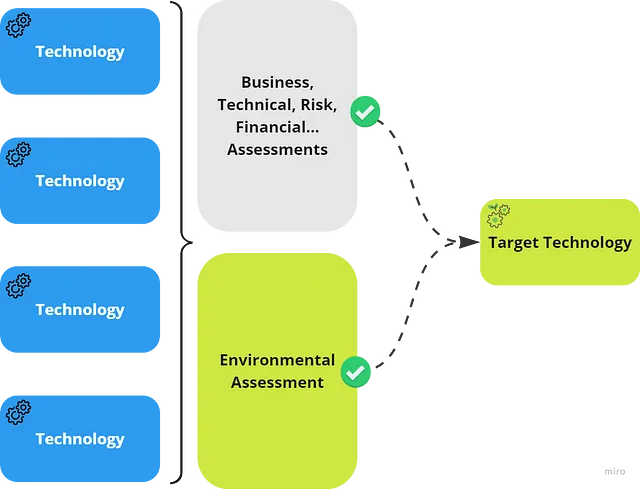

# Data Integration & Transformation

!!! quote

    How should developers and data practitioners start to incorporate environmental
    factors when developing end-to-end data solutions?[^1]

## Getting Started

### Sustainable Data Ingestion

#### Data minimization

Ensuring that only **required data** is needed for a data ingestion process mitigates
excess energy consumption. This can be on a full dataset or on a table field level.
Before any data source connection, the data needed should be explicitly listed
and reviewed.
In some cases, developers may choose to ingest all the data so as not to run into
the process of further adjustments or features to the pipelines, which may result
in short term effort reduction yet increasing compute and data transfer long term.
Data minimization can apply both to the data ingestion and serving level.

- Ensure that only **required data** is ingested.

#### Scheduling

Data requirements collected will contain **freshness** criteria.
That is consumers are expecting to have this data up to date within a needed time
interval.
Ingestion of data in real-time can incur large costs and increase energy consumption.
It’s important that requirements are well reviewed beforehand, to ensure that
such costs are mitigated if **SLAs (service level agreements)** do not meet real-time
data requirements.

- Review data freshness requirements and adjust frequency of ingestion accordingly.

#### Incremental Data Loading

Loading data from source systems can present hurdles depending on the data
characteristics and the system itself. Full batch data loading involves loading
the same data repeatedly to capture newly added or updated records.
This approach results in redundancy and can require significant compute resources
to complete. Strategies to employ here should incorporate [^^**incremental
loading strategies**^^](https://towardsdatascience.com/data-engineering-incremental-data-loading-strategies-b4d62f9dab28)
to ensure only new and updated records are captured and ingested.

- Load and update data **incrementally** in consistent small batches.
- Ensure data integrity with **consistency checks** on each incremental run.

#### Idempotency

Data pipelines are suspectable to failures due to many factors, those can range
from data source changes to sudden data size increase, downtimes etc ...
Re-triggering failures without pipeline **idempotent properties** will compromise
data integrity and can result in duplicate and inconsistent data.
Such properties can include crucial checks on previous pipeline runs, which
records were already processed on timestamps and data batch ids.

- **Regularly checkpoint** data pipeline ingestion progress
- Ensure **consistent logging** of all pipelines for efficient debugging

### Sustainable Data Transformation

#### Data Recency

Operational systems can sustain failure and thus temporarily house stale data.
Initial data pipeline ingestion stages can succeed in detecting such states and
avoid redundant data imports. This does not necessarily represent a failed run.
Transformation stages are often triggered after successful ingestion stage,
which makes them susceptible to processing stale and already processed raw data.

Implement **data recency checks** throughout the data transformation stages.

#### Divide & Conquer

Distributed big data processing ensures efficient data transformations and high
compute utilization. Consistent monitoring of compute clusters utilization is
crucial to prevent waste of compute power and thus energy.

Common best practices to ensure that data fulfills utilization requirements of
distributed compute:

- Ensure **uniform data distribution** and avoid data skew across partitions for
  full compute utilization.
- Ensure **adequate data volume** for the distributed compute resources assigned.
- Take into consideration **data locality** to reduce cross-node communication.

#### Compute Specs

Data volume and transformation play a huge role in deciding compute specifications.
Assigning a medium/large compute specs can typically handle all data use cases
for most companies. While it is easy to choose the default specs without closely
monitoring usage and utilization, such practice could lead to idle compute and
thus energy consumption for apparent benefit.

- **Monitor** compute usage and utilization and adjust specs accordingly.
- Provision **auto-scaling** compute resources where possible.

#### Code Optimizations

Working with efficient and optimized code helps in mitigating technology and resource
limitations to further reduce energy consumptions. Modern tools including open-source
projects offer support to optimize and plan data queries to run optimally
(e.g. Apache Spark..).

- Optimize code for **parallel processing** to maximize efficiency and speed.
- Review and structure code and queries utilizing frameworks and tools to **improve
  planning and performance**.

### Sustainable Data Storage

#### Data Retention

It is important when collecting data requirements that data is classified with
the right retention tag. Those are based on a standard data management retention
strategy ensuring that only necessary data is stored for a specified period.
This helps in managing and optimizing data storage resources thus moving towards
reducing further CO2 emissions.

- Ensure **data retention strategies** are incorporated in the overall data management
  policies and applied.
- Ensure that **data assets classifications** are streamlined across the data lifecycle.

#### Data compression

Efficient data file formats support powerful compression capabilities and for
large data can immensely reduce storage requirements.
Especially for long term data storage, having it in more sustainable formats that
also support efficient querying like _Parquet_, _ORC_, _Delta_, and _Avro_ etc

### Sustainable Data Serving

#### Optimal Compute

Technologies nowadays offer capabilities to manage idle compute resources efficiently,
such as automatic shutdown functionalities or scheduled power activation.
The helps in ensuring that compute are not always consuming resources when not needed,
especially when self-service consumers are active during specific hours of the day.

- Ensure compute resources are **automatically powered off** during idle times.
  (_if it is feasible to do so_)
- Cap the total **runtime limit** for queries to prevent excessive resource consumption.

#### Caching

Introducing a caching layer reduces the need to repeatedly retrieve data from
data storage therefore ensuring faster response time and reduced energy consumption.
Applications should incorporate caching capabilities where possible for
providing scalable and sustainable request handling.

#### Flexible Data Querying

It’s crucial that consumers select and filter by their needed data fields.
Many applications limit selection and filtering capabilities for their interfaces
(e.g. APIs) thereby preventing consumers from only consuming data they actually need.

- Provide **flexible interfaces** for consumers to easily select and filter data.

#### Boost Expertise

Data consumers are often unaware of the background compute resources required to
serve their queries. Complex queries may require a few seconds to complete yet
require heavy compute resources. It is important to bring awareness to consumers
on the impact their querying activities have.

- Regular **training** (if possible) for consumers on query optimizations and resource
  allocation insights.

### Sustainable Technology

#### Research Providers

Technology providers often limit comprehensive reporting on their CO2 footprint.
This trend nonetheless is changing, and more companies are indeed delivering CO2
emissions statistics and aiming for increased sustainability, which makes the
selection strategy with environmental criteria simpler to manage.
In addition to the emergence of tools that one can use to calculate carbon footprint
of certain applications.

- Ensure that **environmental considerations** are incorporated into technology
  selection criteria.
- **Estimate CO2 emissions** of your applications and set goals to reduce them.

#### The role of open-source

Open-source projects provide complete transparency which helps users have control
and visibility over their resource consumption. On a code level, it further
provides opportunity to profile and further optimize existing code to one’s
use cases.

- Be open to **using open-source projects** that can potentially fulfill project
  requirements.
- Review open-source projects and try to **optimize code** to your requirements.

---

## Data Transformation

**Data transformation** is the process of taking raw data and making meaning out
of it; it forms the foundation of all analytics work and represents how data
practitioners create tangible value from their companies.

**ETL**: Data is extracted from different sources, transformed to meet analysis needs,
and then loaded into a data warehouse. This can be time-consuming and less adaptable
to changes.

**ELT**: Data is extracted and directly loaded into the data warehouse in its raw form.
Transformation occurs afterward, leveraging the power of the modern cloud-based
data warehouse’s processing capabilities. This approach is more agile and scalable,
accommodating the growing volume and variety of data.

https://medium.com/towards-data-engineering/why-etl-becomes-elt-or-even-let-1ea7b21e2f28
[Medium: Part2 - Tool Selection Strategy](https://medium.com/the-modern-scientist/data-ingestion-part-2-tool-selection-strategy-07c6ca7aeddb)

[Unveiling Essential Framework Components](https://rkniyer999.medium.com/demystifying-data-ingestion-unveiling-essential-framework-components-in-a-data-lake-0ac448ac8918)

## Read Mores

- [Data Ingestion: Architectural Patterns](https://medium.com/@meskensjan/the-art-of-data-ingestion-powering-analytics-from-operational-sources-467552d6c9a2)

[^1]: [Data Engineering: Towards Sustainable Integration Patterns](https://towardsdatascience.com/towards-sustainable-data-engineering-patterns-20cb254c9636#e089)
