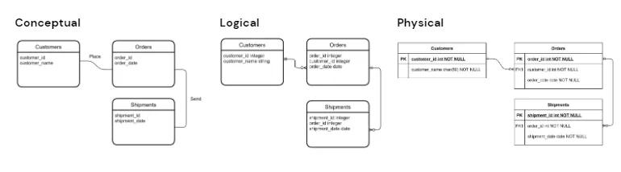
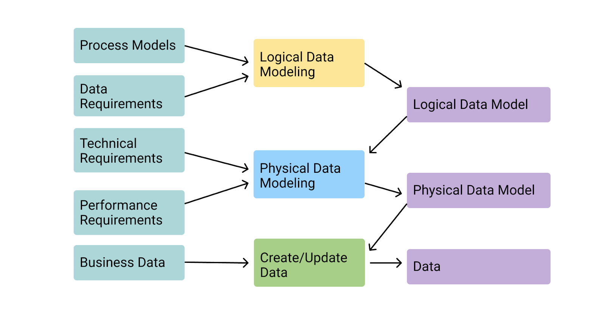
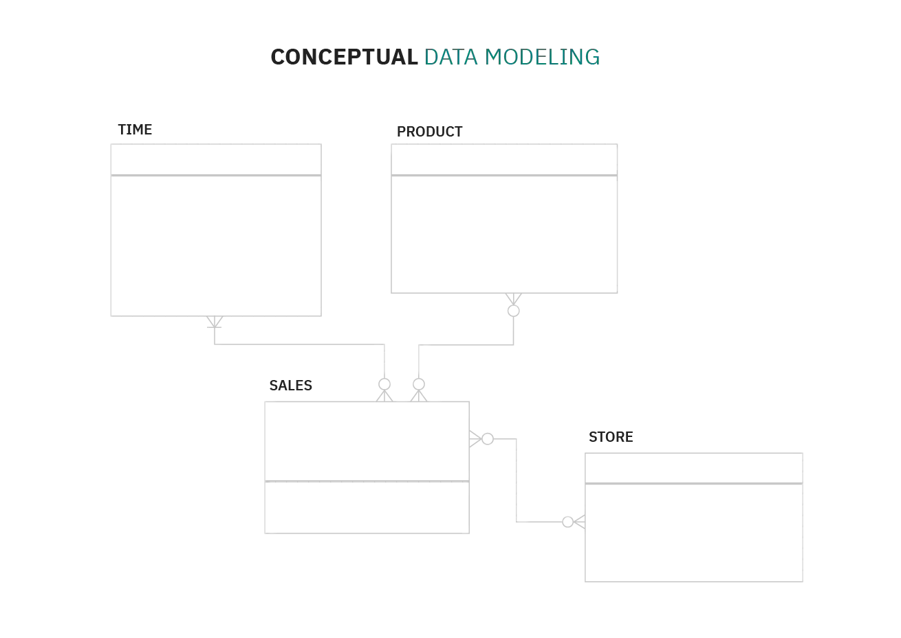
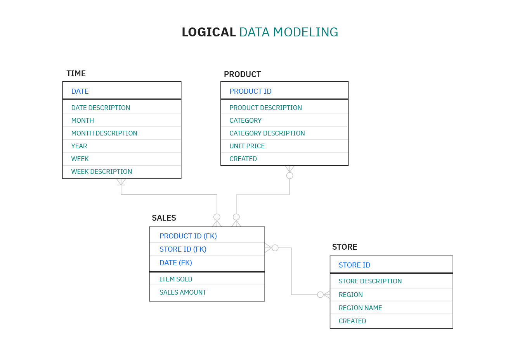
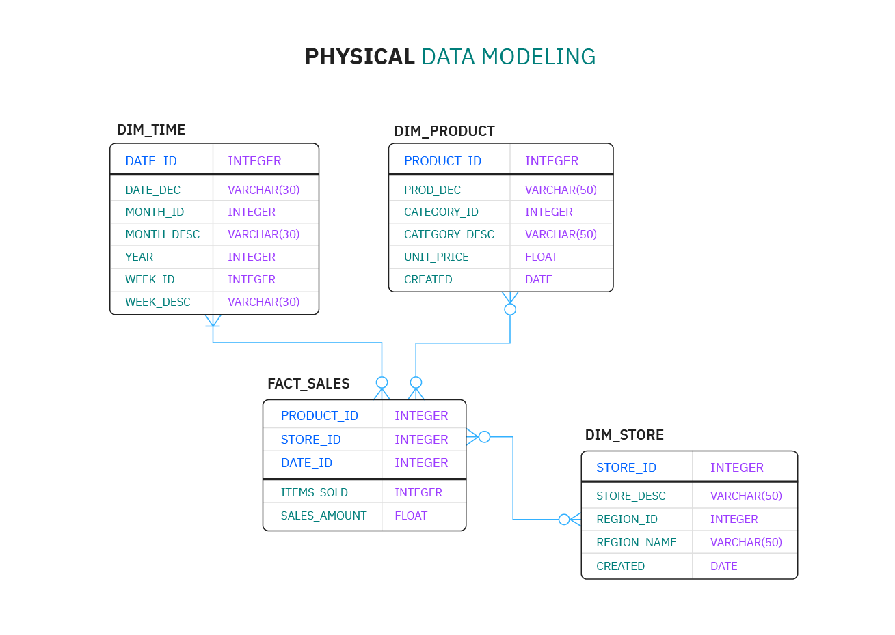

# Data Model

**Data Model** is essentially a blueprint for a building designed by an architect.
It is the technique of documenting complex software system designs in the form of
an easily understandable graphic. To describe how the data will flow, the diagram
will be made using text and symbols.

<figure markdown="span">
  { loading=lazy }
  <figcaption>Overall Data Modeling</figcaption>
</figure>

!!! note

    **Data Modeling** is the process of creating a visual representation of either a whole
    information system or parts of it to communicate connections between data points
    and structures.[^1]

## :material-format-list-bulleted: Types of Data Models

<figure markdown="span">
  { loading=lazy width="650" }
  <figcaption>Types of Data Models</figcaption>
</figure>

### Conceptual Data Models

:material-page-last: They are also referred to as domain models and offer a
big-picture view of what the system will contain, how it will be organized,
and which business rules are involved.
Conceptual models are usually created as part of the process of gathering initial
project requirements.

Typically, they include entity classes (defining the types of things that are
important for the business to represent in the data model), their characteristics
and constraints, the relationships between them and relevant security
and data integrity requirements. Any notation is typically simple.

{ loading=lazy width="550" }

### Logical Data Models

:material-page-last: They are less abstract and provide greater detail about the
concepts and relationships in the domain under consideration.
One of several formal data modeling notation
systems is followed. These indicate data attributes, such as data types and
their corresponding lengths, and show the relationships among entities.
Logical data models don't specify any technical system requirements.

This stage is frequently omitted in agile or DevOps practices.
Logical data models can be useful in highly procedural implementation environments,
or for projects that are data-oriented by nature, such as data warehouse design
or reporting system development.

{ loading=lazy width="550" }

### Physical Data Models

:material-page-last: They provide a schema for how the data will be physically
stored within a database.
As such, they're the least abstract of all. They offer a finalized design that
can be implemented as a relational database, including associative tables that
illustrate the relationships among entities as well as the primary keys and
foreign keys that will be used to maintain those relationships.

Physical data models can include database management system (DBMS)-specific properties,
including performance tuning.

{ loading=lazy width="550" }

## :material-message-question-outline: How Can Define a Good Data Model?

In other words, how can we compare various **Data Modeling** options?
What **Factors** should be taken into account?

1. **Performance**
   This is a vast topic, and we are not discussing database vendors, data indexing,
   or technical modifications to boost read and write speeds. I believe we can
   ascribe performance advantages solely based on how we model the data.

2. **Productivity**
   On the developer side, we want a model that is simple to work with and reason about,
   so we can "create a lot of good code" without wasting time (the concept of productivity).

3. **Clearness**
   The Data Model’s ability to be comprehended by those who look at it. As you may
   have heard, most developers read code rather than write it, therefore we must
   clearly grasp what we are doing with our data.

4. **Flexibility**
   The Model’s capacity to evolve without having a significant influence on our code.
   Because the startup you work for is evolving, the systems and Data Models that
   power it will need to evolve as well.

5. **Traceability**
   Finally, we want to have data that is useful to the system as well as data that
   is valuable to our users. Knowing what happened in the past, what values the
   entities had at some point in time, being able to travel back and forth in time,
   and so on.

!!! example

    **Standard Data Modeling** (a.k.a. Domain Models)

    It’s as simple as this: The domain of the problem you’re solving dictates how you
    define your entities and their properties. As a result, each entity will be
    comparable to other entities in the same domain while being significantly different
    from entities in other domains. As an example, we may have a distinct sort of
    box for each type of item that we want to store.

    This type of modeling is obvious since it is specified in the same way that we
    think about the problem.

    So, let’s run the first test on our five dimensions of analysis (points 1–10):

    **Performance**: `6 points`

    :   This type of model does not perform well, as we will demonstrate later.

    **Productivity**: `3 points`

    :   Each collection (or table) will require its own function to update the values
        in each field, correct? This is not helpful for developer productivity unless you
        create a middleware to communicate with the database in a "parametric fashion,"
        which is equally unnatural. We shall offer a better method of accomplishing this.

    **Clearness**: `10 points`

    :   Yes, the model is crystal clear, precisely as humans think.

    **Flexibility**: `3 points`

    :   However, things aren’t going so well here. Each new field that is added necessitates
        a change to the model.

    **Traceability**: `2 points`

    :   This type of modeling updates fields in place, so if your address changes,
        you’ll lose the previous one, right? The remedy is to have a distinct table
        (a log table) that records all changes, but it will be independent of the rest
        of the model and thus "noisy."

## :material-playlist-plus: Read Mores

- [Types of Data Model](https://hevodata.com/learn/types-of-data-model/)

[^1]: [:simple-ibm: What is data modeling?](https://www.ibm.com/topics/data-modeling/)
