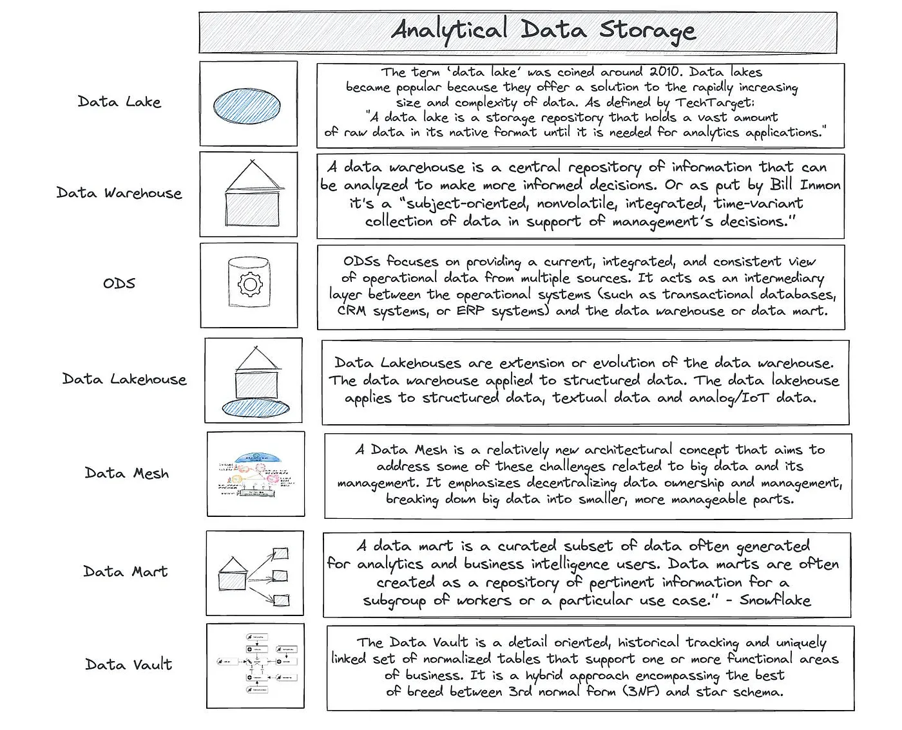

# Data Storage

{ loading=lazy }

## ODS — Operational Data Stores

Unlike traditional data warehouses typically used for long-term storage and
historical data analysis, an ODS focuses on providing a current, integrated, and
consistent view of operational data from multiple sources.
It acts as an intermediary layer between the operational systems
(such as transactional databases, CRM systems, or ERP systems)
and the data warehouse or data mart.

## Data Marts

!!! quote

    In truth, the Kimball model was for data marts, not a data warehouse.
    A data mart and a data warehouse are fundamentally different things.
    — Bill Inmon

!!! quote

    A data mart is a curated subset of data often generated for analytics and
    business intelligence users. Data marts are often created as a repository
    of pertinent information for a subgroup of workers or a particular use case.
    — Snowflake

## Database

[Normalization vs Denormalization](https://medium.com/coriers/normalization-vs-denormalization-taking-a-step-back-c1362bcb2fc5)

## References

- [Operational Data Stores Vs Data Lakehouses And All The Other Data Management Methods](https://medium.com/coriers/operational-data-stores-vs-data-lakehouses-and-all-the-other-data-management-methods-6929158efe0d)
