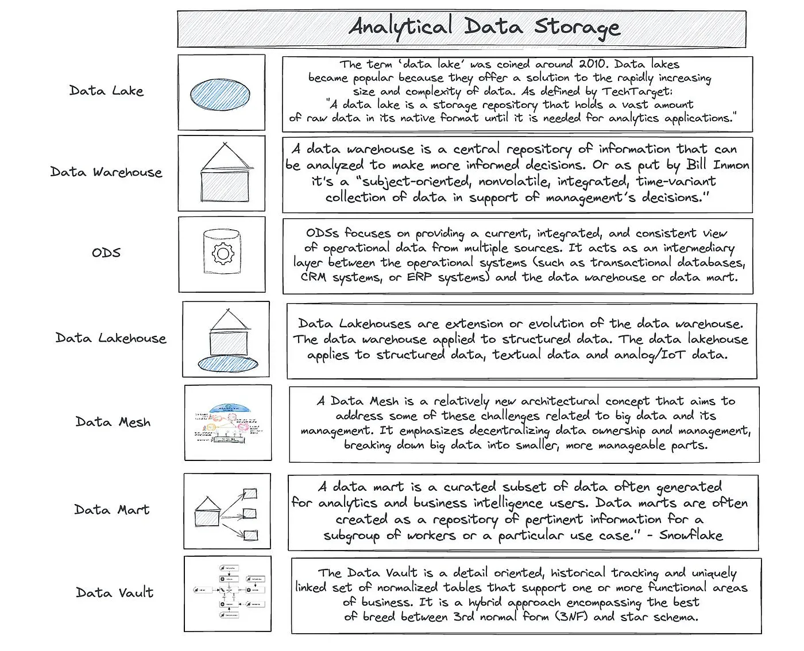

# Data Management: Data Storage

{ loading=lazy }

## References

- [Operational Data Stores Vs Data Lakehouses And All The Other Data Management Methods](https://medium.com/coriers/operational-data-stores-vs-data-lakehouses-and-all-the-other-data-management-methods-6929158efe0d)
