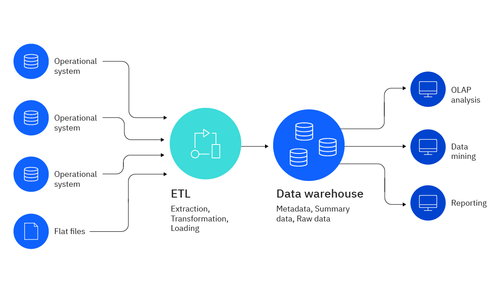

# Data Warehouse

**Data Warehouse (DW or DWH)** is a centralized repository or digital storage system
that integrates and stores data from various sources within an organization.
It is designed to support Business Intelligence (BI) activities such as _reporting_,
_data analysis_, and _decision-making_.

<figure markdown="span">
  { loading=lazy width="650" }
  <figcaption>Data Warehouse Elements</figcaption>
</figure>

---

## :material-arrow-down-right: Getting Started

:material-page-last: A **Data Warehouse**, or **Enterprise Data Warehouse** (EDW)
is a centralized warehouse that provides decision support service across the enterprise.
It offers a unified approach for organizing and representing data.
It also provides the ability to classify data according
to the subject and give access according to those divisions.

EDWs are usually a collection of databases that offer a unified approach for organizing
data and classifying data according to subject. These data sources could be the
Databases of various _Enterprise Resource Planning (ERP)_ systems, _Customer Relationship
Management (CRM)_ systems, and other forms of _Online Transactional Processing (OLTP)_
systems.

!!! note

    This type of data warehouse is the most common and serves as a centralized repository
    for all of an organization's data. An EDW typically integrates data from various
    sources across the entire enterprise and is designed to support the reporting and
    analytics needs of multiple departments.

### Understanding OLAP and OLTP

OLAP (online analytical processing) is software for performing multidimensional
analysis at high speeds on large volumes of data from unified, centralized data
store, such as a data warehouse.
OLTP (online transactional processing), enables the real-time execution of large
numbers of database transactions by large numbers of people, typically over the
internet.
The main difference between OLAP and OLTP is in the name: OLAP is analytical in
nature, and OLTP is transactional.

OLAP tools are designed for multidimensional analysis of data in a data warehouse,
which contains both historical and transactional data.
Common uses of OLAP include data mining and other business intelligence apps,
complex analytical calculations, and predictive scenarios, as well as business
reporting functions like financial analysis, budgeting, and forecast planning.

OLTP is designed to support transaction-oriented applications by processing recent
transactions as quickly and accurately as possible.
Common uses of OLTP include ATMs, e-commerce software, credit card payment data
processing, online bookings, reservation systems, and record-keeping tools.

---

## Architecture

In addition to the below three-tier architecture, some data warehouse architectures
also include a metadata layer, which provides information about the data in the data
warehouse, such as its origin, format, and meaning.
The metadata layer can be used to help users understand and navigate the data.

### Bottom tier

The Bottom Tier (Data Layer) consists of the Data Repository, usually a relational
database system, which collects, cleanses, and transforms data from various data
sources through a process known as;

- Extract Transform Load (ETL)
- Extract Load Transform (ELT)

As a preliminary process, before the data is loaded into the repository,
all the data relevant and required are identified from several sources of the system.
These data are then cleaned up, to avoid repeating or junk data from its current
storage units. The next step is to transform all these data into a single format
of storage. The final step of ETL is to Load the data on the repository.

ETL Layer, This layer is responsible for storing the data in the data warehouse. The data is
typically stored in a relational database management system (RDBMS), which is optimized
for querying and reporting on large datasets. In some cases, data may also be stored
in columnar or in-memory databases for improved performance.

---

### Middle tier

The Middle Tier (Semantics Layer) consists of an `OLAP` (Online Analytical Processing)
servers which enables fast query speeds. The Data Warehouse can have more than one
OLAP server, and it can have more than one type of OLAP server model as well,
which depends on the volume of the data to be processed and the type of data held
in the bottom tier.

This layer is responsible for extracting, transforming, and loading the data from
various sources into the data warehouse. This is typically done using ETL (Extract,
Transform, Load) tools, which automate the process of moving and converting data.

Three types of OLAP models can be used in this tier, which are known as

=== "ROLAP"

    Relational online analytical processing is a model of online analytical processing
    which carries out an active multidimensional breakdown of data stored in a relational database,
    instead of redesigning a relational database into a multidimensional database.

    This is applied when the repository consists of only the relational database
    system in it.

=== "MOLAP"

    Multidimensional online analytical processing is another model of online analytical
    processing that catalogs and comprises directories directly on its multidimensional
    database system.

    This is applied when the repository consists of only the multidimensional database
    system in it.

=== "HOLAP"

    Hybrid online analytical processing is a hybrid of both relational and multidimensional
    online analytical processing models.

    When the repository contains both the relational database management system and
    the multidimensional database management system, HOLAP is the best solution for
    a smooth functional flow between the database systems. HOLAP allows storing data
    in both the relational and the multidimensional formats.

!!! note

    The type of OLAP model used is dependent on the type of database system that
    exists.

---

### Top tier

The Top Tier (Analytics Layer) is represented by some kind of front-end user interface
or reporting tool, which enables end users to conduct ad-hoc data analysis on their
business data.
It holds various tools like query tools, analysis tools, reporting tools, and
[data mining tools](https://www.educba.com/data-mining-tool/).

Reporting Layer. This layer is responsible for presenting the data to end-users
in a format that is easy to understand and analyze. This layer includes tools for
querying, reporting, and visualization, which allow users to create custom reports
and dashboards based on the data in the data warehouse.

---

## :material-gesture: Design

data warehouse design that can be applied within the framework of the design methods
discussed earlier. Here is a brief overview of how each of these approaches relates
to the design methods.

Overall, the choice of design approach will depend on the specific needs and circumstances
of the organization. A bottom-up approach may be more appropriate for organizations with
complex and varied data sources, while a top-down approach may be more appropriate
for organizations with well-defined business requirements. Hybrid design may be a
good choice for organizations that need a flexible and adaptable data warehouse
that can accommodate changing business requirements over time.

### Bottom-up

Bottom-up design is an approach to data warehouse design that focuses on building
small, specialized data marts first and then integrating them into a larger data
warehouse. This approach is often used when there are different data sources
with varying levels of complexity, and it allows for a more incremental and flexible
approach to data warehouse development. Bottom-up design is often associated with
dimensional modeling and may use hybrid modeling techniques to integrate the different
data marts.

!!! example

    **Dimensional Model** (Ralph Kimball):

    The Dimensional Model, also known as the Kimball model, is a bottom-up design approach
    that emphasizes the importance of simplicity and ease of use. This model is designed
    to support ad-hoc querying and analysis and is often used for data warehouse implementations
    in smaller organizations. The Kimball model involves creating a denormalized data
    model, which is optimized for querying and analysis, and building a star or snowflake
    schema that supports specific business functions.

    See more, [Kimball Approach](../data_management/data_modeling/dwh-kimball-approach.md)

### Top-down

Top-down design is an approach to data warehouse design that starts with a comprehensive
enterprise data model and then designs the data warehouse based on that model.
This approach is often used when there is a well-defined set of business requirements
and a clear understanding of the data sources and their relationships. Top-down design
is often associated with data vault modeling and may use hybrid modeling techniques
to accommodate the specific business requirements.

!!! example

    **Third Normal Form Model** (Bill Inmon):

    The 3NF Model, also known as the Inmon model, is a top-down design approach that
    emphasizes the importance of a comprehensive enterprise data model. This model is
    designed to support complex business processes and is often used for data warehouse
    implementations in large organizations. The Inmon model involves creating a normalized
    data model, which is then used to build data marts that support specific business
    functions.

    See more, [Inmon Approach](../data_management/data_modeling/dwh-inmon-approach.md)

### Hybrid

Hybrid design is an approach to data warehouse design that combines elements of
both bottom-up and top-down design. This approach recognizes that there may be benefits
to both approaches and seeks to find a balance between the two. Hybrid design may use
different modeling techniques for different parts of the data warehouse and may involve
a mix of top-down and bottom-up development. Hybrid design is often associated with agile
modeling and may use a variety of design methods to create a flexible and adaptable
data warehouse.

!!! example

    **Data Vault 2.0 Model**:

    The DV 2.0 Model is a hybrid design approach that combines elements of both
    the Inmon and Kimball models. This model is designed to support flexibility, scalability,
    and agility, and is often used for data warehouse implementations in organizations
    that need to handle large amounts of complex and varied data. The Data Vault 2.0 model
    involves creating a normalized data model that separates business entities and relationships
    into three types of tables (Hub, Link, and Satellite), which can then be used to
    build data marts that support specific business functions.

    See more, [Data Vault Model](../data_management/data_modeling/dwh-data-vault-approach.md)

[Read more about **Data Modeling**](data_modeling/index.md)

---

## Conclusion

Overall, the choice of design method will depend on the specific needs and circumstances
of the organization. The Inmon model may be more appropriate for organizations with
complex and varied data sources and a focus on enterprise-wide integration. The
Kimball model may be more appropriate for organizations with a focus on ad-hoc
querying and analysis and a need for simplicity and ease of use. The Data Vault 2.0
model may be a good choice for organizations that need a flexible and scalable
data warehouse that can accommodate changing business requirements over time.

| Design Method | 3NF Model (Inmon)                                                                                                                        | Dimensional Model (Kimball)                                                                                                                 | Data Vault 2.0 Model                                                                                                                                       |
|---------------|------------------------------------------------------------------------------------------------------------------------------------------|---------------------------------------------------------------------------------------------------------------------------------------------|------------------------------------------------------------------------------------------------------------------------------------------------------------|
| Description   | Top-down design approach that emphasizes a comprehensive enterprise data model                                                           | Bottom-up design approach that emphasizes simplicity and ease of use                                                                        | Hybrid design approach that combines elements of the Inmon and Kimball models                                                                              |
| Strengths     | Supports complex business processes, supports enterprise-wide integration, allows for data reuse                                         | Supports ad-hoc querying and analysis, easy to understand and use, can be quickly implemented                                               | Supports flexibility, scalability, and agility, accommodates changing business requirements, allows for data reuse                                         |
| Weaknesses    | Can be time-consuming to design and build, may not be well-suited for ad-hoc querying and analysis                                       | May not be well-suited for complex business processes or enterprise-wide integration, may not support as much data reuse as the Inmon model | Can be more complex to design and build than the Inmon or Kimball models, may not be as well-suited for smaller organizations or simple business processes |
| Focus         | Enterprise-wide integration                                                                                                              | Ad-hoc querying and analysis                                                                                                                | Ad-hoc querying and analysis                                                                                                                               |
| Advantages    | Comprehensive data model supports complex business processes; Data is normalized, reducing data redundancy and ensuring data consistency | Easy to understand and use for ad-hoc querying and analysis; Denormalized data model optimized for querying and analysis                    | Separates business entities and relationships into three types of tables, providing flexibility and scalability; Supports complex and varied data sources  |

As a Data Engineer, the choice of design method will depend on the specific needs
and circumstances of your organization. If you work in a large organization with
complex and varied data sources and a focus on enterprise-wide integration, the
3NF Model (Inmon) may be a good choice. If your organization has a focus on ad-hoc
querying and analysis and a need for simplicity and ease of use, the Dimensional Model
(Kimball) may be a better fit. If your organization needs a flexible and scalable
data warehouse that can accommodate changing business requirements over time,
the Data Vault 2.0 model may be the best option.

---

## :material-playlist-plus: Read Mores

- [Guru99: Data Warehousing](https://www.guru99.com/data-warehousing.html)
- [Guru99: Data Warehouse Architecture](https://www.guru99.com/data-warehouse-architecture.html#8)
- [IBM: Data Warehouse](https://www.ibm.com/topics/data-warehouse/)
- [A Complete Guide to Data Warehouse in 2022](https://www.analyticsvidhya.com/blog/2022/06/a-complete-guide-to-data-warehousing-in-2022/)
- [CodingNinjas: Inmon vs Kimball Approaches in DWH](https://www.codingninjas.com/studio/library/inmon-vs-kimball-approach-in-data-warehousing)
- [Nearshore: Data Warehouse Architecture](https://www.nearshore-it.eu/articles/technologies/data-warehouse-architecture/)
