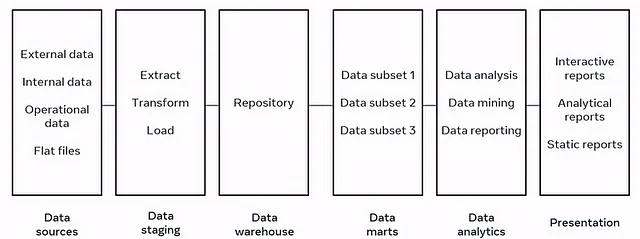

# Data Warehouse

**Data Warehouse (DW or DWH)** is a centralized repository or digital storage system
that integrates and stores data from various sources within an organization. It
is designed to support Business Intelligence (BI) activities such as _reporting_,
_data analysis_, and _decision-making_.

## :material-format-list-bulleted: Types of Data Warehouse

There are three main types of data warehouses:

- [Enterprise Data Warehouse (EDW)](#enterprise-data-warehouse)
- [Operational Data Store (ODS)](#operational-data-store)
- [Data Mart (DM)](#data-mart)

Overall, the type of data warehouse an organization chooses depends on its specific
needs and requirements. Some organizations may require a centralized, enterprise-wide
data warehouse, while others may benefit from a more focused data mart or an operational
data store that supports real-time decision-making.

### Enterprise Data Warehouse

**Enterprise Data Warehouse** (EDW) is a centralized warehouse that provides decision
support service across the enterprise. It offers a unified approach for organizing
and representing data. It also provides the ability to classify data according
to the subject and give access according to those divisions.

EDWs are usually a collection of databases that offer a unified approach for organizing
data and classifying data according to subject. These data sources could be the
Databases of various _Enterprise Resource Planning (ERP)_ systems, _Customer Relationship
Management (CRM)_ systems, and other forms of _Online Transactional Processing (OLTP)_
systems.

!!! note

    This type of data warehouse is the most common and serves as a centralized repository
    for all of an organization's data. An EDW typically integrates data from various
    sources across the entire enterprise and is designed to support the reporting and
    analytics needs of multiple departments.

#### Enterprise Data Warehouse Architecture

While there are many architectural approaches that extend warehouse capabilities
in one way or another, we will focus on the most essential ones. Without diving
into too much technical detail, the whole data pipeline can be divided into three
layers:

- Raw data layer (data sources)
- Warehouse and its ecosystem
- User interface (analytical tools)

The tooling that concerns data Extraction, Transformation, and Loading into a warehouse
is a separate category of tools known as ETL. Also, under the ETL umbrella, data integration
tools perform manipulations with data before it’s placed in a warehouse.
These tools operate between a raw data layer and a warehouse.

##### One-tier Architecture

This is considered to be one of the most primitive forms of EDW architectures.
In this architecture, the Reporting Tools are connected directly
to the Data Warehouse. Although this architecture is easy to set up and implement,
it causes various issues for large datasets. Most organizations today have hundreds
of Gigabytes of data. This means that to perform any query, the Reporting Tool
would have to go through all that data which is a time taking process.
Going through the large dataset for each query would result in low performance.

Hence, the One-tier EDW Architecture is only suitable for organizations with small
datasets.

One-tier architecture for EDW means that you have a database directly connected
with the analytical interfaces where the end user can make queries. Setting the
direct connection between an EDW and analytical tools brings several challenges:

- Traditionally, you can consider your storage a warehouse starting from 100GB of data. Working with it directly may result in messy query results, as well as low processing speed.
- Querying data right from the DW may require precise input so that the system will be able to filter out non-required data. Which makes dealing with presentation tools a little difficult.
- Limited flexibility/analytical capabilities exist.

Additionally, the one-tier architecture sets some limits to reporting complexity.
Such an approach is rarely used for large-scale data platforms, because of its
slowness and unpredictability. To perform advanced data queries, a warehouse can
be extended with low-level instances that make access to data easier.

##### Two-tier Architecture

The Two-tier Architecture implements a **Data Mart** layer between the Reporting
layer and the EDW. **Data Marts** can be seen as smaller Databases that contain
domain-specific information, which is only a part of the data stored
in the Data Warehouse. All information stored in the Data Warehouse is split
into various Data Marts based on the domain of information.

The Reporting Tools are then connected to this Data Mart Layer. Because a single
Data Mart consists of only a small part of the data in the Data Warehouse (low-level
repository that contains domain-specific information), performing queries on it
would require much less time than it would on a Data Warehouse.
A Two-tier EDW is considered to be more suitable for real-life scenarios.

Creating a data mart layer will require additional resources to establish hardware
and integrate those databases with the rest of the data platform. But, such an
approach solves the problem with querying: Each department will access required
data more easily because a given mart will contain only domain-specific information.
In addition, data marts will limit the access to data for end users, making EDW
more secure.

##### Three-tier Architecture

A Three-tier Architecture further implements an Online Analytical Processing (OLAP)
Layer between the Data Mart Layer and the Reporting Layer.
The OLAP Layer consists of OLAP Cubes is a specific type of database which are used
to store data in a multidimensional form allowing faster analysis to be performed
on the data.

It’s pretty difficult to explain in words, so let’s look at this handy example of
what a cube can look like.

{ loading=lazy width="450" }

So, as you can see, a cube adds dimensions to the data. You may think of it as
multiple Excel tables combined with each other. The front of the cube is the usual
two-dimensional table, where the region (Africa, Asia, etc.) is specified vertically,
while sales numbers and dates are written horizontally. The magic begins when we
look at the upper facet of the cube, where sales are segmented by routes and the
bottom specifies time-period. That’s known as multidimensional data.

OLAP Cubes allow various operations to be performed on it, which results in quality
analysis. These operations are as follows:

=== "Roll-up"

    This can be defined as the process of reducing the attributes being measured
    by either performing aggregations or moving up the hierarchy (performing grouping
    based on a specific order).

    ??? example

        A sample Roll-up operation is as follows:

        

=== "Drill-down"

    This can be defined as the process of increasing the number of attributes being
    measured to perform a more in-depth analysis by moving down the hierarchy.
    Drill-down is considered to be the opposite of the Roll-up operation.

    ??? example

        A sample Drill-down operation is as follows:

        

=== "Slice"

    This can be defined as the process of removing a dimension by specifying a
    filter on the dimension to be removed.

    ??? example

        A sample Slice operation is as follows:

        

=== "Dice"

    This can be defined as the process of specifying filters for two or more dimensions
    resulting in the formation of a Sub-Cube.

    ??? example

        A sample Dice operation is as follows:

        

---

### Operational Data Store

:material-page-last: **Operational Data Store (ODS)** are nothing but data store
required when neither Data warehouse nor OLTP systems support organizations reporting
needs.
In ODS, Data warehouse is refreshed in real-time. Hence, it is widely preferred
for routine activities like storing records of the Employees.

!!! note

    Unlike traditional data warehouses typically used for long-term storage and
    historical data analysis, an ODS focuses on providing a current, integrated,
    and consistent view of operational data from multiple sources.
    It acts as an intermediary layer between the operational systems
    (such as transactional databases, CRM systems, or ERP systems)
    and the data warehouse or data mart.

    This is a type of data warehouse that stores operational data from various sources
    and provides near real-time reporting and analysis. It is designed to handle frequent
    updates and queries from operational systems. It also serves as a source of data
    for the EDW or data marts.

:material-page-last: An ODS is a type of data warehouse that stores real-time or
near-real-time data from transactional systems. It is designed to support operational
reporting and analysis, and it typically uses a bottom-up approach to design,
which means that the data model is based on specific business requirements.

---

### Data Mart

**Data Mart** is a subset of the data warehouse. It specially designed for a particular
line of business, such as sales, finance, sales or finance.
In an independent data mart, data can collect directly from sources.

Data Mart is also a storage component used to store data of a specific function
or part related to a company by an individual authority, so data marts are flexible
and small.

A data mart is a subset of an EDW that is designed to serve a specific business
unit or department. It is optimized for querying and reporting on a specific subject
area, such as sales or marketing, and it is typically easier and faster to implement
than an EDW.

!!! quote

    In truth, the Kimball model was for data marts, not a data warehouse.
    A data mart and a data warehouse are fundamentally different things.
    — Bill Inmon

!!! quote

    A data mart is a curated subset of data often generated for analytics and
    business intelligence users. Data marts are often created as a repository
    of pertinent information for a subgroup of workers or a particular use case.
    — Snowflake

---

### Comparison

|                    | EDW                                                     | ODS                                                  | DM                                                              |
|--------------------|---------------------------------------------------------|------------------------------------------------------|-----------------------------------------------------------------|
| Purpose            | Serves the entire organization                          | Supports operational reporting                       | Serves a specific business unit/department                      |
| Data Integration   | Integrates data from multiple sources                   | Integrates real-time data from transactional systems | Integrates data from a specific subject area                    |
| Data Model         | Top-down approach to design                             | Bottom-up approach to design                         | Designed based on specific business requirements                |
| Complexity         | More complex and time-consuming to design and implement | Less complex and quicker to implement                | Less complex and quicker to implement                           |
| Query and Analysis | Supports complex queries and analytics                  | Supports operational reporting and simple analysis   | Optimized for querying and reporting on a specific subject area |
| Data Volume        | Large volume of historical data                         | Real-time or near-real-time data                     | Smaller volume of data                                          |
| Users              | Business analysts, executives, data scientists          | Operational staff, business analysts                 | Business analysts, departmental staff                           |
| Cost               | Higher cost due to complexity and scale                 | Lower cost due to simpler design and implementation  | Lower cost due to simpler design and implementation             |

| Criteria          | EDW                                                     | ODS                                                      | DM                                                     |
|-------------------|---------------------------------------------------------|----------------------------------------------------------|--------------------------------------------------------|
| Scope             | Enterprise-wide                                         | Operational                                              | Departmental or functional                             |
| Data sources      | Multiple internal and external sources                  | Multiple operational sources                             | EDW, ODS, or other sources                             |
| Data integration  | High degree of integration and standardization          | Moderate degree of integration and standardization       | Low degree of integration and standardization          |
| Data granularity  | Mixed levels of granularity                             | Low level of granularity (detailed)                      | High level of granularity (aggregated or summarized)   |
| Data currency     | Historical and current data                             | Near real-time or real-time data                         | Historical and current data                            |
| Data quality      | High quality (cleansed and validated)                   | Moderate quality (some cleansing and validation)         | High quality (cleansed and validated)                  |
| Data structure    | Relational or dimensional models                        | Relational models                                        | Dimensional models                                     |
| Data volume       | Very large (terabytes or petabytes)                     | Large (gigabytes or terabytes)                           | Small or medium (megabytes or gigabytes)               |
| Query performance | Moderate to high (depends on indexing and partitioning) | Low to moderate (depends on updates and concurrency)     | High (optimized for analysis)                          |
| Query complexity  | High (supports complex and ad-hoc queries)              | Low to moderate (supports simple and predefined queries) | Moderate to high (supports complex and ad-hoc queries) |
| Query frequency   | Low to moderate (periodic or on-demand)                 | High (continuous or near-continuous)                     | Moderate to high (periodic or on-demand)               |
| User types        | Analysts, managers, executives, data scientists, etc.   | Operational staff, managers, etc.                        | Analysts, managers, etc.                               |

---

## Architecture

### Bottom tier (Data Layer)

The bottom tier consists of the Data Repository, usually a relational database system,
which collects, cleanses, and transforms data from various data sources through
a process known as Extract, Transform, and Load (`ETL`) or a process known as Extract,
Load, and Transform (`ELT`).

As a preliminary process, before the data is loaded into the repository,
all the data relevant and required are identified from several sources of the system.
These data are then cleaned up, to avoid repeating or junk data from its current
storage units. The next step is to transform all these data into a single format
of storage. The final step of ETL is to Load the data on the repository.

ETL Layer, This layer is responsible for storing the data in the data warehouse. The data is
typically stored in a relational database management system (RDBMS), which is optimized
for querying and reporting on large datasets. In some cases, data may also be stored
in columnar or in-memory databases for improved performance.

Few commonly used ETL tools are:

- Informatica
- Microsoft SSIS
- Snaplogic
- Confluent
- Apache Kafka
- Alooma
- Ab Initio
- IBM Infosphere

### Middle tier (Semantics Layer)

The middle tier consists of an `OLAP` (Online Analytical Processing) servers
which enables fast query speeds. The Data Warehouse can have more than one OLAP server,
and it can have more than one type of OLAP server model as well, which depends on
the volume of the data to be processed and the type of data held in the bottom tier.

ETL Layer. This layer is responsible for extracting, transforming, and loading the data from
various sources into the data warehouse. This is typically done using ETL (Extract,
Transform, Load) tools, which automate the process of moving and converting data.

Three types of OLAP models can be used in this tier, which are known as

=== "ROLAP"

    Relational online analytical processing is a model of online analytical processing
    which carries out an active multidimensional breakdown of data stored in a relational database,
    instead of redesigning a relational database into a multidimensional database.

    This is applied when the repository consists of only the relational database
    system in it.

=== "MOLAP"

    Multidimensional online analytical processing is another model of online analytical
    processing that catalogs and comprises directories directly on its multidimensional
    database system.

    This is applied when the repository consists of only the multidimensional database
    system in it.

=== "HOLAP"

    Hybrid online analytical processing is a hybrid of both relational and multidimensional
    online analytical processing models.

    When the repository contains both the relational database management system and
    the multidimensional database management system, HOLAP is the best solution for
    a smooth functional flow between the database systems. HOLAP allows storing data
    in both the relational and the multidimensional formats.

The type of OLAP model used is dependent on the type of database system that exists.

### Top tier (Analytics Layer)

The top tier is represented by some kind of front-end user interface or reporting
tool, which enables end users to conduct ad-hoc data analysis on their business data.
It holds various tools like query tools, analysis tools, reporting tools, and
[data mining tools](https://www.educba.com/data-mining-tool/).

Reporting Layer. This layer is responsible for presenting the data to end-users
in a format that is easy to understand and analyze. This layer includes tools for
querying, reporting, and visualization, which allow users to create custom reports
and dashboards based on the data in the data warehouse.

Below are the few commonly used Top Tier tools.

- IBM Cognos
- Microsoft BI Platform
- SAP Business Objects Web
- Pentaho
- Crystal Reports
- SAP BW
- SAS Business Intelligence

In addition to the three-tier architecture, some data warehouse architectures also
include a metadata layer, which provides information about the data in the data
warehouse, such as its origin, format, and meaning. The metadata layer can be used
to help users understand and navigate the data.

## :material-gesture: Design

data warehouse design that can be applied within the framework of the design methods
discussed earlier. Here is a brief overview of how each of these approaches relates
to the design methods.

Overall, the choice of design approach will depend on the specific needs and circumstances
of the organization. A bottom-up approach may be more appropriate for organizations with
complex and varied data sources, while a top-down approach may be more appropriate
for organizations with well-defined business requirements. Hybrid design may be a
good choice for organizations that need a flexible and adaptable data warehouse
that can accommodate changing business requirements over time.

### Bottom-up

Bottom-up design is an approach to data warehouse design that focuses on building
small, specialized data marts first and then integrating them into a larger data
warehouse. This approach is often used when there are different data sources
with varying levels of complexity, and it allows for a more incremental and flexible
approach to data warehouse development. Bottom-up design is often associated with
dimensional modeling and may use hybrid modeling techniques to integrate the different
data marts.

!!! example

    **Dimensional Model** (Ralph Kimball):

    The Dimensional Model, also known as the Kimball model, is a bottom-up design approach
    that emphasizes the importance of simplicity and ease of use. This model is designed
    to support ad-hoc querying and analysis and is often used for data warehouse implementations
    in smaller organizations. The Kimball model involves creating a denormalized data
    model, which is optimized for querying and analysis, and building a star or snowflake
    schema that supports specific business functions.

    See more, [Kimball Approach](../data_architecture/data_modeling/dwh-kimball-approach.md)

### Top-down

Top-down design is an approach to data warehouse design that starts with a comprehensive
enterprise data model and then designs the data warehouse based on that model.
This approach is often used when there is a well-defined set of business requirements
and a clear understanding of the data sources and their relationships. Top-down design
is often associated with data vault modeling and may use hybrid modeling techniques
to accommodate the specific business requirements.

!!! example

    **Third Normal Form Model** (Bill Inmon):

    The 3NF Model, also known as the Inmon model, is a top-down design approach that
    emphasizes the importance of a comprehensive enterprise data model. This model is
    designed to support complex business processes and is often used for data warehouse
    implementations in large organizations. The Inmon model involves creating a normalized
    data model, which is then used to build data marts that support specific business
    functions.

    See more, [Inmon Approach](../data_architecture/data_modeling/dwh-inmon-approach.md)

### Hybrid

Hybrid design is an approach to data warehouse design that combines elements of
both bottom-up and top-down design. This approach recognizes that there may be benefits
to both approaches and seeks to find a balance between the two. Hybrid design may use
different modeling techniques for different parts of the data warehouse and may involve
a mix of top-down and bottom-up development. Hybrid design is often associated with agile
modeling and may use a variety of design methods to create a flexible and adaptable
data warehouse.

!!! example

    **Data Vault 2.0 Model**:

    The DV 2.0 Model is a hybrid design approach that combines elements of both
    the Inmon and Kimball models. This model is designed to support flexibility, scalability,
    and agility, and is often used for data warehouse implementations in organizations
    that need to handle large amounts of complex and varied data. The Data Vault 2.0 model
    involves creating a normalized data model that separates business entities and relationships
    into three types of tables (Hub, Link, and Satellite), which can then be used to
    build data marts that support specific business functions.

    See more, [Data Vault Model](../data_architecture/data_modeling/dwh-data-vault-approach.md)

**Differences between the three designs**:

- **Approach**: Kimball is bottom-up, Inmon is top-down, and Data Vault is a hybrid
  approach.

- **Schema**: Kimball uses a star or snowflake schema, Inmon uses a 3NF schema,
  and Data Vault uses a hub-and-spoke schema.

- **Focus**: Kimball focuses on the business process or subject area, Inmon focuses
  on the data, and Data Vault focuses on the relationships between the data.
- **Flexibility**: Kimball is known for its flexibility, Inmon is known for its
  consistency, and Data Vault is known for its ability to handle complex data relationships.
- **Complexity**: Kimball is relatively simple, Inmon is more complex, and
  Data Vault is the most complex of the three methodologies.

---

### Summary

Overall, the choice of design method will depend on the specific needs and circumstances
of the organization. The Inmon model may be more appropriate for organizations with
complex and varied data sources and a focus on enterprise-wide integration. The
Kimball model may be more appropriate for organizations with a focus on ad-hoc
querying and analysis and a need for simplicity and ease of use. The Data Vault 2.0
model may be a good choice for organizations that need a flexible and scalable
data warehouse that can accommodate changing business requirements over time.

| Design Method | 3NF Model (Inmon)                                                                                                                        | Dimensional Model (Kimball)                                                                                                                 | Data Vault 2.0 Model                                                                                                                                       |
|---------------|------------------------------------------------------------------------------------------------------------------------------------------|---------------------------------------------------------------------------------------------------------------------------------------------|------------------------------------------------------------------------------------------------------------------------------------------------------------|
| Description   | Top-down design approach that emphasizes a comprehensive enterprise data model                                                           | Bottom-up design approach that emphasizes simplicity and ease of use                                                                        | Hybrid design approach that combines elements of the Inmon and Kimball models                                                                              |
| Strengths     | Supports complex business processes, supports enterprise-wide integration, allows for data reuse                                         | Supports ad-hoc querying and analysis, easy to understand and use, can be quickly implemented                                               | Supports flexibility, scalability, and agility, accommodates changing business requirements, allows for data reuse                                         |
| Weaknesses    | Can be time-consuming to design and build, may not be well-suited for ad-hoc querying and analysis                                       | May not be well-suited for complex business processes or enterprise-wide integration, may not support as much data reuse as the Inmon model | Can be more complex to design and build than the Inmon or Kimball models, may not be as well-suited for smaller organizations or simple business processes |
| Focus         | Enterprise-wide integration                                                                                                              | Ad-hoc querying and analysis                                                                                                                | Ad-hoc querying and analysis                                                                                                                               |
| Advantages    | Comprehensive data model supports complex business processes; Data is normalized, reducing data redundancy and ensuring data consistency | Easy to understand and use for ad-hoc querying and analysis; Denormalized data model optimized for querying and analysis                    | Separates business entities and relationships into three types of tables, providing flexibility and scalability; Supports complex and varied data sources  |

As a Data Engineer, the choice of design method will depend on the specific needs
and circumstances of your organization. If you work in a large organization with
complex and varied data sources and a focus on enterprise-wide integration, the
3NF Model (Inmon) may be a good choice. If your organization has a focus on ad-hoc
querying and analysis and a need for simplicity and ease of use, the Dimensional Model
(Kimball) may be a better fit. If your organization needs a flexible and scalable
data warehouse that can accommodate changing business requirements over time,
the Data Vault 2.0 model may be the best option.

## :material-playlist-plus: Read Mores

- [Guru99: Data Warehousing](https://www.guru99.com/data-warehousing.html)
- [Guru99: Data Warehouse Architecture](https://www.guru99.com/data-warehouse-architecture.html#8)
- [:simple-ibm: IBM: Data Warehouse](https://www.ibm.com/topics/data-warehouse/)
- [A Complete Guide to Data Warehouse in 2022](https://www.analyticsvidhya.com/blog/2022/06/a-complete-guide-to-data-warehousing-in-2022/)
- [CodingNinjas: Inmon vs Kimball Approaches in DWH](https://www.codingninjas.com/studio/library/inmon-vs-kimball-approach-in-data-warehousing)
- [Nearshore: Data Warehouse Architecture](https://www.nearshore-it.eu/articles/technologies/data-warehouse-architecture/)
