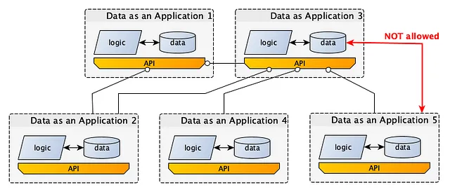
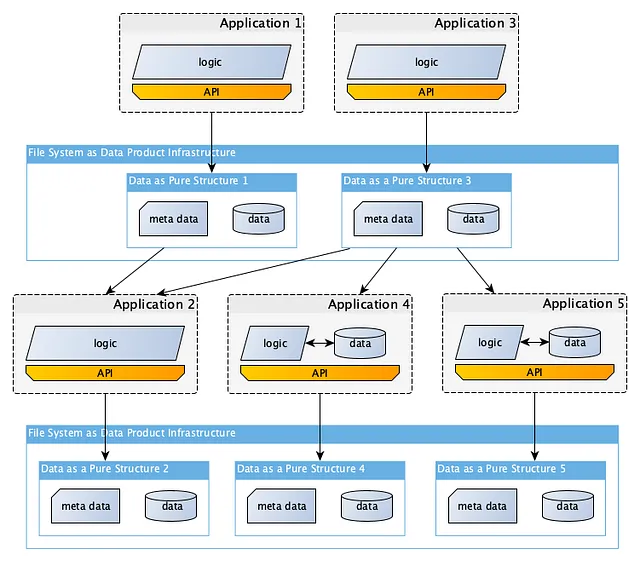
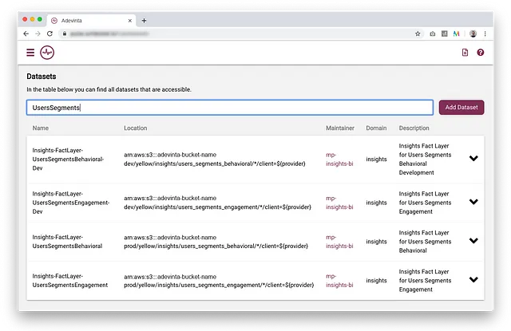
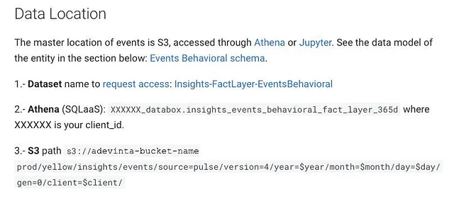
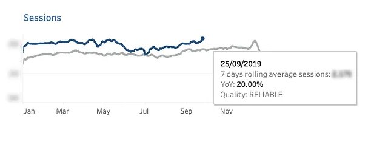

# Data as a Product

!!! quote

    "Data product" is a generic concept and "data as a product" is a subset of
    all possible data products.

    "Data as a product", by contrast, is a mindset or approach that applies
    product-like thinking to a dataset.
    In other words, it ensures that a dataset has all the properties of discoverability,
    accessibility, self-description, and so on.
    Furthermore, it fosters thinking about "data product releases" much like how
    software developers approach software releases - i.e., as discrete, shipped
    products with distinct versions.[^1]

## Data as a Product vs. Data Product

Here is a list of example data products including the category they belong to
and the interfaces used to access it:

- **A company dashboard to visualise the main KPIs of your business.** This data
  product is of the type decision support system and the interface to access it
  is a visualisation.
- **A data warehouse**. This data product is a mix of raw, derived data and decision
  support system. The interface to access it are probably SQL queries.
- **A list of recommended restaurants nearby**. Since the list is curated specifically
  for you, this data product is an automated decision-making one. The interface
  to access it is an app or website.
- **A "faster route now available" notification on Google Maps** is a decision
  support data product (as you are the one making the decision) and its interface
  is a web/app.
- **A self-driving car** is a data product too. Since it drives automatically,
  it is of the type automated decision-making. Its interface is, well, the car
  itself.

## :material-arrow-down-right: Getting Started

**Data as a Product (DaaP)** is the result of applying product thinking into datasets,
making sure they have a series of capabilities including discoverability, security,
explorability, understandability, trustworthiness, etc.

The vast majority of articles on the concept of data products describe the
"Data as an Application" approach.
This is unfortunate, as this method has significant drawbacks compared to the
"Data as a Pure Structure" approach.

Independently from the concept of data products, _Yehonathan Sharvit_ described
the principles of using pure data structures in his book called
"Data-Oriented Programming" (DOP):

- Separating code (behavior) from data.
- Treating data as immutable.
- Separating data schema from data representation.
- Representing data with generic data structures.

### Data as an Application

In the **Data as an Application** approach, data is accessed through an interface (API)
that allows clients to retrieve data by making API calls to an application instance.

This application instance can be a bespoke enterprise application delivering specific
data or even a full-fledged database or AI model (LLMs are increasingly popular)
offering a rather generic data abstraction. Regardless, a running application
instance (the "server") is required for client access to the data.
This instance manages the data stored in the underlying files, prohibiting direct
file access through operating system calls or custom library functions.

Instead, you must use the predefined interfaces provided by the application instance.

### Data as a Pure Structure

Separating code (behavior) from data requires the definition of data products as
pure data structures.

"Data as a Pure Structure" refers to data that exists independently and outside
of any application. It includes all necessary metadata to transform raw data into
a product, but remains pure data structures independent of an accompanying application.
This data structure can be accessed without making API calls to an application instance.

For example, in Unix-like systems, such a structure would be stored as a file
(essentially a byte stream), which can be directly accessed via operating system
calls. Although these are technically system calls, they differ from API calls
since you can’t, quite frankly, do anything at all without a running operating
system.

Often, we maintain a distributed version of the hierarchical file system at a
low level in the operating system to enable distributed file access, such as
HDFS in Hadoop. This layer (a data product storage infrastructure if you like)
integrates closely with the operating system rather than functioning as a separate
application.

!!! note

    It’s important to note that applications can optionally include their own data
    stores in addition to the data products they produce and consume (Application 4 and 5 in the image).
    Also note, these data products contain comprehensive information about their
    usage and lineage. For instance, Pure Structure 2 includes details about being
    created by Application 2 using Pure Structures 1 and 3 as inputs.

## Examples

### Discoverable

In order for data as a product to be discoverable, a search engine is needed and
users must be able to register datasets in this engine and request access to them
(this will increase security, another capability explained below).

The first iteration for this capability could be just a list of datasets in your
de facto internal intranet and you can iterate and build incrementally from that.
==Remember that processes and culture are more important than deploying the ultimate
data catalogue tool too early (which can be too complex for employees to use).==

### Addressable

Having addressable datasets makes your teams more productive.
On one side, Data Analysts and Data Scientists are autonomous in finding and using
the data they need. On the other side, Data Engineers have far less interruptions
from people asking where they can find data about X.

### Self-describing and interoperable

As we commented in the blog post where we explained [Adevinta’s data mesh journey](https://medium.com/adevinta-tech-blog/building-a-data-mesh-to-support-an-ecosystem-of-data-products-at-adevinta-4c057d06824d),
datasets need to contain metadata that make them understandable and follow the
same naming conventions (which will make the datasets interoperable).
We found these pieces of metadata to be super useful to our Data Analysts:

- Data location (as seen above)
- Data provenance and data mapping
- Sample data
- Execution time and freshness
- Input preconditions
- Example notebook or SQL queries using the data set

### Trustworthy and secure

Checking data quality regularly and automatically is a must to fulfil the trustworthy
characteristic of data as a product. And owners of the datasets need to react
accordingly to the results of these checks.

Quality checks must be done at pipeline input and output and it doesn’t hurt to
provide contextual data quality information to consumers of the data;
like for example in Tableau dashboards.

## Read Mores

- [Data as a product vs data products. What are the differences?](https://towardsdatascience.com/data-as-a-product-vs-data-products-what-are-the-differences-b43ddbb0f123)
- [Deliver Your Data as a Product, But Not as an Application](https://towardsdatascience.com/deliver-your-data-as-a-product-but-not-as-an-application-99c4af23c0fb)
- [IBM: What is data as a product (DaaP)?](https://www.ibm.com/topics/data-as-a-product)

[^1]: [GetDBT: Data products vs. data as a product](https://www.getdbt.com/blog/data-product-data-as-product)
