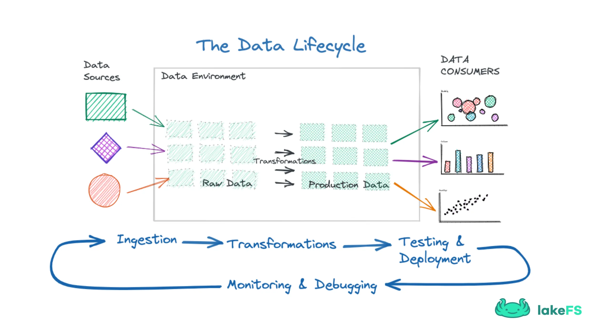

# Data CICD

https://blog.stackademic.com/ci-cd-for-modern-data-engineering-b64d9e76393a

## The Data Lifecycle

Application development starts with Ideation and product requirement and ends with
product release and monitoring. On the other hand, data life cycle is unique because
it starts with data creation, transformation, deployment and all the way to data
deletion (thanks to data privacy regulations that require organizations to delete
personal data of users, if requested).

* [BlogDetLeft; CICD for Data](https://blog.det.life/ci-cd-for-data-how-to-enhance-data-quality-and-increase-data-engineering-velocity-4b1123a770cc)
