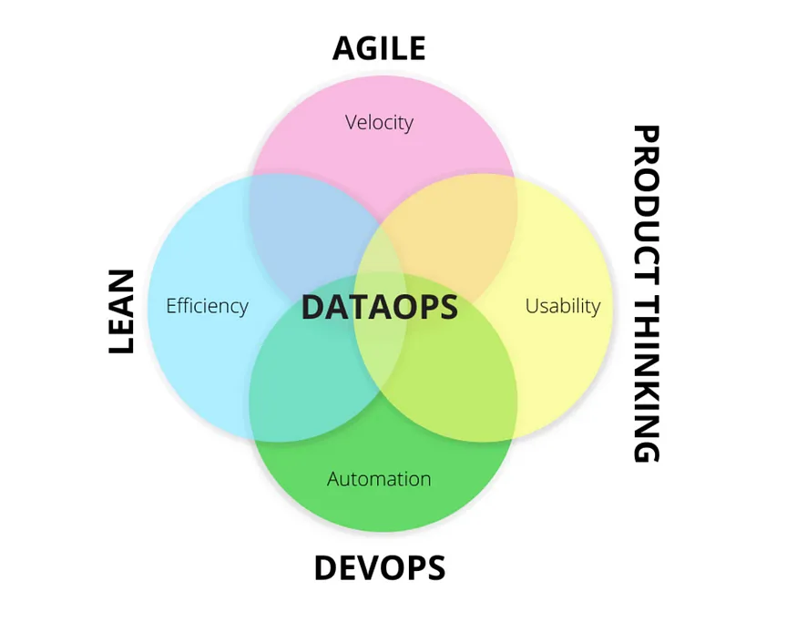

# DataOps

**DataOps** is a collection of practices that focuses on breaking down silos
between data producers and consumers, improving data quality and transparency of
results.
It provides a collaboration of data engineering, data science and operations team.
It aims to automate the delivery of the right and reliable data to appropriate
teams through a much faster approach. And this leads to better data productivity
and enhanced human communication.

{ loading=lazy }

## References

- [Data Engineering concepts: Part 7, DevOps, DataOps and MLOps](https://medium.com/@mudrapatel17/data-engineering-concepts-part-7-devops-dataops-and-mlops-afc6f432473c)
