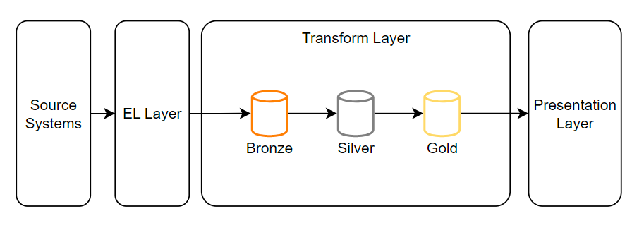
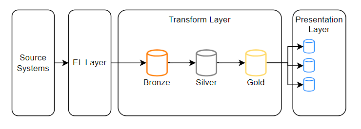
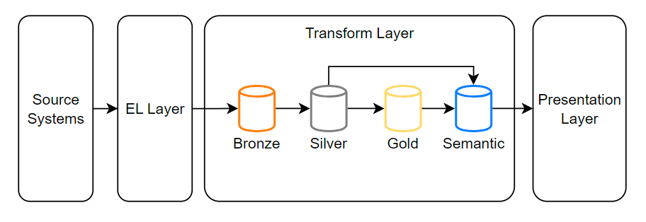

# Semantic Layer

One of the key components of modern data warehouses is the "democratization" of
data.
Rather than have a centralized data team curate and publish reports & dashboards,
organizations have found immense value from creating self-serve reports & dashboards
that users across an organization can query and access the data they need to make
data-driven decisions.

Below is a typical architecture for a modern data stack using a medallion data
warehouse architecture

## Pain points with the Modern Data Stack (MDS):

However, many organizations have found that in trying to democratize their data,
it has caused another set of data problems.
Many end users find that the data they need is NOT in the correct format for a
visualization or they need to make further calculations to get the results they
need to create a report or dashboard.

Moreover, analysts may have different names for essentially the same data record.
The marketing team, for example, may refer to a user as a “prospect,” while the
sales team might call that same business a “client,” while the finance team calls
this user entity a “counter party.”
However, a machine learning model or analytics team might want to analyze all
this data and relate the data back to a single user.

This often leads analysts to create their **own metrics within their local environment
or business intelligence tool**.

**However, this can create major problems**:

- localized metrics have no oversight and can be inaccurate.
- changes in data structure upstream can cause these metrics to break.
- the work required to calculate metrics is duplicated.
- metrics created in one BI tool cannot be integrated with other BI tools or used by the data scientist or data engineering team for automation.

## What is a Semantic layer?

!!! quote

    A semantic layer is a business representation of data and offers a unified
    and consolidated view of data across an organization. Its important to note
    that the semantic layer does not hold or store the actual data, it is a
    metadata and abstraction layer built on the source data.[^1]

This abstraction over the data warehouse maps different data definitions from
various data sources into a unified, consistent, and single view of data for
analytics and other business purposes. Semantic layers create pre-defined views
of processed data that abstract complexity and apply **business-oriented definitions**.
Metrics like revenue or cost are defined.

Hence, the need for centralized metrics to give users a single source of truth and semantic layer. Organizations can codify their metrics in a centralized place and have confidence that they’re getting the same number and context around that number wherever they consume data.

**Benefits of the dbt’s semantic layer include**:

- centralized metrics defined once and used across the organization ensuring accuracy, clarity, and molecularity.
- metrics can be used in downstream applications including machine learning models, automation tools, reverse-etl tools, and even spreadsheets.
- increased ease in calculating metrics (dbt uses YAML files).
- automated documentation to provide metric definition and context.

## When NOT to use a Semantic Layer:

Although the semantic layer can help data teams creating functional self-serving reports and dashboards, it is really only needed when the data infrastructure is relatively mature and there are lots of data users using multiple BI tools. The data warehouse used to build metrics must be relatively clean and formatted correctly into appropriate dimension and fact tables.

If you are a data engineer in a startup, building a semantic layer may not be the best use of your time since building a data infrastructure to support a semantic layer will require significant effort.

However, the semantic layer can be a great value add for organizations using dbt that want to standardize metric definitions. If you would like to delve deeper into dbt’s semantic layer, please check out their blog. In my next blog post, I will show how you can use the dbt semantics layer in practice in dbt-Cloud.

## Conclusion

In conclusion, a semantic layer is an innovative approach to solving the metric
decentralization problem associated with self-serving reporting & dashboards.
It provides a centralized control mechanism to ensure metrics calculations are
consistent & accurate while allowing users the flexibility to use data to improve
decision making in their day-to-day operations.

[^1]: [Why data teams need a semantic layer?](https://medium.com/@blosher13/data-democracy-with-dbts-semantic-layer-6c160a30530b)
