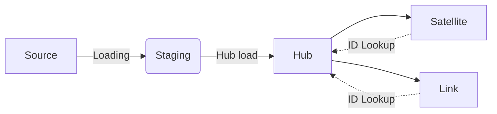
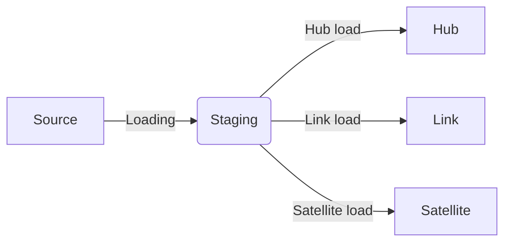
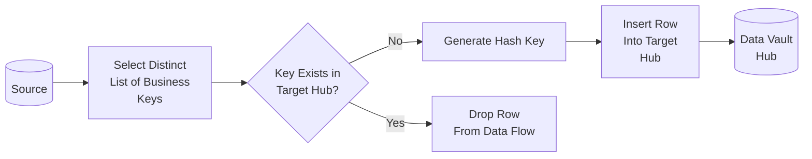
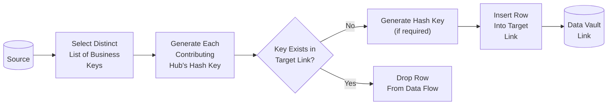
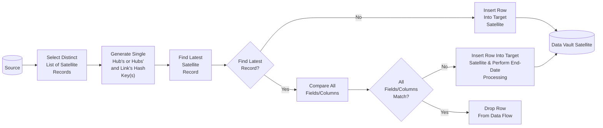
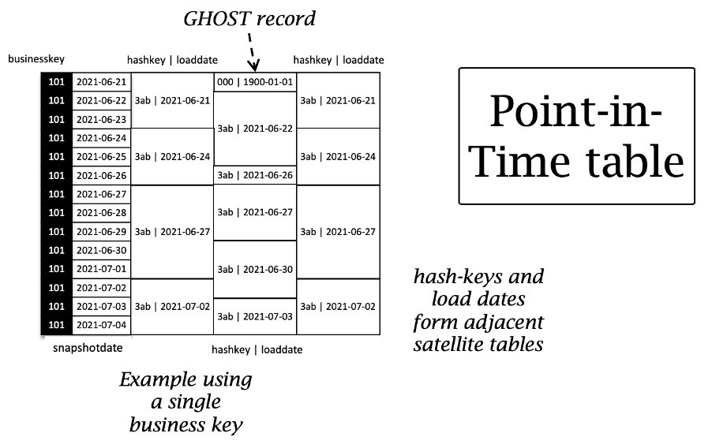
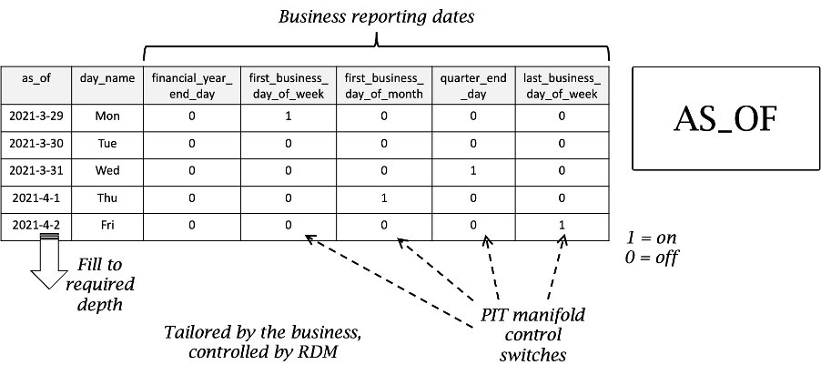
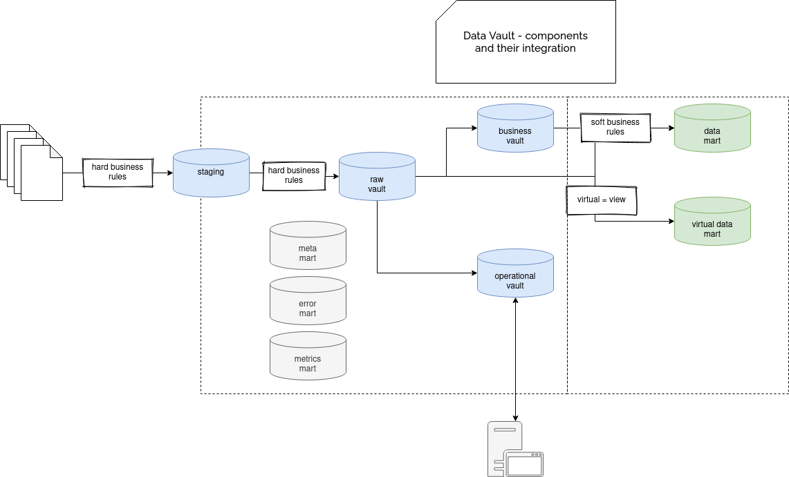

# Data Warehouse: Data Vault Approach

In contrary to Inmon’s view, Linstedt assumes that all available data from the entire
time period should be loaded into the warehouse. This is known as the
"single version of the facts" approach. As with Kimball’s star schema, with the
Data Vault Linstedt introduces some additional objects to organize the data warehouse
structure. These objects are referred to as the hub, satellite and link.

The Data Vault methodology is a hybrid approach that combines aspects of both the Kimball and Inmon methodologies.

It uses a hub-and-spoke architecture to model the data and focuses on creating separate entities for business processes, data sources, and data types.

The Data Vault methodology is known for its scalability, flexibility, and ability to handle complex data relationships.

!!! quote

    Single version of the facts

**Data Vault modeling** is a hybrid approach based on third normal form
and dimensional modeling aimed at the logical Enterprise Data Warehouse (EDW).
The data vault model is built as a ground-up, incremental, and modular models
that can be applied to big data, structured, and unstructured data sets.

**Data Vault 2.0** (DV2) modeling is focused on providing flexible, scalable patterns
that work together to integrate raw data by business key for the enterprise data warehouse.
DV2 modeling includes minor changes to ensure the modeling paradigms can work
within the constructs of big data, unstructured data, multi-structured data, and NoSQL.

Data Vault focuses on **Agile Data Warehouse Development** where scalability, data integration/ETL
and development speed are important. Most customers have a landing zone, Vault zone
and a data mart zone which correspond to the Databricks organizational paradigms
of Bronze, Silver and Gold layers. The Data Vault modeling style of hub, link and satellite tables
typically fits well in the Silver layer of the Databricks Lakehouse.

A data vault is a data modeling design pattern used to build a data warehouse for
enterprise-scale analytics. The data vault has three types of entities:
**hubs**, **links**, and **satellites**.

**Data Vault 1.0 Loading Pattern**:

**Data Vault 2.0 Loading Pattern**:

**Data Vault Modeling 2.0** changes the sequence numbers to hash keys. The hash keys provide
stability, parallel loading methods, and decoupled computation of parent key values
for records.

Regarding the hashes, they have a great benefit for the Big Data workloads. The
loading pattern for **Data Vault 1.0** required to load the hubs first, and later, when
the links and satellites were loaded, make the lookups on the hubs table to retrieve
the surrogate keys. It changes in the Data Vault 2 because the hash key is deterministic,
i.e. it can be resolved from already existing data, making the load parallel
for all components

## Hash

There are many hash functions to choose from: `MD5`, `MD6`, `SHA-1`, `SHA-2`, and some more.
We recommend to use the **MD5 Algorithm** with a length of 128 bit in most cases,
because it is most ubiquitously available across most platforms, and has a decently
low percentage chance of duplicate collision with an acceptable storage requirement.

Hash Keys are not optional in the Data Vault, they are a must. The advantages of

- Massively Parallel Processing (MPP) Architecture
- data load performance
- consistency
- auditability

> **Note**: \
> **Hash values** are the fundamental component of Data Vault 2.0 modeling. They are generated
> using system functions as data is loaded into the data vault. Hashes reduce dependencies,
> allow for quicker joins between tables (HashKey), and allow for fast comparisons to detect
> changes in data (HashDiff).

## Basic Structures of Data Vault

### Hubs

**Hub** (Immutable Business Key): Contains a unique list of **business objects**
that represents a domain or concept within the enterprise, everything else connected
to the hub gives us more context.

> **Note**: \
> **Business Keys** that are supplied by users to identify, track, and locate
> information, such as a customer number, invoice number, or product number.
> Should be,
>
> - Unique
> - At the same level of granularity

| Column       | Alias           | Description                                               | Constraints | Inclusion |
| ------------ | --------------- | --------------------------------------------------------- | ----------- | --------- |
| HashKey      | `HUB_{name}_HK` | HashKey generated from Business Key                       | PK          | Required  |
| BusinessKey  | `{BS-name}_BK`  | Business defined business key                             | UQ          | Required  |
| LoadDatetime | `LDTS`          | Load Datetime from Stage to Data Vault                    |             | Required  |
| RecordSource | `RSCR`          | Specifics the source system from which the key originated |             | Required  |
| LastSeenDate |                 | Date a record was last included on a data load            |             | Optional  |

**Loading Pattern**:

### Links

**Link** (Unit of Work): Represents the relationship between two or more business objects,
representing a part of one or many business processes or even value streams.

Tables that show the relationships between Hubs. Their level of granularity is determined
by the number of hubs they connect, and they are non-temporal.
When thinking of a traditional star schema, links are often associated with fact tables.

**Keynotes on Links**:

- Do not show effectivity
- Only support inserts

**Different types of links can be used to make models more flexible**:

- **Same as Link**: \
  helps to solve the data quality issues problem where a given concept can be misspelled
  and has to be linked to the correct definition. An example of this fuzzy matching
  modeling can be zip codes written in different formats (e.g., 00000 or 00-000)

- **Hierarchical Link**: \
  Represents hierarchies inside the same hub. An example of that hierarchy can be
  a hierarchy of product categories.

- **Standard Link**: \
  Be a standard link created from business rules, so it can be easily discarded
  without affecting the auditability. The official specification calls it also a
  Deep Learning link because it can give confidence for the prediction and strength
  for the correlation of 2 datasets, but if we stay with these 2 columns, we could
  also try to use it to model a result of the ML recommendation system between a
  user and an item. The link would then specify how possible it is that the user
  will like the product. Here, the link is mutable since the prediction can change
  or even be discarded if the algorithm detects other user preferences changes.

- **Non-Historized Link** (aka transactional): \
  That is perfectly adapted to the immutable facts, so something that happened in
  the past can neither be undone nor modified. And since the changes will never happen,
  they don't need to be stored in the satellites.

| Column       | Alias             | DESC                                                         | Constraints | Inclusion |
| ------------ | ----------------- | ------------------------------------------------------------ | ----------- | --------- |
| HashKey      | sha*<type>*<name> | HashKey generated from Business Keys of Linked Hubs          | PK, UQ      | Required  |
| BusinessKey  | <bs-name>\_key    | Concatenation of Business Keys from linked Hubs              | UQ          | Optional  |
| LoadDatetime | `LDTS`            | Load Date & Time from Stage to DV                            |             | Required  |
| RecordSource | `RSCR`            | Specifics the source system from which the key(s) originated |             | Required  |
| HubHashKey1  |                   | HushKey from Hub Relationship 1                              | FK          | Required  |
| HubHashKey2  |                   | HushKey from Hub Relationship 2                              | FK          | Required  |
| ...          |                   | HushKey from Hub Relationship ...                            | FK          | Required  |

**Loading Pattern**:

### Satellites

**Satellite** (Descriptive Context): Descriptive change-tracking content eiter describing the business
object (hab-satellite) or the unit of work (link-satellite).

Tables that provide context to the business objects and relationships described in
Hubs and Links. Each satellite is connected to only one Hub or Link, but a Hub or
Link can have multiple satellites.

**Keynotes on Satellites**:

- One per source system
- Stores all context
- Stores all history
- Delta driven, similar to SCD
- EndDate is only attribute that is updated
- Most flexible construct

**Different types of satellite can be used to make models more flexible**:

- **Multi-active Satellite**: \
  In this satellite given hub or link entity has multiple active values. For example,
  it can be the case of a phone number that can be professional pr personnel, and both
  may be active at a given moment.

  - https://www.scalefree.com/scalefree-newsletter/using-multi-active-satellites-the-correct-way-1-2/
  - https://www.scalefree.com/scalefree-newsletter/using-multi-active-satellites-the-correct-way-2-2/

- **Effectivity Satellite**: \
  A descriptive record that is valid (effective) only for some specific period of time.
  You will there the start and end dates and an example of it can be an external
  contractor working in a company in different periods.

- **System-Driven Satellite**: \
  Mutable, created from hard business rules (data-type rules, like enforcing integer type;
  not involving pure business rules like classifying a revenue as poor or rich category of people)
  for performance purposes. The examples of these satellites are the point-in-time table (PIT)
  and bridge table, presented in the next paragraph.

| Column       | Alias             | DESC                                                         | Constraints | Inclusion |
| ------------ | ----------------- | ------------------------------------------------------------ | ----------- | --------- |
| HashKey      | sha*{type}*{name} | HashKey from parent Hub or Link                              | PK, FK      | Required  |
| LoadDatetime | LDTS              | Batch Load Date & Time from Stage to DV                      | PK          | Required  |
| EndDatetime  | EDTS              | Load Date & Time the record became inactive                  |             | Required  |
| RecordSource | RSCR              | Specifics the source system from which the key(s) originated |             | Required  |
| HashDiff     | HASH_DIFF         | Hushed value of all attributes data                          |             | Optional  |
| ExtractDate  |                   | Date data was extracted from source system                   |             | Optional  |
| Status       |                   | Insert (I)/Update (U)/Delete (D)                             |             |           |
| Attributes1  |                   | Attributes column 1. Number and type will vary               |             | Optional  |
| Attributes2  |                   | Attributes column 2. Number and type will vary               |             | Optional  |
| ...          |                   | Attributes column ... Number and type will vary              |             | Optional  |

**Loading Pattern**:

The **hash difference column** applies to the satellites. The approach is the same as
with the business keys, only that here all the descriptive data is hashed. That
reduces the effort during an upload process because just one column has to be looked up.
The satellite upload process first examines if the hash key is already in the satellite,
and secondly if there are differences between the hash difference values.

### Point-In-Time

**PITs** (Simplify with Equijoin): disposable table designed to simplify querying of business
object or relationship state attributes for information marts.

> **Note**: \
> (Business Vault)

Represents multiple satellite tables in one. But the idea is not to copy any of
the context values but only their load dates. For example, if a hub has 3 different satellites,
satA, satB and satC, a point-in-time table will store the most recent load date
for every satellite and so for every business key. So the stored data will be
built like (business key [BK] from the hub, MAX(loadDate from satA for BK),
MAX(loadDate from satB for the BK), MAX(loadDate from satC for BK)

The PIT serves two purposes:

- Simplify the combination of multiple deltas at different “point in time” \
  A PIT table creates snapshots of data for dates specified by the data consumers
  upstream. For example, it is often usual to report the current state of data each day.
  To accommodate these requirements, the PIT table includes the date and time of
  the snapshot, in combination with the business key, as a unique key of the entity
  (a hashed key including these two attributes, named as CustomerKey).
  For each of these combinations, the PIT table contains the load dates and the
  corresponding hash keys from each satellite that corresponds best with the
  snapshot date.

- Reduce the complexity of joins for performance reasons \
  The PIT table is like an index used by the query and provides information about
  the active satellite entries per snapshot date. The goal is to materialize as
  much of the join logic as possible and end up with an inner join with equi-join
  conditions only. This join type is the most performant version of joining on
  most (if not all) relational database servers. In order to maximize the
  performance of the PIT table while maintaining low storage requirements,
  only one ghost record is required in each satellite used by the PIT table.
  This ghost record is used when no record is active in the referenced satellite
  and serves as the unknown or NULL case. By using the ghost record, it is
  possible to avoid NULL checks in general, because the join condition will
  always point to an active record in the satellite table: either an actual
  record which is active at the given snapshot date or the ghost record.

For example,

We identify range of `PITForm` and `PITTo` and map the data in satellites to
this range (greater or equal than).

> **Note**: \
> PIT tables are incrementally updated when new data becomes available in the
> Data Vault tables that support them.

### Bridge

**Bridges** (Shorten the Distance): Disposable table designed to shorten the distance
between business objects for information marts.

> **Note**: \
> (Business Vault)

Similar to the PIT tables, bridge tables are also the tables designed with the
performance in mind. But unlike a PIT table, a bridge table will only store the
business keys from the hubs and links. If you are familiar with the star schema,
you will see some similarities between bridge and fact tables. The difference
is that the bridge stores only the keys, whereas the fact will also store the
measures. A single accepted value in the bridge tables are aggregations computed
at runtime. Together with PIT table, the bride is considered as a query-assist
structure.

There are some important notes to clarify on the structure of the Bridge table:

- Each Bridge table contains a `zero record`, which provides an 'unknown' record
  that replaces to any NULL value.
- Each Bridge record receives a surrogate key that uniquely identifies a row in
  the Bridge table. This is purely for identification purposes.
- The load date / time stamp used is derived from the involved Hub and Link tables.
  When loading the Bridge table, it will reuse the lowest (earliest) value from
  the tables that are in scope. This value contains the earliest moment in time
  a relationship between Core Business Concepts could be established.

> **Note**: \
> Bridge tables are incrementally updated when new data becomes available in the
> Data Vault tables that support them.

### Reference

> **Note**: \
> (Raw Vault)

They are present to avoid data storage redundancy for the values
used a lot. For example, a satellite can store a product category code instead of
de-normalizing the whole relationship, so bring the category description, full
name to the satellite itself, and use the reference table to retrieve this information
when needed. The reference tables are built from the satellite, hub or links
values entities but are often used only by the satellites since they're the most
"descriptive" part of the data vault modeling.

### Staging

Exactly like a staging area, staging tables are temporary structures used to improve
the load experience. They can also provide the Data Vault features if the raw data's
loading process to the data warehouse storage doesn't support them. More exactly,
you will find there a staging table and a second-level staging table that will
load the raw data from the staging table and add all required attributes like
a hash key, load times or hash difference key)

## Types of Data Vault

### Raw Vault

Raw Vault provides the modelled outcome of business processes from source systems,
business vault extends those business processes to how the business sees them.
Business rules supplied to Raw Vault are idempotent, business vault’s rules must
be the same.

### Business Vault

Data that has been modified by the business rules and is modeled in DV style tables;
sparsely created.

So, the raw vault is the raw, unfiltered data from the source systems that has been
loaded into hubs, links and satellites based on business keys.
The business vault is an extension of a raw vault that applies selected business
rules, de-normalizations, calculations and other query-assistance functions.
It does this in order to facilitate user access and reporting.

A Business Vault is modeled in DV style tables, such as hubs, links and satellites,
but it is not a complete copy of all objects in the Raw Vault. Within it, there
will only be structures that hold some significant business value.

The data will be transformed in a way to apply rules or functions that most of
the business users find useful as opposed to doing these repeatedly into multiple
marts. This includes things like data cleansing, data quality, accounting rules or
repeatable calculations.

In Data Vault 2.0, the Business Vault also includes some special entities that help
build more efficient queries against the Raw Vault. These are Point-in-Time and Bridge Tables.

### Metric Vault

The Metrics Vault is an optional tier used to hold operational metrics data for the
Data Vault ingestion processes. This information can be invaluable when diagnosing
potential problems with ingestion. It can also act as an audit trail for all the
processes that are interacting with the Data Vault.

### Error Marts

Error Marts are an optional layer in the Data Vault that can be useful for surfacing
data issues to the business users. Remember that all data, correct or not, should
remain as historical data in the Data Vault for audit and traceability.

### Metrics Marts

The Metrics Mart is an optional tier used to surface operational metrics for analytical o
r reporting purposes.

## Data Vault Pipeline

Let’s run through each stage of the pipeline

1. Data is landed either as an INSERT OVERWRITE or INSERT ONLY. Without dropping
   the target’s contents then this is the first place we can use Streams to process
   new records only downstream.

2. Landed content is staged with data vault metadata tags, some of these are:

   - Surrogate hash keys – for joining related data vault tables
   - Load date – the timestamp of when the data enters the data warehouse
   - Applied date – the timestamp of the landed data
   - Record source – where the data came from
   - Record hashes – a single column representing a collection of descriptive attributes

3. Autonomous loads through

   - Hub loaders – a template reused to load one or many hub tables
   - Link loaders – a template reused to load zero or many link tables
   - Sat loaders – a template reused to load zero or many satellite tables

4. Test Automation measuring the integrity of all loaded (and related) data vault
   artefacts from the staged content

5. Snapshot is taken of the current load dates and surrogate hash keys from the
   parent entity (hub or link) and adjacent satellite tables.

6. Use the AS_OF date table to control the PIT manifold to periodically populate
   target PIT tables at the configured frequency.

   - **PIT**

     

     A Point-in-Time (PIT) table is a physical collection of applicable surrogate
     keys and load dates for a snapshot period. It must be a table otherwise the
     potential benefits of EQUIJOIN are not realised.

     It improves join performance and forms the base for information mart views
     and easily allows you to define marts to be built for specific logarithmic
     time windows by a snapshot date. The traditional approach to building a PIT
     table makes use of an adjacent date table to define the logarithmic period
     and the PIT windows itself.

   - **AS_OF**

     

     AS_OF table controls the PIT snapshot in a combination of two ways

     - By Window: defining the start and end date of the AS_OF period, the window
       of snapshots to take. You can define a much larger than needed table but
       subset the window in execution.
     - By Frequency: defining at what frequency snapshot keys are to be sent to
       a PIT target. This is tailored by the business and is a part of the report
       frequency and depth. Ideally this would not have any involvement by engineering
       teams, only to set this up. From there the business controls the 1 and 0 switches.

7. Information Marts that are defined once as views over a designated PIT table.

## Data Vault Architecture

- **Raw Source** (Copy from your OLTP data sources)

- **Staging** (nowadays as Persistent Staging Area in a Datalake, because it is cheaper than a Relational DB)

- **Raw Vault** (applying so-called Hard Rules, like data type changes)

- **Business Vault** (applying so-called Soft Rules, all your Business Logic, Aggregations, Concatenation, ...)

- **Information Mart** (Data Mart sometimes virtualized, but not always ... usually Star/Snowflake Schema)

- **Cube/Tabular Model**

- **BI Tool**

> **Hard Rules**: \
> These should be applied before data is stored in the DataVault. Any rules applied
> here do not alter the contents or the granularity of the data, and maintains
> auditability.
>
> - Data typing
> - Normalization / De-normalization
> - Adding system fields (tags)
> - De-duplication
> - Splitting by record structure
> - Trimming spaces from character strings

> **Soft Rules**: \
> Rules that change, or interpret the data, for example adds business logic. This
> changes the granularity of the data.
>
> - Concatenating name fields
> - Standardizing addresses
> - Computing monthly sales
> - Coalescing
> - Consolidation

## Data Vault Modeling Approaches

- Bottom-up approach (Source-Driven)
  This is a source centric design approach, where you rely on understanding the
  source systems and design your DV model based on that.

- Top-down approach (Business-Driven)
  This is a business centric design approach, where you start by understanding the
  business needs, use cases, and business keys in order to design the DV Model.

- Combined approach
  This is a hybrid approach, where you use both Bottom-up and Top-down approaches.

  Examples:

  - Hubs and Links follow Top-down approach
  - Satellite follows Bottom-up approach

## Unit of Work

- https://hanshultgren.wordpress.com/2011/05/04/unit-of-work-demystified/

## Advantages of Data Vault

- **Scalable** \
  One of the biggest advantages of Data Vault model is the ability to scale up or down
  quickly - a huge asset for companies going through growth or transition periods.

  Because satellites are source system specific, adding sources is an easy as adding
  satellites. No updates to existing satellite tables are required.

  > **Note**: \
  > Update may be necessary for views in the information mart

- **Repeatable** \
  Three main entities - Hubs, Links, and Satellites - all follow the same pattern.
  Scripts to build tables or run ETL processes can be automated based on these patterns
  and metadata.

  A number of services and programs exist to quickly automate these processes

- **Auditable** \
  Build on core principle that data is never deleted, and all data is loaded in
  its original format. Record source column in entities allows for tracking back
  to source system.

  Tracking of business keys and separation of business keys (Hubs) from context (Satellites)
  allows for easier compliance with GDPR & similar data protection regulations.

- **Adaptable** \
  Separation of hard and soft rules allows for quicker updated.

  - **Hard**: Any rule that does not change content of individual fields or gain.
  - **Soft**: Any rule that changes or interprets data, or changes the gain (turning data into information)

  Changes in business logic requires no change to ETL processes - only updates
  to virtualized information mart layer.

  Fit within an Agile Framework

- **Optimized Loading**

  1. Decreased process complexity
  2. Decreased amount of data being processed
  3. Increased opportunities for parallelization

- **Platform Agnostic**
  A data vault architecture and model can be built on many platforms - both on premise
  and on cloud. Initial design for Data Vaults were to handle batch processing,
  but patterns also now exist for handling streaming data.

Good fit for:

- Enterprise teams where the ability to audit data is a primary concern
- Teams that need flexibility and who want to make large structural changes to their data without causing delays in reporting
- More technical data teams that can manage and govern the network-like growth of data vault models

## Disadvantages

- **Training & Complexity**
  Because the Data Vault is not a well known modeling technique, hiring or training
  staff may be an issue or expense.

  Data Vault models have a tendency to become very large and complex, which may be
  a daunting process for those new to the technique.

## Conclusion

- Fix the SCD2 problem, because of SAT table can only insert strategy not update, or delete.
- Any record have unique key.
- Can do Change Data Capture (CDC) because all record have end_datetime tracking.
- เหมาะกับการเป็น Agile Data Warehouse เพราะถ้า business process เปลี่ยน ก็ไม่ต้องเปลี่ยน data model ใหม่ทั้งหมด แค่เพิ่มหรือแก้ Sat ไม่เหมือนกับ Dimension model ที่ fact table ใหญ่มากและเก็บ relation ต่างๆไว้ จึงแก้ไขได้ยากเพราะจะกระทบ Relation ที่อยู่ใน fact นั้นไปหมด ง่ายที่คือไปสร้าง Fact ใหม่ที่มีข้อมูลซ้ำซ้อนกับ Fact เก่าบางส่วน ก็ทำให้เปลือง Data Storage อีก
- ถ้ามี Entity Relation ใหม่ เข้ามา จะสามารถเพิ่มเข้าที่ Link table ได้ทันที
- Data Sources มีหลากหลาย เพราะฉะนั้นแต่ละ Record ของทุก table จะต้องระบุ Record Source ว่ามันมาจาก data source ไหน ระบบไหน
- เหมาะกับการเก็บ data เป็น centralize data warehouse/hub เพื่อไว้ใช้เป็น source ของ data mart, Adhoc analytics หรือ ETL/ELT application ต่อไป
- ไม่เหมาะกับการทำ Reporting ที่ Data Vault เพราะ data ที่นี่ยังไม่มีการ Transform, Cleansing
- ควรทำ Data Marts, ETL / ELT เพิ่มเพื่อรองรับการทำ Analytics, Reporting
- คนที่ Implement&Maintain Data Vault ต้องมีสกิลระดับนึงเพราะ Surrogate Key จะใช้การ Hashing ทำ ไม่ใช่เพียงการทำเป็น run_id เฉยๆ

## References

- https://www.databricks.com/glossary/data-vault
- https://www.databricks.com/blog/2022/06/24/prescriptive-guidance-for-implementing-a-data-vault-model-on-the-databricks-lakehouse-platform.html
- https://atitawat.medium.com/data-vault-%E0%B8%84%E0%B8%B7%E0%B8%AD%E0%B8%AD%E0%B8%B0%E0%B9%84%E0%B8%A3-part1-2f4cf602ed6c
- https://medium.com/hashmapinc/getting-started-with-data-vault-2-0-c19945874fe3
- https://medium.com/hashmapinc/3nf-and-data-vault-2-0-a-simple-comparison-4b0694c9a1d1
- https://aginic.com/blog/modelling-with-data-vaults/
- https://www.waitingforcode.com/general-big-data/data-vault-2-big-data/read
- https://www.scalefree.com/scalefree-newsletter/point-in-time-tables-insurance/
- https://digitalcommons.georgiasouthern.edu/cgi/viewcontent.cgi?article=2402&context=etd \*\*\*
- https://www.linkedin.com/pulse/data-vault-pit-flow-manifold-patrick-cuba/
- https://medium.com/snowflake/data-vault-naming-standards-76c93413d3c7
