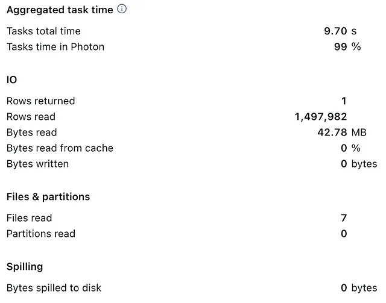
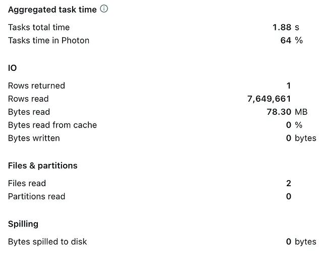
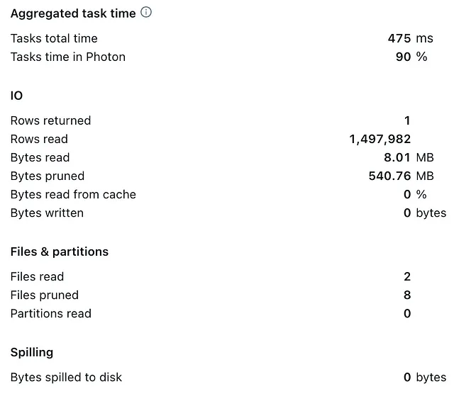

# One Big Table (OBT) Approach

In the dynamic landscape of data warehousing, the methodologies employed for structuring
data play a pivotal role in unlocking timely insights for informed decision-making.
Since the foundational theories of the 1990s and 2000s by Inmon (Inmon W.H., Building
the Data Warehouse, 1990), Kimball (Kimball R, The Data Warehouse Toolkit, 1996),
and later Linstedt (Linstedt D, Data Vault Series 1 — Data Vault Overview, 2002),
various data modeling techniques for traditional data warehousing have evolved
and debated. This blog post delves into two data modeling techniques: Dimensional
Modeling and One Big Table (OBT).

Through this blogpost, we will explore the strengths and challenges of these two
techniques and discuss the best practices for implementing them on Databricks.

## Dimensional Modeling: essential then, optional now — understanding the shift

Designing a dimensional data model requires a bottom-up understanding of the
business requirements and high-level profiling of data sources. The most common
implementation of Dimensional Modeling is Star Schema, which has become widely
adopted as the presentation layer in most data warehouses in the past decades.
This method denormalizes the data into measurable business process events called
**Facts** and the contextual details surrounding the business process events called
**Dimensions**.

### The rise of Dimensional Modeling: why it became the gold standard

Dimensional Modeling was introduced to optimize the data model for analytics in the logical layer of the Relational Databases Management Systems (RDBMS) without redesigning the physical layer. The logical and physical layers of the RDBMS were purposefully designed for Online Transaction Processing (OLTP), facilitating efficient row-oriented data entry, and used primarily for transactional purposes, maintaining ACID (Atomicity, Consistency, Isolation, Durability) properties in normalized data. On the other hand, Dimensional Modeling optimizes the logical layer for Online analytical processing (OLAP) to process and aggregate historical data with better performance. Dimensional Modeling in the logical layer offered various benefits, such as:

- Simplified Data Usability: Dimensional Modeling simplifies data understanding by structuring it into fact and dimensional tables, making it intuitive for end-users to map real-world processes to the data model. Dimensional Modeling supports efficient data aggregation, which can serve the Business Intelligence (BI) tools as the semantic layer.
- Query Performance: The primary advantage of Dimensional Modeling lies in its ability to optimize for query performance without compromising the depth of historical analysis. The Star Schema, a common implementation of Dimensional Modeling, optimizes analytics by denormalizing data into business-grained facts and dimensions, improving query performance and data aggregation.
- Scalability and Consistency: Dimensional Models excel at scalability, accommodating growing data volumes and changing business requirements. The Star Schema can adapt changes in the dimensions and facts, facilitate Slowly Changing Dimensions and integration of incremental data. There are further approaches to reducing the redundancy in the data, such as implementing a Snowflake Schema or using Surrogate Keys in the dimension tables.

### Dimensional Modeling under scrutiny: navigating new technological landscapes

Dimensional Modeling achieved a level of optimization on the logical layer effectively balancing redundancy and query performance, which was crucial when storage and computing resources were costly and limited row-oriented databases were insufficient for analytical processing. The advancement in Data technologies has brought to light certain considerations associated with traditional Dimensional Modeling.

- Operational and Design Limitations: Dimensional Modeling requires a substantial initial investment in schema design, as well as ongoing maintenance of data pipelines, typically managed through ETL tools. Beyond operational overhead, Dimensional Modeling faces inherent design limitations, such as the complexity of managing Slowly Changing Dimensions and Fact-to-Fact joins. In the past, these challenges were considered worthwhile trade-offs for the purpose of improved query performance. However, with the advancements in modern data technologies, these issues can often be circumvented, reducing the necessity of complex schema designs and operational overhead.
- Technological Evolution in Data Storage and Processing: Modern data warehousing allows for flexibility and scalability by decoupling storage and processing. These technologies leverage Massive Parallel Processing (MPP) and physical columnar storage, which inherently optimize historical data aggregation and analytics by default. Also, the drawbacks of denormalization are mitigated since the storage cost has significantly reduced over time. Advanced optimization technologies, e.g., data compression on the storage layer and clustering, outweigh the complexity of keeping the normalized data.

## Dimensional Modeling best practices on Databricks

Considering the advanced Data Warehousing capabilities of Databricks, adhering
strictly to Dimensional Modeling e.g. Star Schema is not a necessity anymore;
however possible and very well supported. We’ll review various Databricks technologies
here that make it possible to implement and optimize the Dimensional Modeling
technique.

- ACID properties: Databricks Delta Lake supports ACID transactions on Delta Tables, simplifying the maintenance and quality of the Dimensional Models.
- Data layers: The Star Schema can be deployed into a Gold Layer of the medallion architecture in Databricks to power analytics and fast decision-making.
- ELT pipelines: The pipeline to transform the transactional data into dimensional data models is supported by Databricks SQL and Delta Live Tables (DLT).
- Relational constraints: Unlike usual data lakes, Databricks supports schema enhancement such as relational constraints e.g. Primary Keys, Foreign Keys, and Identity Columns in Databricks SQL as Surrogate Keys and enforced CHECK constraints for data quality. The physical and virtual constraints can exist as meta-objects in the Unity Catalog.
- Unified governance: All data models, Dimension tables, Fact tables, and their relations are registered centrally into the Unity Catalog. With Unity Catalog as the unified governance layer, Dimensions and Facts can be discovered and shared across organizations without the need to duplicate it.
- Optimization: Databricks supports Liquid Clustering, which incrementally optimizes the data layout without rewriting the data, which can be applied to fact tables as well as dimension tables.

In [this blogpost](https://www.databricks.com/blog/2022/05/20/five-simple-steps-for-implementing-a-star-schema-in-databricks-with-delta-lake.html), you can follow a simple 5-step guideline to implement Dimensional
Modeling on Databricks.

## Embracing simplicity: The One Big Table (OBT) approach as a modern alternative

One Big Table emerges as another alternative concept to Dimensional Modeling.
This method, characterized by its simplicity, involves storing data in a single,
expansive table, offering a much-simplified data model by significantly reducing
the number of tables that need to be governed and updated.

Reconsidering OBT: unveiling the benefits

- Simplicity: In contrast to designing a Dimensional Model, setting up One Big Table is quick and easy. It facilitates flexibility for swift integration and modification of data while simplifying workflows with data at high velocities. As complex joins are usually not required, finding, querying, and exploring a single wide big table is also straightforward, increasing the discoverability and readability of data assets.
- Data Consistency & Governance: Since all data is stored and updated in One Big Table, the risks of data duplication and data inconsistencies are reduced and can be easily mitigated and monitored with quality constraints applied to a single table. By reducing the amount of tables to govern, One Big Table can also significantly decrease administrative workloads.
- Performance: Although the OBT approach originally required scanning and filtering of an entire large table, it avoids complex joins and transformations, reducing the amount of data shuffling, and often delivering faster query results compared to Dimensional Modeling. This benefit is additionally capitalized by a much simpler reduction of data skews.

Addressing the challenges of OBT

- Performance: Despite previously highlighted performance benefits of the One Big Table approach by redundancy of joins and shuffles, as tables grow in size, they can introduce performance bottlenecks for queries where the entire table needs to be scanned. This has historically been the most prominent challenge of the One Big Table concept, which can be particularly challenging for serving the BI tools. With columnar storage in Delta, OBT can lead to high data compression for the table, making storage of repeated values less of a concern compared to classical row-based databases. However, since it is indeed One Big Table, if you need to prune files by more than one to two dimensions for ALL attributes you need in the table, OBT can quickly become inefficient. If you have five relational tables, each with one or two clustered columns, you can efficiently prune files using up to ten dimensions. If you have an OBT model, you can only use two to three dimensions before clustering becomes useless.
- Data exploration: One Big Table lacks the structure inherent to Dimensional Modeling by mapping specific business requirements to data architecture. Although this can also pose a benefit, as tables grow, particularly in width, navigating and exploring data in One Big Table can become complicated, particularly using BI tools. Moreover, this approach can lead to duplicated analysis and results in writing numerous window functions instead of joins.
- Data privacy: Storing all data in One Big Table concentrates a lot of data, including sensitive information, in one place. As the number of users querying data from a single big table is larger than in Dimensional Models, the concept requires fine-grained access controls, data masking, and anonymization, which can become complex to manage for very wide tables.
- Data Quality: The level of data quality and observability can seriously influence the decision to utilize OBT. If you need to implement data quality checks beyond your filtering/clustered columns, and if your data quality rules / checks need to be measured across multiple rows, this can get expensive and complex fast. Overall for OBT, keep data quality simple: check quality statelessly (data quality checks across rows at a point in time is stateful) or keep the data quality rules to a window that utilizes the clustering columns. Try to measure / enforce data quality within the write-side of the pipeline, especially since OBT models tend to be much larger.

Overall, OneBigTable can be incredibly useful for certain use cases, but should
be used with caution. ==The OBT model works well for use cases where you only need
to filter the table on 1–3 dimensions, and the rest of your analytics / apps are
built on those filters.== Real world examples include IoT data, logging systems,
or single use case / data view applications. In IoT data, you usually only ever
need to filter the data by an event timestamp, sensor type, and then the rest of
the downstream analytics are built on that. This is a perfect example of a string
use case for OBT because you can have 100s/1000s of attributes that a single
sensor row carries, but you only ever need to filter by the initial timestamp/sensor
type columns. In the Sensor IoT example, modeling the data for 100s+ number of
data attributes is not worth the lift, and the OBT model is built perfectly for
this.

## OBT best practices on Databricks

Let’s create OBT from a dimensional Databricks sample dataset using a Databricks
SQL Serverless (XS) warehouse and explore the benefits and challenges of OBT and
how we can address them in Databricks.

```sql
CREATE TABLE tpch_obt AS
SELECT
  *
FROM
  samples.tpch.customer
  JOIN saples.tpch.orders ON c_custkey == o_custkey
```

The resulting Delta table comprises 730 MB stored across 7 files.

Let’s analyze the average order price for the AUTOMOBILE market segment:

```sql
SELECT
 MEAN(o_totalprice)
FROM
 tpch_obt
WHERE
 c_mktsegment == "AUTOMOBILE"
```

The wall-clock duration time on a Databricks SQL Serverless XS Warehouse was
3.5 seconds.

Looking at the query profile in the Query History provides further insights:



Note that 7 files were scanned and the total task time was 9.7 seconds.

Querying the Dimensional Model on the same Databricks SQL Serverless XS warehouse
with a slightly faster wall-clock duration of 2.6 seconds looks like the following
(if you want to reproduce the performance test, make sure to restart your SQL
Serverless Warehouse after the OBT creation to avoid CACHING):

```sql
SELECT
 MEAN(a.o_totalprice)
FROM
 samples.tpch.orders a JOIN samples.tpch.customer b ON a.o_custkey == b.c_custkey
WHERE
 b.c_mktsegment == "AUTOMOBILE"
```

Looking at the query history reveals further details:



Despite the latter query requiring a join, it’s faster as fewer files have to be
scanned.

When executing both queries again, one can capitalize on Databricks SQL automatic
caching capabilities ([see this blog post](https://www.databricks.com/blog/understanding-caching-databricks-sql-ui-result-and-disk-caches)),
effectively reducing wall-clock duration to <500ms for both queries.

### Optimize query performance using Liquid Clustering

To optimize the query performance for the OBT beyond Caching, Databricks Liquid
Clustering offers an easy and automated approach to simplify data layout,
resulting in largely optimized query performance.

```sql
ALTER TABLE tpch_obt CLUSTER BY (c_mktsegment);
OPTIMIZE tpch_obt;
```

Subsequently querying the table (same statement as before) results in >20x task
speed up and >3x wall-clock duration, bringing the latter down to 1.13 seconds.

The optimized data layout by liquid clustering effectively reduced the number of
files to read from 7 to 2.



As datasets increase in size, this effect becomes even more prominent in the
absolute speedup time.

### Data Privacy with Row Filters and Column Masks

#### Row filters

Row filters allow you to apply a filter to a table so that subsequent queries
only return rows for which the filter predicate evaluates to true.
This facilitates overcoming the privacy challenges of OBT.
A row filter is implemented as an SQL user-defined function (UDF).

**Create the row filter function**:

```sql
CREATE FUNCTION mktsegment(c_mktsegment STRING)
RETURN IF(IS_ACCOUNT_GROUP_MEMBER('pl_obt'), true, c_mktsegment = 'HOUSEHOLD');
```

**Apply the row filter to a table**:

```sql
ALTER TABLE tpch_obt SET ROW FILTER mktsegment ON (c_mktsegment);
```

Subsequent queries of users who are members of the group pl_obt will return only
rows where the `c_mktsegment` column equals `'HOUSEHOLD'`.

#### Column masks

Column masks let you apply a masking function to a table column.
The masking function gets evaluated at query runtime, substituting each reference
of the target column with the results of the masking function. In the following
example, we create a user-defined function that masks the total_price column so
that only users who are members of the pl_obt group can view values in that column.

**Create the column masking function**:

```sql
CREATE FUNCTION price_mask(o_totalprice DECIMAL)
    RETURN CASE WHEN is_member('pl_obt')
    THEN o_totalprice ELSE '***-**-****' END;
```

**Apply the column masking function to a table**:

```sql
ALTER TABLE tpch_obt ALTER COLUMN o_totalprice SET MASK price_mask;
```

Subsequent queries of users who are not members of the `pl_obt` group will result
in masked values:

```sql
SELECT o_totalprice FROM tpch_obt LIMIT 10;
```

## References

- https://medium.com/@hubert.dulay/one-big-table-obt-vs-star-schema-a9f72530d4a3
- https://medium.com/dbsql-sme-engineering/one-big-table-vs-dimensional-modeling-on-databricks-sql-755fc3ef5dfd
