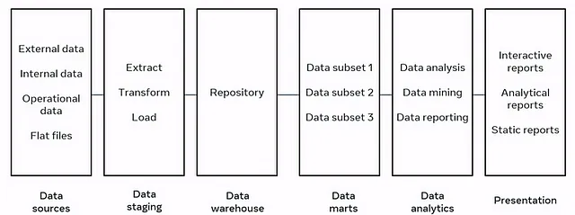
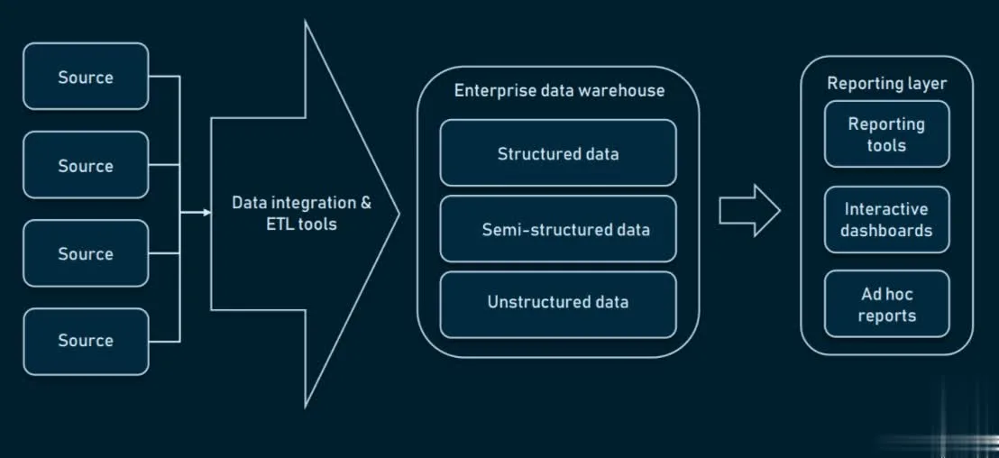
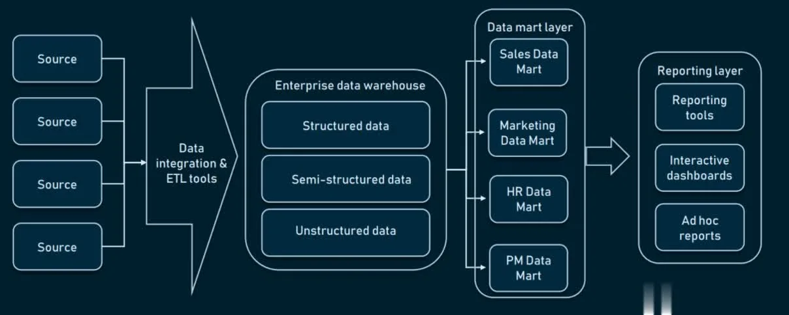
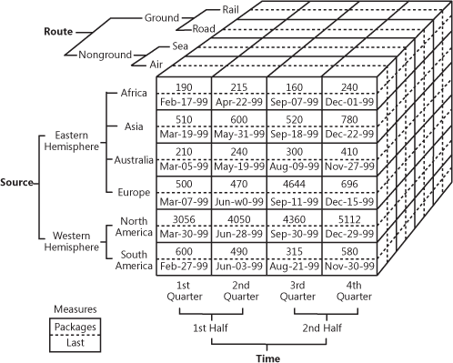
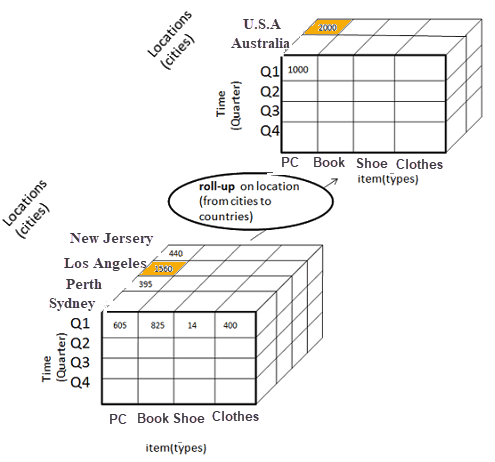
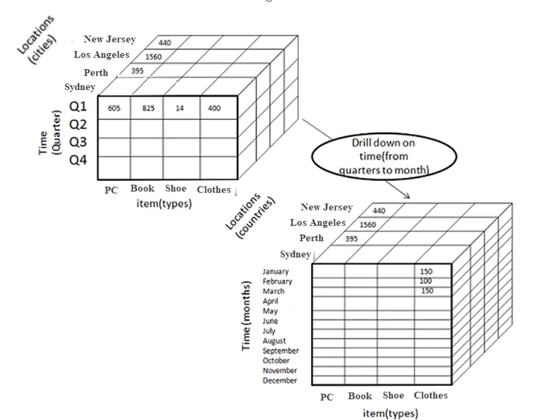
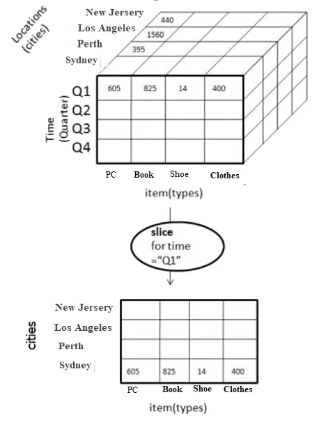
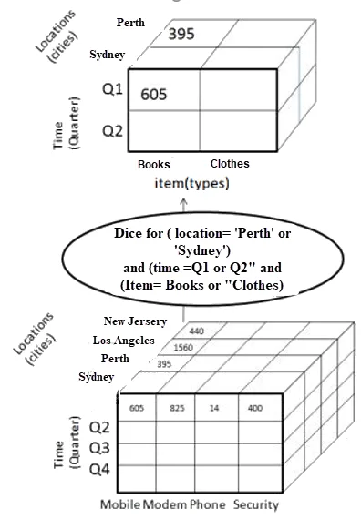

# Data Warehouse

**Data Warehouse** (DW or DWH) is a centralized repository or digital storage system
that integrates and stores data from various sources within an organization. It
is designed to support Business Intelligence (BI) activities such as _reporting_,
_data analysis_, and _decision-making_.

Data warehouses use a process called Extract, Transform, Load (ETL) to extract
data from different sources, transform it into a consistent format, and load it
into the warehouse.

## Types of Data Warehouse

There are three main types of data warehouses:

- [Enterprise Data Warehouse (EDW)](#enterprise-data-warehouse)
- [Operational Data Store (ODS)](#operational-data-store)
- [Data Mart (DM)](#data-mart)

Overall, the type of data warehouse an organization chooses depends on its specific
needs and requirements. Some organizations may require a centralized, enterprise-wide
data warehouse, while others may benefit from a more focused data mart or an operational
data store that supports real-time decision-making.

### Enterprise Data Warehouse

**Enterprise Data Warehouse** (EDW) is a centralized warehouse that provides decision
support service across the enterprise. It offers a unified approach for organizing
and representing data. It also provides the ability to classify data according
to the subject and give access according to those divisions.

EDWs are usually a collection of databases that offer a unified approach for organizing
data and classifying data according to subject. These data sources could be the
Databases of various _Enterprise Resource Planning (ERP)_ systems, _Customer Relationship
Management (CRM)_ systems, and other forms of _Online Transactional Processing (OLTP)_
systems.

EDW is the most preferred form of data storage today due to its ability to scale
storage requirements up or down as per the business and data requirements. This
means that an EDW is capable of providing unlimited storage to any enterprise

!!! note

    This type of data warehouse is the most common and serves as a centralized repository
    for all of an organization's data. An EDW typically integrates data from various
    sources across the entire enterprise and is designed to support the reporting and
    analytics needs of multiple departments.

#### Enterprise Data Warehouse Architecture

While there are many architectural approaches that extend warehouse capabilities
in one way or another, we will focus on the most essential ones. Without diving
into too much technical detail, the whole data pipeline can be divided into three
layers:

- Raw data layer (data sources)
- Warehouse and its ecosystem
- User interface (analytical tools)

The tooling that concerns data Extraction, Transformation, and Loading into a warehouse
is a separate category of tools known as ETL. Also, under the ETL umbrella, data integration
tools perform manipulations with data before it’s placed in a warehouse.
These tools operate between a raw data layer and a warehouse.

##### One-tier Architecture

This is considered to be one of the most primitive forms of EDW architectures.
In this architecture, the Reporting Tools are connected directly
to the Data Warehouse. Although this architecture is easy to set up and implement,
it causes various issues for large datasets. Most organizations today have hundreds
of Gigabytes of data. This means that to perform any query, the Reporting Tool
would have to go through all that data which is a time taking process.
Going through the large dataset for each query would result in low performance.

Hence, the One-tier EDW Architecture is only suitable for organizations with small
datasets.

One-tier architecture for EDW means that you have a database directly connected
with the analytical interfaces where the end user can make queries. Setting the
direct connection between an EDW and analytical tools brings several challenges:

- Traditionally, you can consider your storage a warehouse starting from 100GB of data. Working with it directly may result in messy query results, as well as low processing speed.
- Querying data right from the DW may require precise input so that the system will be able to filter out non-required data. Which makes dealing with presentation tools a little difficult.
- Limited flexibility/analytical capabilities exist.

Additionally, the one-tier architecture sets some limits to reporting complexity.
Such an approach is rarely used for large-scale data platforms, because of its
slowness and unpredictability. To perform advanced data queries, a warehouse can
be extended with low-level instances that make access to data easier.

##### Two-tier Architecture

The Two-tier Architecture implements a **Data Mart** layer between the Reporting
layer and the EDW. **Data Marts** can be seen as smaller Databases that contain
domain-specific information, which is only a part of the data stored
in the Data Warehouse. All information stored in the Data Warehouse is split
into various Data Marts based on the domain of information.

The Reporting Tools are then connected to this Data Mart Layer. Because a single
Data Mart consists of only a small part of the data in the Data Warehouse (low-level
repository that contains domain-specific information), performing queries on it
would require much less time than it would on a Data Warehouse.
A Two-tier EDW is considered to be more suitable for real-life scenarios.

Creating a data mart layer will require additional resources to establish hardware
and integrate those databases with the rest of the data platform. But, such an
approach solves the problem with querying: Each department will access required
data more easily because a given mart will contain only domain-specific information.
In addition, data marts will limit the access to data for end users, making EDW
more secure.

##### Three-tier Architecture

A Three-tier Architecture further implements an Online Analytical Processing (OLAP)
Layer between the Data Mart Layer and the Reporting Layer.
The OLAP Layer consists of OLAP Cubes is a specific type of database which are used
to store data in a multidimensional form allowing faster analysis to be performed
on the data.

It’s pretty difficult to explain in words, so let’s look at this handy example of
what a cube can look like.

So, as you can see, a cube adds dimensions to the data. You may think of it as
multiple Excel tables combined with each other. The front of the cube is the usual
two-dimensional table, where the region (Africa, Asia, etc.) is specified vertically,
while sales numbers and dates are written horizontally. The magic begins when we
look at the upper facet of the cube, where sales are segmented by routes and the
bottom specifies time-period. That’s known as multidimensional data.

OLAP Cubes allow various operations to be performed on it, which results in quality
analysis. These operations are as follows:

=== "Roll-up"

    This can be defined as the process of reducing the attributes being measured
    by either performing aggregations or moving up the hierarchy (performing grouping
    based on a specific order).

    ??? example

        A sample Roll-up operation is as follows:

        

=== "Drill-down"

    This can be defined as the process of increasing the number of attributes being
    measured to perform a more in-depth analysis by moving down the hierarchy.
    Drill-down is considered to be the opposite of the Roll-up operation.

    ??? example

        A sample Drill-down operation is as follows:

        

=== "Slice"

    This can be defined as the process of removing a dimension by specifying a
    filter on the dimension to be removed.

    ??? example

        A sample Slice operation is as follows:

        

=== "Dice"

    This can be defined as the process of specifying filters for two or more dimensions
    resulting in the formation of a Sub-Cube.

    ??? example

        A sample Dice operation is as follows:

        

Hence, it can be seen that the implementation of an OLAP Layer in the Three-tier
Enterprise Data Warehouse (EDW) Architecture allows more in-depth analysis to be
performed on the data and also ensure high performance.

#### Types of Enterprise Data Warehouses

##### On-premise Data Warehouse

Usage of an On-premise Data Warehouse means that the organization is responsible
for purchasing, setting up, and maintaining the software and hardware required
to manage the Data Warehouse.

An on-premise data warehouse is a data warehouse that is installed and maintained
on the physical servers or hardware of an organization. An on-premise data warehouse
offers more control and security over the data and infrastructure, but it also
requires more upfront investment and ongoing maintenance costs. An on-premise
data warehouse may also face limitations in scalability, flexibility, and innovation.

The advantages are as follows:

- **Control**: The organization chooses the kind of hardware and software that will
  be used to set up the Data Warehouse.

- **Speed**: The Data Warehouse is On-premise and will hence have little to no
  network latency.

- **Security**: Only someone who is connected to the organization's network
  can access the Data Warehouse.

The disadvantage are as follows:

- **High Cost of Investment**: The Data Warehouse would require high investment
  to purchase and set up the initial software and hardware. Even then, as the
  volume of data with the organization increases, more hardware will have to
  be purchased to accommodate that data.

- **Inability to Scale Resources**: On-premise Data Warehouses cannot scale resources
  up or down as per the requirements due to limited hardware.

!!! note

    **Data warehouse appliance**: A data warehouse appliance is a pre-integrated
    bundle of hardware and software—CPUs, storage, operating system, and data
    warehouse software—that a business can connect to its network and start using
    as-is. A data warehouse appliance sits somewhere between cloud and on-premises
    implementations in terms of upfront cost, speed of deployment, ease of scalability,
    and management control.

!!! tip

    **When to use ?**: Such an EDW type is appropriate for organizations of all
    sizes that want to process their data securely and make the most out of it.
    Classic warehouses allow for morphing into different architectural styles of
    the data platform and scaling up and down on purpose while maintaining data
    privacy concerns.

##### Cloud-based Data Warehouse

Cloud-based Data Warehousing is a service provided by an organization that various
other organizations can use to fulfill their Data Warehousing needs. This means
that the organization does not have to set up its own On-premise hardware and
software but only pay for the Cloud Data Warehousing Solution.

A cloud-based data warehouse is a data warehouse that is hosted and managed by
a third-party cloud service provider. A cloud-based data warehouse offers more
scalability, flexibility, and cost-efficiency over the data and infrastructure,
but it also requires more trust and compliance with the cloud service provider.
A cloud-based data warehouse can also leverage other cloud services and tools,
such as machine learning, data lake, and streaming analytics.

The advantages are as follows:

- **Low Cost of Investment**: Organizations do not have to invest large amounts of
  money to purchase and set up hardware and software requirements of the Data Warehouse.

- **Scalability**: Storage and Compute capabilities of your Data Warehouse can
  scale up or down as per your business and data requirements automatically
  and hence, you only have to pay for what you use.

The disadvantages are as follows:

- **Security**: Since the Cloud-based Data Warehouses store data of many organizations
  that can be accessed over the Internet, businesses feel some level of concern
  over the storage of confidential data.

- **Accessibility**: Cloud-based Data Warehouses cannot be accessed in-case there
  is no internet access.

- **Latency**: Depending on where the Data Warehouse is located, businesses might
  notice some network latency while accessing their data.

**Examples**:

- Amazon Redshift
- Snowflake
- Google BigQuery
- Azure Synapse Analytic

!!! tip

    **When to use ?**: Cloud data warehouse platforms are a great choice for organizations
    of any size. If you need everything set up for you, including managed data integration,
    DW maintenance, and BI support.

##### Virtual-based Data Warehouse

A virtual data warehouse is a type of data warehouse that is built on top of
existing data sources, such as transactional databases or cloud storage services.
It is typically built using a virtualization layer, which allows users to query
and analyze data from multiple sources as if it were all stored in a single location.

The data can stay in its sources: It isn’t moved physically anywhere but can still
be pulled with the help of analytical tools. Virtual warehouses can be used if
you don’t want to mess with all the underlying infrastructure, or the data you have
is easily manageable as it is.

However, such an approach has many drawbacks:

- Multiple databases will require constant software and hardware maintenance and
  costs.

- The data stored in a virtual DW still requires transformation software to make
  it digestible for the end users and reporting tools.

- Complex data queries may take too much time, as the required pieces of data may
  be placed in two separate databases.

**Example**:

- Denodo
- TIBCO Data Virtualization
- Actifio.

!!! tip

    **When to use ?**: Virtual EDWs are suitable for businesses that have raw data
    in a standardized form that does not require complex analytics. It also fits
    organizations that don’t use BI systematically or want to start with it.

### Operational Data Store

**Operational Data Store** (ODS) are nothing but data store required when neither
Data warehouse nor OLTP systems support organizations reporting needs.
In ODS, Data warehouse is refreshed in real time. Hence, it is widely preferred
for routine activities like storing records of the Employees.

In the ODS, the data is cleaned to avoid junk or repetition, validated for redundancy
and made sure for the data to be obeying the systematic rules set by the business/project.
This is the location where all the data used in recent functions are held on,
which is then relocated to the data warehouse's permanent storage systems or
the data warehouse's Archives.

An ODS is a type of data warehouse that stores real-time or near-real-time data
from transactional systems. It is designed to support operational reporting and
analysis, and it typically uses a bottom-up approach to design, which means that
the data model is based on specific business requirements.

This is a type of data warehouse that stores operational data from various sources
and provides near real-time reporting and analysis. It is designed to handle frequent
updates and queries from operational systems. It also serves as a source of data
for the EDW or data marts.

#### Implementation of Operational Data Stores

Any number of data sources can be integrated to create an Operational Data Store.
For an integrated data source system to be qualified as an operational Data Store,
it should comply with the below principles:

1. **Subject-Oriented**:

   The Operational Data Store should be designed and built based on explicit functional
   requirements presented by the business, for a certain specific area under discussion.

2. **Integrated**:

   All the data from multiple data sources of the given application undergoes a
   set of ETL process flow, which includes cleaning the junk data to reduce redundancy,
   transforming all the data into a single format and loading the entire set of
   records onto the ODS, based on the business/ client’s policies for data control
   and regularity.

3. **Current/Up-To-Date**:

   The data in the ODS is expected to be up-to-date, in order to cover all the current
   functions of application tied to the Data Warehouse and to show the existing
   status of the data from every source linked to the DW system.

4. **Granularity in the Details**:

   It is primarily used to support the operational business functions/ requirements,
   and so it is important for the rules to be implemented in a way that it maintains
   the comprehensive level of detailing the business entails for those functions
   to be executed.

#### Advantages of Operational Data Stores

It is a beneficial database in comparison to a data warehouse system as a whole.
Below are the justification for its advantageous nature:

- An ODS provides access to only the current, finely crumbled, non-aggregated,
  less complicated data, which can be queried in a well-fitted approach without
  using the operational systems.

- When the Reporting & Analysis tools need data that are closer to real-time operations,
  it can be queried from the Operational Data Store, as and when it is received
  from the respective source systems, instead of opting for more prolonging conversion
  and loading operations from the other database sources in the data warehouse systems.

- ODS is a secure option as it does not contain all the historical data and operations,
  which makes it resilient for any cyber-attacks or hacking of data privacy.

- It is a practically feasible structural design option when bearing in mind the
  complex requirements provided by the business, in order to generate input for
  analysis and reporting processes that leads to business decision-making.

- ODS facilitates considerably less total time for turnaround when in trouble,
  like the environment failure or when a database needs a restart, which implicates
  less stress on the business or the stack holders of the application.

- In order to fetch data from an ODS, querying need not be complex or with multi-level
  joins and conditional Simple queries will be sufficient as it holds moderately
  detailed operational data.

### Data Mart

**Data Mart** is a subset of the data warehouse. It specially designed for a particular
line of business, such as sales, finance, sales or finance.
In an independent data mart, data can collect directly from sources.

Data Mart is also a storage component used to store data of a specific function
or part related to a company by an individual authority, so data marts are flexible
and small.

A data mart is a subset of an EDW that is designed to serve a specific business
unit or department. It is optimized for querying and reporting on a specific subject
area, such as sales or marketing, and it is typically easier and faster to implement
than an EDW.

This is a subset of data warehouse that is designed to serve a specific department,
function, or business unit. It contains a limited amount of data that is relevant
to a particular domain or topic. It can be independent or dependent on the EDW or
ODS.

#### Types of Data Mart

##### Dependent Data Mart

A dependent data mart is purely from the data warehouse and all the grouped
dependent will form an enterprise data warehouse. It is purely a subset of
data warehouse since it is created from central DW. Since clean and summarised
data is already present in the central data warehouse ETT process or Extract
Transform and Transportation is simplified. We just need to identify the particular
subset here and perform ETT on top of it. These data marts are typically
built to achieve better availability and a lot of improved performance with
better control and efficiency.

##### Independent Data Mart

A independent data mart act as standalone systems, meaning they can work without
a data warehouse. They receive data from external and internal data sources directly.
The data presented in independent data marts can be then used for the creation of a
data warehouse. This approach is called bottom-up.

Often, the motivation behind choosing independent data marts is shorter time to
market. They work great for small to medium-sized companies.

So, the key difference between dependent and independent data marts is in the way
they get data from sources. The step involving data transfer, filtering, and loading
into either a data warehouse or data mart is called the extract-transform-load (ELT)
process. When dealing with dependent data marts, the central data warehouse already
keeps data formatted and cleansed, so ETL tools will do little work. On the other hand,
independent data marts require the complete ETL process for data to be injected.

##### Hybrid Data Mart

A hybrid data marts integrate data from all existing operational data sources and/or
data warehouses. This method collects the benefits and addresses the issues of both
top-down and bottom-up approaches. Hybrid data marts are a good choice for organizations
that have multiple databases.

#### Features of Data Mart

- Since the source of the data is concentrated to subject the user response time
  is enhanced by using it.

- For frequently required data, using data marts will be beneficial since it is
  subset to central DW and hence data size will be lesser.

- Also since the volume of the data is limited the processing time will be quite
  reduced compared to central DWS.

- These are basically agile and can accommodate the changes in the model quite
  quickly and efficiently compared to the data warehouse.

- Datamart requires a single subject expert to handle, in contrast to warehouse
  data, the expertise we require in multiple subject warehouses. Because of this,
  we say that data mart is more agile.

- We can segregate access categories to a low level with partitioned data and with
  data mart, it is a lot easy.

- Infrastructure dependency is quite limited and data can be stored in on different
  hardware platforms upon segmentation.

#### Steps to Implement Data Mart

1. **Designing**

   This will be the first step in the implementation where all the required tasks
   and sources identified to gather technical and business information. Later the
   logical plan is implemented and upon review, this will be converted to a physical
   plan. Also, the logical and physical structure of the data is decided here like
   how to partition the data and field of partition like date or any other file.

2. **Construction**

   This is the second phase of implementation where physical databases were generated
   with the help of RDBMS, which was determined as part of the design process and
   logical structures. All the objects like schema, indexes, tables, views, etc
   are created.

3. **Populating**

   This is the third phase and here data is populated in it upon sourcing the data.
   All the required transformations are implemented prior to populating the data on it.

4. **Accessing**

   This is the next step of implementation where we will use the populated data
   to query upon for creating reports. End-user use this step to understand the data using queries.

5. **Managing**

   This is the last stage of implementation of the data mart and here various tasks
   such as access management, system optimization, and tuning, managing and adding fresh
   data to the data mart and planing recovery scenarios to handle any failure cases are taken care of.

#### Benefits

- It is one of the best cost-effective alternatives to a data warehouse where you
  need to work on only a small segment of data.

- Segregation of data from sources will make data mart efficient as a specific
  group of people can work the data from a specific source instead of all using
  the data warehouse.

- Faster access to the data is possible by using data mart if we know on which
  subset we require to access.

- Datamart is lot easier to use so end-users can easily query on top of them.

- Coming to the implementation time data mart requires less time compared with
  the data warehouse since the data is segregated in groups.

- Historical data from a particular subject can be used for easy trend analysis.

### Summary

|                    | EDW                                                     | ODS                                                  | DM                                                              |
| ------------------ | ------------------------------------------------------- | ---------------------------------------------------- | --------------------------------------------------------------- |
| Purpose            | Serves the entire organization                          | Supports operational reporting                       | Serves a specific business unit/department                      |
| Data Integration   | Integrates data from multiple sources                   | Integrates real-time data from transactional systems | Integrates data from a specific subject area                    |
| Data Model         | Top-down approach to design                             | Bottom-up approach to design                         | Designed based on specific business requirements                |
| Complexity         | More complex and time-consuming to design and implement | Less complex and quicker to implement                | Less complex and quicker to implement                           |
| Query and Analysis | Supports complex queries and analytics                  | Supports operational reporting and simple analysis   | Optimized for querying and reporting on a specific subject area |
| Data Volume        | Large volume of historical data                         | Real-time or near-real-time data                     | Smaller volume of data                                          |
| Users              | Business analysts, executives, data scientists          | Operational staff, business analysts                 | Business analysts, departmental staff                           |
| Cost               | Higher cost due to complexity and scale                 | Lower cost due to simpler design and implementation  | Lower cost due to simpler design and implementation             |

| Criteria          | EDW                                                     | ODS                                                      | DM                                                     |
| ----------------- | ------------------------------------------------------- | -------------------------------------------------------- | ------------------------------------------------------ |
| Scope             | Enterprise-wide                                         | Operational                                              | Departmental or functional                             |
| Data sources      | Multiple internal and external sources                  | Multiple operational sources                             | EDW, ODS, or other sources                             |
| Data integration  | High degree of integration and standardization          | Moderate degree of integration and standardization       | Low degree of integration and standardization          |
| Data granularity  | Mixed levels of granularity                             | Low level of granularity (detailed)                      | High level of granularity (aggregated or summarized)   |
| Data currency     | Historical and current data                             | Near real-time or real-time data                         | Historical and current data                            |
| Data quality      | High quality (cleansed and validated)                   | Moderate quality (some cleansing and validation)         | High quality (cleansed and validated)                  |
| Data structure    | Relational or dimensional models                        | Relational models                                        | Dimensional models                                     |
| Data volume       | Very large (terabytes or petabytes)                     | Large (gigabytes or terabytes)                           | Small or medium (megabytes or gigabytes)               |
| Query performance | Moderate to high (depends on indexing and partitioning) | Low to moderate (depends on updates and concurrency)     | High (optimized for analysis)                          |
| Query complexity  | High (supports complex and ad-hoc queries)              | Low to moderate (supports simple and predefined queries) | Moderate to high (supports complex and ad-hoc queries) |
| Query frequency   | Low to moderate (periodic or on-demand)                 | High (continuous or near-continuous)                     | Moderate to high (periodic or on-demand)               |
| User types        | Analysts, managers, executives, data scientists, etc.   | Operational staff, managers, etc.                        | Analysts, managers, etc.                               |

## Data Warehouse Architecture

### Bottom tier (Data Layer)

The bottom tier consists of the Data Repository, usually a relational database system,
which collects, cleanses, and transforms data from various data sources through
a process known as Extract, Transform, and Load (`ETL`) or a process known as Extract,
Load, and Transform (`ELT`).

As a preliminary process, before the data is loaded into the repository,
all the data relevant and required are identified from several sources of the system.
These data are then cleaned up, to avoid repeating or junk data from its current
storage units. The next step is to transform all these data into a single format
of storage. The final step of ETL is to Load the data on the repository.

ETL Layer, This layer is responsible for storing the data in the data warehouse. The data is
typically stored in a relational database management system (RDBMS), which is optimized
for querying and reporting on large datasets. In some cases, data may also be stored
in columnar or in-memory databases for improved performance.

Few commonly used ETL tools are:

- Informatica
- Microsoft SSIS
- Snaplogic
- Confluent
- Apache Kafka
- Alooma
- Ab Initio
- IBM Infosphere

### Middle tier (Semantics Layer)

The middle tier consists of an `OLAP` (Online Analytical Processing) servers
which enables fast query speeds. The Data Warehouse can have more than one OLAP server,
and it can have more than one type of OLAP server model as well, which depends on
the volume of the data to be processed and the type of data held in the bottom tier.

ETL Layer. This layer is responsible for extracting, transforming, and loading the data from
various sources into the data warehouse. This is typically done using ETL (Extract,
Transform, Load) tools, which automate the process of moving and converting data.

Three types of OLAP models can be used in this tier, which are known as

=== "ROLAP"

    Relational online analytical processing is a model of online analytical processing
    which carries out an active multidimensional breakdown of data stored in a relational database,
    instead of redesigning a relational database into a multidimensional database.

    This is applied when the repository consists of only the relational database
    system in it.

=== "MOLAP"

    Multidimensional online analytical processing is another model of online analytical
    processing that catalogs and comprises directories directly on its multidimensional
    database system.

    This is applied when the repository consists of only the multidimensional database
    system in it.

=== "HOLAP"

    Hybrid online analytical processing is a hybrid of both relational and multidimensional
    online analytical processing models.

    When the repository contains both the relational database management system and
    the multidimensional database management system, HOLAP is the best solution for
    a smooth functional flow between the database systems. HOLAP allows storing data
    in both the relational and the multidimensional formats.

The type of OLAP model used is dependent on the type of database system that exists.

### Top tier (Analytics Layer)

The top tier is represented by some kind of front-end user interface or reporting
tool, which enables end users to conduct ad-hoc data analysis on their business data.
It holds various tools like query tools, analysis tools, reporting tools, and
[data mining tools](https://www.educba.com/data-mining-tool/).

Reporting Layer. This layer is responsible for presenting the data to end-users
in a format that is easy to understand and analyze. This layer includes tools for
querying, reporting, and visualization, which allow users to create custom reports
and dashboards based on the data in the data warehouse.

Below are the few commonly used Top Tier tools.

- IBM Cognos
- Microsoft BI Platform
- SAP Business Objects Web
- Pentaho
- Crystal Reports
- SAP BW
- SAS Business Intelligence

In addition to the three-tier architecture, some data warehouse architectures also
include a metadata layer, which provides information about the data in the data
warehouse, such as its origin, format, and meaning. The metadata layer can be used
to help users understand and navigate the data.

## Data Warehouse Design

data warehouse design that can be applied within the framework of the design methods
discussed earlier. Here is a brief overview of how each of these approaches relates
to the design methods.

Overall, the choice of design approach will depend on the specific needs and circumstances
of the organization. A bottom-up approach may be more appropriate for organizations with
complex and varied data sources, while a top-down approach may be more appropriate
for organizations with well-defined business requirements. Hybrid design may be a
good choice for organizations that need a flexible and adaptable data warehouse
that can accommodate changing business requirements over time.

### Bottom-up design

Bottom-up design is an approach to data warehouse design that focuses on building
small, specialized data marts first and then integrating them into a larger data
warehouse. This approach is often used when there are different data sources
with varying levels of complexity, and it allows for a more incremental and flexible
approach to data warehouse development. Bottom-up design is often associated with
dimensional modeling and may use hybrid modeling techniques to integrate the different
data marts.

!!! example

    **Dimensional Model** (Ralph Kimball):

    The Dimensional Model, also known as the Kimball model, is a bottom-up design approach
    that emphasizes the importance of simplicity and ease of use. This model is designed
    to support ad-hoc querying and analysis and is often used for data warehouse implementations
    in smaller organizations. The Kimball model involves creating a denormalized data
    model, which is optimized for querying and analysis, and building a star or snowflake
    schema that supports specific business functions.

    See more, [Kimball Approach](./data_modeling/dwh-kimball-approach.md)

### Top-down design

Top-down design is an approach to data warehouse design that starts with a comprehensive
enterprise data model and then designs the data warehouse based on that model.
This approach is often used when there is a well-defined set of business requirements
and a clear understanding of the data sources and their relationships. Top-down design
is often associated with data vault modeling and may use hybrid modeling techniques
to accommodate the specific business requirements.

!!! example

    **Third Normal Form Model** (Bill Inmon):
    The 3NF Model, also known as the Inmon model, is a top-down design approach that
    emphasizes the importance of a comprehensive enterprise data model. This model is
    designed to support complex business processes and is often used for data warehouse
    implementations in large organizations. The Inmon model involves creating a normalized
    data model, which is then used to build data marts that support specific business
    functions.

    See more, [Inmon Approach](./data_modeling/dwh-inmon-approach.md)

### Hybrid design

Hybrid design is an approach to data warehouse design that combines elements of
both bottom-up and top-down design. This approach recognizes that there may be benefits
to both approaches and seeks to find a balance between the two. Hybrid design may use
different modeling techniques for different parts of the data warehouse and may involve
a mix of top-down and bottom-up development. Hybrid design is often associated with agile
modeling and may use a variety of design methods to create a flexible and adaptable
data warehouse.

!!! example

    **Data Vault 2.0 Model**:
    The DV 2.0 Model is a hybrid design approach that combines elements of both
    the Inmon and Kimball models. This model is designed to support flexibility, scalability,
    and agility, and is often used for data warehouse implementations in organizations
    that need to handle large amounts of complex and varied data. The Data Vault 2.0 model
    involves creating a normalized data model that separates business entities and relationships
    into three types of tables (Hub, Link, and Satellite), which can then be used to
    build data marts that support specific business functions.

    See more, [Data Vault Model](./data_modeling/dwh-data-vault-approach.md)

**Differences between the three designs**:

- **Approach**: Kimball is bottom-up, Inmon is top-down, and Data Vault is a hybrid
  approach.

- **Schema**: Kimball uses a star or snowflake schema, Inmon uses a 3NF schema,
  and Data Vault uses a hub-and-spoke schema.

- **Focus**: Kimball focuses on the business process or subject area, Inmon focuses
  on the data, and Data Vault focuses on the relationships between the data.
- **Flexibility**: Kimball is known for its flexibility, Inmon is known for its
  consistency, and Data Vault is known for its ability to handle complex data relationships.
- **Complexity**: Kimball is relatively simple, Inmon is more complex, and
  Data Vault is the most complex of the three methodologies.

### Summary

Overall, the choice of design method will depend on the specific needs and circumstances
of the organization. The Inmon model may be more appropriate for organizations with
complex and varied data sources and a focus on enterprise-wide integration. The
Kimball model may be more appropriate for organizations with a focus on ad-hoc
querying and analysis and a need for simplicity and ease of use. The Data Vault 2.0
model may be a good choice for organizations that need a flexible and scalable
data warehouse that can accommodate changing business requirements over time.

| Design Method | 3NF Model (Inmon)                                                                                                                        | Dimensional Model (Kimball)                                                                                                                 | Data Vault 2.0 Model                                                                                                                                       |
| ------------- | ---------------------------------------------------------------------------------------------------------------------------------------- | ------------------------------------------------------------------------------------------------------------------------------------------- | ---------------------------------------------------------------------------------------------------------------------------------------------------------- |
| Description   | Top-down design approach that emphasizes a comprehensive enterprise data model                                                           | Bottom-up design approach that emphasizes simplicity and ease of use                                                                        | Hybrid design approach that combines elements of the Inmon and Kimball models                                                                              |
| Strengths     | Supports complex business processes, supports enterprise-wide integration, allows for data reuse                                         | Supports ad-hoc querying and analysis, easy to understand and use, can be quickly implemented                                               | Supports flexibility, scalability, and agility, accommodates changing business requirements, allows for data reuse                                         |
| Weaknesses    | Can be time-consuming to design and build, may not be well-suited for ad-hoc querying and analysis                                       | May not be well-suited for complex business processes or enterprise-wide integration, may not support as much data reuse as the Inmon model | Can be more complex to design and build than the Inmon or Kimball models, may not be as well-suited for smaller organizations or simple business processes |
| Focus         | Enterprise-wide integration                                                                                                              | Ad-hoc querying and analysis                                                                                                                | Ad-hoc querying and analysis                                                                                                                               |
| Advantages    | Comprehensive data model supports complex business processes; Data is normalized, reducing data redundancy and ensuring data consistency | Easy to understand and use for ad-hoc querying and analysis; Denormalized data model optimized for querying and analysis                    | Separates business entities and relationships into three types of tables, providing flexibility and scalability; Supports complex and varied data sources  |

As a Data Engineer, the choice of design method will depend on the specific needs
and circumstances of your organization. If you work in a large organization with
complex and varied data sources and a focus on enterprise-wide integration, the
3NF Model (Inmon) may be a good choice. If your organization has a focus on ad-hoc
querying and analysis and a need for simplicity and ease of use, the Dimensional Model
(Kimball) may be a better fit. If your organization needs a flexible and scalable
data warehouse that can accommodate changing business requirements over time,
the Data Vault 2.0 model may be the best option.

## References

- [Guru99: Data Warehousing](https://www.guru99.com/data-warehousing.html)
- [Guru99: Data Warehouse Architecture](https://www.guru99.com/data-warehouse-architecture.html#8)
- [IBM: Data Warehouse](https://www.ibm.com/topics/data-warehouse/)
- [A Complete Guide to Data Warehouse in 2022](https://www.analyticsvidhya.com/blog/2022/06/a-complete-guide-to-data-warehousing-in-2022/)
- [CodingNinjas: Inmon vs Kimball Approaches in DWH](https://www.codingninjas.com/studio/library/inmon-vs-kimball-approach-in-data-warehousing)
- [Nearshore: Data Warehouse Architecture](https://www.nearshore-it.eu/articles/technologies/data-warehouse-architecture/)
