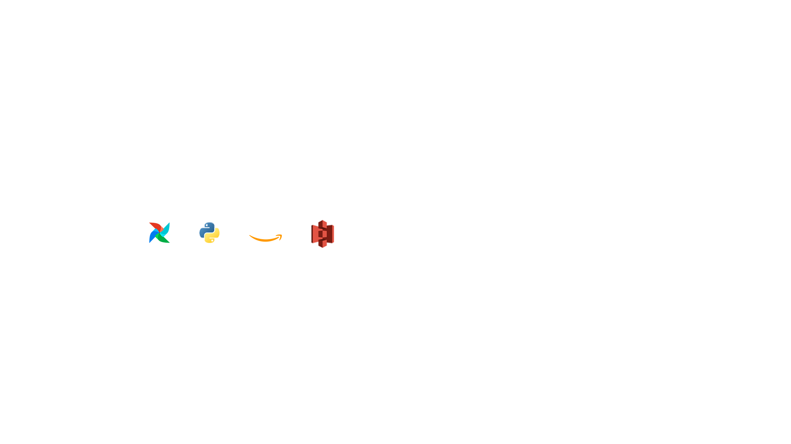
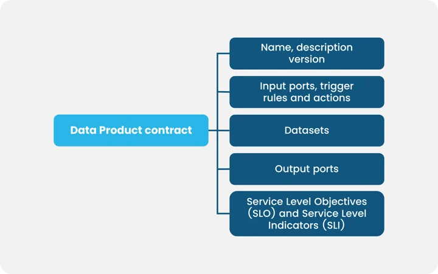

# Data Product

!!! quote

    A **Data Product** is a product or service that leverages data as its core
    component to deliver value to end users or customers (data consumers).[^1]

## :material-arrow-down-right: Getting Started

**Data Product** involves collecting, analyzing, and using data to provide insight,
information, or functionality that helps address specific needs or business challenges.
Data products integrate data from source systems, process it, ensure compliance,
and make it instantly available to consumers.

!!! quote

    A Data Product is a valuable data asset that your company uses to make decisions
    and all the technologies and metadata associated with that asset.[^2]

### Principles of an Enterprise-Grade Data Product

1.  Inherently valuable: Complete and valuable without any other data required.
2.  Product managed: A product owner manages each product through the entire lifecycle,
    like any other digital product.
3.  Developable: Should be structured to allow an Agile and well-governed development
    process.
4.  Backward compatible: Must be versioned, co-existent in multiple versions,
    and backward compatible.
5.  Exclusive: End users can only access data through the product; there are no
    back doors.
6.  Trustworthy: There must be commitments to consumers, including completeness,
    accuracy, and timeliness.
7.  Interoperable and composable: Combining one data product with others must be
    easy, including creating new ones.
8.  Secure: Must meet access, confidentiality, and compliance requirements.
9.  Accessible: Must be accessible in a useful way for target consumers.
10. Discoverable: Must be easy for target users to find.

---

### The Data Product Contract

As you share data across organizational boundaries, you are faced with the questions
outlined above.
Depending on your role in the organization, you may care more or less about
certain ones. If you are a data product **producer**, you want a developable product.
If you are a data product **consumer**, you want some guarantees about the product.
An easy way to capture the criteria both parties care about is a data product contract.

!!! quote

    A data product contract needs to encapsulate a set of contract items.

To make a data product findable, be sure to add awe require name, description,
and version to be published to a data product registry.
To share a data product and make it inherently valuable, you need to capture
the datasets. To make a data product accessible, share the desired output ports.
To provide the necessary guarantees,  define the Service Level Objectives (SLO),
the desired KPIs, and Service Level Indicators (SLI), as well as the current value
of the KPI.

As you deploy many data products across domains and the organization, you want
to compose data products and ensure interoperability as defined in the metadata
of the datasets.
If you are sharing data outside your organization, you will want to define the
license types.
If you want to monetize data, your clients will likely ask you to provide sample
data so that they can try it before they buy.

Defining the data product contract allows you to foster communication between
data product producers and consumers effectively.
The data product owner can improve data quality over time.
The data product consumer can enjoy a service level agreement with defined guarantees
supporting them throughout the entire product lifecycle.

---

## Examples

Data products can take various forms depending on the industry and application
and target internal or external audiences. Here are a few examples:

1.  Data Analytics Platforms: These systems collect and analyze data from multiple sources to give businesses comprehensive insights into their operations, customer behavior, or market trends. They often involve data visualization tools and reporting capabilities.
2.  Recommendation Systems:  Platforms that leverage user data and algorithms to suggest personalized recommendations for products (a la Amazon), movies (like Netflix), music (think Spotify), or content (like Instagram) based on user preferences and historical data.
3.  Predictive Models: Data products can use machine learning models to build predictive models that forecast future outcomes based on historical data. For instance, predictive analytics models can be used in finance to forecast stock prices or in healthcare to predict disease outcomes.
4.  Generative AI: Customer support can use conversational AI or chatbot systems that leverage natural language processing and generative AI techniques to simulate human-like conversations and provide automated responses to customer inquiries. They use machine learning algorithms, like language models, to generate contextually relevant responses tailored to the specific inquiry.
5.  Real-time Dashboards: display real-time data metrics and key performance indicators (KPIs) to provide instant insights into various aspects of a business, such as supply chain health, website traffic, or social media engagement.
6.  Data APIs: Application Programming Interfaces (APIs) that enable access to structured and unstructured data for developers to build their data products applications.

[^1]: DataOps Live: [What is a Data Product?](https://www.dataops.live/what-are-data-products)
[^2]: [CNDI: What is a Data Product?](https://www.cndi.dev/post/what-is-a-data-product)
