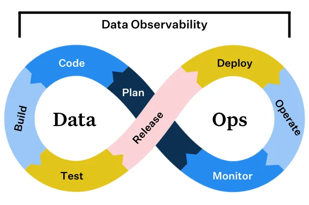
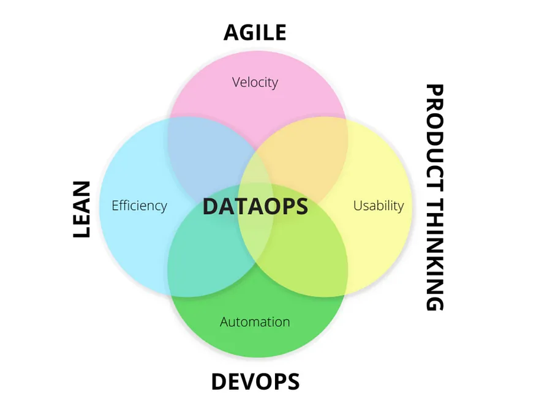
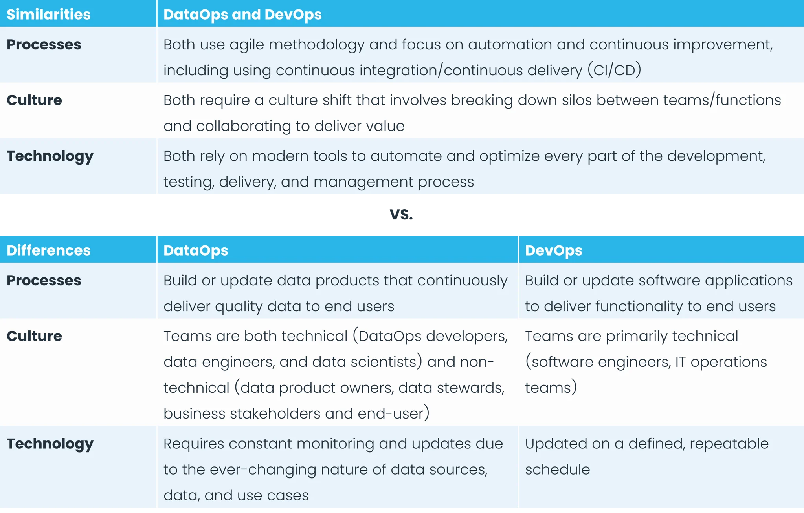
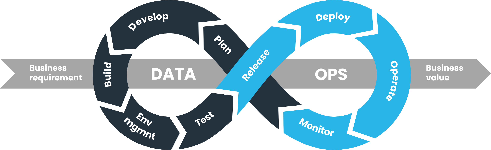

# DataOps

!!! note

    **DataOps** is a collection of practices that focuses on breaking down silos
    between data producers and consumers, improving data quality and transparency
    of results to be seamless.[^1]

<figure markdown="span">
  { loading=lazy width="550" }
  <figcaption>DataOps Flow</figcaption>
</figure>

**DataOps (Data Operations)** provides a collaboration of data engineering,
data science and operations team.
It aims to automate the delivery of the right and reliable data to appropriate
teams through a much faster approach. And this leads to better data productivity
and enhanced human communication.

!!! quote

    DataOps aims to bridge the gap between data engineering, data science, and
    operations teams by promoting continuous integration and delivery, collaboration
    and automation of data-related processes.[^2]

<figure markdown="span">
  { loading=lazy width="600" }
  <figcaption>DataOps</figcaption>
</figure>

## :material-arrow-down-right: Getting Started

### DataOps vs. DevOps

The key difference is DevOps is a methodology that brings development and
operations teams together to make software development and delivery more
efficient, while DataOps focuses on breaking down silos between data producers
and data consumers to make data more reliable and valuable.

!!! quote

    To keep a constant pulse on the overall health of their systems,
    DevOps engineers leverage observability to monitor, track, and triage incidents
    to prevent application downtime.

Software observability consists of three pillars:

- **Logs**: A record of an event that occurred at a given timestamp. Logs also provide context to that specific event that occurred.
- **Metrics**: A numeric representation of data measured over a period of time.
- **Traces**: Represent events that are related to one another in a distributed environment.

**Data Observability** is an organization’s ability to fully understand the health
of the data in their systems. It reduces the frequency and impact of data downtime
(periods of time when your data is partial, erroneous, missing or otherwise inaccurate)
by monitoring and alerting teams to incidents that may otherwise go undetected
for days, weeks, or even months.

Like software observability, data observability includes its own set of pillars:

- **Freshness**: Is the data recent? When was it last updated?
- **Distribution**: Is the data within accepted ranges? Is it in the expected format?
- **Volume**: Has all the data arrived? Was any of the data duplicated or removed from tables?
- **Schema**: What’s the schema, and has it changed? Were the changes to the schema made intentionally?
- **Lineage**: Which upstream and downstream dependencies are connected to a given data asset? Who relies on that data for decision-making, and what tables is that data in?

[Read More about **Data Observability**](../data_observability/index.md)

### DataOps Framework

To facilitate faster and more reliable insight from data, DataOps teams apply a
continuous feedback loop, also referred to as the DataOps lifecycle.

Here is what the DataOps lifecycle looks like in practice:

- **Planning**: Partnering with product, engineering, and business teams to set
  KPIs, SLAs, and SLIs for the quality and availability of data
  (more on this in the next section).

- **Development**: Building the data products and machine learning models that
  will power your data application.

- **Integration**: Integrating the code and/or data product within your existing
  tech and or data stack. (For example, you might integrate a dbt model with
  Airflow so the dbt module can automatically run.)

- **Testing**: Testing your data to make sure it matches business logic and meets
  basic operational thresholds (such as uniqueness of your data or no null values).

- **Release**: Releasing your data into a test environment.
- **Deployment**: Merging your data into production.

- **Operate**: Running your data into applications such as Looker or Tableau
  dashboards and data loaders that feed machine learning models.

- **Monitor**: Continuously monitoring and alerting for any anomalies in the data.

This cycle will repeat itself over and over again.
However, by applying similar principles of DevOps to data pipelines, data teams
can better collaborate to identify, resolve, and even prevent data quality issues
from occurring in the first place.

### Building Blocks

1. **Collaboration**
   DataOps promotes cross-functional collaboration and brings together different
   data engineering, data science, analyst and operations personnel.
   This collaboration helps streamline communication, align goals, and share
   knowledge and expertise across different business domains.
2. Automation
   Automation plays a vital role in DataOps. It involves automating repetitive tasks, such as data ingestion, transformation and validation as well as deployment of infrastructure, applications and pipelines. This helps minimize manual errors, improve quality, and accelerate the overall data lifecycle.
3. CICD
   DataOps borrows from Agile and DevOps methodologies, making continuous integration and delivery a natural fit. CI/CD focuses on delivering data quickly and predictably while ensuring quality, reliability, and security. This approach enables organizations to respond rapidly to changing business needs and deliver insights in a timely manner.
4. Monitoring
   DataOps borrows from quality control approaches like Statistical Process Control and Total Quality Management. DataOps emphasizes the importance of monitoring data pipelines and processes to identify issues and bottlenecks. Monitoring tools and techniques help track data quality, performance, and availability, which enables proactive troubleshooting and timely response to any potential problems.
5. Version Control
   Similar to software development practices, DataOps promotes the use of version control systems like Git so you can manage changes to data infrastructure, application configurations, code, and sometimes data itself. This ensures auditability, while enabling teams to roll back to previous versions if needed and maintain a history of changes.
6. Data Governance
   DataOps emphasizes the need for proper data governance practices. It includes establishing data quality standards, data lineage, and data cataloging to boost data’s usability and value. Data governance ensures compliance with regulations, controls access, maintains data integrity, and enhances trust in the data being used for decision-making.

!!! note

    By adopting DataOps practices, organizations can accelerate data delivery,
    improve data quality, and keep costs in check.

## Functions of a DataOps Platform

With a strong DataOps platform, organizations can solve inefficient data-generation
and processing problems and improve poor data quality caused by errors and
inconsistencies.

### Data Ingestion

Generally, the first step in the lifecycle of data starts by ingesting it into a
data lake or data warehouse to transform it into usable insights through the
pipeline.
Organizations need a competent tool that can handle ingestion at scale.
As an organization grows, an efficient solution for data ingestion is required.

### Data Orchestration

Data volume and type within organizations will continue to grow and it's important
to manage that growth before it gets out of hand.
Infinite resources are an impossibility, so data orchestration focuses on organizing
multiple pipeline tasks into a single end-to-end process that enables data to
move predictably through a platform when and where it's needed without requiring
an engineer to code manually.

### Data Transformation

Data transformation is where raw data is cleaned, manipulated and prepared for
analysis.
Organizations should invest in tools that make creating complex models faster
and manage them reliably as teams expand and the data volume grows.

### Data Catalog

A data catalog is like a library for all data assets within an organization.
It organizes, describes and makes data easy to find and understand.
In DataOps, a data catalog can help build a solid foundation for smooth data operations.
Data catalogs serve as a single point of reference for all data needs.

### Data Observability

Without data observability, an organization is not implementing a proper DataOps
practice.
Observability protects the reliability and accuracy of data products being produced
and makes reliable data available for upstream and downstream users.

[Read More about **Data Observability**](../data_observability/index.md)

## Noted

- Continuous Integration/Continuous Deployment for Data
- Automated Testing for Data Pipelines
- Data Observability
- Incident Management for Data Systems

---

- Data Pipeline Orchestration
- Continuous Integration/Continuous Deployment (CI/CD) for Data
- Data Observability
- Automated Data Quality Checks

## Roles

### DataOps Engineer

**DataOps Engineer** create and implement the processes that enable successful
teamwork within the data organization.
They design the orchestrations that enable work to flow seamlessly from development
to production. They make sure that environments are aligned and that hardware,
software, data, and other resources are available on demand.

- [:simple-medium: 10 New DevOps Tools to Watch in 2024](https://medium.com/4th-coffee/10-new-devops-tools-to-watch-in-2024-a5127c0b3411)
- [:simple-medium: Is Data Observability Critical to Successful Data Analytics?](https://sanjmo.medium.com/is-data-observability-critical-to-successful-data-analytics-d09b983b95c6)

## Examples

- [:material-github: DataOps for the Modern Data Warehouse](https://github.com/Azure-Samples/modern-data-warehouse-dataops)

## :material-playlist-plus: Read Mores

- [What is DataOps?](https://www.ibm.com/topics/dataops)

[^1]: [:simple-medium: Data Engineering concepts: Part 7, DevOps, DataOps and MLOps](https://medium.com/@mudrapatel17/data-engineering-concepts-part-7-devops-dataops-and-mlops-afc6f432473c)
[^2]: [CNDI: What is DataOps?](https://www.cndi.dev/post/what-is-dataops)
