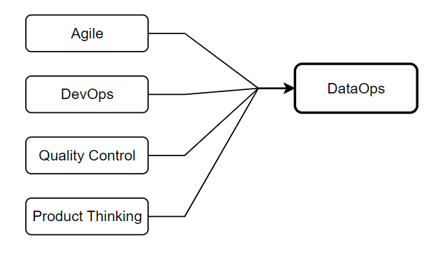

# Data Ops

!!! note

    **DataOps** is a collection of practices that focuses on breaking down silos
    between data producers and consumers, improving data quality and transparency
    of results.

**DataOps** provides a collaboration of data engineering, data science and operations team.
It aims to automate the delivery of the right and reliable data to appropriate
teams through a much faster approach. And this leads to better data productivity
and enhanced human communication.

<figure markdown="span">
  { loading=lazy width="600" }
  <figcaption>DataOps</figcaption>
</figure>

## Noted

- Continuous Integration/Continuous Deployment for Data
- Automated Testing for Data Pipelines
- Data Observability
- Incident Management for Data Systems

---

- Data Pipeline Orchestration
- Continuous Integration/Continuous Deployment (CI/CD) for Data
- Data Observability
- Automated Data Quality Checks

## DataOps Engineer

- [:simple-medium: 10 New DevOps Tools to Watch in 2024](https://medium.com/4th-coffee/10-new-devops-tools-to-watch-in-2024-a5127c0b3411)
- [:simple-medium: Is Data Observability Critical to Successful Data Analytics?](https://sanjmo.medium.com/is-data-observability-critical-to-successful-data-analytics-d09b983b95c6)

## Examples

- [:material-github: DataOps for the Modern Data Warehouse](https://github.com/Azure-Samples/modern-data-warehouse-dataops)

## References

- [:simple-medium: Data Engineering concepts: Part 7, DevOps, DataOps and MLOps](https://medium.com/@mudrapatel17/data-engineering-concepts-part-7-devops-dataops-and-mlops-afc6f432473c)
