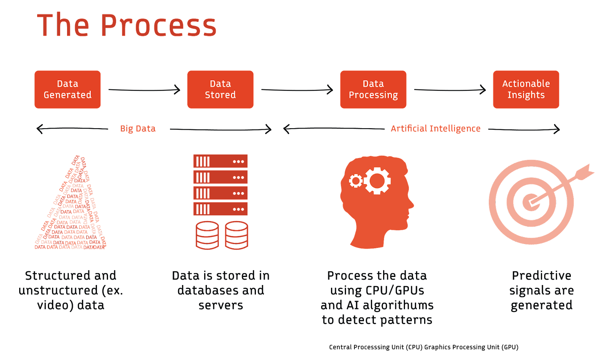

# Emerging Trends & Challenges

- Edge Computing for Data
- Quantum Data Processing
- Blockchain in Data Management
- Artificial Intelligence in Data Engineering

---

## Getting Started

As data sources multiply, the process of ingesting, processing, and transforming
data becomes cumbersome.
Systems must scale to avoid becoming bottlenecks.
Automation tools are stepping in to streamline data engineering processes,
ensuring data pipelines remain robust and efficient.
Data engineers are increasingly adopting distributed data storage and processing
systems like Hadoop or Spark.
Netflix's adoption of a microservices architecture to manage increasing data is
a testament to the importance of scalable designs.

The shift towards cloud-based storage and processing solutions has also revolutionized
data engineering.
Platforms like AWS, Google Cloud, and Azure offer scalable storage and high-performance
computing capabilities.
These platforms support the vast computational demands of data engineering algorithms
and ensure data is available and consistent across global architectures.

AI's rise has paralleled the evolution of data-driven decision-making in businesses.
Advanced algorithms can sift through vast datasets, identify patterns, and offer
previously inscrutable insights.
However, these insights are only as good as the data they're based on.

!!! quote

    The fundamentals of data engineering are evolving with AI.[^1]

### Using data engineering in AI

AI applications process large amounts of visual data.
For example, optical character recognition converts typed or handwritten text
images into machine-encoded text.
Computer vision applications train machines to interpret and understand visual data.
Images and videos from different sources, resolutions, and formats need harmonization.
The input images must be of sufficient quality, and data engineers often need to
preprocess these images to enhance clarity.
Many computer vision tasks require labeled data, demanding efficient tools for
annotating vast amounts of visual data.

AI applications can also learn and process human language. For instance, they can
identify hidden sentiments in content, summarize and sort documents, and
translate from one language to another.
These AI applications require data engineers to convert text into numerical vectors
using embeddings. The resulting vectors can be extensive, demanding efficient
storage solutions. Real-time applications require rapid conversion into these
embeddings, challenging data infrastructure's processing speed.
Data pipelines have to maintain the context of textual data. It also involves data
infrastructure capable of handling varied linguistic structures and scripts.

Large language models(LLMs)like OpenAI's GPT series are pushing the boundaries of
what's possible in natural language understanding and generation. These models,
trained on extensive and diverse text corpora, require:

- **Scale** — The sheer size of these models necessitates data storage and processing
  capabilities at a massive scale.

- **Diversity** — To ensure the models understand the varied nuances of languages,
  data sources need to span numerous domains, languages, and contexts.

- **Quality** — Incorrect or biased data can lead LLMs to produce misleading or
  inappropriate outputs.

### Using AI for data engineering

The relationship between AI and data engineering is bidirectional.
While AI depends on data engineering for quality inputs, data engineers also employ
AI tools to refine and enhance their processes.
The inter-dependency underscores the profound transformation businesses are undergoing.
As AI continues to permeate various sectors, data engineering expectations also
evolve, necessitating a continuous adaptation of skills, tools, and methodologies.

#### Automated data cleansing

AI models can learn the patterns and structures of clean data.
They can automatically identify and correct anomalies or errors by comparing incoming
data to known structures. This ensures that businesses operate with clean,
reliable data without manual intervention, thereby increasing efficiency and
reducing the risk of human error.

#### Predictive data storage

AI algorithms analyze the growth rate and usage patterns of stored data.
By doing so, they can predict future storage requirements.
This foresight allows organizations to make informed decisions about storage
infrastructure investments, avoiding over-provisioning and potential storage shortages.

#### Anomaly detection

Machine learning models can be trained to recognize "normal" behavior within datasets.
When data deviates from this norm, it's flagged as anomalous.
Early detection of anomalies can warn businesses of potential system failures,
security breaches, or even changing market trends.

#### Imputation

Along with detecting anomalies, AI can also help with discovering and completing
missing data points in a given dataset. Machine learning models can predict and
fill in missing data based on patterns and relationships in previously known data.
For instance, if a dataset of weather statistics had occasional missing values for
temperature, an ML model could use other related parameters like humidity, pressure,
and historical temperature data to estimate the missing value.

#### Data categorization and tagging

NLP models can automatically categorize and tag unstructured data like text,
ensuring it's stored appropriately and is easily retrievable.
This automates and refines data organization, allowing businesses to derive insights
faster and more accurately.

#### Optimizing data pipelines

AI algorithms can analyze data flow through various pipelines, identifying bottlenecks
or inefficiencies. By optimizing the pipelines, businesses can ensure faster data
processing and lower computational costs.

#### Semantic data search

Rather than relying on exact keyword matches, AI-driven semantic searches understand
the context and intent behind search queries, allowing users to find data based
on its meaning. This provides a more intuitive and comprehensive data search experience,
especially in vast data lakes.

#### Data lineage tracking

AI models can trace the journey of data from its source to its final destination,
detailing all transformations along the way. This ensures transparency, aids in
debugging, and ensures regulatory compliance.

---

In essence, the integration of AI into data engineering is a game-changer.
As AI simplifies and enhances complex data engineering tasks, professionals can
focus on strategic activities, pushing the boundaries of what's possible in data-driven
innovation. The potential of this synergy is vast, promising unprecedented advancements
in data efficiency, accuracy, and utility.

[^1]: [Data engineering 101](https://redpanda.com/guides/fundamentals-of-data-engineering)
