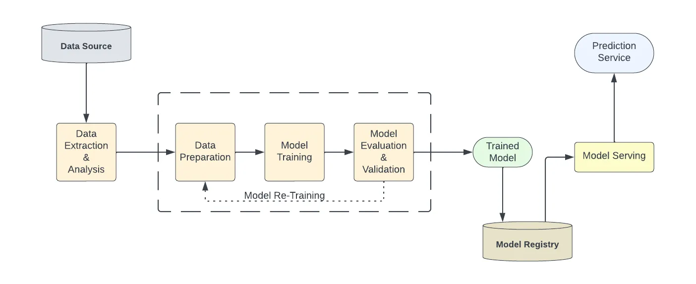

# ML Ops

- Data Preparation for Machine Learning
- Feature Engineering
- Data Versioning for ML
- Serving ML Models in Production

## What is MLOps?

!!! quote "What is MLOps?"

    **MLOps** = **DevOps** + **DataOps** + **ModelOps**[^1]

**Machine Learning Operations (MLOps)** is a set of practices that includes Machine Learning,
DevOps and Data Engineering elements. The main aim of the union is reliable and
efficient deployment and maintenance of Machine Learning systems in production.

<figure markdown="span">
  { loading=lazy }
  <figcaption>Basic Model Training Flow</figcaption>
</figure>

**Features of MLOps**:

-   Ensures validation of data, data schemas, and models along with testing and
    validation of code
-   Facilitates automated deployment of a ML pipeline that should automatically
    deploy a model and corresponding prediction service.
-   Expedites the process of automatically re-training and serving the models.

<figure markdown="span">
  { loading=lazy }
  <figcaption>MLOps Relation Overview</figcaption>
</figure>

### Components

<figure markdown="span">
  { loading=lazy }
  <figcaption>MLOps Components</figcaption>
</figure>

### Workflow

<figure markdown="span">
  { loading=lazy }
  <figcaption>MLOps High-Level Workflow Architecture[^1]</figcaption>
</figure>

The following table summarizes MLOps main practices and how they relate to DevOps
and Data Engineering practices:

<figure markdown="span">
  { loading=lazy }
  <figcaption>MLOps Main Practices</figcaption>
</figure>

## What is MLOps Engineer?

!!! quote

    **ML Engineers** build and retrain machine learning models. MLOps Engineers enable
    the ML Engineers. **MLOps Engineers** build and maintain a platform to enable the
    development and deployment of machine learning models. They typically do that
    through standardization, automation, and monitoring. MLOps Engineers reiterate
    the platform and processes to make the machine learning model development and
    deployment quicker, more reliable, reproducible, and efficient.

However, **ML Engineers** focus on building, training and validating machine learning
models, while **MLOps Engineers** concentrate primarily on testing, deploying and
monitoring models in production environments.

## Read Mores

- [:simple-medium: MLOps - What, Why and How](https://medium.com/@anup0999/mlops-what-why-and-how-7c1e0eb39ca1)
- [:material-web: MLOps - Benefits That Make It An Upcoming Industry Trend](https://geniusee.com/single-blog/mlops-practices-and-its-benefits)
- [:material-microsoft-azure: Orchestrate MLOps by using Azure Databricks](https://learn.microsoft.com/en-us/azure/architecture/ai-ml/idea/orchestrate-mlops-azure-databricks)
- [:simple-databricks: Architecting MLOps on the Lakehouse](https://www.databricks.com/blog/2022/06/22/architecting-mlops-on-the-lakehouse.html)
- [:simple-databricks: MLOps - workflows on Databricks](https://docs.databricks.com/en/machine-learning/mlops/mlops-workflow.html#mlops-workflows-on-databricks)

[^1]: [:simple-databricks: Architecting MLOps on the Lakehouse](https://www.databricks.com/blog/2022/06/22/architecting-mlops-on-the-lakehouse.html)
