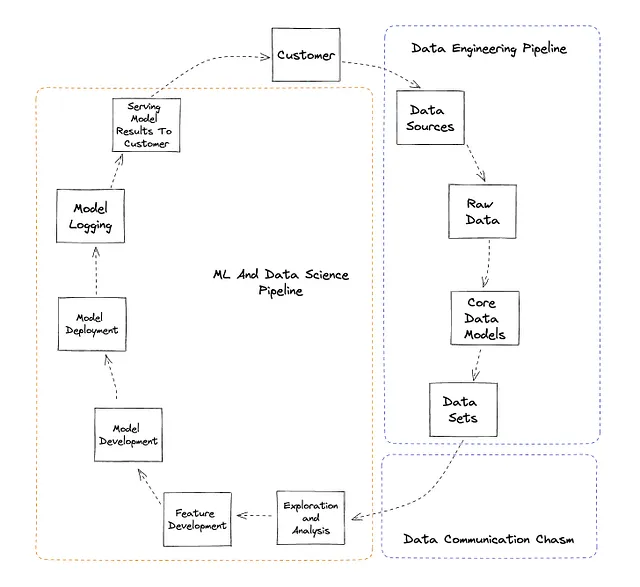

# Challenge

Data engineering and machine learning pipelines are both very different but oddly
can feel very similar. Many ML engineers I have talked to in the past rely on
tools like Airflow to deploy their batch models.

## Data Engineering Pipelines

First, let’s dive into data pipelines. Data pipelines are a series of processes
that extract data from different sources, clean it, and then store it in a data
warehouse or database. This is important for companies because it helps them make
informed decisions. A data pipeline is made up of four parts:

{ loading=lazy }

## Machine Learning Pipelines

Machine Learning (ML) pipelines don’t work in a straight line like data pipelines.
Instead, they involve building, training, and deploying ML models. This is used
to automate the entire process of building an ML model, from collecting data to
deploying it in production. An ML pipeline is made up of five parts:

## Read Mores

- [Data Engineering Vs Machine Learning Pipelines](https://medium.com/coriers/data-engineering-vs-machine-learning-pipelines-82d0e1be410c)
