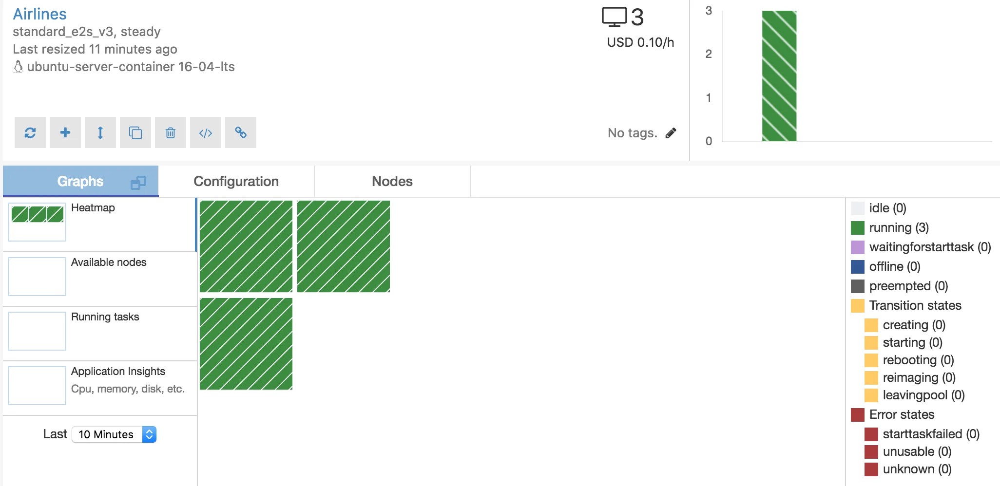
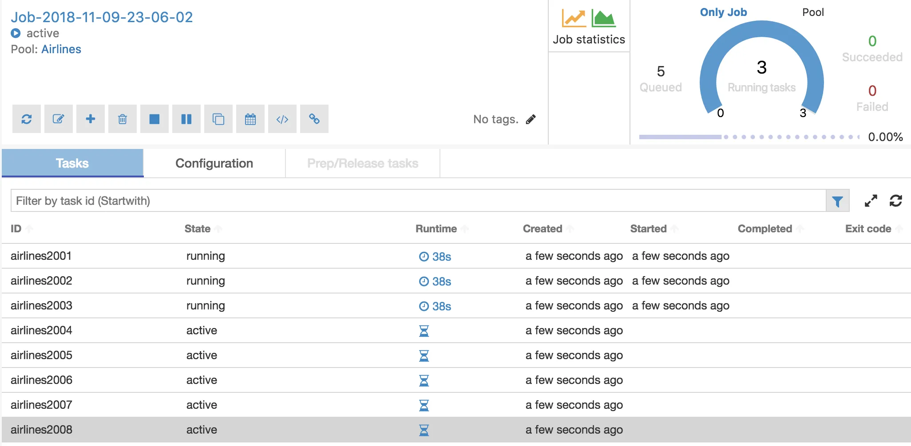

# Azure Batch: _Run PySpark with Docker_

You simply wrap your Spark code in a Docker container, and schedule 100 of those
containers on a pool of 20 Azure Batch nodes, and let them execute the 100 jobs
in parallel. You get to use Low Priority VMs out of the box, and you only pay
for what you need. No long-running Spark or Hadoop clusters.

In order to run this example, we need to set up:

- **Azure Storage Accounts** to read and write your data
- **Azure Container Registry** to store the Docker container
- **Azure Batch Accounts** to run your batch jobs in.

## Getting Started

Chances are you already have these running in Azure. If not, it’s simple click
and install on the Azure Portal. For each of these 3 services, you need to get
the Keys and add them to a `config.py`:

```python titile="config.py"
STORAGE_ACCOUNT_NAME = "<storage-account-name>"
STORAGE_ACCOUNT_KEY = "****"

BATCH_ACCOUNT_NAME = "<batch-account-name>"
BATCH_ACCOUNT_KEY = "****"
BATCH_ACCOUNT_URL = "https://<batch-account-name>.westeurope.batch.azure.com"

ACR_LOGINSERVER = "<registry-name>.azurecr.io"
ACR_USERNAME = "<registry-name>"
ACR_PASSWORD = "****"
```

## Create the Spark job script

For this demo, we need a simple spark job. Any job will do, really, The only thing
you need to be aware of, is that it has to be able to read from Blob Storage.

```requirements.txt title="requirements.txt"
azure
azure-storage
azure-storage-blob
pyspark==2.4.0
```

```python
import argparse
import config
from pyspark.sql import SparkSession

def get_azure_spark_connection(storage_account_name, storage_account_key):
    spark = (
        SparkSession.builder
            .config('spark.jars.packages', 'org.apache.hadoop:hadoop-azure:2.7.3')
            .config('spark.hadoop.fs.azure', "org.apache.hadoop.fs.azure.NativeAzureFileSystem")
            .config(f"spark.hadoop.fs.azure.account.key.{storage_account_name}.blob.core.windows.net", storage_account_key)
            .appName("AzureSparkDemo")
            .getOrCreate()
    )

    (
        spark.sparkContext._jsc
            .hadoopConfiguration()
            .set("fs.wasbs.impl", "org.apache.hadoop.fs.azure.NativeAzureFileSystem")
    )
    return spark

if __name__ == '__main__':
    parser = argparse.ArgumentParser()
    parser.add_argument("-i", "--input", help="input file to parse", type=str)
    parser.add_argument("-o", "--output", help="result file to write", type=str)
    args = parser.parse_args()
    spark = get_azure_spark_connection(
        storage_account_name=config.STORAGE_ACCOUNT_NAME,
        storage_account_key=config.STORAGE_ACCOUNT_KEY
    )
    df = (
        spark.read.option("header", "true")
            .option("delimiter", ",")
            .option("inferSchema", "true")
            .csv(args.input)
    )
    df.registerTempTable("airlines")
    result = spark.sql("""
      SELECT Year,
          Month,
          DayOfMonth,
          avg(ArrDelay) as avg_ArrDelay,
          avg(DepDelay) as avg_DepDelay
      FROM airlines
      GROUP BY Year, Month, DayOfMonth
    """)
    (
        result.repartition(1)
            .write.mode("overwrite")
            .parquet(args.output)
    )
```

## Dockerize

We wrap this job in a Docker container and push it to the **Azure Container Registry**
(ACR).

A simple `Dockerfile` can be as follows:

```dockerfile title="Dockerfile"
FROM python:3.6

# Install OpenJDK 8, and monitoring tooling
RUN \
  apt-get update && \
  apt-get install -y openjdk-8-jdk htop bmon && \
  rm -rf /var/lib/apt/lists/*

RUN pip install --upgrade setuptools
COPY requirements.txt /
RUN pip install -r /requirements.txt

ENV PATH=$PATH:/src
ENV PYTHONPATH /src

ADD ./ /src
WORKDIR /src/
```

It starts from a `python3.6` base image, installs `openjdk` and some monitoring
tooling, and then all the python dependencies as listed in `requirements.txt`.
Finally, it copies your code to a `src` folder.

You can build it with the command:

```shell
docker build -t dataminded/spark_on_azure_batch_demo .
```

Now you could already run this script locally as follows:

```shell
docker run dataminded/spark_on_azure_batch_demo python /src/airline_analytics.py \
  --input wasbs://demo@datamindeddata.blob.core.windows.net/raw/airlines/2007.csv.bz2 \
  --output wasbs://demo@datamindeddata.blob.core.windows.net/aggregated/airlines/2007.parquet
```

Next, you need to log in to the **Azure Container Registry**, with `<registry-name>` replaced
by your own registry of course. Enter the admin username you see on the Azure portal:

```shell
$ docker login <registry-name>.azurecr.io
$ docker tag dataminded/spark_on_azure_batch_demo:latest <registry-name>.azurecr.io/<registry-name>/spark_on_azure_batch_demo:latest
$ docker push <registry-name>.azurecr.io/<registry-name>/spark_on_azure_batch_demo:latest
```

!!! note

    That the first time you push this Docker container, it will be huge, about 1GB:
    it has an ubuntu image, a bunch of spark libraries, a JDK, etc.
    The next push you do of this container, will only push your latest code changes.

## Run on Azure Batch

Ok, so we’ve written a sample Spark application, with the right Azure libraries.
We’ve dockerized it and uploaded it to Azure Container Registry. Now we’re finally
ready to run our code on Azure Batch. This is going to be quite a long python script,
but it does a lot of things as well:

- It connects to your container registry and uses those docker images

- Create a Pool if it doesn't exist yet. Here, you can configure which kind of
  VMs and how many of them you want in your pool. And more importantly, you can
  specify that it are Low Prio VMs, which are cheap.

- Create a Job within the Pool

- Create a separate task to process each year of data. In a real-life situation,
  you would have a task for each day of data.

```python
import datetime
import sys
import time
import azure.batch.batch_auth as batch_auth
import azure.batch.batch_service_client as batch
import azure.batch.models as batchmodels
import config

sys.path.append('docs')
sys.path.append('')

IMAGE_NAME = '<registry-name>.azurecr.io/<registry-name>/spark_on_azure_batch_demo'
IMAGE_VERSION = 'latest'


def create_pool(
        batch_service_client,
        container_registry,
        image_name,
        pool_id,
        pool_vm_size,
        pool_node_count,
        skip_if_exists = True
):
  print(f'Creating pool [{pool_id}]...')

  container_conf = batch.models.ContainerConfiguration(
    container_image_names=[image_name],
    container_registries=[container_registry]
  )

  image_ref_to_use = batch.models.ImageReference(
    publisher='microsoft-azure-batch',
    offer='ubuntu-server-container',
    sku='16-04-lts',
    version='latest',
  )

  new_pool = batch.models.PoolAddParameter(
    id=pool_id,
    virtual_machine_configuration=batch.models.VirtualMachineConfiguration(
      image_reference=image_ref_to_use,
      container_configuration=container_conf,
      node_agent_sku_id='batch.node.ubuntu 16.04',
    ),
    vm_size=pool_vm_size,
    target_low_priority_nodes=pool_node_count)

  if not skip_if_exists or not batch_service_client.pool.exists(pool_id):
    batch_service_client.pool.add(new_pool)


def create_job(batch_service_client, job_id, pool_id):
  print('Creating job [{}]...'.format(job_id))

  job = batch.models.JobAddParameter(
    id=job_id,
    pool_info=batch.models.PoolInformation(pool_id=pool_id))

  batch_service_client.job.add(job)


def add_task(
    batch_service_client,
    image_name,
    image_version,
    job_id,
    command,
    name
):
  user = batchmodels.UserIdentity(
      auto_user=batchmodels.AutoUserSpecification(
        elevation_level=batchmodels.ElevationLevel.admin,
        scope=batchmodels.AutoUserScope.task,
      )
  )

  task_id = name
  task_container_settings = batch.models.TaskContainerSettings(
    image_name=image_name + ':' + image_version,
    container_run_options='--rm -p 4040:4040')
  task = batch.models.TaskAddParameter(
    id=task_id,
    command_line=command,
    container_settings=task_container_settings,
    user_identity=user
  )
  print("running " + command)

  batch_service_client.task.add(job_id, task)


def wait_for_tasks_to_complete(batch_service_client, job_id, timeout):
  timeout_expiration = datetime.datetime.now() + timeout

  print("Monitoring all tasks for 'Completed' state, timeout in {}..."
        .format(timeout), end='')

  while datetime.datetime.now() < timeout_expiration:
    print('.', end='')
    sys.stdout.flush()
    tasks = batch_service_client.task.list(job_id)

    incomplete_tasks = [task for task in tasks if
                        task.state != batchmodels.TaskState.completed]
    if not incomplete_tasks:
      print()
      return True
    else:
      time.sleep(1)

  print()
  raise RuntimeError("ERROR: Tasks did not reach 'Completed' state within "
                     "timeout period of " + str(timeout))


def daterange(start_date, end_date):
  for n in range(int((end_date - start_date).days)):
    yield start_date + datetime.timedelta(n)


if __name__ == '__main__':

  start_time = datetime.datetime.now().replace(microsecond=0)
  print('Start batch job {}'.format(start_time))
  print()

  image_name = IMAGE_NAME
  image_version = IMAGE_VERSION

  # Create the blob client, for use in obtaining references to
  # blob storage containers and uploading files to containers.

  credentials = batch_auth.SharedKeyCredentials(config.BATCH_ACCOUNT_NAME,
                                                config.BATCH_ACCOUNT_KEY)

  batch_client = batch.BatchServiceClient(credentials,
                                          base_url=config.BATCH_ACCOUNT_URL)

  job_id: str = f'Job-{datetime.datetime.now():%Y-%m-%d-%H-%M-%S}'
  pool_id: str = 'Airlines'

  try:
    container_registry = batch.models.ContainerRegistry(
      registry_server=config.ACR_LOGINSERVER,
      user_name=config.ACR_USERNAME,
      password=config.ACR_PASSWORD)

    create_pool(
      batch_service_client=batch_client,
      pool_id=pool_id,
      container_registry=container_registry,
      image_name=image_name,
      pool_node_count=3,
      pool_vm_size='Standard_E2s_v3',
      skip_if_exists=True)

    # Create the job that will run the tasks.
    create_job(batch_client, job_id, pool_id)

    for year in range(2001, 2009):
      command = (
        f"python /src/airline_analytics.py "
        f"--input wasbs://demo@datamindeddata.blob.core.windows.net/raw/airlines/{year}.csv.bz2"
        f"--output wasbs://demo@datamindeddata.blob.core.windows.net/aggregated/airlines/{year}.parquet"
      )
      add_task(
        batch_service_client=batch_client,
        image_name=image_name,
        image_version=image_version,
        job_id=job_id,
        command=command,
        name=f'airlines{year}'
      )

    # Pause execution until tasks reach Completed state.
    wait_for_tasks_to_complete(
      batch_client,
      job_id,
      datetime.timedelta(hours=2),
    )
    print(
      "Success! All tasks reached the 'Completed' state within the specified timeout period.")

  except batchmodels.BatchErrorException as err:
    print(err)
    raise

  # Print out some timing info
  end_time = datetime.datetime.now().replace(microsecond=0)
  print()
  print('Sample end: {}'.format(end_time))
  print('Elapsed time: {}'.format(end_time - start_time))
  print()
```

And finally, you will see your jobs run on Azure Batch:





!!! warning

    That all nodes in a pool are completely separate. This is not a one big Spark
    cluster concept.

## Next steps

This solves 90% of the needs of a project we’re working on. However,
there are always next steps:

- **Security**:

  Account keys are everywhere here. Maybe not in the git repo. But you are going
  to fill them in and put them in a docker image. Which is a big No No. Better
  would be to work with some sort of Role Based Access Control and a Vault,
  where this job is allowed to access the vault for certain keys, and it is allowed
  to read and write certain data from Blob storage

- **Monitoring**:

  The htop monitoring is nice, and you sure do look like a hardcore hacker with that CLI dashboard. But you would just like to see the Spark UI, really. Just like any normal human being.

- **Scaling**:

  Not all jobs fit on a single node. Although you can get up to 64 cores and 432GB (for not even $1 per hour in Low Prio), there might be use cases where you need more. Although, honestly, we all talk about big data a lot, but 99% of jobs that I’ve seen, really don’t need 432GB of RAM. But anyway, in those cases, AZTK is the way to go if you want to stick with Azure Batch.

- **Auto scaling**:

  Even better than scaling, we would also like to auto-scale our pool. Now it’s just a fixed size, which you have to turn off manually. Don’t forget, or your “It’s cheap!” claim won’t survive for long. Ideally, you want to autoscale to dozens or even hundreds of nodes, if you have a large workload. And then you want them to automatically be turned off when they are idle for a couple of minutes.

- **Kubernetes**: \
  We are big believers of Kubernetes as the next platform for big data analytics, and we’re looking into whether it’s stable enough to run Spark workloads. Since Spark 2.4.0, which got released yesterday, it also supports pyspark. The nice thing with this setup, is that you are already halfway there. You’ve wrapped your spark jobs in a docker container, and you put the container in a private registry. Now it’s just a matter of choosing where to launch it.

## References

- [Medium: Run Spark on Azure Batch using Azure Container Registry](https://medium.com/datamindedbe/run-spark-jobs-on-azure-batch-using-azure-container-registry-and-blob-storage-10a60bd78f90)
- [GitHub: Spark on Azure Batch Demo](https://github.com/datamindedbe/spark_on_azure_batch_demo)
