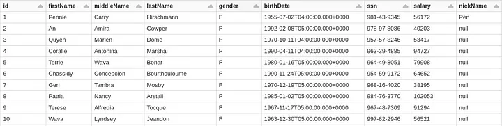
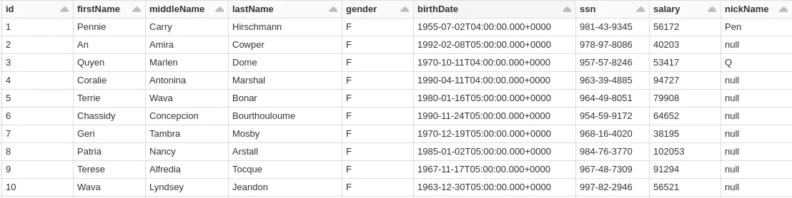
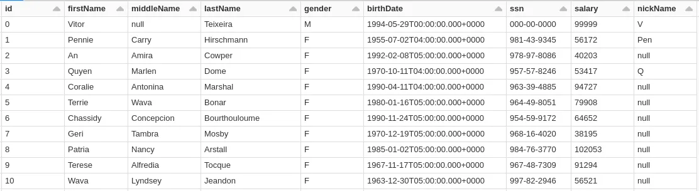
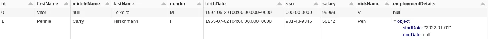
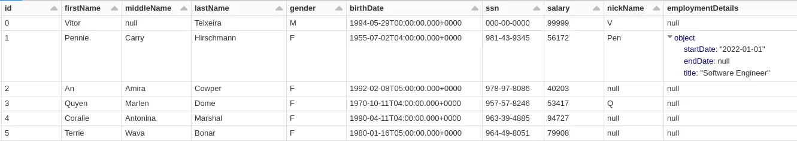
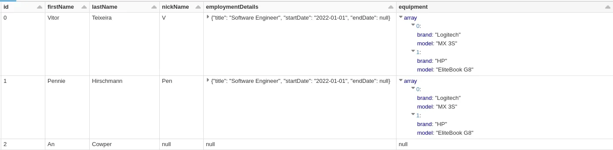
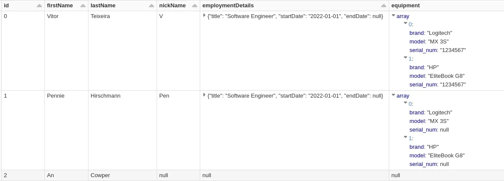
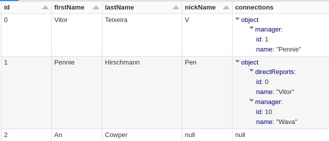
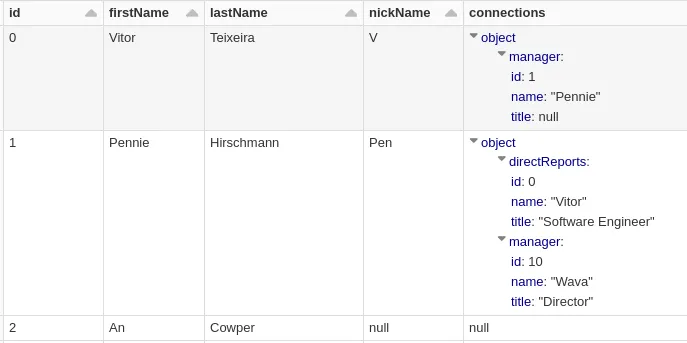

# Pyspark Delta lake Automatic Schema Evolution

**Update**: `2023-04-27` |
**Tag**: `Python` `Spark` `Delta Lake` `Schema`

Schema evolution is a critical aspect of managing data over time. It is very common
for data sources to evolve and adapt to new business requirements, which might mean
adding or removing fields from an existing data schema. As a data consumer, it
is imperative a quick and agile adaption to the new characteristics of the data
sources and automatic schema evolution allows us to seamlessly adapt to these
changes.

In this post, we will cover automatic schema evolution in Delta while using the
**people10m public dataset** that is available on Databricks Community Edition.
We’ll test adding and removing fields in several scenarios.

**Table of Contents**:

- []()

## Setup

Automatic schema evolution can be enabled in two ways, depending on our workload.
If we are doing blind appends, all we need to do is to enable `mergeSchema` option:

```scala
(
    df.write // writeStream
        .mode("append")
        .option("mergeSchema", "true")
        .save("delta_table")
)
```

If we use a merge strategy for inserting data we need to enable `spark.databricks.delta.schema.autoMerge.enabled`
by setting it to true.

```scala
spark.sql("SET spark.databricks.delta.schema.autoMerge.enabled = true")
```

## Evolving Schemas

Disclaimer: All the updates that we will be doing to the schema are just examples
and are not meant to make much sense.

```scala
import org.apache.spark.sql.types._

val schema = StructType(
  StructField("id", IntegerType) ::
    StructField("firstName", StringType) ::
    StructField("middleName", StringType) ::
    StructField("lastName", StringType) ::
    StructField("gender", StringType) ::
    StructField("birthDate", TimestampType) ::
    StructField("ssn", StringType) ::
    StructField("salary", IntegerType) ::
    Nil
)
```

```scala
import io.delta.tables._
import scala.collection.JavaConverters._

val sourceDataFrame = spark.createDataFrame(
  Seq(
    Row.fromSeq(
      // records
    )).asJava, schema)

val targetDeltaTable = DeltaTable.forPath(spark, "/delta/people-10m.delta")

targetDeltaTable.alias("t").merge(
    sourceDataFrame.alias("s"),
    "t.id = s.id")
  .whenMatched().updateAll()
  .whenNotMatched().insertAll()
  .execute()
```

- **Adding a field**:

  We’ll add a new field to our current schema called `nickName` and update
  Pennie’s nickName (id number 1).

  ```scala
  ...
  StructField("nickName", StringType) ::
  ...
  ```

  

  As we can see a new field as added and Pennie can now be called by her new
  favorite nickname! Notice how all the other records' value was automatically
  filled with `null`.

- **Removing a field**:

  With the addition of nicknames, everyone started thinking about how no one uses
  their middle name, so they decided to remove it.

  We’re going to update Quyen’s nickname as well but as a result of the source
  deleting the field, her middle name won’t be present. What should happen to the
  table?

  

  If you guessed nothing, you were right. Every current target table record remains
  the same, only new records will have `middleName` as `null`.

  To showcase this we’re going to insert a new id (0).

  

- **Renaming a column**:

  Renaming a column is the same as removing a column and adding another with a
  new name. If you wish to rename a column in place please refer to
  [Delta Column Name Mapping](https://docs.databricks.com/delta/delta-column-mapping.html#rename-a-column).

  I won’t dig further into this topic as even though it is a schema evolution,
  it is not automatic. Have in mind that this feature is irreversible, once you
  turn it on you aren’t able to turn it off.

- **Changing a column type/order**:

  Changing a column type or column order is also not part of automatic schema evolution.

- **Adding/Removing a field in a struct**:

  Let’s imagine that we have added an employee history struct that includes the
  `startDate` and `endDate` to track when the employee started and left the job.

  

  For a more complete history, we now wish to include the `title` in order to track
  the employee’s career in the company.

  ```scala
  val schema = StructType(
    StructField("id", IntegerType) ::
    StructField("firstName", StringType) ::
    StructField("lastName", StringType) ::
    StructField("gender", StringType) ::
    StructField("birthDate", TimestampType) ::
    StructField("ssn", StringType) ::
    StructField("salary", IntegerType) ::
    StructField("nickName", StringType) ::
    StructField(
      "employmentHistory",
      StructType(
        StructField("title", StringType) :: //newly added
          StructField("startDate", TimestampType) ::
          StructField("endDate", TimestampType) ::
          Nil
      )) ::
    Nil
  )
  ```

  

  As we can see, adding a field to a struct is also not an issue. If we try to
  remove the newly added field it will also work. Adding and removing fields
  inside a struct works the same way as if it is performed on the root.

- **Adding/Removing a field in an array of structs**:

  Now we are getting more complex. In this case, we’ll be adding a new field to
  a struct that is inside an array. Imagine we now have an array of equipment that
  currently belongs to an employee:

  

  ```scala
  val schema = StructType(
    StructField("id", IntegerType) ::
      StructField("firstName", StringType) ::
      StructField("lastName", StringType) ::
      StructField("gender", StringType) ::
      StructField("birthDate", TimestampType) ::
      StructField("ssn", StringType) ::
      StructField("salary", IntegerType) ::
      StructField("nickName", StringType) ::
      StructField(
        "employmentDetails",
        StructType(
          StructField("title", StringType) ::
            StructField("startDate", DateType) ::
            StructField("endDate", DateType) ::
            Nil
        )) ::
      StructField(
        "equipment", ArrayType(
          StructType(
            StructField("brand", StringType) ::
              StructField("model", StringType) ::
              StructField("serial_num", StringType) :: //newly added
              Nil
          )
        )) ::
      Nil
  )
  ```

  

  As we can see, this also works as expected. The table schema is updated, new
  records have the respective `serial_num` and older records `serial_num` are filled
  with null values.

  If we remove the newly added field again it works as expected.

- **Adding/Removing a field in a map of structs**:

  Now it's time to test the same but inside a map. We have added a new column
  called `connections` that will be responsible for holding the hierarchy for each
  employee.

  

  To simulate an update we’ll be adding a new column called `title` to the struct
  inside the `connections` column.

  ```scala
  val schema = StructType(
    StructField("id", IntegerType) ::
      StructField("firstName", StringType) ::
      StructField("lastName", StringType) ::
      StructField("gender", StringType) ::
      StructField("birthDate", TimestampType) ::
      StructField("ssn", StringType) ::
      StructField("salary", IntegerType) ::
      StructField("nickName", StringType) ::
      StructField(
        "employmentDetails",
        StructType(
          StructField("title", StringType) ::
            StructField("startDate", DateType) ::
            StructField("endDate", DateType) ::
            Nil
        )) ::
      StructField(
        "equipment", ArrayType(
          StructType(
            StructField("brand", StringType) ::
              StructField("model", StringType) ::
              StructField("serial_num", StringType) ::
              Nil
          )
        )) ::
      StructField(
        "connections", MapType(
          StringType, StructType(
            StructField("id", IntegerType) ::
              StructField("name", StringType) ::
              StructField("title", StringType) :: //newly added
              Nil
          )
        )) ::
      Nil
  )
  ```

  

  This time, removing the field that returns an `AnalysisException` which means
  that MapType conversions are not well-supported.

  ```text
  AnalysisException: cannot resolve 's.connections' due to data type mismatch:
  cannot cast map<string,struct<id:int,title:string>> to map<string,struct<id:int,name:string,title:string>>;
  ```

  After a brief investigation, I found that it is due to castIfNeeded function not
  supporting MapTypes yet. I have opened a bug and will try to work on a fix for
  this issue.

  Edit: https://github.com/delta-io/delta/pull/1645

## Conclusion

In this article, we went through the addition and removal of fields in several
scenarios. We concluded that automatic schema evolution in Delta is
very complete and supports most of the complex scenarios. By allowing these
scenarios we can avoid having to manually intervene to update our schemas when
data sources evolve. This is especially useful when consuming hundreds of data
sources.

As a bonus, we also found a missing case that is not supported in MapTypes which
is a great opportunity to give back to the community for such an awesome open-source
project.

## References

- https://towardsdatascience.com/delta-lake-automatic-schema-evolution-11d32bd1aa99
