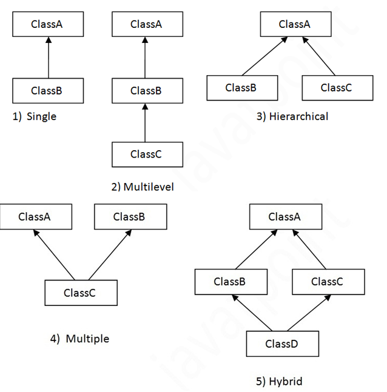

# Scala OOPs Concepts

**Table of Contents**:

- [Object and Class]()
- [Singleton Object]
- [Companion Object]

## Object and Class

Unlike java, scala is a pure object-oriented programming language. It allows us
to create object and class so that you can develop object-oriented applications.

- Object

  Object is a real world entity. It contains state and behavior. Laptop, car,
  cell phone are the real world objects.

  Object typically has two characteristics:
  - State: data values of an object are known as its state.
  - Behavior: functionality that an object performs is known as its behavior.

  > **Note**: \
  > Object in scala is an instance of class. It is also known as runtime entity.

- Class

  Class is a template or a blueprint. It is also known as collection of objects
  of similar type.

  In scala, a class can contain:
  - Data member
  - Member method
  - Constructor
  - Block
  - Nested class
  - Super class information etc.

  You must initialize all instance variables in the class. There is no default
  scope. If you don't specify access scope, it is public. There must be an object
  in which main method is defined. It provides starting point for your program.
  Here, we have created an example of class.


```scala
class Student {
    var id: Int = 0;
    var name: String = null;
}

var s = new Student();
s.id = 10;
println(s.id + " " + s.name);  // 10 null
```

```scala
// Primary constructor with `val` by default
class Student(id: Int, name: String) {
    def this() {
        this(99, "Default");
    }

    def this(id: Int) {
        this(id, "Default);
    }

    def show() {
        println(id + " " + name)
    }
}

var s = new Student(100, "Martin");
s.show();  // 100 Martin

var s = new Student();  // Student(99, Default)
var s = new Student(200);  // Student(200, Default)
```

```scala
class User(private var name: String, val age: Int) {
    def printName{ println(name) }
}

var u = new User("Max", 28);
u.printName;  // Max
```

```scala
// Anonymous object
class Arithmetic {
    def add(a: Int, b: Int) {
        var add = a + b;
        println("sum = " + add);
    }
}

new Arithmetic().add(10, 10);  // Sum = 20
```

> **Note**: \
> In scala, `this` is a keyword and used to refer current object. You can call
> instance variables, methods, constructors by using `this` keyword.

> **Note**: \
> Access modifier is used to define accessibility of data and our code to the outside
> world. Scala provides only three types of access modifiers, which are given
> below:
> - No modifier
> - Protected: `protected var ...`
> - Private: `private var ...`

## Singleton Object

Singleton object is an object which is declared by using object keyword instead
by class. No object is required to call methods declared inside singleton object.

In scala, there is no static concept. So scala creates a singleton object to
provide entry point for your program execution.

If you don't create singleton object, your code will compile successfully but
will not produce any output. Methods declared inside Singleton Object are accessible
globally. A singleton object can extend classes and traits.

```scala
object SingletonObject{
    def hello(){
        println("Hello, This is Singleton Object")
    }
}

SingletonObject.hello();  // Hello, This is Singleton Object
```

## Companion Object

In scala, when you have a class with same name as singleton object, it is called
companion class and the singleton object is called companion object.

The companion class and its companion object both must be defined in the same
source file.

```scala
class ComapanionClass{
    def hello(){
        println("Hello, this is Companion Class.")
    }
}

new ComapanionClass().hello();  // Hello, this is Companion Class.
```

## Inheritance

Inheritance is an object-oriented concept which is used to re-usability of code.
You can achieve inheritance by using extends keyword. To achieve inheritance a
class must extend to other class. A class which is extended called super or parent
class. a class which extends class is called derived or base class.

**Inheritance Syntax**:

```scala
class SubClassName extends SuperClassName() {
  /* Write your code
  *  methods and fields etc.
  */
}
```

**Types of Inheritance in Scala**:

Scala supports various types of inheritance including single, multilevel, multiple,
and hybrid. You can use single, multilevel and hierarchical in your class.
Multiple and hybrid can only be achieved by using traits. Here, we are representing
all types of inheritance by using pictorial form.



```scala
class Employee {
    val salary: Float = 10000;
    def title : String = "Salary: " + salary;
}

class Programmer(name: String) extends Employee {
    override val salary: Float = 15000;
    var bonus: Int = 5000;  // this cannot override a mutable variable
    override def title: String = name + " Salary: " + salary + ", Bonus: " + bonus;
}

var p = new Programmer("Jax");
p.title;  // Jax Salary: 15000, Bonus: 5000
```

### Final

Final is a keyword, which is used to prevent inheritance of super class members
into derived class. You can declare final variables, methods and classes also.

```scala
class Vehicle{
    final val speed: Int = 60;
}

class Bike extends Vehicle{
    override val speed: Int = 100;
}
```

```text
Error - value speed cannot override final member
```

> **Note**: \
> The `final` can use to method and class like `final def ...` and `final class ...`.

## Case Classes

Scala case classes are just regular classes which are immutable by default and
decomposable through pattern matching.

It uses equal method to compare instance structurally. It does not use new keyword
to instantiate object.

> **Warning**: \
> All the parameters listed in the case class are public and immutable by default.

```scala
case class Task(id: Int, title: String, var state: Int = 1) {
    def next() { if (state == 3) 3 else state += 1 }
}

val buyBanana = Task(id = 0, title = "Buy Banana");  // Task(0, Buy Banana, 3)
```

## Abstract Class

A class which is declared with abstract keyword is known as abstract class.
An abstract class can have abstract methods and non-abstract methods as well.
Abstract class is used to achieve abstraction. Abstraction is a process in which we
hide complex implementation details and show only functionality to the user.

In scala, we can achieve abstraction by using abstract class and trait. We have
discussed these in detail here.

```scala
abstract class Bike(name: String) {
    var b: Int = 20;

    // Abstract method
    def run()

    // Non-abstract method
    def performance() {
        println("Performance awesome")
    }
}

class Hero extends Bike {
    def run() {
        println("running fine...")
    }
}
```

## Trait

A trait is like an interface with a partial implementation. In scala, trait is a
collection of abstract and non-abstract methods. You can create trait that can have
all abstract methods or some abstract and some non-abstract methods.

A variable that is declared either by using `val` or `var` keyword in a trait get
internally implemented in the class that implements the `trait`. Any variable which
is declared by using `val` or `var` but not initialized is considered abstract.

Traits are compiled into Java interfaces with corresponding implementation classes
that hold any methods implemented in the traits.

```scala
trait Printable {
    def print()
}

class A4 extends Printable{
  def print() {
        println("Hello I am A4")
    }
}
```

- Implementing Multiple Traits in a Class

```scala
trait Printable {
    def print()

    // Non-abstract method
    def title() {
        println("This is show method")
    }
}

trait Showable {
    def show()
}

class A6 extends Printable with Showable {
    def print() {
        println("This is printable")
    }
    def show() {
        println("This is showable");
    }
}
```

> **Note**: \
> On above example, `Printable` can be abstract class but `Showable` can not.
> That mean `A6` need to inherited only one abstract class and `Showable` should be
> trait. \
> `class ClassName extends AbstractClass with FirstTrait with SecondTrait { ... }`

### Trait Mixins

In scala, trait mixins means you can extend any number of traits with a class or
abstract class. You can extend only traits or combination of traits and class or
traits and abstract class.

It is necessary to maintain order of mixins otherwise compiler throws an error.

```scala
trait Print {
    def print()
}

abstract class PrintA4 {
    def printA4()
}

class A6 extends PrintA4 with Print {
    // Trait print
    def print() {
        println("print sheet");
    }
    // Abstract class printA4
    def printA4() {
        println("Print A4 Sheet");
    }
}

class A6After extends PrintA4 {
    // Trait print
    def print() {
        println("print sheet");
    }
    // Abstract class printA4
    def printA4() {
        println("Print A4 Sheet");
    }
}

var a = new A6();
var a = new A6After() with Print;
```
