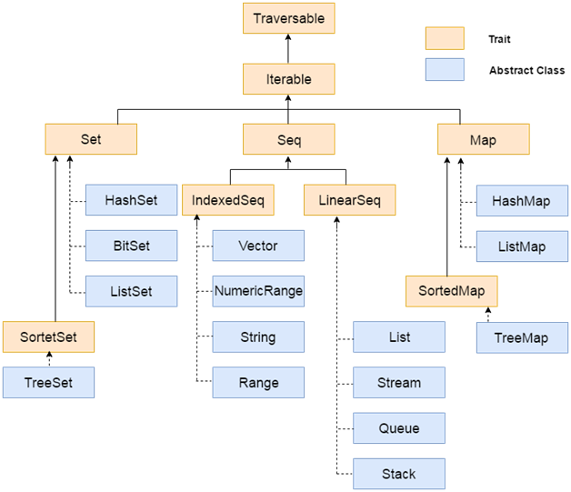

# Scala Collection


Scala provides rich set of collection library. It contains classes and traits to
collect data. These collections can be mutable or immutable. You can use them
according to your requirement. `Scala.collection.mutable` package contains all the
mutable collections. You can add, remove and update data while using this package.



`Scala.collection.immutable` contains all the immutable collections. It does not
allow you to modify data. Scala imports this package by default. If you want
mutable collection, you must import `Scala.collection.mutable` package in your code.

> **Note**: \
> Traversable is a trait and used to traverse collection elements. It is a base
> trait for all scala collections. It implements the methods which are common to
> all collections.

| Method                              | Description                                                                                              |
|-------------------------------------|----------------------------------------------------------------------------------------------------------|
| def head: A                         | It returns the first element of collection.                                                              |
| def init: Traversable[A]            | It returns all elements except last one.                                                                 |
| def isEmpty: Boolean                | It checks whether the collection is empty or not. It returns either true or false.                       |
| def last: A                         | It returns the last element of this collection.                                                          |
| def max: A                          | It returns the largest element of this collection.                                                       |
| def min: A                          | It returns smallest element of this collection                                                           |
| def size: Int                       | It is used to get size of this traversable and returns a number of elements present in this traversable. |
| def sum: A                          | It returns sum of all elements of this collection.                                                       |
| def tail: Traversable[A]            | It returns all elements except first.                                                                    |
| def toArray: Array[A]               | It converts this collection to an array.                                                                 |
| def toList: List[A]                 | It converts this collection to a list.                                                                   |
| def toSeq: Seq[A]                   | It converts this collection to a sequence.                                                               |
| def toSet[B >: A]: immutable.Set[B] | It converts this collection to a set.                                                                    |

> **Note**: \
> Iterable is a next trait from the top of the hierarchy and a base trait for
> iterable collections. It extends traversable trait and provides important methods
> to concrete classes.

**Table of Contents**:

- [Array](#array)
- [Seq](#seq)
- [List](#list)
- [Vector](#vector)
- [Queue](#)
- [Stream](#)
- [Set](#set)
  - [HashSet]()
  - [BitSet]()
  - [ListSet]()
- [Map](#map)
  - [HashMap]()
  - [ListMap]()
- [Tuple](#tuple)
- [Method of Collections](#method-of-collections)

## Array

Array is a collection of mutable values. It is an index based data structure which
starts from 0 index to n-1 where n is length of array.

Scala arrays can be generic. It means, you can have an `Array[T]`, where `T` is
a type parameter or abstract type. Scala arrays are compatible with Scala
sequences - you can pass an `Array[T]` where a `Seq[T]` is required. It also supports
all the sequence operations.

### Single Dimensional Array

Syntax for Single Dimensional Array:

```scala
var arrayName : Array[arrayType] = new Array[arrayType](arraySize);
var arrayName = new Array[arrayType](arraySize);
var arrayName : Array[arrayType] = new Array(arraySize);
var arrayName = Array(element1, element2 ... elementN);
```

```scala
val arr = Array(1, 2, 3, 4, 5);
for (x <- arr) {
    println(x);
}
```

```text
1
2
3
4
5
```

> Note:
> You can iterate an array by using foreach Loop like, `arr.foreach((x: Int) => println(x))`

- Array Function

```scala
import Array._

val arr1 = Array(1, 2, 3, 4, 5);
val arr2 = Array(6, 7, 8);
val result = concat(arr1, arr2);  // Array(1, 2, 3, 4, 5, 6, 7, 8)
```

### Multidimensional Array

Multidimensional Array Syntax:

```scala
var arrayName = Array.ofDim[ArrayType](NoOfRows,NoOfColumns);
var arrayName = Array(Array(element...), Array(element...), ...);
```

```scala
var arr = Array.ofDim[Int](2,2);
arr(1)(0) = 15;
for( i <- 0 to 1){
    for( j <- 0 to 1){
        print(" " + arr(i)(j))
    }
    println();
}
```

```text
0 0
15 0
```

## Seq

Seq is a trait which represents indexed sequences that are guaranteed immutable.
You can access elements by using their indexes. It maintains insertion order of
elements.

Sequences support a number of methods to find occurrences of elements or subsequences.
It returns a list.

Commonly used Methods of Seq:

| Method                                                    | Description                                                               |
|-----------------------------------------------------------|---------------------------------------------------------------------------|
| def contains[A1 >: A](elem: A1): Boolean                  | Check whether the given element present in this sequence.                 |
| def copyToArray(xs: Array[A], start: Int, len: Int): Unit | It copies the seq elements to an array.                                   |
| def endsWith[B](that: GenSeq[B]): Boolean                 | It tests whether this sequence ends with the given sequence or not.       |
| def head: A                                               | It selects the first element of this seq collection.                      |
| def indexOf(elem: A): Int                                 | It finds index of first occurrence of a value in this immutable sequence. |
| def isEmpty: Boolean                                      | It tests whether this sequence is empty or not.                           |
| def lastIndexOf(elem: A): Int                             | It finds index of last occurrence of a value in this immutable sequence.  |
| def reverse: Seq[A]                                       | It returns new sequence with elements in reversed order.                  |

```scala
import scala.collection.immutable.Seq

var seq: Seq[Int] = Seq(52, 85, 1, 8, 3, 2, 7);
seq.reverse;  // List(7, 2, 3, 8, 1, 85, 52)
```

## List

List is used to store ordered elements. It extends LinearSeq trait. It is a class
for immutable linked lists. This class is good for **last-in-first-out** (LIFO),
stack-like access patterns.

is a next trait from the top of the hierarchy and a base trait for iterable collections.
It extends traversable trait and provides important methods to concrete classes.

```scala
val lst: List[Int] = List(1, 8, 5, 6, 9, 58, 23, 15, 4);
val lst2: List[Int] = List(88, 100);
val lstNil: List[Int] = 1 :: 5 :: 9 :: Nil;  // List(1, 5, 9)
val lstTwo: List[Int] = List.fill(5)(2);  // List(2, 2, 2, 2, 2)
```

```scala
val lst3 = lst ++ lst2;  // List(1, 8, 5, 6, 9, 58, 23, 15, 4, 88, 100)
val lst4 = lst3.sorted;  // List(1, 4, 5, 6, 8, 9, 15, 23, 58, 88, 100)
val lst5 = lst3.reverse;  // List(100, 88, 4, 15, 23, 58, 9, 6, 5, 8, 1)
```

```scala
var result = 0 :: lst;  // List(0, 1, 8, 5, 6, 9, 58, 23, 15, 4);
var result = lst.max;  // 58
```

```scala
var sum: Int = 0;
val result = lst2.foreach(sum += _);  // 188
```

## Vector

Vector is a general-purpose, immutable data structure. It provides random access
of elements. It is good for large collection of elements.

It extends an abstract class AbstractSeq and IndexedSeq trait.

```scala
import scala.collection.immutable.Vector

var vector: Vector[Int] = Vector(5, 8, 3, 6, 9, 4);
var vector2 = Vector.empty;
```

## Queue

Queue implements a data structure that allows inserting and retrieving elements
in a first-in-first-out (FIFO) manner.

In scala, Queue is implemented as a pair of lists. One is used to insert the
elements and second to contain deleted elements. Elements are added to the first
list and removed from the second list.

```scala
import scala.collection.immutable._

var queue: Queue[Int] = Queue(1, 5, 6, 2, 3, 9, 5, 2, 5);
```

```scala
queue.front;  // 1
queue.enqueue(100);  // Queue(1, 5, 6, 2, 3, 9, 5, 2, 5, 100)
queue.dequeue;  // (1,Queue(5, 6, 2, 3, 9, 5, 2, 5))
```

## Stream

Stream is a lazy list. It evaluates elements only when they are required. This is
a feature of scala. Scala supports lazy computation. It increases performance of
your program.

```scala
val stream = 100 #:: 200 #:: 85 #:: Stream.empty;  // Stream(100, ?)
val stream2 = (1 to 10).toStream;  // Stream(1, ?)
```

```scala
stream2.head;  // 1
stream2.take(10);  // Stream(1, ?)
stream.map{_*2};  // Stream(200, ?)
```

## Set

It is used to store unique elements in the set. It does not maintain any order
for storing elements. You can apply various operations on them. It is defined in
the `Scala.collection.immutable` package.

Scala Set Syntax:

```scala
val variableName: Set[Type] = Set(element1, element2,... elementN);
val variableName = Set(element1, element2,... elementN);
```

```scala
import scala.collection.immutable._

val alphabet = Set("C","F","H","G");
val alphabet2 = Set("A","B", "D","E");
```

```scala
var result = alphabet ++ alphabet2;  // Set(E, F, G, H, A, B, C, D);
var result = alphabet.size;  // 4
var result = alphabet.contains("G");  // true
```

```scala
alphabet += "R";  // Set(E, F, G, H, A, B, C, D, R);
alphabet += "A";  // Set(E, F, G, H, A, B, C, D, R);
alphabet -= "C";  // Set(E, F, G, H, A, B, D, R);
```

> **Note**: \
> We can use `variable(something)` instead `variable.contains(something)`.

> **Note**: \
> If you want to create set that able to sort, you can use `scala.collection.immutable.SortedSet `.

### HashSet

HashSet is a sealed class. It extends AbstractSet and immutable Set trait. It uses
hash code to store elements. It neither maintains insertion order nor sorts the
elements.

```scala
import scala.collection.immutable.HashSet

var hashset = HashSet(4, 2, 8, 0, 6, 3, 45);
hashset.foreach((element: Int) => println(element));
```

```text
0
6
2
45
3
8
4
```

### BitSet

Bitsets are sets of non-negative integers which are represented as variable-size
arrays of bits packed into 64-bit words. The memory footprint of a bitset is
determined by the largest number stored in it. It extends Set trait.

```scala
import scala.collection.immutable.BitSet

var numbers = BitSet(1, 5, 8, 6, 9, 0);
numbers.foreach((element: Int) => println(element));
```

```text
0
1
5
6
8
9
```

```scala
numbers += 20;  // BitSet(0 1 5 6 8 9 20)
numbers -= 0;  // BitSet(1 5 6 8 9 20)
```

### ListSet

In scala, ListSet class implements immutable sets using a list-based data structure.
Elements are stored internally in reversed insertion order, which means the newest
element is at the head of the list. It maintains insertion order.

This collection is suitable only for a small number of elements. You can create
empty `ListSet` either by calling the constructor or by applying the function
`ListSet.empty`. Its iterate and traversal methods visit elements in the same
order in which they were first inserted.

```scala
import scala.collection.immutable.ListSet

var listset = ListSet(4, 2, 8, 0, 6, 3, 45);
listset.foreach((element: Int) => println(element));
```

```text
4
2
8
0
6
3
45
```

```scala
var listset: ListSet[String] = new ListSet();
var listset2: ListSet[String] = ListSet.empty;

listset += "India";  // ListSet(India)
```

## Map

Map is used to store elements. It stores elements in pairs of key and values.
In scala, you can create map by using two ways either by using comma separated
pairs or by using rocket operator.

```scala
val map: Map[String, String] = Map(("A", "Apple"), ("B", "Ball"));
val map2 = Map("D" -> "Dog");
```

```scala
var result = map + ("C" -> "Cat");  // Map(A -> Apple, B -> Ball, C -> Cat)
var result = map - ("B");  // Map(A -> Apple)
var result = map ++ map2;  // Map(A -> Apple, B -> Ball, D -> Dog)
```

```scala
map.keys;  // Set(A, B, C)
map.values;  // MapLike.DefaultValuesIterable(Apple, Ball, Cat)
```

### HashMap

HashMap is used to store element. It use hash code to store elements and return
a map.

```scala
import scala.collection.immutable.HashMap

var hashMap = new HashMap();
var hashMap2 = HashMap("A" -> "Apple", "B" -> "Ball", "C" -> "Cat");

hashMap2.foreach {
    case (key, value) => println(key + " -> " + value)
}
```

```text
A -> Apple
B -> Ball
C -> Cat
```

## Tuple

A tuple is a collection of elements in ordered form. If there is no element present,
it is called empty tuple. You can use tuple to store any type of data. You can store
similar type or mix type data also. You can use it to return multiple values from
a function.

```scala
val tp = (1, 2.5, "Apple");
val tp2 = 1 -> "Tom";  // (1, Tom)
```

```scala
tp.productIterator.foreach(println)
```

```text
1
2.5
Apple
```

```scala
tp._1;  // 1
tp._2;  // 2.5
```

### ListMap

This class implements immutable maps by using a list-based data structure. It
maintains insertion order and returns `ListMap`. This collection is suitable for
small elements.

```scala
import scala.collection.immutable._


var listMap = ListMap("Rice" -> "100", "Wheat" -> "50", "Gram" -> "500");
var emptyListMap = new ListMap();
var emptyListMap2 = ListMap.empty;
```

```scala
var newListMap = listMap + ("Pulses" -> "550");
newListMap.foreach {
    case (key, value) => println(key + " -> " + value)
}
```

```text
Rice -> 100
Wheat -> 50
Gram -> 500
Pulses -> 550
```

## Method of Collections

### Map & Filter

```scala
val lst = List(1, 2, 3, 4, 5);
var result = lst.map(x => x * 2);  // List(2, 4, 6, 8, 10)
var result = lst.map(x => List(x, x + 1));  // List(List(1, 2), List(2, 3), List(3, 4), List(4, 5), List(5, 6))
var result = lst.flatMap(x => List(x, x + 1));  // List(1, 2, 2, 3, 3, 4, 4, 5, 5, 6)
var result = lst.fillter(x => x % 2 == 0);  // List(2, 4)
```

```scala
val map = Map(1 -> "Apple", 2 -> "Ball");
var result = map.map(x => "hi" + x);  // List(hi(1,Apple), hi(2,Ball))
var result = map.mapValues(x => "hi" + x);  // Map(1 -> hi Apple, 2 -> hi Ball)
```

```scala
"Hello".map(_.toUpper);  // HELLO
```

```scala
List(List(1, 2, 3), List(3, 4)).flatten;  // List(1, 2, 3, 3, 4)
```

### Reduce & Fold or Scan

```scala
val lst = List(1, 2, 3, 10, 13);
var result = lst.reduceLeft(_ + _);  // 29
var result = lst.foldLeft(0)(_ + _);  // 29
var result = lst.foldLeft(100)(_ + _);  // 129
var result = lst.scanLeft(100)(_ + _);  // List(100, 101, 103, 106, 116, 129)

val lst2 = List("A", "B", "C");
var result = lst2.reduceLeft(_ + _);  // ABC
var result = lst2.foldLeft("z")(_ + _);  // zABC
var result = lst2.scanLeft("z")(_ + _);  // List(z, zA, zAB, zABC)
```

```scala
var result = lst.reduceLeft((x, y) => {println(x + " , " + y); x + y;});
```

```text
1, 2
3, 3
6, 10
16, 13
29
```

## References

- https://www.youtube.com/watch?v=OfngvXKNkpM
- https://www.javatpoint.com/
