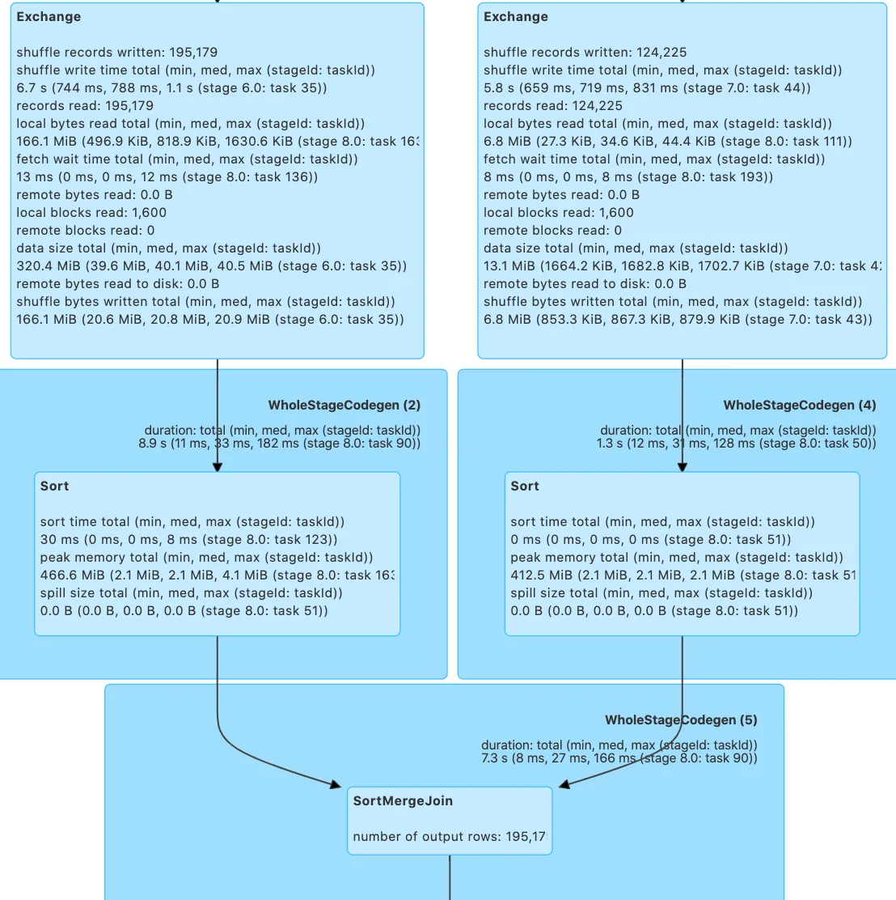
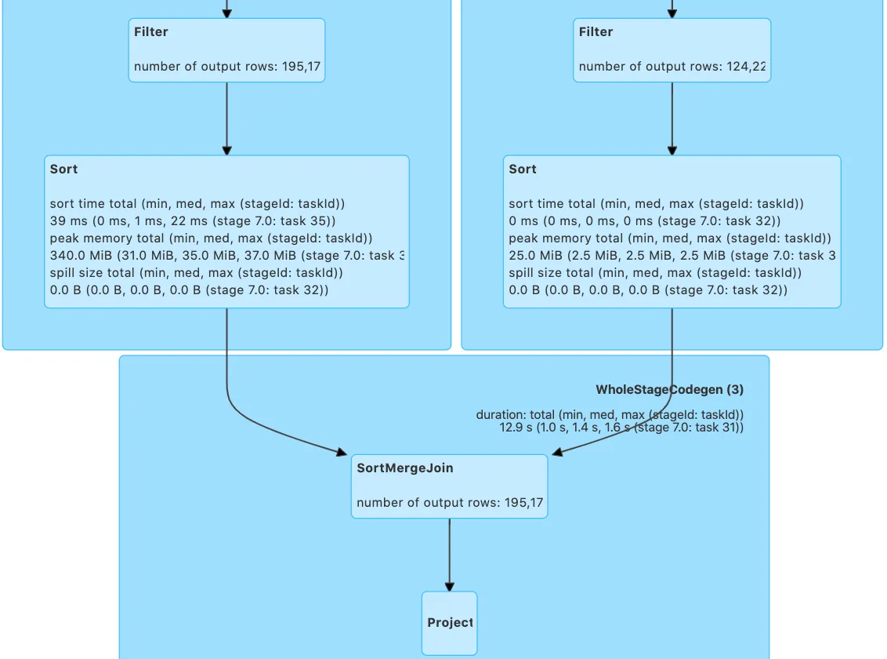
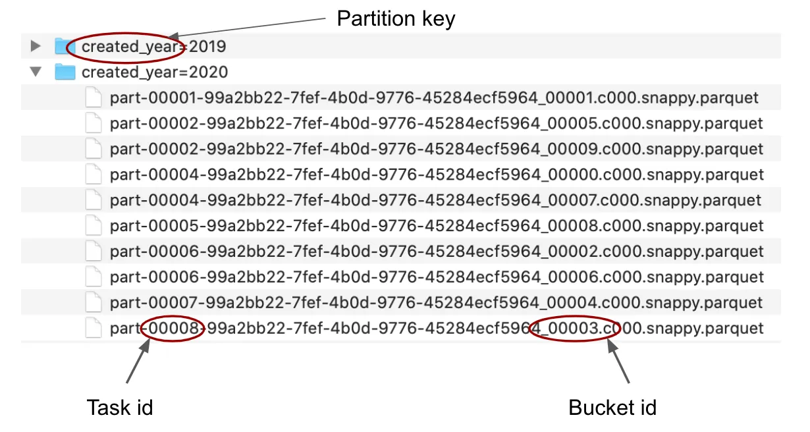
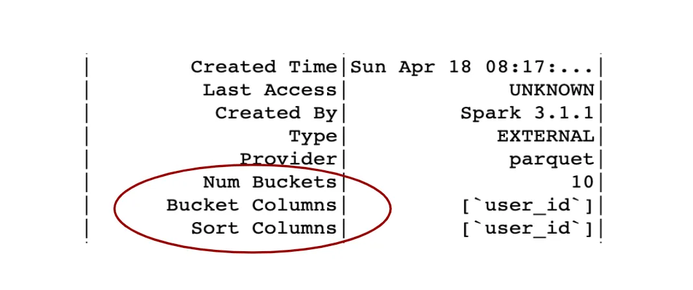

# Spark Bucketing

## What is bucketing?

Let’s start with this simple question. Bucketing in Spark is a way how to organize
data in the storage system in a particular way so it can be leveraged in subsequent
queries which can become more efficient. This efficiency improvement is specifically
related to avoiding the shuffle in queries with joins and aggregations if the bucketing
is designed well.

Queries with sort-merge join or shuffle-hash join and aggregations or window functions
require the data to be repartitioned by the joining/grouping keys. More specifically,
all rows that have the same value of the joining/grouping key must be in the same
partition. To satisfy this requirement Spark has to repartition the data, and to
achieve that, Spark has to physically move the data from one executor to another
— Spark has to do a so-called shuffle (for more details about the logic that Spark
uses to determine if a shuffle is necessary, see also my other article closely
related to this [topic](https://towardsdatascience.com/should-i-repartition-836f7842298c)).

With bucketing, we can shuffle the data in advance and save it in this pre-shuffled
state. After reading the data back from the storage system, Spark will be aware
of this distribution and will not have to shuffle it again.

### How to make the data bucketed

In Spark API there is a function `bucketBy` that can be used for this purpose:

```python
(
    df.write
        .mode("append/overwrite")
        .bucketBy("<number>", "<field1>", "<field2>", ...)
        .sortBy("<field1>", "<field2>", ...)
        .option("path", "<output-path>")
        .saveAsTable("<table-name>")
)
```

There are four points worth mentioning here:

- We need to save the data as a table (a simple save function is not sufficient)
  because the information about the bucketing needs to be saved somewhere. Calling
  saveAsTable will make sure the metadata is saved in the metastore
  (if the Hive metastore is correctly set up) and Spark can pick the information
  from there when the table is accessed.

- Together with bucketBy, we can call also sortBy, this will sort each bucket by the specified fields. Calling sortBy is optional, bucketing will work also without the sorting. The other way around is not working though — you can not call sortBy if you don’t call bucketBy as well.

- The first argument of the bucketBy is the number of buckets that should be created. Choosing the correct number might be tricky and it is good to consider the overall size of the dataset and the number and size of the created files (see more detailed discussion below).

- Careless usage of the bucketBy function can lead to the creation of too many files and custom repartition of the DataFrame might be needed before the actual write — see more info about this issue below (in the Bucketing from a data engineer perspective section).

### How is the data distributed among buckets?

So we know that bucketing will distribute the data into some buckets/groups.
You might be now wondering how are these buckets determined. Having a specific row,
do we know in which bucket it will end up? Well, yes! Roughly speaking, Spark is
using a hash function that is applied on the bucketing field and then computes
this hash value modulo number of buckets that should be created (hash(x) mod n).
This modulo operation ensures that no more than the specified number of buckets
are created. For the sake of simplicity, let’s first assume that after applying
the hash function we get these values: (1, 2, 3, 4, 5, 6 ) and we want to
create 4 buckets, so we will compute modulo 4. Modulo function returns the
remainder after integer division:

```text
1 mod 4 = 1  # remainder after the integer division
2 mod 4 = 2
3 mod 4 = 3
4 mod 4 = 0
5 mod 4 = 1
6 mod 4 = 2
```

The computed number is the final bucket. As you can see, we just distributed
these six values into four buckets

```text
(1, 2, 3, 4, 5, 6 ) -> (1, 2, 3, 0, 1, 2)
```

To be more exact, Spark is not using a simple modulo function, but a so-called
positive modulo which makes sure the final bucket value is a positive number and
is defined as follows:

```text
b = value mod n
if b < 0:
    b = (b + n) mod n
```

So if the bucket value is negative, we will add n (number of buckets) and compute
the **modulo** again which will no longer be negative. Let's assume this example in
which the hash function returns negative number -9 and we want to compute to which
bucket it belongs (still assuming we use four buckets):

```text
n = 4
value = -9
b = value mod n = -9 mod 4 = -1
# be is negative so we continue:
b = (b + n) mod n = (-1 + 4) mod 4 = 3 mod 4 = 3
```

So the value -9 will belong to bucket number 3.

The hash function that Spark is using is implemented with the _MurMur3_ hash algorithm
and the function is actually exposed in the DataFrame API (see in [docs](https://spark.apache.org/docs/3.1.1/api/python/reference/api/pyspark.sql.functions.hash.html))
so we can use it to compute the corresponding bucket if we want:

```python
from pyspark.sql.functions import hash, col, expr
(
    spark.range(100) # this will create a DataFrame with one column id
        .withColumn("hash", hash(col("id")))
        .withColumn("bucket", expr("pmod(hash, 8)"))
)
```

Here we can see how the data would be distributed into buckets if we use bucketing
by the column id with 8 buckets. Notice that the pmod function is called inside
expr because the function is not directly available in the PySpark API, but it is
available in SQL (to see more information about how the `expr` function can be used
with SQL functions, you can check my recent [article](https://towardsdatascience.com/a-decent-guide-to-dataframes-in-spark-3-0-for-beginners-dcc2903345a5)
about DataFrame transformations).

## Advantages of bucketing

The main goal of bucketing is to speed up queries and gain performance improvements.
There are two main areas where bucketing can help, the first one is to avoid shuffle
in queries with joins and aggregations, the second one is to reduce the I/O with
a feature called bucket pruning. Let’s see both these optimization opportunities
more in detail in the following subsections.

### Shuffle-free joins

If you are joining two tables and neither of them is particularly small, Spark
will have to make sure both tables are distributed on the cluster in the same
way (according to the joining key) and will therefore shuffle the data (both
tables will be shuffled). In the query plan, you will see an `Exchange` operator
in both branches of the join. Let’s see an example:

```python
tableA.join(tableB, 'user_id')
```

If the join is planed with sort-merge join, the execution plan will look like this:



As you can see, each branch of the join contains an `Exchange` operator that represents
the shuffle (notice that Spark will not always use sort-merge join for joining
two tables — to see more details about the logic that Spark is using for choosing
a joining algorithm, see my other [article](https://towardsdatascience.com/about-joins-in-spark-3-0-1e0ea083ea86)
About Joins in Spark 3.0 where we discuss it in detail).

However, if both tables are bucketed by the joining key into the same number of
buckets, Spark will read the data on the cluster with this specific distribution,
so it doesn't require additional repartitioning and shuffle — the Exchange operator
will no longer be present in the plan:



### One-side shuffle-free join

An interesting question is what happens if only one table is bucketed and the
other is not. The answer actually depends on the number of buckets and the number
of shuffle partitions. If the number of buckets is greater or equal to the number
of shuffle partitions, Spark will shuffle only one side of the join — the table
that was not bucketed. However, if the number of buckets is less than the number
of shuffle partitions, Spark will shuffle both tables and will not leverage the
fact that one of the tables is already well distributed. The default number of
shuffle partitions is 200 and it can be controlled with this configuration
setting:

```python
spark.conf.set("spark.sql.shuffle.partitions", n)
```

So if we use the default setting (200 partitions) and one of the tables
(let’s say `tableA`) is bucketed into, for example, 50 buckets and the other table
(`tableB`) is not bucketed at all, Spark will shuffle both tables and will repartition
the tables into 200 partitions.

To make sure that bucketing of `tableA` is leveraged, we have two options, either
we set the number of shuffle partitions to the number of buckets (or smaller),
in our example 50,

```python
# if tableA is bucketed into 50 buckets and tableB is not bucketed
spark.conf.set("spark.sql.shuffle.partitions", 50)
tableA.join(tableB, joining_key)
```

or we repartition the tableB into 50 partitions by explicitly calling repartition
as follows:

```python
(
    tableA
        .join(tableB.repartition(50, joining_key), joining_key)
)
```

Both these techniques will lead to a one-side shuffle-free join, which can be seen
also from the query plan because the Exchange operator will be in only one branch
of the join and so only one table will be shuffled.

### Tables with different bucket numbers

There is one more situation that we can consider here. What if both tables are
bucketed, but into a different number of buckets? What will happen depends on the
Spark version because an enhancement was implemented for this case in 3.1.1.

Before 3.1 the situation was actually similar to the previous case where only one
table is bucketed and the other is not, in other words, both tables will be shuffled
unless a specific condition with shuffle partitions and the number of buckets is
met in which case only one table will be shuffled and we will get a one-side
shuffle-free join. Here the condition is similar as before — the number of shuffle
partitions must be equal to or less than the number of buckets of the bigger table.
Let’s see this more clearly on a simple example: if tableA has 50 buckets, tableB
has 100, and the number of shuffle partitions is 200 (default), in that case, both
tables will be shuffled into 200 partitions. However, if the number of shuffle
partitions is set to 100 or less, only the tableA will be shuffled into 100 partitions.
Similarly, we can also repartition one of the tables to the number of buckets of
the other table in which case also only one shuffle would happen during the execution.

In Spark 3.1.1 a new feature was implemented which can coalesce the larger number
of buckets into the smaller one if it buckets numbers are multiples of each other.
This feature is by default turned off and can be controlled with this configuration
setting `spark.sql.bucketing.coalesceBucketsInJoin.enabled`. So if we turn it on
and have again tableA bucketed into 50 buckets, tableB into 100, the join will be
shuffle-free because Spark will coalesce tableB into 50 buckets so both tables will
have the same number and this will happen regardless of the number of shuffle partitions.

### What about the sort?

We have seen that with bucketing we can eliminate `Exchange` from the plan of sort-merge
join. The plan contains also `Sort` operators, just after the `Exchange` because the
data has to be sorted to be merged correctly. Can we eliminate the Sort as well?
You might be tempted to say yes because the bucketing supports also sorting, we
can call `sortBy` after `bucketBy` and have each bucket sorted, so it should be possible
to leverage that during the join. However, the situation with sort is more complex.

Before Spark 3.0, it was possible to eliminate the `Sort` operator from the join
plan if each bucket was formed by exactly one file. In that case, Spark was sure
that the data is sorted after reading it on the cluster and indeed the final plan
was Sort-free. However, if there were more files per bucket, Spark couldn’t guarantee
that the data is globally sorted and thus kept the Sort operator in the plan
— the data had to be sorted during the join execution. (See the section `Bucketing
from a Data Engineer perspective` below to learn how to achieve exactly one file
per bucket.)

In Spark 3.0 the situation changed and by default, the `Sort` is present even if
there is only one file per bucket. The reason for this change was that listing all
the files to check if there is only one per bucket was too expensive (if there were
too many files) so it was decided to turn off this check and have the Sort in the
plan all the time (for the sort-merge join). As you can see it is a trade-off, one
optimization for another. There was also introduced a new configuration setting
`spark.sql.legacy.bucketedTableScan.outputOrdering` that you can set to `True` to
enforce the behavior before 3.0 and still leverage the sorted buckets with one file.

### Shuffle-free aggregations

Similarly to joins, aggregations also require correct distribution of the data on
the cluster and in general Spark will have to shuffle the data for the following
queries:

```python
# this requires partial shuffle if tableA is not bucketed:
(
    tableA
        .groupBy('user_id')
        .agg(count('*'))
)
# this requires full shuffle if tableA is not bucketed :
(
    tableA
        .withColumn('n', count('*').over(Window().partitionBy('user_id')))
)
```

If, however, the tableA is bucketed by the field user_id, both queries will be
shuffle-free.

### Bucket pruning

Bucket pruning is a feature that was released in Spark 2.4 and its purpose is to
reduce I/O if we use a filter on the field by which the table is bucketed. Let’s
assume the following query:

```python
spark.table('tableA').filter(col('user_id') == 123)
```

If the table is not bucketed, Spark will have to scan the entire table to find
this record and if the table is large, it can take many tasks that will have to
be launched and executed. On the other hand, if the table is bucketed, Spark will
know immediately to which bucket this row belongs (Spark computes the hash function
with the modulo to see directly the bucket number) and will scan files only from
the corresponding bucket. And how does Spark know which files belong to which bucket?
Well, each file name has a specific structure and contains information not only
about the bucket to which it belongs, but also which task produced the file as
you can see from this picture:



The bucket pruning can lead to a huge speed-up if the table is very large.

## Disadvantages of bucketing

We just described the advantages that bucketing can offer. You might be wondering
whether there are also some disadvantages or simply some situations in which it
is better to avoid it. There is actually one consequence of bucketing that is good
to keep in mind, and it is parallelization during execution. If a table is bucketed
into n buckets, and you will query it, the first stage of the resulting job will
have exactly `n` tasks. On the other hand, if the table is not bucketed or the bucketing
is turned off, a number of tasks can be very different because Spark will try to
split the data into partitions to have approximately 128 MB per partition (this
is controlled by configuration setting `spark.sql.files.maxPartitionBytes`) so the
tasks have reasonable size and don’t get into troubles with memory.

If a table is bucketed and over time it grew in size and the buckets become large
it could be more efficient to turn the bucketing off to allow Spark to create more
partitions and avoid problems with data spill. This is useful especially if the
query doesn’t do any operations that could directly leverage the distribution
provided by bucketing.

In Spark 3.1.1 a new feature was implemented that can recognize a situation in
which bucketing is not useful based on the query plan (no joins or aggregations)
and will turn the bucketing off in the sense that it will discard the distribution
and scan the data in the same way as if it wasn’t bucketed. This feature is by
default turned on and can be controlled by `spark.sql.sources.bucketing.autoBucketedScan.enabled`
configuration setting.

## Bucketing from a data analyst perspective

Data Analyst wants to query the data and in an ideal world, he/she doesn’t want
to care about the details of how the table is stored in the data lake. Well, we
don’t live in an ideal world and sometimes it is still useful to know some details
about the table to leverage a faster execution and achieve better performance. It
will be important to be able at least check if the bucketing is leveraged in the
query or if it can be leveraged, in other words, if there is a way to easily
achieve some performance improvement for the query.

### Is the table bucketed?

To see if and how a table is bucketed we can simply check the details about the
table by calling a SQL statement

```python
spark.sql("DESCRIBE EXTENDED table_name").show(n=100)
```



From this, you can see if the table is bucketed, what fields were used for the
bucketing and how many buckets the table has. Notice that we called here `show(n=100)`
because the show function displays by default only 20 rows, but if the schema of
the table is large, the information about bucketing will not appear in the first
20 rows, so just be aware that depending on the table it might be needed to show
more rows to see the bucketing info.

### Is the bucketing leveraged in my query?

First of all, bucketing has to be enabled, which is by default, but if you are
not sure, you can check it as follows

```python
spark.conf.get("spark.sql.sources.bucketing.enabled")
```

and it should return `True`. This configuration setting can be used to control
if bucketing is on or off.

If a table is bucketed the information about it is saved in metastore. If we want
Spark to use it we need to access the data as a table (this will make sure that
Spark gets the information from the metastore):

```python
# Spark will use the information about bucketing from metastore:
df = spark.table(table_name)
# Spark will not use the information about bucketing:
df = spark.read.parquet(path_to_data)
```

Notice that in the second case where we approach the data directly from the path,
Spark will not communicate with the Hive metastore and will not get the information
about bucketing — bucketing will not be used.

Last but not least we can check the query plan and see if there are `Exchange`
operators in the plan in places where we want to avoid them.

### Can I help Spark?

Usually, if the tables are bucketed in the same number of buckets, the bucketing will work out of the box. But there are some cases in which Spark will fail to leverage bucketing and we can actually help to make it work. To get an idea, let’s see some of these situations.

Before Spark 3.0, if the bucketing column has a different name in two tables that
we want to join, and we rename the column in the DataFrame to have the same name,
the bucketing will stop working. For example, `tableA` is bucketed by `user_id`, and
`tableB` is bucketed by `userId`, the column has the same meaning (we can join on it),
but the name is different (`user_id` vs `userId`). The bucketing will not be fully
leveraged in the following query:

```python
# The bucketing information is discarded because we rename the
# bucketed column and we will get extra shuffle:
(
    tableA
        .withColumnRenamed('user_id', 'userId')
        .join(tableB, 'userId')
)
```

To make it work, we need to keep the original names:

```python
# Here bucketing will work:
(
    tableA
        .join(tableB, tableA['user_id'] == tableB['userId'])
)
```

This issue was fixed in Spark 3.0 so renaming the column is no longer a problem.

Another thing that is good to watch out for is the data types of the joining
columns — they need to be the same. Let’s assume this example: `tableA` is bucketed
by `user_id` which is of integer type, `tableB` is also bucketed by `user_id`, but it
is of long type and both tables are bucketed into 50 buckets. In this situation
the data types of the joining column are different in each table, so Spark will
have to cast it, will discard the bucketing information and both tables will be
shuffled:

```python
# both tables will be shuffled if user_id has different data type
# in both tables:
tableA.join(tableB, user_id)
```

It is quite unfortunate that both tables were created with a different data type
for a column that has the same meaning. Nevertheless, we can help Spark to achieve
at least one-side shuffle-free join as follows:

```python
(
    tableA
        .withColumn('user_id', col('user_id').cast('long'))
        .repartition(50, 'user_id')
        .join(tableB, 'user_id')
)
```

As you can see we explicitly convert the data type to be the same in both tables
and then repartition the changed table into the same number of partitions as is
the other table. The shuffle will happen only on this side where we repartition
it, the other table will be shuffle-free. This basically becomes equivalent to
the situation in which only one table is bucketed and the other is not.

The last example in this section is related to using a user-defined function (UDF)
in a query with a join. We need to keep in mind, that UDF will discard information
about bucketing, so if we call the UDF before the join, it will lead to the same
situation as if only one table is bucketed. Either both tables will be shuffled,
or we will have one-side shuffle-free join if we repartition the table or if we
set the number of shuffle partitions to the number of buckets:

```python
# Spark will shuffle both tables because of the UDF
(
    tableA.withColumn('x', my_udf('some_col'))
        .join(tableB, 'user_id')
)
# One-side shuffle-free join:
(
    tableA.withColumn('x', my_udf('some_col'))
        .repartition(50, 'user_id') # assuming we have 50 buckets
        .join(tableB, 'user_id')
)
# One-side shuffle-free join:
# set number of shuffle partitions to number of buckets (or less):
spark.conf.set('spark.sql.shuffle.partitions', 50)
(
    tableA.withColumn('x', my_udf('some_col'))
        .join(tableB, 'user_id')
)
```

And if we want to totally avoid the shuffle, we can simply call the UDF after the join

```python
(
    tableA
      .join(tableB, 'user_id')
      .withColumn('x', my_udf('some_col'))
)
```

## Bucketing from a data engineer perspective

The tables in the data lake are usually prepared by data engineers. They need to
consider how the data will be used and prepare it so it serves typical use-cases
of the data users, which are usually data analysts and scientists. Bucketing is
one of the techniques that need to be considered similarly to partitioning which
is another way how to organize data in the file system. Let’s now see some issues
that the data engineer usually has to face.

### How to create a bucketed table

We have already seen the query above using the function `bucketBy`. The problem
in practice becomes to control the number of created files. We need to keep in mind that each task in the last stage of the Spark job will create one file for each bucket for which it carries data. Let’s assume this example in which we process a 20 GB dataset and we have the data distributed into 200 tasks in the last stage (each task processing approximately 100 MB) and we want to create a table with 200 buckets. If the data on the cluster is distributed randomly (which is the general case) each of these 200 tasks will carry data for each of these 200 buckets, so each task will create 200 files, leading to 200 x 200 = 40 000 files, where all final files will be very small. You can see that number of resulting files is the multiplication of the number of tasks with the requested number of final buckets.

We can fix this problem by achieving already on the cluster the same distribution
that we want to have in the file system (in the storage). If each task has data
only for one bucket, in that case, each task will write only one file. That can
be achieved by custom repartition before the writing.

```python
(
    df.repartition(expr("pmod(hash(user_id), 200)"))
        .write
        .mode(saving_mode)  # append/overwrite
        .bucketBy(200, 'user_id')
        .option("path", output_path)
        .saveAsTable(table_name)
)
```

This will create exactly one file per bucket. As you can see we repartition the
data exactly by the same expression that is Spark using under the hood to distribute
the data among the buckets (see the relevant section above for more details on
how this works). You could actually use here more simple `df.repartition(200, ‘user_id’)`
with the same result, but the advantage of the above approach is that it works
also if you want to at the same time partition the data in the filesystem by
another field as follows

```python
(
    df
        .repartition(200, "created_year",expr("pmod(hash(user_id), 200)"))
        .write
        .mode(saving_mode)
        .partitionBy("created_year")
        .bucketBy(200, "user_id")
        .option("path", output_path)
        .saveAsTable(table_name)
)
```

Here each file system partition will have exactly 200 files (one file per bucket),
so the total number of files will be the number of buckets multiplied by the number
of file system partitions. Notice that this wouldn’t work out if you just call
`df.repartition(200, “created_year”, “user_id”)`.

### How to determine a reasonable number of buckets

This can be tricky and depends on more circumstances. It is important to consider the size of the final buckets — remember that when you read the data back, one bucket will be processed by one task, and if the bucket is large in size, the task will get into troubles with memory and Spark will have to spill data on the disk during the execution which will lead to a performance hit. Depending on the queries that you will run on the data, 150-200 MB per bucket might be a reasonable choice and if you know the total size of the dataset, you can compute from this how many buckets to create.
In practice, the situation is more complex and one has to face the following challenges:

- the table is continuously appended and its size grows in time and so does the
size of the buckets. In some cases, this may still be fine if the dataset is also
partitioned by some date dimension (year and month for example) and the buckets
are distributed uniformly across these partitions. If the typical query asks always
only for recent data, for example, the last 6 months, we can design the buckets
so the reasonable size corresponds to the 6 months of data. The total size of
the bucket will grow, but it doesn’t matter, because we will never ask for the
entire bucket.

- the data is skewed — this happens if there is a specific value of the bucketing
key for which there are many more records than for other values of the key. For
example, if the table is bucketed by user_id, there might be a specific user that
has many more interactions/activities/purchases or whatever the dataset represents
and this will lead to data skew — the task that will process this bigger bucket
will take longer than the other.

## Evolution of the bucketing feature

Spark itself is being continuously evolved and improved with each new release. Also, the bucketing feature underwent some improvements in the last few releases, so let's mention some of these here:

### Improvements in Spark 2.4

- Bucket pruning (see Jira)— reduce I/O with a filter on the bucketed field.

### Improvements in Spark 3.0

- Discard information about sorting (see Jira) — this is not really an improvement of bucketing, but rather the opposite. After this change, the sort-merge join always requires sorting, no matter if the buckets are already sorted. This was done in favor to have a faster explain command which needed to do file listing to verify if each bucket has only one file. There is a configuration setting that can bring the original behavior back (spark.sql.legacy.bucketedTableScan.outputOrdering, by default it is False so you need to set it to True if you want to leverage sorted buckets during the join). Also, see the discussion about the sort in the relevant section above.

- Respect aliases in output partitioning (see Jira) — it makes sure that sort-merge join will be shuffle-free for bucketed tables even if we rename the bucketed column.

### Improvements in Spark 3.1

- Coalescing bucketed tables for join (see Jira) — enable shuffle-free join if both tables have a different number of buckets. See the discussion about the feature in the relevant section above.

- Enable/disable bucketing by a rule (see Jira) — a rule that will turn off bucketing if it cannot be leveraged in the query.

### Future improvements

Here is listed a couple of features that are not implemented at the time of writing this article (April 2021):

- Add bucket scan info to explain (see Jira) — see the information if the bucketing is used in the query plan

- Read multiple sorted bucket files (see Jira) — leverage the sorted buckets for the sort-merge join even if there are more files per bucket

- Hive bucketing write support (see Jira) — enable compatibility with Hive bucketing (so it could be leveraged also by Presto)

## Configuration settings related to bucketing

We have already seen some of them throughout the article, but let’s list them here
to have them in one place:

- spark.sql.sources.bucketing.enabled — control if bucketing is on/off, default is True.

- spark.sql.sources.bucketing.maxBuckets — maximum number of buckets that can be used for a table. By default, it is 100 000.

- spark.sql.sources.bucketing.autoBucketedScan.enabled — it will discard bucketing information if it is not useful (based on the query plan). By default it is True.

- spark.sql.bucketing.coalesceBucketsInJoin.enabled — if both tables have a different number of buckets, it will coalesce buckets of the table with the bigger number to have the same as the other table. It works only if both numbers are multiples of each other. It is also constrained by the next configuration setting. By default it is False.

- spark.sql.bucketing.coalesceBucketsInJoin.maxBucketRatio — the maximum ratio of the two bucket numbers to have the coalescing work. By default, it is 4. In other words, if one table has more than 4 times the number of buckets than the other table, the coalescing will not take place.

- spark.sql.legacy.bucketedTableScan.outputOrdering — use the behavior before Spark 3.0 to leverage the sorting information from bucketing (it might be useful if we have one file per bucket). By default it is False.

- spark.sql.shuffle.partitions — control number of shuffle partitions, by default it is 200.

## Final discussion

In this report, we described bucketing from different perspectives. We have seen some of the issues that a data engineer needs to deal with when creating a bucketed table, like choosing a reasonable number of buckets and controlling the number of created files. We have also discussed the data analyst view — having bucketed tables provides optimization opportunities. In many cases, these opportunities are utilized by Spark out of the box, in some situations, however, extra care needs to be taken to leverage the bucketing potential. This happens with joins of tables where the bucketing details differ, for example, the tables have a different number of buckets, the bucketing column has a different name or data type, here we have seen that at least one-side shuffle-free join can be achieved with simple tricks using an explicit repartition of the DataFrame, or changing the number of shuffle partitions to meet the number of buckets.

## References

- https://towardsdatascience.com/best-practices-for-bucketing-in-spark-sql-ea9f23f7dd53
