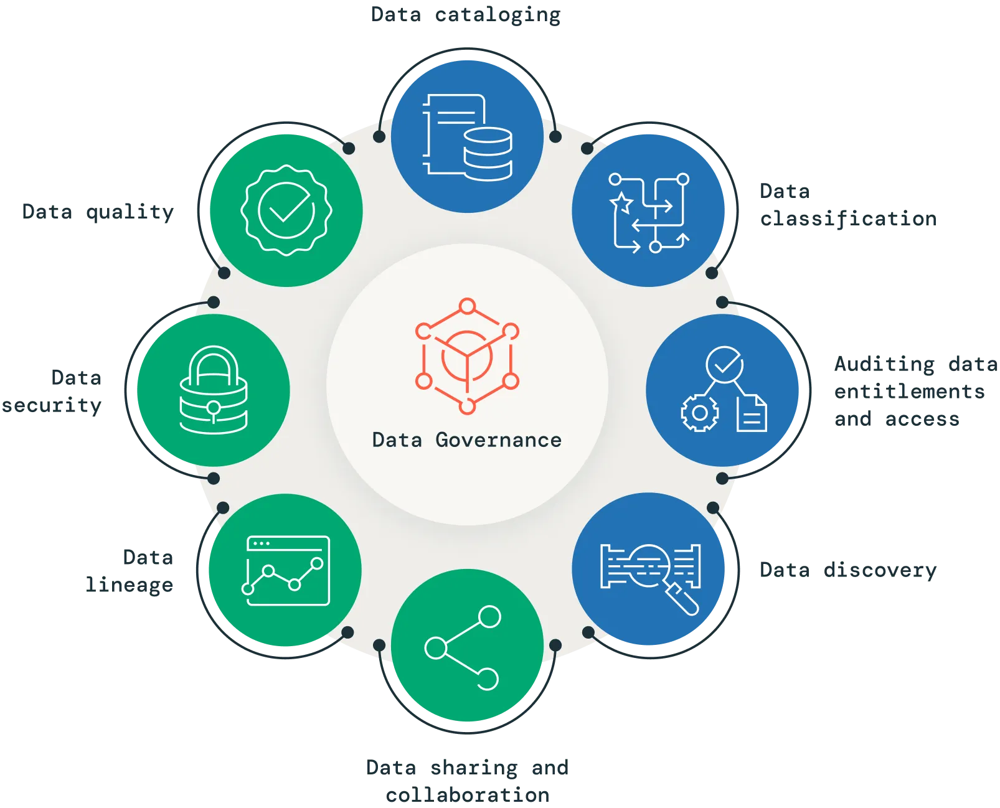

# Data Governance

**Data Governance** is a comprehensive approach that comprises the principles,
practices and tools to manage an organization’s data assets throughout their lifecycle.
By aligning data-related requirements with business strategy, data governance provides
superior data management, quality, visibility, security and compliance capabilities
across the organization. Implementing an effective data governance strategy allows
companies to make data easily available for data-driven decision-making while
safeguarding their data from unauthorized access, and ensuring compliance with
regulatory requirements.

## Key Elements of Data Governance

* **Data cataloging**

  Effective data governance requires knowledge of the data that exists within an
  organization. This is where a data catalog comes in, as it provides a centralized
  metadata repository for an organization’s data assets. A data catalog allows
  stakeholders to quickly discover, understand and access the data they need,
  improving data-related activities such as discovery, governance and analytics.
  It acts as a searchable index of all the data available, including information
  about its format, structure, location and usage, providing semantic value to an
  otherwise unidentifiable sea of information. Incorporating a data catalog into
  a governance program can help organizations improve their data management, enhance
  collaboration, reduce redundancy and ensure proper access controls and audit
  information retrieval.

## Why is Data Governance so important?

- It can be a colossal waste of time when not done correctly— Think about organizing
  a library with no books.

- It is foundational to data.

- It can save significant time and money when done correctly.

- It can help with the rapid adoption of new technologies or strategies.

- Mismanagement of data is a liability for an organization — Data that gets into
  the wrong hands represents real business risk.

## References

* [Databricks: Data Governance](https://www.databricks.com/discover/data-governance)
* [Digging into Data Governance and Data Modeling](https://medium.com/hashmapinc/digging-into-data-governance-and-data-modeling-e2ddaeddef93)
