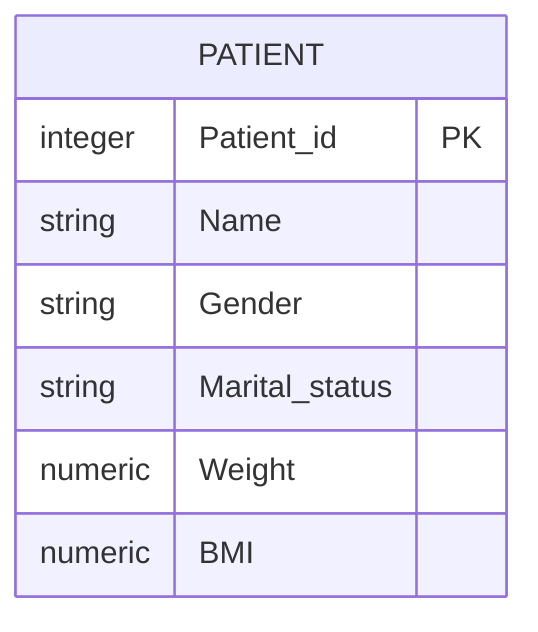
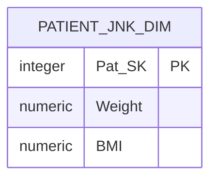
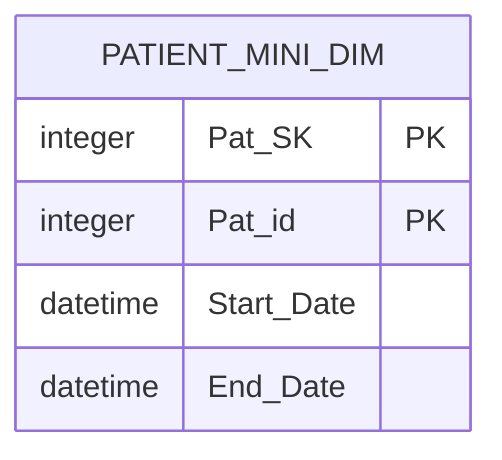
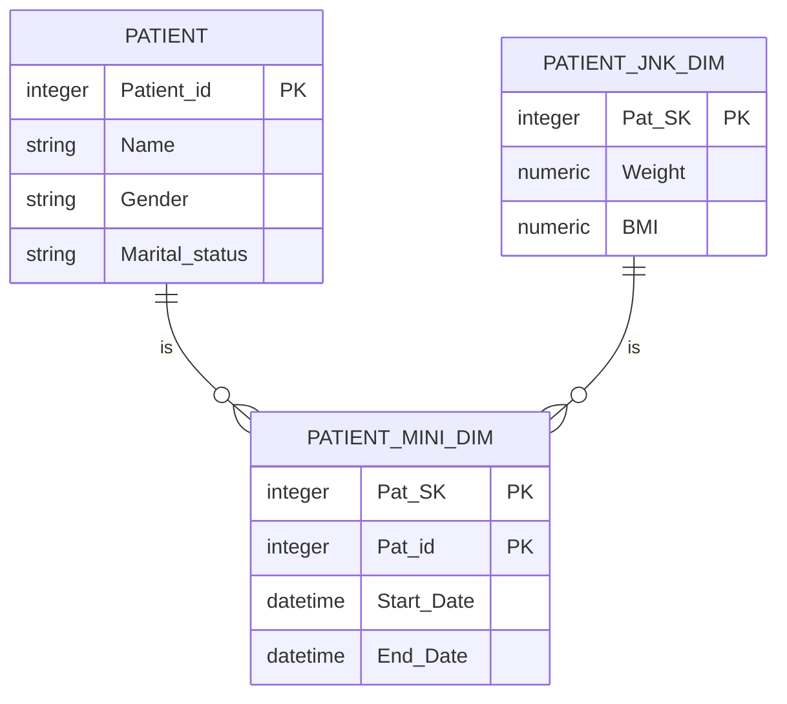

# Rapidly Changing Dimension

A dimension is a fast changing or rapidly changing dimension if one or more of its
attributes in the table changes very fast and in many rows. Handling rapidly changing
dimension in data warehouse is very difficult because of many performance implications.

As you know slowly changing dimension type 2 is used to preserve the history for
the changes. But the problem with type 2 is, with each and every change in the dimension attribute,
it adds new row to the table. If in case there are dimensions that are changing
a lot, table become larger and may cause serious performance issues. Hence, use of the type 2
may not be the wise decision to implement the rapidly changing dimensions.

**Separate Rapidly Changing Attribute by Implementing Junk Dimension**

Consider the fact table, in which not all the attributes of the table changes rapidly.
There may be some attribute that may be changing rapidly and other not.
The idea here is to separate the rapidly changing attribute from the slowly changing
ones and move those attribute to another table called junk dimension and maintain
the slowly changing attribute in same table. In this way, we can handle situation
of increasing table size.

For example:

Consider patient dimension where there are 1000 rows in it. On average basis,
each patient changes the 10 of attributes in a year. If you use the type 2 to manage
this scenario, there will be 1000*10 = 10000 rows. Imagine if the table has 1 million rows,
it’ll become very hard to handle the situation with type 2.
Hence, we use rapidly changing dimension approach.

The attribute like patient_id, Name, Gender, Marital_status will not change or
changes very rarely. And attribute like weight and BMI (body mass index)
changes every month based on the patient visit to hospital.
So, we need to separate the weight column out of the patient table otherwise
we end up filling the table if we use SCD type 2 on PATIENT dimension.
We can put the weight column which is rapidly changing into junk dimension table.

Below is the structure of Junk dimension table:

> Note:
> Pat_SK is the surrogate key and acts as a primary key for junk dimension table.

**Link Junk Dimension and PATIENT Table**

In this step, we must link the junk dimension and patient table. Keep in mind; we cannot simply refer the junk dimension table by adding its primary key to patient table as foreign key. Because any changes made to junk dimension will have to reflect in the patient table, this obviously increases the data in patient dimension. Instead, we create one more table called mini dimension that acts as a bridge between Patient and Junk dimension. We can also add the columns such as start and end date to track the change history. Below is the structure of the mini dimension:

This table is just bridge between two tables and does not require any surrogate key in it.
Below is the diagrammatic representation of the Rapidly Changing Dimension implementation.

## References

- https://dwgeek.com/rapidly-changing-dimension-data-warehouse.html/
