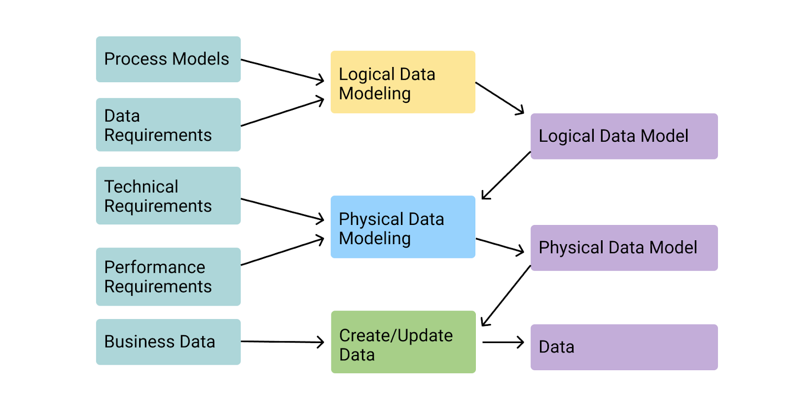
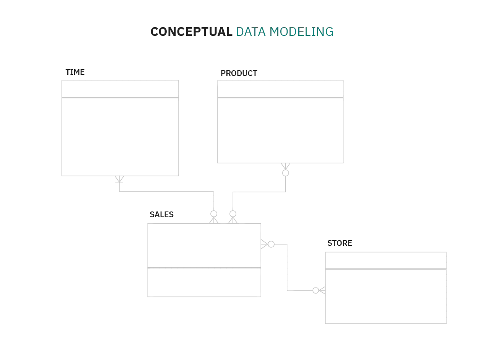
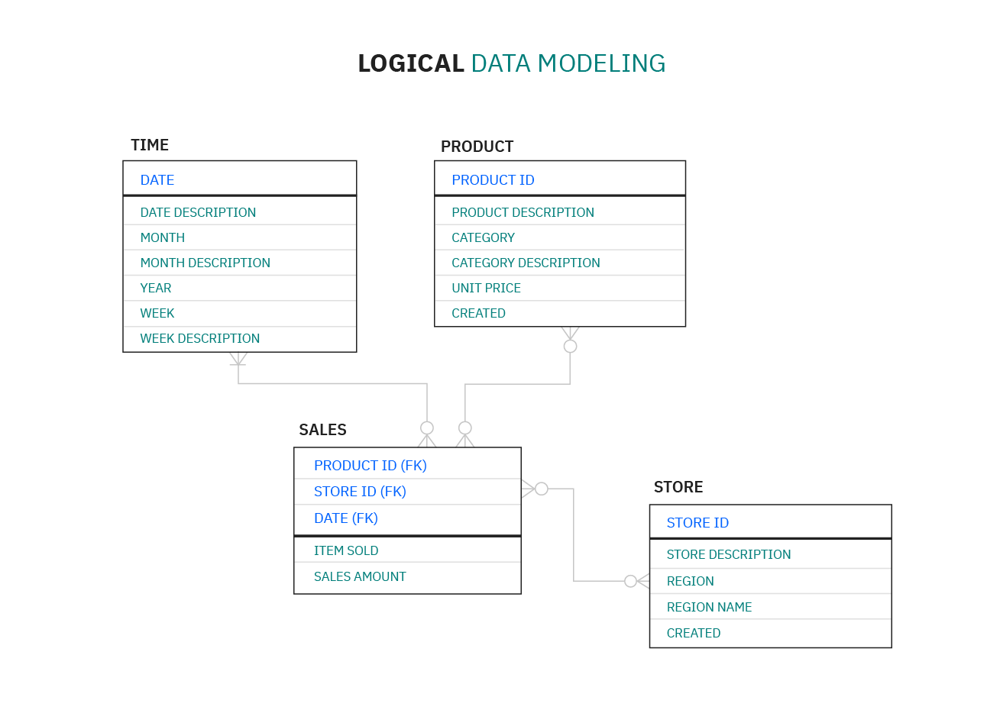
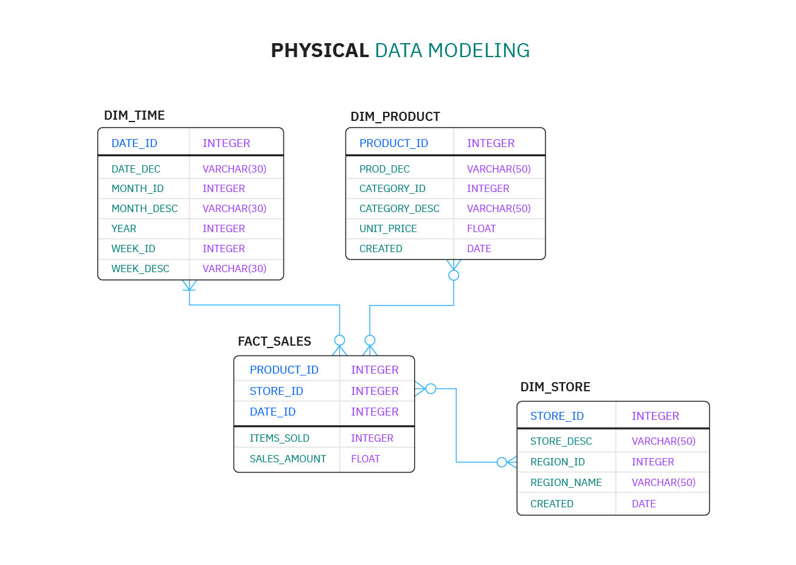

# Data Model

_Last update: 2023-03-28 (`Copy Edition`)_

> **TODO**:
> - [ ] Change: Summary document

---

Data modeling is the process of creating a visual representation of either a whole
information system or parts of it to communicate connections between data points
and structures. The goal is to illustrate the types of data used and stored within
the system, the relationships among these data types, the ways the data can be
grouped and organized and its formats and attributes.

Data models are built around business needs. Rules and requirements are defined
upfront through feedback from business stakeholders, so they can be incorporated
into the design of a new system or adapted in the iteration of an existing one.

A Data Model is essentially a blueprint for a building designed by an architect.
It is the technique of documenting complex software system designs in the form of
an easily understandable graphic. To describe how the data will flow, the diagram
will be made using text and symbols. It is often referred to as the blueprint for
developing new software or reengineering existing applications.

**Table of Contents**:

- [Types of data models](#types-of-data-models)
- [Data modeling process](#data-modeling-process)
- [Types of data modeling](#types-of-data-modeling)
- [How Can We Define a Good Data Model?](#how-can-we-define-a-good-data-model)
- [Benefits of data modeling](#benefits-of-data-modeling)
- [Why Create a Data Model?](#why-create-a-data-model)

**Key Features of Data Modeling**:

- Cost Savings: Data Models allow you to design apps at a lesser cost.
  Data modeling typically spends less than 10% of a project's budget and has the
  potential to lower the 70% of the budget that is typically allocated to programming.

- Broader Scope: A Data Model serves as a focal point for deciding scope. It provides something practical to help corporate sponsors and developers agree on what is and is not included with the product.

- Improved Documentation: Models serve as a foundation for long-term maintenance by documenting fundamental concepts and language. The documentation will be useful to you even if your staff changes.

- Risk Management: A Data Model can be used to quantify software complexity and obtain insight into the level of development effort and project risk.

- Solid Starting Point for Data Mining: A model's documentation serves as a starting point for analytical data mining. You can load daily company data into a dedicated database known as a "Data Warehouse."

- Shorter Time to Market: You may also construct software more quickly by detecting mistakes early on. A Data Model can also automate some processes; for example, Design tools can take a model as input and construct the first database structure as well as some data access code.

## Types of data models

Like any design process, database and information system design begins at a high
level of abstraction and becomes increasingly more concrete and specific.
Data models can generally be divided into three categories, which vary according
to their degree of abstraction. The process will start with a conceptual model,
progress to a logical model and conclude with a physical model.

Each type of data model is discussed in more detail below:

### Conceptual data models
They are also referred to as domain models and offer a big-picture view of what
the system will contain, how it will be organized, and which business rules are involved.
Conceptual models are usually created as part of the process of gathering initial
project requirements.

Typically, they include entity classes (defining the types of things that are
important for the business to represent in the data model), their characteristics
and constraints, the relationships between them and relevant security
and data integrity requirements. Any notation is typically simple.

### Logical data models
They are less abstract and provide greater detail about the concepts and relationships
in the domain under consideration. One of several formal data modeling notation
systems is followed. These indicate data attributes, such as data types and
their corresponding lengths, and show the relationships among entities.
Logical data models don't specify any technical system requirements.

This stage is frequently omitted in agile or DevOps practices.
Logical data models can be useful in highly procedural implementation environments,
or for projects that are data-oriented by nature, such as data warehouse design
or reporting system development.

### Physical data models
They provide a schema for how the data will be physically stored within a database.
As such, they're the least abstract of all. They offer a finalized design that
can be implemented as a relational database, including associative tables that
illustrate the relationships among entities as well as the primary keys and
foreign keys that will be used to maintain those relationships.

Physical data models can include database management system (DBMS)-specific properties,
including performance tuning.

## Data modeling process

As a discipline, data modeling invites stakeholders to evaluate data processing
and storage in painstaking detail. Data modeling techniques have different conventions
that dictate which symbols are used to represent the data, how models are laid out,
and how business requirements are conveyed. All approaches provide formalized workflows
that include a sequence of tasks to be performed in an iterative manner.

Those workflows generally look like this:

1) Identify the entities. The process of data modeling begins with the identification
  of the things, events or concepts that are represented in the data set that is
  to be modeled. Each entity should be cohesive and logically discrete from all others.

2) Identify key properties of each entity. Each entity type can be differentiated
  from all others because it has one or more unique properties, called attributes.
  For instance, an entity called "customer" might possess such attributes as a
  first name, last name, telephone number and salutation, while an entity called
  "address" might include a street name and number, a city, state, country and
  zip code.

3) Identify relationships among entities. The earliest draft of a data model will
  specify the nature of the relationships each entity has with the others.
  In the above example, each customer "lives at" an address. If that model were
  expanded to include an entity called "orders," each order would be shipped to
  and billed to an address as well. These relationships are usually documented
  via unified modeling language (UML).

4) Map attributes to entities completely. This will ensure the model reflects how
  the business will use the data. Several formal data modeling patterns are in
  widespread use. Object-oriented developers often apply analysis patterns or
  design patterns, while stakeholders from other business domains may turn to
  other patterns.

5) Assign keys as needed, and decide on a degree of normalization that balances
  the need to reduce redundancy with performance requirements. Normalization is
  a technique for organizing data models (and the databases they represent) in
  which numerical identifiers, called keys, are assigned to groups of data to
  represent relationships between them without repeating the data. For instance,
  if customers are each assigned a key, that key can be linked to both their
  address and their order history without having to repeat this information
  in the table of customer names. Normalization tends to reduce the amount of
  storage space a database will require, but it can at cost to query performance.

6) Finalize and validate the data model. Data modeling is an iterative process that
  should be repeated and refined as business needs change.

## How Can We Define a Good Data Model?

In other words, how can we compare various Data Modeling options? What factors
should be taken into account?.

I believe the following five dimensions are the most important:

1) **Performance**
This is a vast topic, and we are not discussing database vendors, data indexing,
or technical modifications to boost read and write speeds. I believe we can
ascribe performance advantages solely based on how we model the data.

2) **Productivity**
On the developer side, we want a model that is simple to work with and reason about,
so we can "create a lot of good code" without wasting time (the concept of productivity).

3) **Clearness**
The Data Model’s ability to be comprehended by those who look at it. As you may
have heard, most developers read code rather than write it, therefore we must
clearly grasp what we are doing with our data.

4) **Flexibility**
The Model’s capacity to evolve without having a significant influence on our code.
Because the startup you work for is evolving, the systems and Data Models that
power it will need to evolve as well.

5) **Traceability**
Finally, we want to have data that is useful to the system as well as data that
is valuable to our users. Knowing what happened in the past, what values the
entities had at some point in time, being able to travel back and forth in time,
and so on.

But first, let me tell you about the "conventional way" of Modeling Data, which
you are already aware of.

### Standard Data Modeling (a.k.a. Domain Models)

It’s as simple as this: The domain of the problem you’re solving dictates how you
define your entities and their properties. As a result, each entity will be
comparable to other entities in the same domain while being significantly different
from entities in other domains. As an example, we may have a distinct sort of
box for each type of item that we want to store.

This type of modeling is obvious since it is specified in the same way that we
think about the problem.

So, let’s run the first test on our five dimensions of analysis (points 1–10):

- Clearness: `10 points` \
  Yes, the model is crystal clear, precisely as humans think.

- Flexibility: `3 points` \
  However, things aren’t going so well here. Each new field that is added necessitates
  a change to the model.

- Performance: `6 points` \
  This type of model does not perform well, as we will demonstrate later.

- Productivity: `3 points` \
  Each collection (or table) will require its own function to update the values
  in each field, correct? This is not helpful for developer productivity unless you
  create a middleware to communicate with the database in a "parametric fashion,"
  which is equally unnatural. We shall offer a better method of accomplishing this.

- Traceability: `2 points` \
  This type of modeling updates fields in place, so if your address changes,
  you’ll lose the previous one, right? The remedy is to have a distinct table
  (a log table) that records all changes, but it will be independent of the rest
  of the model and thus "noisy."

Hence, The above reason satisfies the need for Advanced-Data Modeling Concepts.

The following are five different types of data organization techniques:

1) Technique of Hierarchy
A Tree-like structure characterizes the hierarchical model. There is one root
node or one parent node, and the other child nodes are arranged in a specific
order. However, the hierarchical approach is currently rarely employed.
This paradigm is applicable to real-world model relationships.

2) Object-Oriented Model
The Object-Oriented Method involves the construction of objects that contain
values that have been saved. The Object-Oriented Model allows for communication
while also allowing for Data Abstraction, Inheritance, and Encapsulation.

3) Networking Methodology
The network model allows us to represent items and their relationships in a
flexible manner. It has a feature called a schema that represents the data as
a graph. An object is represented within a node, and the relationship between
them is represented as an edge, allowing them to keep many parent and child
records in a generalized fashion.

4) Entity-Relationship Diagram
The ER model (Entity-Relationship model) is a high-level relational model used to
specify data pieces and relationships for system entities. This conceptual design
provides a clearer view of the data, making it easier for us to interpret.
The complete database is represented in this paradigm by an entity-relationship
diagram, which is made up of Entities, Attributes, and Relationships.

5) Relational Methodology
The term "relational" refers to the various relationships that exist between the
entities. There are also many sets of relationships between the entities,
such as one to one, one to many, many to one, and many to many.

## Types of data modeling

Data modeling has evolved alongside database management systems, with model types
increasing in complexity as businesses' data storage needs have grown.

Here are several model types:

- **Hierarchical data models** represent one-to-many relationships in a treelike format.
  In this type of model, each record has a single root or parent which maps
  to one or more child tables. This model was implemented in the IBM Information Management System (IMS),
  which was introduced in 1966 and rapidly found widespread use, especially in banking.
  Though this approach is less efficient than more recently developed database models,
  it's still used in Extensible Markup Language (XML) systems and
  geographic information systems (GISs).

- **Relational data models** were initially proposed by IBM researcher E.F. Codd in 1970.
  They are still implemented today in the many relational databases commonly used
  in enterprise computing. Relational data modeling doesn't require a detailed
  understanding of the physical properties of the data storage being used.
  In it, data segments are explicitly joined through the use of tables,
  reducing database complexity.

Relational databases frequently employ structured query language (SQL) for data management.
These databases work well for maintaining data integrity and minimizing redundancy.
They're often used in point-of-sale systems, as well as for other types of transaction
processing.

- **Entity-relationship (ER) data models** use formal diagrams to represent the relationships
  between entities in a database. Several ER modeling tools are used by data architects
  to create visual maps that convey database design objectives.

- **Object-oriented data models** gained traction as object-oriented programming,
  and it became popular in the mid-1990s. The "objects" involved are abstractions
  of real-world entities. Objects are grouped in class hierarchies, and have
  associated features. Object-oriented databases can incorporate tables,
  but can also support more complex data relationships. This approach is employed
  in multimedia and hypertext databases as well as other use cases.

- **Dimensional data models** were developed by Ralph Kimball, and they were designed
  to optimize data retrieval speeds for analytic purposes in a **data warehouse**.
  While relational and ER models emphasize efficient storage, dimensional models
  increase redundancy in order to make it easier to locate information for reporting
  and retrieval. This modeling is typically used across **OLAP** systems.

Two popular dimensional data models are the star schema, in which data is organized
into facts (measurable items) and dimensions (reference information), where each
fact is surrounded by its associated dimensions in a star-like pattern.
The other is the snowflake schema, which resembles the star schema but includes
additional layers of associated dimensions, making the branching pattern more complex.

# Benefits of data modeling

Data modeling makes it easier for developers, data architects, business analysts,
and other stakeholders to view and understand relationships among the data in a
database or data warehouse. In addition, it can:

- Reduce errors in software and database development.

- Increase consistency in documentation and system design across the enterprise.

- Improve application and database performance.

- Ease data mapping throughout the organization.

- Improve communication between developers and business intelligence teams.

- Ease and speed the process of database design at the conceptual, logical and physical levels.

## Why Create a Data Model?

Creating and maintaining a Data model for your database has numerous advantages.
A couple of these types of data models will be outlined and explained further down.

The following are the advantages of having a Data model from a business standpoint:

- A Data model creates a common communication layer that makes it easier for the
Data Architect and the business folks to communicate. It ensures that all the
intricacies can be discussed in detail because it is a visual model with a
shared terminology.

- High-quality documentation ensures that the code that is implemented is also of
high quality. The code builds on the preceding documentation phase's decisions,
reducing the number of errors.

- Developers can spend more time on feature development because there is less code
that needs to be changed. As a result, the amount of time spent coding is reduced,
and some costs are eliminated.

- Creating a Data Model allows you to determine the scope of the project. Complexity
is decreased and tough topics are comprehended because of the Data model's visual
depiction.

The following are the technical advantages of having a Data Model:

- Technical Layer: A technical layer is attached to a Data model which contains
  all the technical information (specified by the Data Architect), allowing developers
  to concentrate on implementation rather than interpretation.

- Lesser Mistakes: There are fewer mistakes. Fewer mistakes are made on the data
and application side as a result of the Data model's clarity and precision.
Developers can concentrate on feature development rather than database design.

- Database Structure Optimization: The Database structure can be optimized right
from the start before any data is entered. This decreases the amount of data
that needs to be moved (i.e. to improve performance after the database is in production).

- Data Risk Reduction: Risks to data are reduced. Data Architects and Database Administrators
can develop backup and restore procedures if they have a better understanding
of the data's size. In a disaster recovery scenario, having strategies and safeguards
in place decreases risks.

## References

- https://www.ibm.com/topics/data-modeling/
- https://hevodata.com/learn/types-of-data-model/
