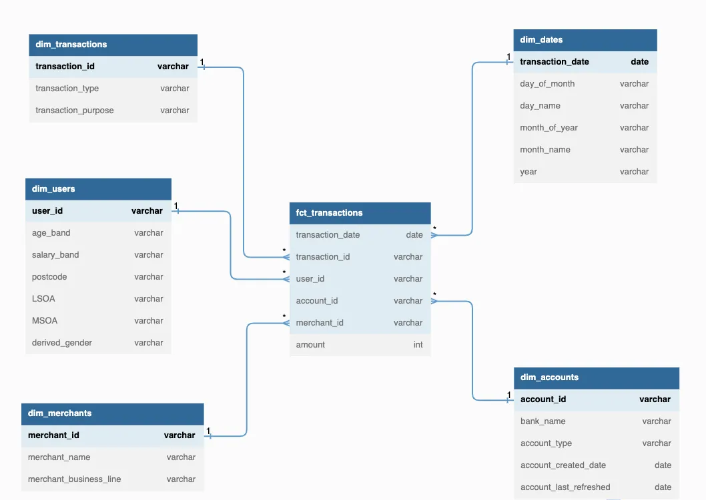

# Dimension Model Implementation

## Example: 01

I will discuss Star Schema and how to create one using credit-debit transaction
dataset in Snowflake data warehouse. This post is more suitable to those who are
new to Star Schema or Dimensional Modeling. But if you are a seasoned data modeler,
you are more than welcome to read this post and please leave your feedback in the
comment section.

So how do we build a Star Schema? As proposed by Kimball, there are 4 steps in
designing of a dimensional model.


1) **Select the business process**. The first step is to identify the business
   process that you want to model. Model the processes that are most significant
   or relevant to the business first.

2) **Declare the grain**. Grain refers to the level of detail of the information
   that you will store in the fact table. The grain should be at the most atomic
   or lowest level possible. For example, A line item on a grocery receipt. The
   grocery owner might want to ask questions such as “what are the items that
   sold the best during the day in our grocery store?”, and to answer this question
   we need to dig into line-item level instead of the order-level.

3) **Identify the dimensions**. You can identify the dimensions by looking at the
   descriptive information or attributes that exist in your business process and
   provide context to your measurable events. For example: payment method, customers,
   locations, etc.

4) **Identify the facts**. Facts are the quantitative measures in your business
   process that are always in numeric. For example: price, minutes, speed, etc.
   You should identify/select the measures that are true to your selected grain.

The dataset has 23 columns but for simplicity, I will exclude 4 irrelevant columns.
Here are the descriptions of the columns.

| Columns                | Descriptions                                                                                                                       |
|------------------------|------------------------------------------------------------------------------------------------------------------------------------|
| TRANSACTION_REFERENCE  | The transaction identifier for each transaction made by consumer                                                                   |
| USER_REFERENCE         | The user identifier of the consumer                                                                                                |
| AGE_BAND               | The consumer age range                                                                                                             |
| SALARY_BAND            | The consumer salary range.                                                                                                         |
| POSTCODE               | The postcode of where the consumer lives.                                                                                          |
| LSOA                   | Geographical hierarchy: small areas that has similar population size (average of approximately 1,500 residents or 650 households). |
| MSOA                   | Geographical hierarchy: medium areas where the minimum population size is 5000 (average of 7200).                                  |
| DERIVED_GENDER         | The consumer gender identity.                                                                                                      |
| TRANSACTION_DATE       | The transaction date made by the consumer.                                                                                         |
| ACCOUNT_REFERENCE      | The consumer bank account identifier.                                                                                              |
| PROVIDER_GROUP_NAME    | The consumer's bank for executing his/her transactions.                                                                            |
| ACCOUNT_TYPE           | The account type: current, savings, etc.                                                                                           |
| CREDIT_DEBIT           | Type of transaction made by consumer: debit or credit.                                                                             |
| AMOUNT                 | The amount of transaction.                                                                                                         |
| AUTO_PURPOSE_TAG_NAME  | The transaction purpose.                                                                                                           |
| MERCHANT_NAME          | The merchant's name.                                                                                                               |
| MERCHANT_BUSINESS_LINE | The merchant's business category.                                                                                                  |
| ACCOUNT_CREATED_DATE   | The date of when the account first created.                                                                                        |
| ACCOUNT_LAST_REFRESHED | The date of when the account last updated.                                                                                         |

### DIM_USERS

DIM_USERS will store users’ demographic information such as user id, age, salary,
gender and address.

```sql
CREATE OR REPLACE TABLE analytics.marts_credit_debit_transaction.dim_users AS (
    SELECT
        DISTINCT user_reference AS user_id,
        age_band,
        salary_band,
        postcode,
        LSOA,
        MSOA,
        derived_gender AS gender
    FROM raw_credit_debit_transaction.public_listing.transactions
);
```

### DIM_ACCOUNTS

DIM_ACCOUNTS stores account level attributes such as account id, bank name and
account type.

```sql
CREATE OR REPLACE TABLE analytics.marts_credit_debit_transaction.dim_accounts AS (
    SELECT
        DISTINCT account_reference AS account_id,
        provider_group_name AS bank_name,
        account_type,
        account_created_date,
        account_last_refreshed
    FROM raw_credit_debit_transaction.public_listing.transactions
);
```

### DIM_MERCHANTS

All information about the merchants such as merchant’s name and business category
will be stored in DIM_MERCHANTS. The dataset does not provide merchant identifier,
so in this case I have decided to create a **surrogate key** for merchant’s key
identifier.

```sql
CREATE OR REPLACE TABLE analytics.marts_credit_debit_transaction.dim_merchants AS (
    SELECT
        DISTINCT HASH(merchant_name, merchant_business_line)::VARCHAR AS merchant_id,
        merchant_name,
        merchant_business_line
    FROM raw_credit_debit_transaction.public_listing.transactions
);
```

### DIM_TRANSACTIONS

DIM_TRANSACTIONS stores information on transaction attributes such as transaction
type and purpose.

```sql
CREATE OR REPLACE TABLE analytics.marts_credit_debit_transaction.dim_transactions AS (
    SELECT
        transaction_reference AS transaction_id,
        credit_debit AS transaction_type,
        auto_purpose_tag_name AS transaction_purpose
    FROM raw_credit_debit_transaction.public_listing.transactions
);
```

### DIM_DATES

I decided to create a data dimension that stores all date related parsed values
such as day of the month, day name, month of the year, month name, etc. This will
be handy when we need to generate time based reports.

```sql
CREATE OR REPLACE TABLE analytics.marts_credit_debit_transaction.dim_dates AS (
    SELECT
        DISTINCT transaction_date,
        DAY(transaction_date)::VARCHAR as day_of_month,
        DAYNAME(transaction_date) as day_name,
        MONTH(transaction_date)::VARCHAR as month_of_year,
        MONTHNAME(transaction_date) as month_name,
        YEAR(transaction_date)::VARCHAR as year
    FROM raw_credit_debit_transaction.public_listing.transactions
);
```

### FCT_TRANSACTIONS

FCT_TRANSACTIONS will store the numeric information (transaction amount) and
foreign keys that connect it to the dimension tables. To note, I also add transaction
date column as a way to connect the FCT_TRANSACTIONS to DIM_DATES table.
A better approach is to use surrogate key to generate date identifier but that is
outside the scope of this post.

```sql
CREATE OR REPLACE TABLE analytics.marts_credit_debit_transaction.fct_transactions AS (
    SELECT
        transaction_date AS transaction_date,
        transaction_reference AS transaction_id,
        user_reference AS user_id,
        account_reference AS account_id,
        HASH(merchant_name, merchant_business_line)::VARCHAR AS merchant_id,
        amount::NUMBER as amount
    FROM raw_credit_debit_transaction.public_listing.transactions
);
```



## References

- https://danischnider.wordpress.com/2022/11/10/star-schema-design-in-oracle-fundamentals/
- https://blog.devgenius.io/implementing-star-schema-in-snowflake-data-warehouse-1f890cdda952
