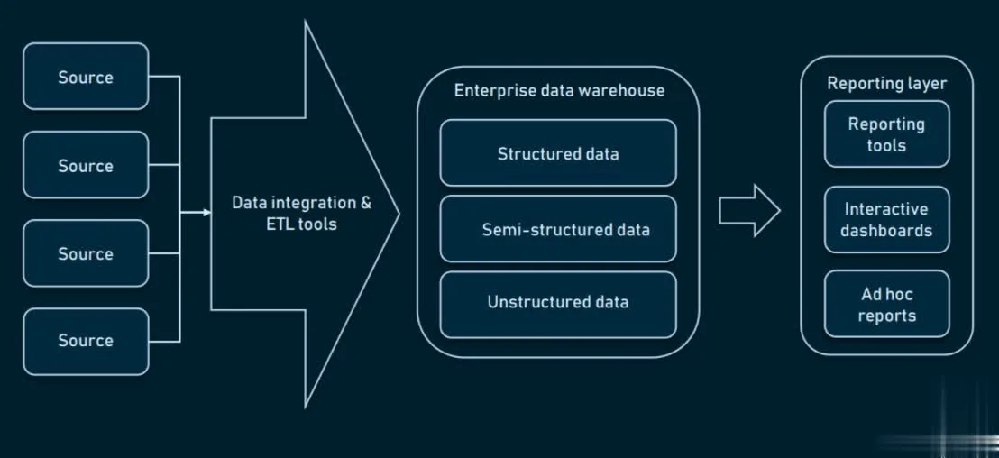

# Data Warehouse

**Data Warehouse** (DW or DWH) is a centralized repository or digital storage system
that integrates and stores data from various sources within an organization. It
is designed to support business intelligence (BI) activities such as reporting,
data analysis, and decision-making.

Data warehouses use a process called Extract, Transform, Load (ETL) to extract
data from different sources, transform it into a consistent format, and load it
into the warehouse. The data is typically organized into subject areas, such as
sales, customer, or product, to facilitate analysis and reporting.

Data warehouses are optimized for querying and analysis, and they often support
advanced analytics techniques such as data mining and machine learning. They also
support historical data storage, which allows analysts to track trends and identify
patterns over time.

Overall, a data warehouse is a critical component of a **data management** strategy
and provides a foundation for **data-driven** decision-making.

A data warehouse is a centralized repository of integrated data from one or more
sources that supports business intelligence and analytics activities. A data warehouse
enables users to query, analyze, and report on data from different perspectives
and levels of detail. A data warehouse also ensures data quality, consistency,
and accuracy by applying standard rules and transformations during the data integration
process

## Types of Data Warehouse

There are three main types of data warehouses:

- Enterprise Data Warehouse (EDW)
- Operational Data Store (ODS)
- Data Mart

Overall, the type of data warehouse an organization chooses depends on its specific
needs and requirements. Some organizations may require a centralized, enterprise-wide
data warehouse, while others may benefit from a more focused data mart or an operational
data store that supports real-time decision-making.

### Enterprise Data Warehouse

**Enterprise Data Warehouse** (EDW) is a centralized warehouse that provides decision
support service across the enterprise. It offers a unified approach for organizing
and representing data. It also provides the ability to classify data according
to the subject and give access according to those divisions.

EDWs are usually a collection of databases that offer a unified approach for organizing
data and classifying data according to subject.

EDW can be defined as a Database or a collection of Databases used to centralize
an enterprise's historical business data. These data sources could be the Databases
of various Enterprise Resource Planning (ERP) systems, Customer Relationship Management
(CRM) systems, and other forms of Online Transactional Processing (OLTP) systems.

Enterprise Data Warehouse is the most preferred form of data storage today due to
its ability to scale storage requirements up or down as per the business
and data requirements. This means that an Enterprise Data Warehouse is capable
of providing unlimited storage to any enterprise

This type of data warehouse is the most common and serves as a centralized repository
for all of an organization's data. An EDW typically integrates data from various
sources across the entire enterprise and is designed to support the reporting and
analytics needs of multiple departments.

#### Enterprise Data Warehouse Architecture

The various possible architectures an Enterprise Data Warehouse can incorporate
are as follows:

1) **One-tier Architecture**: \
   This is considered to be one of the most primitive forms of Enterprise Data Warehouse (EDW)
   architectures. In this architecture, the Reporting Tools are connected directly
   to the Data Warehouse. Although this architecture is easy to set up and implement,
   it causes various issues for large datasets. Most organizations today have hundreds
   of Gigabytes of data. This means that to perform any query, the Reporting Tool
   would have to go through all that data which is a time taking process.
   Going through the large dataset for each query would result in low performance.

   Hence, the One-tier Enterprise Data Warehouse (EDW) Architecture is only suitable
   for organizations with small datasets.

   

2) **Two-tier Architecture**: \
   The Two-tier Architecture implements a Data Mart Layer between the Reporting Layer
   and the Enterprise Data Warehouse (EDW). Data Marts can be seen as smaller Databases
   that contain domain-specific information, which is only a part of the data stored
   in the Data Warehouse. All information stored in the Data Warehouse is split
   into various Data Marts based on the domain of information.

   The Reporting Tools are then connected to this Data Mart Layer. Because a single
   Data Mart consists of only a small part of the data in the Data Warehouse,
   performing queries on it would require much less time than it would on a Data Warehouse.
   A Two-tier Enterprise Data Warehouse (EDW) is considered to be more suitable
   for real-life scenarios.

   

3) **Three-tier Architecture**: \
   A Three-tier Architecture further implements an OLAP Layer between the Data Mart
   Layer and the Reporting Layer. The OLAP Layer consists of OLAP Cubes which are
   used to store data in a multidimensional form allowing faster analysis to be
   performed on the data.

   

#### Types of Enterprise Data Warehouses

1) **On-premise Data Warehouse** \
   Usage of an On-premise Data Warehouse means that the organization is responsible
   for purchasing, setting up, and maintaining the software and hardware required
   to manage the Data Warehouse.

   An on-premise data warehouse is a data warehouse that is installed and maintained
   on the physical servers or hardware of an organization. An on-premise data warehouse
   offers more control and security over the data and infrastructure, but it also
   requires more upfront investment and ongoing maintenance costs. An on-premise
   data warehouse may also face limitations in scalability, flexibility, and innovation.

   The advantages of using an On-premise Data Warehouse are as follows:

   - **Control**: The organization chooses the kind of hardware and software that will
     be used to set up the Data Warehouse.

   - **Speed**: The Data Warehouse is On-premise and will hence have little to no
     network latency.

   - **Security**: Only someone who is connected to the organization's network
     can access the Data Warehouse.

   The disadvantage of using an On-premise Data Warehouse are as follows:

   - **High Cost** of Investment: The Data Warehouse would require high investment
     to purchase and set up the initial software and hardware. Even then, as the
     volume of data with the organization increases, more hardware will have to
     be purchased to accommodate that data.

   - **Inability** to Scale Resources: On-premise Data Warehouses cannot scale resources
     up or down as per the requirements due to limited hardware.

   > **Data warehouse appliance**: \
   > A data warehouse appliance is a pre-integrated bundle of hardware and software—CPUs,
   > storage, operating system, and data warehouse software—that a business can connect
   > to its network and start using as-is. A data warehouse appliance sits somewhere between
   > cloud and on-premises implementations in terms of upfront cost, speed of deployment,
   > ease of scalability, and management control.

2) **Cloud-based Data Warehouse** \
   Cloud-based Data Warehousing is a service provided by an organization that various
   other organizations can use to fulfill their Data Warehousing needs. This means
   that the organization does not have to set up its own On-premise hardware and
   software but only pay for the Cloud Data Warehousing Solution.

   A cloud-based data warehouse is a data warehouse that is hosted and managed by
   a third-party cloud service provider. A cloud-based data warehouse offers more
   scalability, flexibility, and cost-efficiency over the data and infrastructure,
   but it also requires more trust and compliance with the cloud service provider.
   A cloud-based data warehouse can also leverage other cloud services and tools,
   such as machine learning, data lake, and streaming analytics.

   The advantages of using Cloud-based Data Warehouse are as follows:

   - **Low Cost of Investment**: Organizations do not have to invest large amounts of
     money to purchase and set up hardware and software requirements of the Data Warehouse.

   - **Scalability**: Storage and Compute capabilities of your Data Warehouse can
     scale up or down as per your business and data requirements automatically
     and hence, you only have to pay for what you use.

   The disadvantages of using Cloud-based Data Warehouses are as follows:

   - **Security**: Since the Cloud-based Data Warehouses store data of many organizations
     that can be accessed over the Internet, businesses feel some level of concern
     over the storage of confidential data.

   - **Accessibility**: Cloud-based Data Warehouses cannot be accessed in-case there
     is no internet access.

   - **Latency**: Depending on where the Data Warehouse is located, businesses might
     notice some network latency while accessing their data.

   Example,

   - Amazon Redshift
   - Snowflake
   - Google BigQuery
   - Azure Synapse Analytic

3) **Virtual-based Data Warehouse** \
   A virtual data warehouse is a type of data warehouse that is built on top of
   existing data sources, such as transactional databases or cloud storage services.
   It is typically built using a virtualization layer, which allows users to query
   and analyze data from multiple sources as if it were all stored in a single location.
   Popular software tools for building and managing virtual data warehouses include
   Denodo, TIBCO Data Virtualization, and Actifio.

### Operational Data Store

**Operational Data Store** (ODS), which is also called ODS, are nothing but data store required
when neither Data warehouse nor OLTP systems support organizations reporting needs.
In ODS, Data warehouse is refreshed in real time.
Hence, it is widely preferred for routine activities like storing records of the Employees.

In the ODS, the data is cleaned to avoid junk or repetition, validated for redundancy
and made sure for the data to be obeying the systematic rules set by the business/project.
This is the location where all the data used in recent functions are held on,
which is then relocated to the data warehouse's permanent storage systems or
the data warehouse's Archives.

An ODS is a type of data warehouse that stores real-time or near-real-time data
from transactional systems. It is designed to support operational reporting and
analysis, and it typically uses a bottom-up approach to design, which means that
the data model is based on specific business requirements.

This is a type of data warehouse that stores operational data from various sources
and provides near real-time reporting and analysis. It is designed to handle frequent
updates and queries from operational systems. It also serves as a source of data
for the EDW or data marts.

#### Implementation of Operational Data Stores

Any number of data sources can be integrated to create an Operational Data Store.
For an integrated data source system to be qualified as an operational Data Store,
it should comply with the below principles:

1. **Subject-Oriented**: \
   The Operational Data Store should be designed and built based on explicit functional
   requirements presented by the business, for a certain specific area under discussion.

2. **Integrated**: \
   All the data from multiple data sources of the given application undergoes a
   set of ETL process flow, which includes cleaning the junk data to reduce redundancy,
   transforming all the data into a single format and loading the entire set of
   records onto the ODS, based on the business/ client’s policies for data control
   and regularity.

3. **Current/Up-To-Date**: \
   The data in the ODS is expected to be up-to-date, in order to cover all the current
   functions of application tied to the Data Warehouse and to show the existing
   status of the data from every source linked to the DW system.

4. **Granularity in the Details**: \
   It is primarily used to support the operational business functions/ requirements,
   and so it is important for the rules to be implemented in a way that it maintains
   the comprehensive level of detailing the business entails for those functions
   to be executed.

#### Advantages of Operational Data Stores

It is a beneficial database in comparison to a data warehouse system as a whole.
Below are the justification for its advantageous nature:

- An ODS provides access to only the current, finely crumbled, non-aggregated,
  less complicated data, which can be queried in a well-fitted approach without
  using the operational systems.

- When the Reporting & Analysis tools need data that are closer to real-time operations,
  it can be queried from the Operational Data Store, as and when it is received
  from the respective source systems, instead of opting for more prolonging conversion
  and loading operations from the other database sources in the data warehouse systems.

- ODS is a secure option as it does not contain all the historical data and operations,
  which makes it resilient for any cyber-attacks or hacking of data privacy.

- It is a practically feasible structural design option when bearing in mind the
  complex requirements provided by the business, in order to generate input for
  analysis and reporting processes that leads to business decision-making.

- ODS facilitates considerably less total time for turnaround when in trouble,
  like the environment failure or when a database needs a restart, which implicates
  less stress on the business or the stack holders of the application.

- In order to fetch data from an ODS, querying need not be complex or with multi-level
  joins and conditional Simple queries will be sufficient as it holds moderately
  detailed operational data.

### Data Mart

**Data Mart** is a subset of the data warehouse. It specially designed for a particular
line of business, such as sales, finance, sales or finance.
In an independent data mart, data can collect directly from sources.

Data Mart is also a storage component used to store data of a specific function
or part related to a company by an individual authority, so data marts are flexible
and small.

A data mart is a subset of an EDW that is designed to serve a specific business
unit or department. It is optimized for querying and reporting on a specific subject
area, such as sales or marketing, and it is typically easier and faster to implement
than an EDW.

This is a subset of data warehouse that is designed to serve a specific department,
function, or business unit. It contains a limited amount of data that is relevant
to a particular domain or topic. It can be independent or dependent on the EDW or
ODS.

#### Types of Data Mart

There are typically three types:

1. **Dependent Data Warehouse**: \
   A dependent data mart is purely from the data warehouse and all the grouped
   dependent will form an enterprise data warehouse. It is purely a subset of
   data warehouse since it is created from central DW. Since clean and summarised
   data is already present in the central data warehouse ETT process or Extract
   Transform and Transportation is simplified. We just need to identify the particular
   subset here and perform ETT on top of it. These data marts are typically
   built to achieve better availability and a lot of improved performance with
   better control and efficiency.

2. **Independent Data Mart**: \
   This is not created from the central data warehouse and the source to this can
   be different. Since data is from other than the central DW ETT process is a
   bit different.
   Most of the independent data mart is used by a smaller group of organizations
   and the source to this is also limited. The Independent data mart is generally
   created when we need to get a solution in a relatively shorter time-bound.

3. **Hybrid Data Mart**: \
   Hybrid data mart will allow you to group the data from all other sources other
   than the central data warehouse DW.
   When we deal with ad hoc integration this will greatly benefit the top work on
   all the products that got added to the organizations externally.

#### Features of Data Mart

- Since the source of the data is concentrated to subject the user response time
  is enhanced by using it.

- For frequently required data, using data marts will be beneficial since it is
  subset to central DW and hence data size will be lesser.

- Also since the volume of the data is limited the processing time will be quite
  reduced compared to central DWS.

- These are basically agile and can accommodate the changes in the model quite
  quickly and efficiently compared to the data warehouse.

- Datamart requires a single subject expert to handle, in contrast to warehouse
  data, the expertise we require in multiple subject warehouses. Because of this,
  we say that data mart is more agile.

- We can segregate access categories to a low level with partitioned data and with
  data mart, it is a lot easy.

- Infrastructure dependency is quite limited and data can be stored in on different
  hardware platforms upon segmentation.

#### Steps to Implement Data Mart

1. **Designing** \
   This will be the first step in the implementation where all the required tasks
   and sources identified to gather technical and business information. Later the
   logical plan is implemented and upon review, this will be converted to a physical
   plan. Also, the logical and physical structure of the data is decided here like
   how to partition the data and field of partition like date or any other file.

2. **Construction** \
   This is the second phase of implementation where physical databases were generated
   with the help of RDBMS, which was determined as part of the design process and
   logical structures. All the objects like schema, indexes, tables, views, etc
   are created.

3. **Populating** \
   This is the third phase and here data is populated in it upon sourcing the data. All the required transformations are implemented prior to populating the data on it.

4. **Accessing** \
   This is the next step of implementation where we will use the populated data to query upon for creating reports. End-user use this step to understand the data using queries.

5. **Managing** \
   This is the last stage of implementation of the data mart and here various tasks such as access management, system optimization, and tuning, managing and adding fresh data to the data mart and planing recovery scenarios to handle any failure cases are taken care of.

#### Benefits

- It is one of the best cost-effective alternatives to a data warehouse where you
  need to work on only a small segment of data.

- Segregation of data from sources will make data mart efficient as a specific
  group of people can work the data from a specific source instead of all using
  the data warehouse.

- Faster access to the data is possible by using data mart if we know on which
  subset we require to access.

- Datamart is lot easier to use so end-users can easily query on top of them.

- Coming to the implementation time data mart requires less time compared with
  the data warehouse since the data is segregated in groups.

- Historical data from a particular subject can be used for easy trend analysis.

## General stages of Data Warehouse

Earlier, organizations started relatively simple use of data warehousing. However,
over time, more sophisticated use of data warehousing begun.

The following are general stages of use of the data warehouse (DWH):

- **Offline Operational Database**: \
  In this stage, data is just copied from an operational system to another server.
  In this way, loading, processing, and reporting of the copied data do not impact
  the operational system's performance.

- **Offline Data Warehouse**: \
  Data in the Data Warehouse is regularly updated from the Operational Database.
  The data in Data Warehouse is mapped and transformed to meet the Data Warehouse
  objectives.

- **Real time Data Warehouse**: \
  In this stage, Data warehouses are updated whenever any transaction takes place
  in operational database. For example, Airline or railway booking system.

- **Integrated Data Warehouse**: \
  In this stage, Data Warehouses are updated continuously when the operational
  system performs a transaction. The Data Warehouse then generates transactions
  which are passed back to the operational system.

|                      | Enterprise Data Warehouse (EDW)                         | Operational Data Store (ODS)                         | Data Mart                                                       |
|----------------------|---------------------------------------------------------|------------------------------------------------------|-----------------------------------------------------------------|
| Purpose              | Serves the entire organization                          | Supports operational reporting                       | Serves a specific business unit/department                      |
| Data Integration     | Integrates data from multiple sources                   | Integrates real-time data from transactional systems | Integrates data from a specific subject area                    |
| Data Model           | Top-down approach to design                             | Bottom-up approach to design                         | Designed based on specific business requirements                |
| Complexity           | More complex and time-consuming to design and implement | Less complex and quicker to implement                | Less complex and quicker to implement                           |
| Query and Analysis   | Supports complex queries and analytics                  | Supports operational reporting and simple analysis   | Optimized for querying and reporting on a specific subject area |
| Data Volume          | Large volume of historical data                         | Real-time or near-real-time data                     | Smaller volume of data                                          |
| Users                | Business analysts, executives, data scientists          | Operational staff, business analysts                 | Business analysts, departmental staff                           |
| Cost                 | Higher cost due to complexity and scale                 | Lower cost due to simpler design and implementation  | Lower cost due to simpler design and implementation             |

| Criteria          | EDW                                                     | ODS                                                      | Data Mart                                              |
|-------------------|---------------------------------------------------------|----------------------------------------------------------|--------------------------------------------------------|
| Scope             | Enterprise-wide                                         | Operational                                              | Departmental or functional                             |
| Data sources      | Multiple internal and external sources                  | Multiple operational sources                             | EDW, ODS, or other sources                             |
| Data integration  | High degree of integration and standardization          | Moderate degree of integration and standardization       | Low degree of integration and standardization          |
| Data granularity  | Mixed levels of granularity                             | Low level of granularity (detailed)                      | High level of granularity (aggregated or summarized)   |
| Data currency     | Historical and current data                             | Near real-time or real-time data                         | Historical and current data                            |
| Data quality      | High quality (cleansed and validated)                   | Moderate quality (some cleansing and validation)         | High quality (cleansed and validated)                  |
| Data structure    | Relational or dimensional models                        | Relational models                                        | Dimensional models                                     |
| Data volume       | Very large (terabytes or petabytes)                     | Large (gigabytes or terabytes)                           | Small or medium (megabytes or gigabytes)               |
| Query performance | Moderate to high (depends on indexing and partitioning) | Low to moderate (depends on updates and concurrency)     | High (optimized for analysis)                          |
| Query complexity  | High (supports complex and ad-hoc queries)              | Low to moderate (supports simple and predefined queries) | Moderate to high (supports complex and ad-hoc queries) |
| Query frequency   | Low to moderate (periodic or on-demand)                 | High (continuous or near-continuous)                     | Moderate to high (periodic or on-demand)               |
| User types        | Analysts, managers, executives, data scientists, etc.   | Operational staff, managers, etc.                        | Analysts, managers, etc.                               |

---

## Components of Data Warehouse


- Data Sources: These are the various sources of data that are used to populate the data warehouse. They may include transactional databases, flat files, cloud-based applications, and other sources.
- ETL Tools: ETL (Extract, Transform, Load) tools are used to extract data from the various data sources, transform it into a consistent format, and load it into the data warehouse.
- Data Warehouse Database: This is the main database that stores the integrated and transformed data. It is designed to support fast querying and analysis, and it may be optimized for specific types of queries and workloads.
- Metadata: Metadata is data about the data in the data warehouse. It describes the structure, meaning, and relationships between the different data elements and is used to facilitate querying and analysis.
- Business Intelligence (BI) Tools: BI tools are used to analyze and visualize the data in the data warehouse. They may include reporting tools, dashboarding tools, and data visualization tools.
- Data Governance: Data governance is the set of policies, procedures, and processes that are used to ensure the quality, security, and compliance of the data in the data warehouse.


- Source Systems: These are the systems that generate and store the data that will be integrated into the data warehouse. They can include transactional systems, operational databases, external data sources, and more.
- ETL (Extract, Transform, Load) Processes: ETL processes are used to extract data from the source systems, transform it into a consistent format, and load it into the data warehouse. ETL processes may also involve data cleansing, data integration, and data quality checks.
- Data Storage: The data warehouse stores the integrated and transformed data in a centralized repository. The data is typically organized into subject areas, such as sales, customer, or product.
- Metadata: Metadata provides information about the data in the data warehouse, such as its source, meaning, and structure. It is used to help users understand and navigate the data.
- Query and Analysis Tools: Query and analysis tools allow users to access and analyze the data in the data warehouse. They may include reporting tools, OLAP (Online Analytical Processing) tools, data mining tools, and more.
- Data Governance and Security: Data governance and security are critical components of a data warehouse. They ensure that the data in the warehouse is accurate, consistent, and secure. Data governance also involves establishing policies and procedures for managing the data warehouse and ensuring its ongoing effectiveness.

---

The components of a data warehouse are the building blocks that enable the data
warehousing process. They can be grouped into four main categories:

- Data sources: These are the original data repositories that provide data for the
  data warehouse. They can be internal or external, structured or unstructured,
  operational or historical. Examples of data sources are databases, files, applications,
  web services, sensors, etc.

  - Traditional relational databases, such as Oracle, SQL Server, and MySQL, are still commonly used as data sources.
  - Big data technologies, such as Hadoop, Spark, and NoSQL databases, are increasingly used to handle large volumes of data from a variety of sources, including social media, IoT devices, and machine-generated data.
  - Cloud-based data sources, such as Amazon S3, Google Cloud Storage, and Azure Blob Storage, are becoming more popular due to their scalability, flexibility, and cost-effectiveness.

- Data staging: This is the area where data is extracted, transformed, and loaded (ETL)
  from the data sources into a consistent and standardized format for the data warehouse.
  Data staging involves data cleansing, validation, integration, aggregation, and
  enrichment processes. Examples of data staging tools are Informatica, Talend,
  SSIS, etc.

  - ETL tools, such as Informatica PowerCenter, Talend, and IBM DataStage, are commonly used to automate the extraction, transformation, and loading of data into the data warehouse.
  - ELT (Extract, Load, Transform) tools, such as Microsoft Azure Data Factory and Google Cloud Dataflow, are also becoming popular as they can leverage the processing power of the data warehouse to perform transformations.


- Data storage: This is the central database where data is stored and managed for
  the data warehouse. Data storage can use relational or dimensional models, or
  a combination of both. Data storage also includes metadata (data about data)
  that describes the structure, meaning, and usage of the data warehouse.
  Examples of data storage systems are Oracle, SQL Server, Teradata, Snowflake, etc.

  - Data warehouses are typically built using traditional relational database management systems (RDBMS), such as Oracle, SQL Server, and IBM Db2.
  - Columnar databases, such as Amazon Redshift, Google BigQuery, and Snowflake, are becoming more popular due to their ability to handle large volumes of data and support faster query performance.
  - In-memory databases, such as SAP HANA and Oracle Exadata, are also gaining popularity as they can provide even faster query performance by storing data in memory.

- Metadata: Metadata is information about the data in the data warehouse, such as
  its origin, format, and meaning. It is used to help users understand and navigate
  the data.

  - Metadata management tools, such as Informatica Metadata Manager and IBM InfoSphere Information Governance Catalog, are commonly used to manage metadata in a data warehouse environment.
  - Data modeling tools, such as Erwin and SAP PowerDesigner, can also be used to document the data warehouse schema and relationships.

- Query and Reporting Tools: These tools allow users to query and analyze the data in the data warehouse. They may include dashboards, ad-hoc reporting tools, and data visualization tools.

  - Query and Reporting Tools: These tools allow users to query and analyze the data in the data warehouse. They may include dashboards, ad-hoc reporting tools, and data visualization tools.

  - Data Governance and Security: Data governance refers to the policies, procedures, and controls that ensure the accuracy, consistency, and security of the data in the data warehouse. Security measures are in place to protect the data from unauthorized access, theft, or loss.

- Data Governance and Security: Data governance refers to the policies, procedures, and controls that ensure the accuracy, consistency, and security of the data in the data warehouse. Security measures are in place to protect the data from unauthorized access, theft, or loss.

  - Query and Reporting Tools: These tools allow users to query and analyze the data in the data warehouse. They may include dashboards, ad-hoc reporting tools, and data visualization tools.

  - Data Governance and Security: Data governance refers to the policies, procedures, and controls that ensure the accuracy, consistency, and security of the data in the data warehouse. Security measures are in place to protect the data from unauthorized access, theft, or loss.

Keep in mind that these are just some of the most common types and tools used for
each component, and there are many other options available depending on the specific
needs and requirements of the organization.

These are the main components of a data warehouse that work together to enable data integration, management, and analysis.

There are mainly five Data Warehouse Components:

---

### Data Warehouse Database

The central database is the foundation of the data warehousing environment. This
database is implemented on the RDBMS technology. Although, this kind of implementation
is constrained by the fact that traditional RDBMS system is optimized for transactional
database processing and not for data warehousing. For instance, ad-hoc query,
multi-table joins, aggregates are resource intensive and slow down performance.

Hence, alternative approaches to Database are used as listed below-

- In a data warehouse, relational databases are deployed in parallel to allow for
  scalability. Parallel relational databases also allow shared memory or shared nothing
  model on various multiprocessor configurations or massively parallel processors.

- New index structures are used to bypass relational table scan and improve speed.

- Use of multidimensional database (MDDBs) to overcome any limitations which are
  placed because of the relational Data Warehouse Models.\
  **Example:** Essbase from Oracle.

### Sourcing, Acquisition, Clean-up and Transformation Tools (ETL)

The data sourcing, transformation, and migration tools are used for performing all
the conversions, summarizations, and all the changes needed to transform data into
a unified format in the data warehouse. They are also called Extract, Transform and Load (ETL) Tools.

Their functionality includes:

- Anonymize data as per regulatory stipulations.
- Eliminating unwanted data in operational databases from loading into Data warehouse.
- Search and replace common names and definitions for data arriving from different sources.
- Calculating summaries and derived data
- In case of missing data, populate them with defaults.
- De-duplicated repeated data arriving from multiple data sources.

These Extract, Transform, and Load tools may generate cron jobs, background jobs,
Cobol programs, shell scripts, etc. that regularly update data in data warehouse.
These tools are also helpful to maintain the Metadata.

These ETL Tools have to deal with challenges of Database & Data heterogeneity.

### Metadata

The name MetaData suggests some high-level technological Data Warehousing Concepts.
However, it is quite simple. Metadata is data about data which defines the data warehouse.
It is used for building, maintaining and managing the data warehouse.

In the Data Warehouse Architecture, meta-data plays an important role as it specifies
the source, usage, values, and features of data warehouse data. It also defines
how data can be changed and processed. It is closely connected to the data warehouse.

For example, a line in sales database may contain:

```text
4030 KJ732 299.90
```

This is a meaningless data until we consult the Meta that tell us it was

- Model number: 4030
- Sales Agent ID: KJ732
- Total sales amount of $299.90

Therefore, MetaData are essential ingredients in the transformation of data into knowledge.

Metadata helps to answer the following questions

- What tables, attributes, and keys does the Data Warehouse contain?
- Where did the data come from?
- How many times do data get reloaded?
- What transformations were applied with cleansing?

Metadata can be classified into following categories:

- **Technical MetaData**: \
  This kind of Metadata contains information about warehouse which is used by
  Data warehouse designers and administrators.

- **Business MetaData**: \
  This kind of Metadata contains detail that gives end-users a way easy to understand
  information stored in the data warehouse.

### Access Tools

One of the primary objects of data warehousing is to provide information to businesses to make strategic decisions. Query tools allow users to interact with the data warehouse system.

These tools fall into four different categories:

1) Query and reporting tools \
    Query and reporting tools can be further divided into

    - **Reporting tools**: \
      Reporting tools can be further divided into production reporting tools and
      desktop report writer.

      1) Report writers: This kind of reporting tool are tools designed for end-users
         for their analysis.

      2) Production reporting: This kind of tools allows organizations to generate
         regular operational reports. It also supports high volume batch jobs like
         printing and calculating. Some popular reporting tools are Brio,
         Business Objects, Oracle, PowerSoft, SAS Institute.

    - **Managed query tools**: \
      This kind of access tools helps end users to resolve snags in database and
      SQL and database structure by inserting meta-layer between users and database.

2) Application Development tools

    Sometimes built-in graphical and analytical tools do not satisfy the analytical
    needs of an organization. In such cases, custom reports are developed using
    Application development tools.

3) Data mining tools

    Data mining is a process of discovering meaningful new correlation, pattens,
    and trends by mining large amount data. [Data mining tools](https://www.guru99.com/best-data-mining-tools.html) are used to make
    this process automatic.

4) OLAP tools

    These tools are based on concepts of a multidimensional database. It allows users to analyse the data using elaborate and complex multidimensional views.

### Data warehouse Bus Architecture

Data warehouse Bus determines the flow of data in your warehouse. The data flow
in a data warehouse can be categorized as Inflow, Upflow, Downflow, Outflow and
Meta flow.

While designing a Data Bus, one needs to consider the shared dimensions, facts
across data marts.

**Data Marts**

A data mart is an access layer which is used to get data out to the users. It is
presented as an option for large size data warehouse as it takes less time and money
to build. However, there is no standard definition of a data mart is differing
from person to person.

In a simple word Data mart is a subsidiary of a data warehouse. The data mart is
used for partition of data which is created for the specific group of users.

Data marts could be created in the same database as the Data warehouse or a physically
separate Database.

### Data Warehouse Reporting Layer

Allows the end-users to access the BI interface.

"Act as a dashboard for data virtualization"

## Data warehouse architecture

Generally speaking, data warehouses have a three-tier architecture,
which consists of a:

### Bottom tier (Data Layer)

The bottom tier consists of the Data Repository, usually a relational database system,
which collects, cleanses, and transforms data from various data sources through
a process known as Extract, Transform, and Load (`ETL`) or a process known as Extract,
Load, and Transform (`ELT`).

As a preliminary process, before the data is loaded into the repository,
all the data relevant and required are identified from several sources of the system.
These data are then cleaned up, to avoid repeating or junk data from its current
storage units. The next step is to transform all these data into a single format
of storage. The final step of ETL is to Load the data on the repository.

ETL Layer, This layer is responsible for storing the data in the data warehouse. The data is
typically stored in a relational database management system (RDBMS), which is optimized
for querying and reporting on large datasets. In some cases, data may also be stored
in columnar or in-memory databases for improved performance.

Few commonly used ETL tools are:

- Informatica
- Microsoft SSIS
- Snaplogic
- Confluent
- Apache Kafka
- Alooma
- Ab Initio
- IBM Infosphere

### Middle tier (Semantics Layer)

The middle tier consists of an `OLAP` (Online Analytical Processing) servers
which enables fast query speeds. The Data Warehouse can have more than one OLAP server,
and it can have more than one type of OLAP server model as well, which depends on
the volume of the data to be processed and the type of data held in the bottom tier.

ETL Layer. This layer is responsible for extracting, transforming, and loading the data from
various sources into the data warehouse. This is typically done using ETL (Extract,
Transform, Load) tools, which automate the process of moving and converting data.

Three types of OLAP models can be used in this tier, which are known as

- **ROLAP**: \
  Relational online analytical processing is a model of online analytical processing
  which carries out an active multidimensional breakdown of data stored in a relational database,
  instead of redesigning a relational database into a multidimensional database.

  This is applied when the repository consists of only the relational database
  system in it.

- **MOLAP**: \
  Multidimensional online analytical processing is another model of online analytical
  processing that catalogs and comprises directories directly on its multidimensional
  database system.

  This is applied when the repository consists of only the multidimensional database
  system in it.

- **HOLAP**: \
  Hybrid online analytical processing is a hybrid of both relational and multidimensional
  online analytical processing models.

  When the repository contains both the relational database management system and
  the multidimensional database management system, HOLAP is the best solution for
  a smooth functional flow between the database systems. HOLAP allows storing data
  in both the relational and the multidimensional formats.

The type of OLAP model used is dependent on the type of database system that exists.

### Top tier (Analytics Layer)

The top tier is represented by some kind of front-end user interface or reporting
tool, which enables end users to conduct ad-hoc data analysis on their business data.
It holds various tools like query tools, analysis tools, reporting tools, and
[data mining tools](https://www.educba.com/data-mining-tool/).

Reporting Layer. This layer is responsible for presenting the data to end-users
in a format that is easy to understand and analyze. This layer includes tools for
querying, reporting, and visualization, which allow users to create custom reports
and dashboards based on the data in the data warehouse.

Below are the few commonly used Top Tier tools.

- IBM Cognos
- Microsoft BI Platform
- SAP Business Objects Web
- Pentaho
- Crystal Reports
- SAP BW
- SAS Business Intelligence

In addition to the three-tier architecture, some data warehouse architectures also
include a metadata layer, which provides information about the data in the data
warehouse, such as its origin, format, and meaning. The metadata layer can be used
to help users understand and navigate the data.

---

## Data Warehouse Design Methods

data warehouse design that can be applied within the framework of the design methods
discussed earlier. Here is a brief overview of how each of these approaches relates
to the design methods.

Overall, the choice of design approach will depend on the specific needs and circumstances
of the organization. A bottom-up approach may be more appropriate for organizations with
complex and varied data sources, while a top-down approach may be more appropriate
for organizations with well-defined business requirements. Hybrid design may be a
good choice for organizations that need a flexible and adaptable data warehouse
that can accommodate changing business requirements over time.

### Bottom-up design

Bottom-up design is an approach to data warehouse design that focuses on building
small, specialized data marts first and then integrating them into a larger data
warehouse. This approach is often used when there are different data sources
with varying levels of complexity, and it allows for a more incremental and flexible
approach to data warehouse development. Bottom-up design is often associated with
dimensional modeling and may use hybrid modeling techniques to integrate the different
data marts.

Example:

Dimensional Model (Ralph Kimball):
The Dimensional Model, also known as the Kimball model, is a bottom-up design approach
that emphasizes the importance of simplicity and ease of use. This model is designed
to support ad-hoc querying and analysis and is often used for data warehouse implementations
in smaller organizations. The Kimball model involves creating a denormalized data
model, which is optimized for querying and analysis, and building a star or snowflake
schema that supports specific business functions.

See more, [Dimension Model](dwh-dimension-model.md)

### Top-down design

Top-down design is an approach to data warehouse design that starts with a comprehensive
enterprise data model and then designs the data warehouse based on that model.
This approach is often used when there is a well-defined set of business requirements
and a clear understanding of the data sources and their relationships. Top-down design
is often associated with data vault modeling and may use hybrid modeling techniques
to accommodate the specific business requirements.

Example:

Third Normal Form (3NF) Model (Bill Inmon):
The 3NF Model, also known as the Inmon model, is a top-down design approach that
emphasizes the importance of a comprehensive enterprise data model. This model is
designed to support complex business processes and is often used for data warehouse
implementations in large organizations. The Inmon model involves creating a normalized
data model, which is then used to build data marts that support specific business
functions.

### Hybrid design

Hybrid design is an approach to data warehouse design that combines elements of
both bottom-up and top-down design. This approach recognizes that there may be benefits
to both approaches and seeks to find a balance between the two. Hybrid design may use
different modeling techniques for different parts of the data warehouse and may involve
a mix of top-down and bottom-up development. Hybrid design is often associated with agile
modeling and may use a variety of design methods to create a flexible and adaptable
data warehouse.

Example:

The Data Vault 2.0 Model is a hybrid design approach that combines elements of both
the Inmon and Kimball models. This model is designed to support flexibility, scalability,
and agility, and is often used for data warehouse implementations in organizations
that need to handle large amounts of complex and varied data. The Data Vault 2.0 model
involves creating a normalized data model that separates business entities and relationships
into three types of tables (Hub, Link, and Satellite), which can then be used to
build data marts that support specific business functions.

See more, [Data Vault Model](../data_model/dwh-data-vault-model.md)

### Summary

Overall, the choice of design method will depend on the specific needs and circumstances
of the organization. The Inmon model may be more appropriate for organizations with
complex and varied data sources and a focus on enterprise-wide integration. The
Kimball model may be more appropriate for organizations with a focus on ad-hoc
querying and analysis and a need for simplicity and ease of use. The Data Vault 2.0
model may be a good choice for organizations that need a flexible and scalable
data warehouse that can accommodate changing business requirements over time.

| Design Method | 3NF Model (Inmon)                                                                                                                        | Dimensional Model (Kimball)                                                                                                                 | Data Vault 2.0 Model                                                                                                                                       |
|---------------|------------------------------------------------------------------------------------------------------------------------------------------|---------------------------------------------------------------------------------------------------------------------------------------------|------------------------------------------------------------------------------------------------------------------------------------------------------------|
| Description   | Top-down design approach that emphasizes a comprehensive enterprise data model                                                           | Bottom-up design approach that emphasizes simplicity and ease of use                                                                        | Hybrid design approach that combines elements of the Inmon and Kimball models                                                                              |
| Strengths     | Supports complex business processes, supports enterprise-wide integration, allows for data reuse                                         | Supports ad-hoc querying and analysis, easy to understand and use, can be quickly implemented                                               | Supports flexibility, scalability, and agility, accommodates changing business requirements, allows for data reuse                                         |
| Weaknesses    | Can be time-consuming to design and build, may not be well-suited for ad-hoc querying and analysis                                       | May not be well-suited for complex business processes or enterprise-wide integration, may not support as much data reuse as the Inmon model | Can be more complex to design and build than the Inmon or Kimball models, may not be as well-suited for smaller organizations or simple business processes |
| Focus         | Enterprise-wide integration                                                                                                              | Ad-hoc querying and analysis                                                                                                                | Ad-hoc querying and analysis                                                                                                                               |
| Advantages    | Comprehensive data model supports complex business processes; Data is normalized, reducing data redundancy and ensuring data consistency | Easy to understand and use for ad-hoc querying and analysis; Denormalized data model optimized for querying and analysis                    | Separates business entities and relationships into three types of tables, providing flexibility and scalability; Supports complex and varied data sources  |


As a Data Engineer, the choice of design method will depend on the specific needs
and circumstances of your organization. If you work in a large organization with
complex and varied data sources and a focus on enterprise-wide integration, the
3NF Model (Inmon) may be a good choice. If your organization has a focus on ad-hoc
querying and analysis and a need for simplicity and ease of use, the Dimensional Model
(Kimball) may be a better fit. If your organization needs a flexible and scalable
data warehouse that can accommodate changing business requirements over time,
the Data Vault 2.0 model may be the best option.

---

## Data Warehouse Software

data warehouse software is evolving to meet the challenges and opportunities of
the digital era. Some trends and features that are shaping the data warehouse
landscape are:

- Data warehouse on the cloud: Cloud-based data warehouse solutions offer scalability,
  flexibility, and cost-effectiveness for storing and processing large volumes of
  data. Cloud data warehouses can also leverage the benefits of cloud services such
  as artificial intelligence, machine learning, and data integration tools. Some
  examples of cloud data warehouse software are Snowflake, Amazon Redshift,
  Google BigQuery, and Microsoft Azure Synapse Analytics1.

- Data warehouse automation: Data warehouse automation is the process of automating
  the tasks involved in designing, building, and maintaining a data warehouse.
  Data warehouse automation software can help reduce the complexity, time, and
  cost of data warehouse projects by generating code, documentation, testing, and
  deployment scripts. Data warehouse automation software can also enable agile and
  iterative development cycles, as well as continuous integration and delivery of
  data warehouse changes2.

- Data warehouse federation: Data warehouse federation is the technique of creating
  a virtual data warehouse that integrates data from multiple sources without physically
  moving or copying the data. Data warehouse federation software can provide a unified
  view of data across different platforms, locations, and formats. Data warehouse
  federation software can also enable real-time or near-real-time access to data,
  as well as query optimization and caching mechanisms3.

## References

- https://www.guru99.com/data-warehousing.html
- https://www.guru99.com/data-warehouse-architecture.html#8
- https://www.ibm.com/topics/data-warehouse/
- https://www.analyticsvidhya.com/blog/2022/06/a-complete-guide-to-data-warehousing-in-2022/
