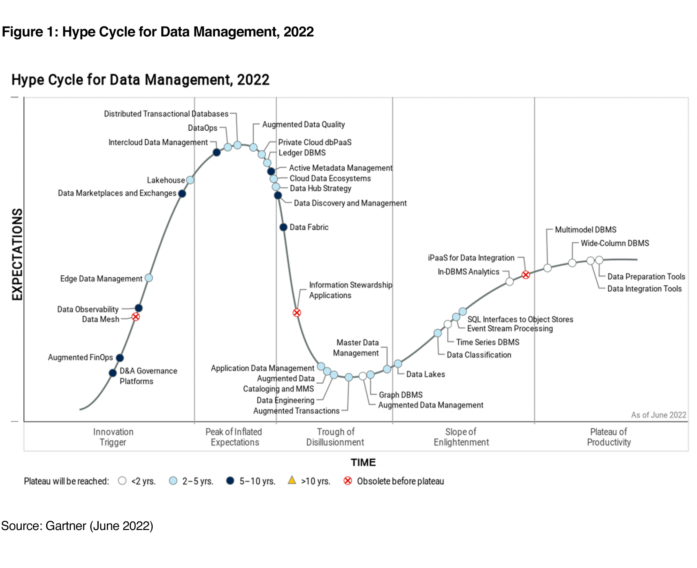

# Data Knowledge

This is the main topic when we work in **Data Engineer** role. It the important
knowledge the make you differ with software or backend developer.

When you raise a Question like, _what I should to know about data?_, it is so difficult
to explain all data knowledge but the answers will represent about how to manage your
data that serve to who want to use.

Hence, Data Engineer is who know how to manage data for any requirement from data
user.

**TOPICS**:

- [Data Management]
  - [Data Warehouse](data_warehouse/README.md)
    - [3RD Normal Model]
    - [Dimension Data Model]
    - [Data Vault Model]
  - [Data Governance]
- [Data Ingestion]
- [Data Orchestration]
- [Data Exchange]
- [Data Mesh]

# Overviews about Data

**Table of Contents**:

- [Data Management](#data-management)

## Data Management

**Data management** is the effective practice of collecting, storing, protecting, delivering,
and processing data. In business, data is usually associated with customers, prospects,
employees, deals, competitors, and finances. When an organization effectively manages data,
they **gain** insights that **drive** business decisions.

### Types of data management

The scope of a data management discipline is quite broad, and a strong data management
strategy typically implements the following components to streamline their strategy
and operations throughout an organization

So, whether you’re researching big data or master data, you'll use many types of
data management.

- **Data processing**: \
  Within this stage of the [data management lifecycle](https://www.ibm.com/topics/data-lifecycle-management),
  raw data is ingested from a range of data sources, such as web APIs, mobile apps,
  Internet of Things (IoT) devices, forms, surveys, and more. It is, then, usually
  processed or loaded, via data integration techniques, such as [extract, transform,
  load (ETL)](https://www.ibm.com/topics/etl) or [extract, load, transform (ELT)](https://www.ibm.com/topics/elt).
  While ETL has historically been the standard method to integrate and organize
  data across different datasets, ELT has been growing in popularity with the emergence
  of cloud data platforms and the increasing demand for real-time data. Independently
  of the [data integration](https://www.ibm.com/analytics/data-integration) technique
  used, the data is usually filtered, merged,
  or aggregated during the data processing stage to meet the requirements for its
  intended purpose, which can range from a business intelligence dashboard to a
  predictive machine learning algorithm.

- **Data storage**: \
  While data can be stored before or after data processing, the type of data and
  purpose of it will usually dictate the storage repository that is leveraged.
  For example, data warehousing requires a defined schema to meet specific data
  analytics requirements for data outputs, such as dashboards, [data visualizations],
  and other [business intelligence] tasks. These data requirements are usually directed
  and documented by business users in partnership with data engineers, who will
  ultimately execute against the defined [data model]. The underlying structure of
  a [data warehouse] is typically organized as a relational system (i.e. in a structured data format),
  sourcing data from transactional databases. However, other storage systems,
  such as [data lakes], incorporate data from both relational and [non-relational systems],
  becoming a sandbox for innovative data projects. Data lakes benefit data scientists
  in particular, as they allow them to incorporate both structured and unstructured
  data into their data science projects.

- **Data governance**: \
  Data governance is a set of standards and business processes which ensure that
  data assets are leveraged effectively within an organization. This generally
  includes processes around data quality, data access, usability, and data security.
  For instance, data governance councils tend align on taxonomies to ensure that
  metadata is added consistently across various data sources. This taxonomy should
  also be further documented via a data catalog to make data more accessible to users,
  facilitating data democratization across organizations. Data governance teams
  also help to define roles and responsibilities to ensure that data access is provided
  appropriately; this is particularly important to maintain data privacy.

- **Data security**: \
  Data security sets guardrails in place to protect digital information from unauthorized
  access, corruption, or theft. As digital technology becomes an increasing part
  of our lives, more scrutiny is placed upon the security practices of modern businesses
  to ensure that customer data is protected from cybercriminals or disaster recovery
  incidents. While data loss can be devastating to any business, data breaches,
  in particular, can reap costly consequences from both a financial and brand standpoint.
  Data security teams can better secure their data by leveraging encryption and
  data masking within their data security strategy.

### Data management systems and components

#### Database management systems (DBMS)

#### Data warehouses and lakes

#### Data integration

#### Data governance, security, and compliance

#### Business intelligence and analytics

### Hype Cycle for Data Management

Gartner, Hype Cycle for Data Management, 2022,
Donald Feinberg, Philip Russom, Nina Showell, 30 June 2022

### Data Management Processes

### Benefits of Investing in Data Management

Data management can make your company more effective and responsive to your customers.
Stellar data can help your team limit errors and build trust. It also gives your
business better data for decision-making.

- Building a Secure and Reliable System
- Understanding Your Most Profitable Customers
- Evaluating Customer Acquisition Channels
- Making Your Business Processes More Transparent
- Seeing Your Full Buying Cycle
- Helping Your Business Scale

### Data Management Strategy

A data management strategy typically includes the following components:

#### Data Governance
This includes policies, procedures, and standards that ensure the appropriate use,
management, and protection of data throughout its lifecycle. It also involves
establishing roles and responsibilities for data management, as well as ensuring
compliance with legal and regulatory requirements.

#### Data Architecture

This involves designing a data model that supports the organization's needs and
provides a framework for data storage, retrieval, and processing. It includes
selecting appropriate data storage technologies, defining data integration and
migration strategies, and establishing data security and privacy protocols.

#### Data Quality

This involves ensuring that data is accurate, complete, and consistent. It includes
defining data quality metrics, establishing data quality rules, and implementing
data profiling and cleansing tools and techniques.

#### Data Integration

This involves consolidating data from multiple sources into a single, unified view
of the data. It includes selecting appropriate data integration tools, defining
data mapping and transformation rules, and establishing data synchronization and
replication protocols.

#### Data Warehousing

This involves designing and implementing a data warehouse or data lake that provides
a centralized repository for storing and analyzing large volumes of data. It
includes selecting appropriate data warehousing technologies, designing a data
warehouse schema, and defining data loading and transformation processes.

#### Business Intelligence and Analytics

This involves using data to gain insights and inform business decisions. It includes
selecting appropriate business intelligence and analytics tools, defining key performance
indicators (KPIs) and metrics, and developing dashboards and reports.

#### Data Security and Privacy
This involves ensuring the confidentiality, integrity, and availability of data.
It includes establishing data security policies and procedures, implementing access
controls and encryption, and complying with legal and regulatory requirements.

Overall, a data management strategy is a comprehensive approach to managing data
that includes a range of components designed to ensure the effective use, management,
and protection of data throughout its lifecycle.

## References

- https://www.oracle.com/database/what-is-data-management/
- https://blog.hubspot.com/website/data-management
- https://www.tibco.com/reference-center/what-is-data-management
- https://a16z.com/2020/10/15/emerging-architectures-for-modern-data-infrastructure/
