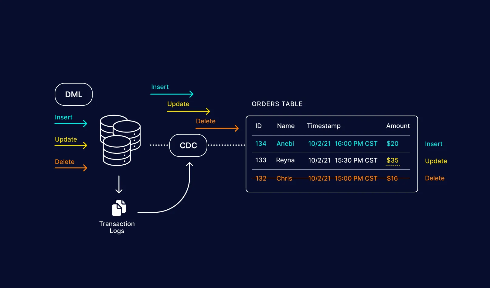

---
authors:
  - admin
categories:
  - Knowledge
tags:
  - Data
date:
  created: 2024-03-24
  update: 2024-09-17
draft: false
---

# Change Data Capture (CDC)

{ loading=lazy }

**Change Data Capture** (CDC) is a design pattern that identifies and tracks changes
in data so that action can be taken using this change data. It’s particularly
crucial in data-driven architectures where it’s essential to promptly and reliably
capture the modifications in the source data store and propagate them to downstream
systems. CDC can be applied in various scenarios, including data replication,
data warehousing, real-time analytics, and more.

<!-- more -->

## Implementing Change Data Capture

CDC can be implemented using different approaches based on the source system and
its capabilities:

1. **Log-Based CDC**: This method utilizes the transaction logs generated by
   databases to capture changes. It offers high performance and minimal impact
   on the source system.

2. **Trigger-Based CDC**: Here, triggers are set up on tables to detect changes,
   and when triggered, they capture the changes and push them to the target
   system. This approach is relatively easy to implement but might affect the
   source system’s performance.

3. **Replication-Based CDC**: Some databases offer built-in replication features
   that can be used for CDC. This approach provides an efficient and integrated
   solution but may be limited to specific database technologies.

4. **API-Based CDC**: For applications without built-in CDC support, custom APIs
   can be created to extract and propagate changes.

## Example

Implementing Change Data Capture (CDC) in Python involves monitoring changes in
a source database and capturing them for propagation to a target system.
To demonstrate a simple example of CDC using Python, we will use a log-based
approach to monitor an SQLite database and print the changes made to the database.

```python
import sqlite3
import time

# Function to monitor and capture changes in the database
def capture_changes():
    connection = sqlite3.connect('your_database.db')
    cursor = connection.cursor()

    last_rowid = 0

    while True:
        # Get the maximum rowid from the source table
        cursor.execute("SELECT MAX(rowid) FROM your_source_table")
        max_rowid = cursor.fetchone()[0]

        # If the maximum rowid is greater than the last captured rowid, there are new changes
        if max_rowid > last_rowid:
            cursor.execute("SELECT * FROM your_source_table WHERE rowid > ?", (last_rowid,))
            changes = cursor.fetchall()

            print("Changes captured:")
            for change in changes:
                print(change)

            # Update the last captured rowid to the maximum rowid for the next iteration
            last_rowid = max_rowid

        # Wait for a short period before checking for new changes again
        time.sleep(1)

if __name__ == "__main__":
    capture_changes()
```

## References

- [Medium: Change Data Capture (CDC)](https://medium.com/@venkatkarthick15/change-data-capture-cdc-3a076c9bdaa3)
- [Medium: The Change Data Capture (CDC) Design Pattern](https://medium.com/@luishrsoares/the-change-data-capture-cdc-design-pattern-fa8d3adc964f)
- [Medium: CDC from zero to hero](https://medium.com/plumbersofdatascience/cdc-from-zero-to-hero-a5a2fb8ee67b)
- [Medium: Change Data Capture (CDC): Empowering Real-time Data Integration](https://medium.com/@evertongomede/change-data-capture-cdc-empowering-real-time-data-integration-d83317af82ef)
