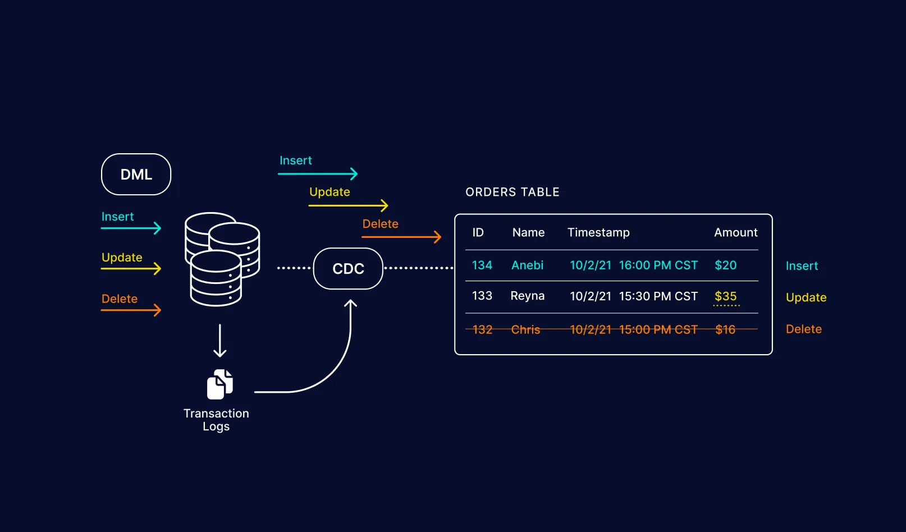

---
authors:
  - admin
categories:
  - Knowledge
tags:
  - Data
date:
  created: 2024-03-24
  update: 2024-03-24
draft: true
---

# Change Data Capture (CDC)

{ loading=lazy }

**Change Data Capture** (CDC) is a design pattern that identifies and tracks changes
in data so that action can be taken using this change data. It’s particularly
crucial in data-driven architectures where it’s essential to promptly and reliably
capture the modifications in the source data store and propagate them to downstream
systems. CDC can be applied in various scenarios, including data replication,
data warehousing, real-time analytics, and more.

<!-- more -->

## References

- [Medium: Change Data Capture (CDC)](https://medium.com/@venkatkarthick15/change-data-capture-cdc-3a076c9bdaa3)
- [Medium: The Change Data Capture (CDC) Design Pattern](https://medium.com/@luishrsoares/the-change-data-capture-cdc-design-pattern-fa8d3adc964f)
