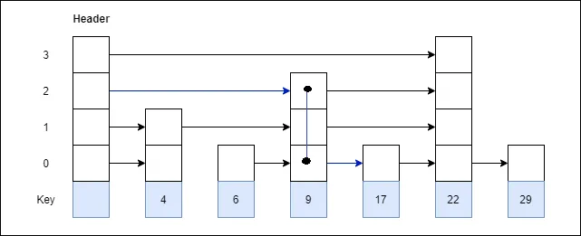

---
authors:
  - admin
categories:
  - Knowledge
tags:
  - Data
date:
  created: 2024-03-24
  update: 2024-03-24
draft: true
---

# Data Structure

:material-queue-first-in-last-out:

## Directed Acyclic Graph (DAG)

A DAG is a specific type of graph. It can be seen as a graphical representation
of causal effects i.e. a node in a DAG is the result of an action/relation of its
predecessor node. It has the following properties.

<!-- more -->

- Has Nodes, Edges & Direction
- No cycle
- Topologically sorted/ordered
- Idempotent

!!! note

    * Node -> Entity/Process
    * Edges -> Relationship
    * Direction -> Flow

Owing to the above-mentioned properties, DAGs are useful when it comes to optimization.
We can optimize the flow by transitive reduction (removing unnecessary edges).

DAGs are used in workflow engines like `Airflow`, real-time data computation engines
like `Storm`, and data processing engines like `Spark`.

## Skip List

The skip list is a probabilistic data structure that is built upon the general
idea of a linked list. A skip list starts with an ordered linked list. It uses
probability to build subsequent layers of linked lists upon the original linked
list. Each additional layer of links contains a subset of elements from previous
layers.

In a skip list, if we have to insert a new node, only the adjacent nodes will be
affected, so we can still access a large part of our data while this is happening.

!!! note

    * Search - avg O(logn) worst O(n)
    * Insertion - avg O(logn) worst O(n)
    * Deletion - avg O(logn) worst O(n)

Skip lists can be used as alternatives to balanced trees (e.g. AVL trees) and
self-adjusting trees (e.g. splay trees). Skip list is an in-memory data structure
used in **Redis**.

## References

- [5 Data Structures That You Probably Aren’t Familiar With](https://levelup.gitconnected.com/5-data-structures-that-you-probably-are-unfamiliar-with-but-are-extremely-useful-6d3b47f51b0c)
- [:simple-medium: Advance Data Structures for Data Engineering — Part I](https://blog.devgenius.io/advance-data-structures-for-data-engineering-part-i-78ffd2fdd017)
- [:simple-medium: Advance Data Structures for Data Engineering — Part II](https://blog.devgenius.io/advance-data-structures-for-data-engineering-part-ii-71e9901f1b3d)
