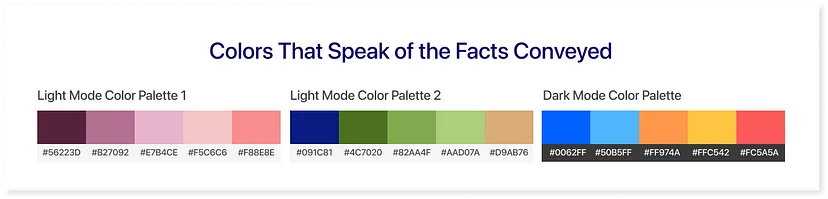

# Data Storytelling

!!! quote

    In a world of information and patterns, **Data Storytelling** is a beautiful art
    form that uses ones and zeros.[^1]

**Data Storytelling** entails communicating facts to a specific audience.
It showcases the company’s effectiveness and influence on its customers.
Through data insights and beautiful representation, it conveys the entire story
of the essential performance metrics, organizational strategies, and processes.

## What Are The Components Of Data Storytelling?

Data storytelling has four main parts: data, visual design, narration, and communication.
You need to effectively communicate and share it with your audience.

1) Data: The foundation of data storytelling is the data and its credibility. First and foremost, data analytics are very important. This helps a person find insights in the data and draw a conclusion. These key insights build the narration while proving its credibility and usage. When you have a thorough understanding of the data, it provides a stronger basis for supporting the numbers.

2) Visual Design: Visually designing your data can enhance the process of data storytelling; examples include charts, graphs, KPIs, tables, etc. These visuals can turn complex concepts into easy narratives. By combining narrative and graphic representation, one can smoothly deliver the information and improve its recall for future use.

3) Narrative: Narration is important in data storytelling since it requires expressing data verbally or in written form. It acts as an outlet for communicating to the target audience the story created through analyzing data. While showing the data, you can give recommendations or suggestions based on the data, pointing out vulnerable plots.

4) Communication: To succeed in data storytelling, you need to know your audience, set clear goals, and have feedback mechanisms in place. To build interesting data narratives, one must understand the audience and their distinct viewpoints, inclinations, and expertise.

Let’s come to the main question — how is data storytelling beneficial for businesses?
Well, businesses often become overwhelmed by a sea of data when navigating the
maze. A directing light — data storytelling paves the way to clarity!

## Why Is Data Storytelling Important For Your Business?

!!! quote

    Numbers have an important story to tell. They rely on you to give them a clear
    and convincing voice. — Stephen Few.

The extraction of value from the data that a company has gathered is an important step in strategizing its business plans.

Easing complexity by sharing insights: It’s often a complex procedure if the data comes in a huge bunch. Data storytelling plays a major role in simplifying complexity. It transforms data into easily understandable insights using visuals, narratives, and various charts like bar charts, columns, and pie charts. It builds a bridge between the tangled data and meaningful information.

Its main job is to simplify complex concepts so that normal users can grasp the importance of those data points. Thus, apply them to their business growth.

Make strategic decisions: Knowledge is power. By knowing the context or story behind every piece of information, companies can make strategic decisions. Businesses can successfully coordinate their growth strategies and set goals by utilizing the effectiveness of data storytelling. With this strategy, businesses can use the context and narrative capabilities of data to guide their decision-making and coordinate efforts to meet their objectives.

Presenting data driven storytelling: Businesses can successfully communicate the narrative the data offers by using impact storytelling. By relating insights to real people and events, this strategy increases their applicability and makes them more accessible in the workplace. Companies may include stakeholders, decision-makers, and workers and ensure that the insights drawn from the data align with their objectives and experiences by narratively presenting the data. This strategy helps the business make better decisions by increasing the effect of data-driven insights.

Also, it grabs people’s attention and sparks emotions, which motivates them to take action. Thus, the organization can aim to create a data-driven culture. This involves identifying areas for improvement and understanding complex processes. Examples of these processes include customer service and supply chain management.

Making a connection with data storytelling: One of the best practices of data storytelling is making it interactive. It lies in the message you convey through your data. The clearer the narrative of your data is, the better they can connect with or relate to it.

For instance, questions like “Will the presentation offer actionable insights to stakeholders? or Do these trends hold any significance?” can go deeper into the root cause, and thus getting a solution will be easy.

The trick to successful data storytelling is — when it blends together narratives, real-life events, and fascinating experiences. Communicating data and connecting with your clients with an element of authenticity makes your message more relatable.

## Steps to a Persuasive Data Storytelling Presentation

The power of data storytelling lies in the simplification of complicated information. It enhances effectiveness by utilizing visual representation, while traditional data storytelling relies on conventional elements like character, conflict, and resolution.

Data storytelling is like an artist choosing colors and brushstrokes to create feelings. It uses visuals, narratives, and settings to engage and convince listeners. By carefully selecting and presenting data, you can transform complex information into a captivating narrative that connects and motivates action. Creating a compelling data story helps make informed decisions, facilitates effective interaction, and drives positive change in various industries.

We all know that datasets are just numbers without the story that lies behind them, right? If the data is easy to understand, imagine the time and effort it can save. You can utilize these efforts to generate ideas for making better business decisions. We will examine the topic in more detail.

The characters that represent your ideal customer or group of clients are basically user personas. This helps in understanding your customers better by identifying things like their interests, personalities, or ages. These personas help in connecting with or communicating with your audience about the product marketing approach on a deeper level. This aids in understanding their choices and preferences.

For instance — a dashboard with personalized hubs that help your audience use your product without any complications can make things easy. It will captivate a diverse audience from different departments. But before that — there are some crucial questions to focus on:

- What kind of data analysis and storytelling are they interested in? Use data to construct a picture that clarifies their course.
- A broad overview or a close examination of the data — what do they prefer? Adapt your story to their understanding and grab their attention.
- Are they beginners or professionals? Acknowledge their expertise and interact with them accordingly.

The ability to effectively build an engaging narrative that keeps your audience interested in your story is a must. Ultimately, your ability to captivate them determines the impact of your data narrative presentation and the resulting outcome.

### Colors That Speak of the Facts Conveyed:

Using color in data storytelling presentations is a bonus to a compelling narrative — it helps your audience understand the information more effectively. Data shown in green may indicate a favorable outcome, whereas data displayed in red may demonstrate a poor outcome.

A personalized dashboard that helps you easily understand important information can greatly affect your clients.

### Develop Engagement Among Users

Prioritize the interests of your targeted audience. You could improve their engagement and make it more interactive and engaging by responding to their queries and comprehending their expectations.

Responding to their questions and understanding their expectations is a successful strategy. This encourages a feeling of participation and connection while also enabling you to customize your material or products to suit their requirements better. A more pleasant and meaningful encounter may arise from taking the time to listen and understand their preferences, which will eventually boost audience participation and trust.

### Visualizing Data Insights:

Data visualization storytelling plays the ultimate role. You can impress your audience with your data by using charts, filters, buttons, and visuals instead of dull tables and sheets. To learn more about the principles of effective data visualization, click here.

You may compare data, evaluate performance, and draw attention to variations between scenarios by using data visualization and storytelling. This gives you the opportunity to provide useful feedback and pointers to your audience. This will help them progress toward their objectives.

## Data Storytelling in Action

Developing compelling and intuitive dashboard designs is essential for thriving in today’s highly competitive business world. In response to this need, mokkup.ai created a design platform that gives businesses the ability to produce interactive dashboards.

Key performance indicators (KPIs): KPI metrics are valuable in determining how well a business is doing in reaching specific targets. You can compare past and present information when you customize dashboards with Mokkup, which is one of its best features. As a result, users will find it easy to understand and will visualize the information being presented.

Themes: Is spring green the brand color for your organization, and are you seeking to align the dashboard’s color scheme accordingly? Enhance the dashboard easily by using different styles and themes that match your preferences and clients’ needs. You can effortlessly achieve the appearance you want owing to this flexibility.

Charts and Maps: Charts give you an almost limitless number of alternatives. You can enhance the quality of your dashboard design. Combo charts, pie charts, donut-shaped charts, funnel charts, and more are merely a few examples of the alternatives available. There are more alternatives available, including area and line charts. So use your imagination to create an incredible data storytelling screen for your dashboard.

Including maps can further enhance the visual appeal and context of data that is geographically focused. In such circumstances, you have the opportunity to explore the geomap, treemap, and heatmap. Isn’t it better to use a map to display information about a specific location rather than bland tables?

However, balancing the use of tables with other visual elements can avoid overwhelming the dashboard with excessive data. Instead of relying completely on bland tables, maps such as geomaps, treemaps, and heatmaps offer a more engaging and intuitive way to convey information.

## Final Thoughts

Presenting data storytelling in an accessible manner can have a greater impact on your audience. It transforms complex numbers into visually appealing content, making it more engaging and easy to understand. It will be simple for the average user to understand the story the numbers are trying to tell. There is no other format that can compare to the impact that words and images have on the audience’s minds.

Finally, knowing your audience and their needs and keeping your presentation concise will help you make effective data storytelling presentations.

[^1]: [Can Data Make You a Better Storyteller?](https://medium.com/@mokkup/can-data-make-you-a-better-storyteller-868cdd2e25c9)
