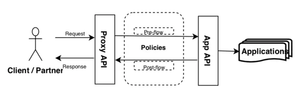
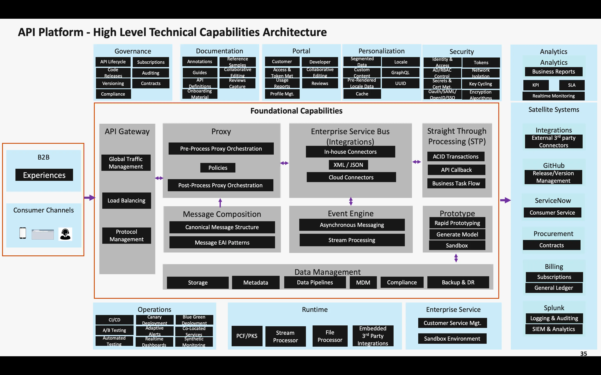

# API

API-First design is an architectural approach where systems are designed and built
with API consumers as the primary consumers.

## Strategy

## Best Practices for URL design

## References

- [Api Design & Best Practices](https://medium.com/api-design-principles-and-best-practices/api-design-best-practices-e940c7ea3fc5)
