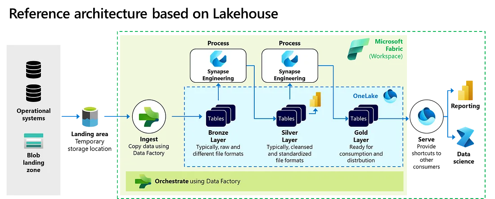
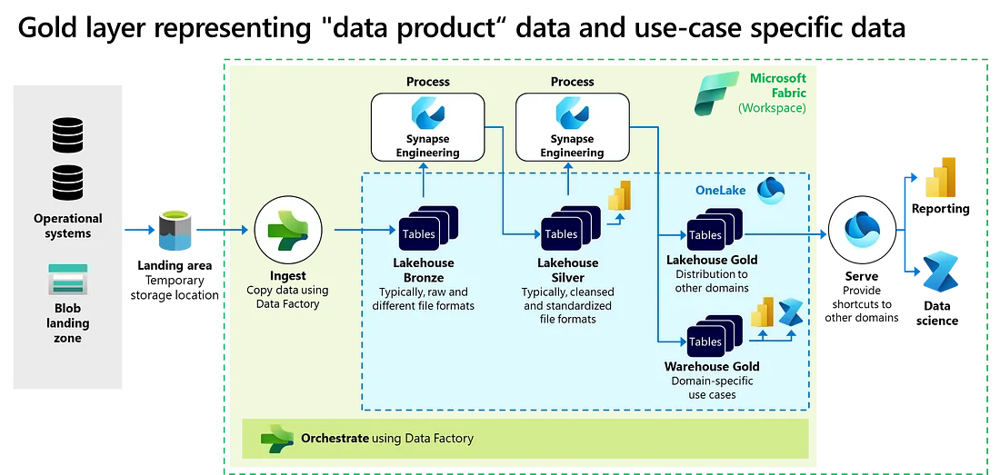
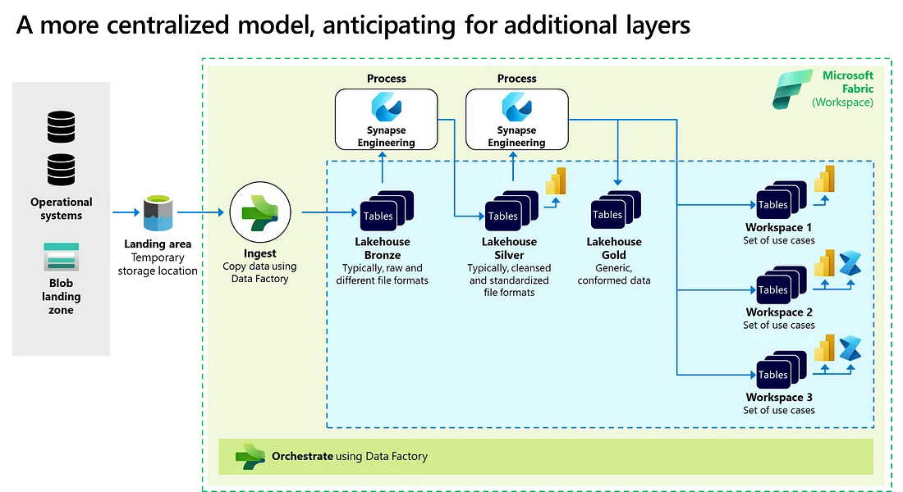

# Lakehouse on Azure Fabric

Many of my clients employ a Medallion structure to logically arrange data in a
**Lakehouse**.
They process incoming data through various stages or layers.
The most recognized layout, illustrated below, incorporates Bronze, Silver, and Gold
layers, thus the term "[**Medallion architecture**](https://www.databricks.com/glossary/medallion-architecture)"
is used.

## Data platform strategy

The first and most important consideration for layering your architecture is
determining how your data platform is used.
A centralized and shared data platform is expected to have quite a different structure
than a federated multi-platform structure that is used by many domains.
The layering also varies based on whether you align platform(s) with the
source-system side or consuming side of your architecture.
A source-system aligned platform is usually easier to standardize in terms of layering
and structure than a consumer-aligned platform given the more diverse data usage
characteristics on the consumption side.

{ loading=lazy }

{ loading=lazy }

{ loading=lazy }

## References

- [Medallion architecture: best practices for managing Bronze, Silver and Gold](https://piethein.medium.com/medallion-architecture-best-practices-for-managing-bronze-silver-and-gold-486de7c90055)
