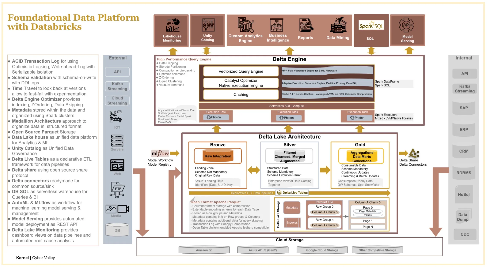

# Data Platform Strategy with Databricks

!!! quote

    **Data Lakes are not efficient** and data lakes often end up being data swamps
    for medium to large implementations.

## References

- [:simple-medium: Foundational Data Platform Strategy with Databricks](https://medium.com/@vijay.polsani/foundational-data-platform-strategy-with-databricks-1557616a0c9c)
