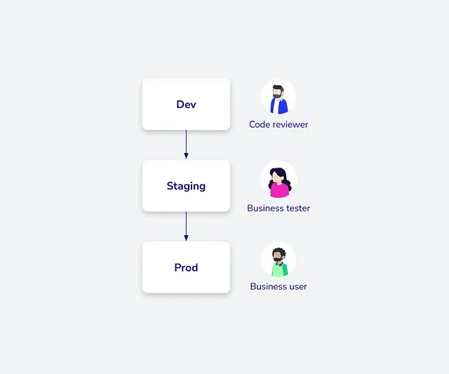

# Internal Analytics

## Best Practices in Internal Analytics

Let’s also mention some best practices we found very useful. From our previous
experience, we knew that maintaining end-to-end analytics is no easy task.
Anything can happen at any time: an upstream data source might change, the definition
of certain metrics might alter or break, among other possibilities.
However, one commonality persists — it often leads to broken analytics.
Our goal was to minimize these disruptions as much as possible. To achieve this,
we borrowed practices from software engineering, such as version control, tests,
code reviews, and the use of different environments, and applied them to analytics.

The following image outlines our approach.

We utilized multiple environments: dev, staging, and production. Why did we do this?
Let’s say a data analyst wants to change the dbt model of revenue. This would likely
involve editing the SQL code. Such modifications can introduce various issues,
and it’s risky to experiment with production analytics that stakeholders rely on.

Therefore, a much better approach is to first make those changes in an environment
where the data analyst can experiment without any negative consequences
(i.e., the dev environment). Furthermore, the analyst pushes their changes to platforms
like GitHub or GitLab. Here, you can set up CI/CD pipelines to automatically verify
the changes. Another data analyst can also review the code to ensure there are no
issues. Once the data analysts are satisfied with the changes, they move them to
the staging environment, where stakeholders can review the changes. When everyone
agrees the updates are ready, they are then pushed to the production environment.

This means that the probability of something breaking is still the same, but the
probability of something breaking in production is much lower.

Effectively, we treat analytics similarly to any software system. Combining tools
such as Meltano, dbt, and GoodData facilitates this harmonization. These tools
inherently embrace these best practices. Dbt models provide universally
comprehensible data model definitions, and GoodData allows for the extraction
of metric and dashboard definitions in YAML/JSON formats, enabling analytics
versioning via git. This approach resonates with us because it proactively averts
production issues and offers an excellent operational experience.

## References

- [:simple-medium: How to Build Internal Analytics Without Relying on Senior Engineers](https://medium.com/gooddata-developers/how-to-build-internal-analytics-without-relying-on-senior-engineers-b2d5032be2bc)
