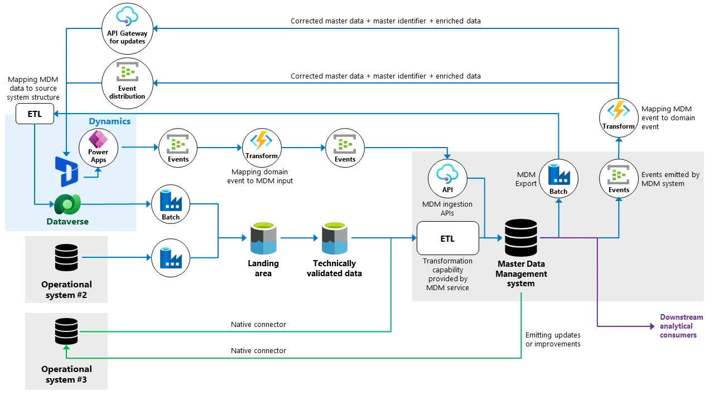
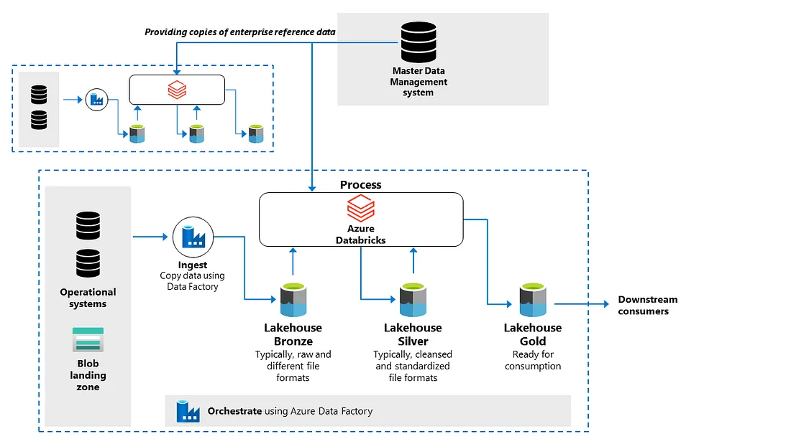

# Master Data Management

A successful **Master Data Management (MDM)** implementation is no simple task. It
involves choosing the right scope with approach, and overcoming numerous data
integration hurdles such as data quality, data consolidation from disparate sources,
and maintaining data uniformity across different business units. In this post,
we’ll explore some of these challenges in detail, offering insights into how they
can be effectively managed to ensure your MDM strategy delivers the most value.

## Discussing a real-life Coexistence style example

The Coexistence pattern within Master Data Management is involving, especially when
it comes to integration. A real-life example of the style can be seen in the diagram
below, which includes multiple source systems.

## Managing reference data

Unlike master data, reference data can be managed within individual domains.
To ensure consistency of reference data across various domains, it’s crucial to
guide your teams to synchronize their data distribution processes with the centrally
managed reference data. Currency codes, country codes, and product codes are common
examples of reference data that should be provided. This data can be published,
for example, in a central master data management system. When any of your domains
distribute data to other domains, they should use the identifiers from the enterprise
reference data to classify the data. The mapping of local data to enterprise data
allows other domains to quickly recognize master data.

## Conclusion

Despite the numerous benefits, MDM can be challenging to maintain due to the many
integration challenges. These can range from data standardization issues to the
complexity of integrating disparate source systems and the need for continuous
synchronization between the MDM system and source systems. However, with the right
strategy, tools, and governance framework, these challenges can be effectively
managed, making MDM a powerful asset in the data management landscape.

A significant portion of the content in this blog post has been sourced from the
book "[Data Management at Scale.](https://www.oreilly.com/library/view/data-management-at/9781098138851/)"
For readers who are interested in gaining a deeper understanding of master data
management and its associated challenges, there is a comprehensive chapter dedicated
to this topic. I highly recommend taking a look for yourself.

## References

- [:simple-medium: Understanding Master Data Management’s integration challenges](https://piethein.medium.com/understanding-master-data-managements-integration-challenges-a41f6ed0f702)
