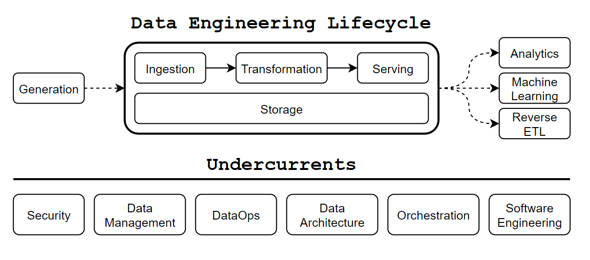

# Welcome to **Data Develop & Engineer**

This project will deliver all knowledge from my experience and other sharing
knowledge in **_Data Develop and Engineer_** area.

!!! warning "Important"

    This project I am working on doesn't have much proper _English_ grammar.
    Because I'm in the middle of trying to practice writing and reading. Please
    understand this issue before going deeper into it :face_holding_back_tears:

## Getting Started

:material-page-last: First, I will start reading the popular Data Engineering books from worldwide. That
have many blogs represent many different books to you, but I see that it has some
book that you should to read that they say you should too.

!!! quote "What is DE do?"

    **Data Engineer** is who able to _Develop_, _Operate_, and _Maintain_ of
    **Data Infrastructure**, either On-Premises or Clouds, comprising databases,
    storages, compute engines, and pipelines to Extract, Transform, and Load Data.[^1]

<figure markdown="span">
  { loading=lazy width="650" }
  <figcaption><a href="https://www.techment.com/unlocking-the-power-of-data-a-beginners-guide-to-data-engineering/">Life Cycle of Data Engineering</a></figcaption>
</figure>

<u>**Data engineering** is a critical part of the data lifecycle that enables organizations
to manage and process large volumes of data efficiently and reliably</u>[^3].
By these concepts, **Data Engineers** can design and implement data pipelines
that meet the requirements of their organizations and ensure that their data is
managed consistently and reliably.

:material-page-last: When I started, I got the idea about the future of my responsibilities.
I know the Data Engineering tools will shift so fast because last three year I
start with the map-reduce processing on **Hadoop HDFS** but nowadays, it changes
to in-memory processing like **Impala** or **Spark**.
You will see below the **Data Landscape** :material-land-plots: that show about how
many possibility tools that able to use on your work.

<figure markdown="span">
  { loading=lazy width="650" }
  <figcaption><a href="https://mad.firstmark.com/">The 2023 MAD (ML/AI/DATA) Landscape</a></figcaption>
</figure>

:material-page-last: Finally, I drop the books and go to start searching and
observing about trend of **Data Engineering**.

- [:simple-medium: The Future of the Data Engineer part I](https://medium.com/@AnalyticsAtMeta/the-future-of-the-data-engineer-part-i-32bd125465be)
- [:simple-medium: My Predictions for Data Engineering](https://medium.com/art-of-data-engineering/my-predictions-for-data-engineering-in-2024-0723fa7a6e04)

## Roles

In the future, if I do not in love with communication or management knowledge
that make me be :material-face-agent: [**Lead of Data Engineer**](roles/lead_data_engineer/index.md),
I will go to any specialize roles such as,

- :material-face-man: [**Data Platform Engineer**](roles/data_platform_engineer/index.md)
- :material-face-man-shimmer: [**DataOps Engineer**](roles/dataops_engineer/index.md)
- :material-face-man-profile: [**MLOps Engineer**](roles/mlops_engineer/index.md)
- :material-face-woman: [**Analytic Engineer**](roles/analytic_engineer/index.md)

## Communities

This below is the list of communities that must learn about Coding knowledge and
Data Engineering tools.

-   :simple-medium: **Data Engineering**

    ---
    A Medium Tag for Data Engineering knowledge and solutions.

    [:octicons-arrow-right-24: Go Through](https://medium.com/tag/data-engineering)

-   :simple-medium: **ODDS Team**

    ---
    A Group that believes software development should be joyful and advocates
    deliberate practice.

    [:octicons-arrow-right-24: Go Through](https://medium.com/tag/data-engineering)

[^1]: Information of this quote reference from [:simple-medium: What is Data Engineering?](https://medium.com/codex/what-is-data-engineering-407bcf860baf)
[^2]: [:material-land-plots: The 2023 MAD (ML/AI/DATA) Landscape](https://mad.firstmark.com/)
[^3]: Unlocking the Power of Data: [:material-web:A Beginner’s Guide to Data Engineering](https://www.techment.com/unlocking-the-power-of-data-a-beginners-guide-to-data-engineering/)
