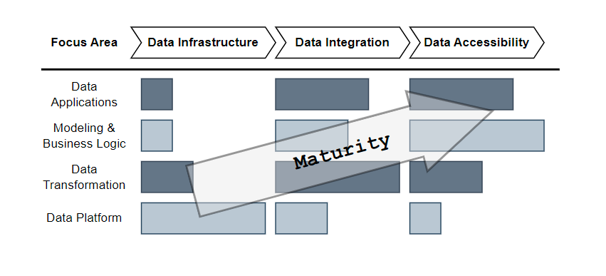

# Welcome to **Data Develop & Engineer**

> **_Disclaimer_**: This docs add-on my opinion from **Data Engineer** experience
> and experiment around ~5 years (_Since 2019_).

!!! warning "Important"

    I do not have much proper _English_ grammar because I am in the middle level
    of trying to practice writing and reading.
    Please understand this problem and open your mind before continue this
    documents :face_holding_back_tears:

This project will deliver all Practice and Knowledge of **Data Developer and Engineer**
area.

## :material-arrow-down-right: Getting Started

:material-page-last: First, ^^**Data engineering** is a critical part of the
data lifecycle that enables organizations to manage and process large volumes of
data efficiently and reliably^^[^3].
By these concepts, **Data Engineer** can design and implement **Data Pipelines**
that meet the requirements of their organizations and ensure that their data is
managed _Consistently_ and _Reliably_.

!!! quote "What is DE do?"

    **Data Engineer** is who able to ==_**Develop**_, _**Operate**_, and _**Maintain**_==
    of **Data Infrastructure**, either On-Premises or Clouds, comprising databases,
    storages, compute engines, and pipelines to Extract, Transform, and Load Data.[^1]

<figure markdown="span">
  { loading=lazy width="650" }
  <figcaption><a href="https://www.techment.com/unlocking-the-power-of-data-a-beginners-guide-to-data-engineering/">Life Cycle of Data Engineering</a></figcaption>
</figure>

:material-page-last: When I started on this role, I got the idea about the future
of my responsibilities. I know the Data Engineering tools will shift so fast because
the last three year I start with the map-reduce processing on **Hadoop HDFS** but
nowadays, it changes to in-memory processing like **Impala** or **Spark**.

{ loading=lazy width="350" align=right }

You will see the right picture, the [**2023 MAD (ML/AI/Data) Landscape** :material-land-plots:](https://mad.firstmark.com/),
that show about how many possibility tools that able to use on your project.
It has many area that you should to choose which one that match with the current
architect or fit with your cost planing model.

:material-page-last: Finally, the below diagram shows ^^how the focus areas of
**Data Engineering Shift** as the analytics organization evolves^^.

<figure markdown="span">
  { loading=lazy width="650" }
  <figcaption><a href="https://medium.com/@AnalyticsAtMeta/the-future-of-the-data-engineer-part-i-32bd125465be">Data Engineering Shift</a></figcaption>
</figure>

Based upon this illustration, we can observe three distinct focus areas for the
role:

- **Data Infrastructure**: One example of a problem being solved in this instance might
  be setting up a spark cluster for users to issue HQL queries against data on S3.

- **Data Integration**: An example task would be creating a dataset via SQL query,
  joining tens of other datasets, and then scheduling the query to run daily using
  the orchestration framework.

- **Data Accessibility**: An example could be enabling end-users to analyze significant
  metrics movements in a self-serve manner.

:material-page-last: Additional, the trend of ^^**Modern Data Stack**^^ will make
the **Data Engineering** so easy and force you have the time to focus on
**Business Problem**.
In the another hand, **Business Users** able to use less of technical knowledge
to interact the Data in the **Data Platform** that make less of SLA to require
**Data Engineer** a lot! :partying_face:

---

## :material-account-arrow-right-outline: Roles

:material-page-last: In the future, if I do not in love with communication or management
level skill that make me be :material-face-agent: [**Lead of Data Engineer**](roles/lead_data_engineer/index.md),
I will go to any specialize roles such as,

- :material-face-man: [**Data Platform Engineer**](roles/data_platform_engineer/index.md)
- :material-face-man-shimmer: [**DataOps Engineer**](roles/dataops_engineer/index.md)
- :material-face-man-profile: [**MLOps Engineer**](roles/mlops_engineer/index.md)
- :material-face-woman: [**Analytic Engineer**](roles/analytic_engineer/index.md)

---

## :material-account-supervisor-outline: Communities

:material-page-last: This below is the list of Communities that must learn about
Coding knowledge and Data Engineering tools.

-   :simple-medium: **Data Engineering**

    ---
    The **Medium Tag** for Data Engineering knowledge and solutions :octicons-share-android-24:

    [:octicons-arrow-right-24: Go Through](https://medium.com/tag/data-engineering)

-   :material-coffee-to-go-outline: **Data Engineer Cafe**

    ---
    An **Area of Discussing Blog** for Data Engineer like talk to your close friend
    at the Cafe :material-coffee-maker-outline:

    [:octicons-arrow-right-24: Go Through](https://discuss.dataengineercafe.io/)

-   :simple-medium: **ODDS Team**

    ---
    The **Medium Group** that believes software development should be joyful and
    advocates deliberate practice :material-human-greeting-proximity:

    [:octicons-arrow-right-24: Go Through](https://medium.com/tag/data-engineering)

-   :material-map-marker-path: **TPA Roadmap**

    ---
    **Community Driven Roadmaps, Articles and Resources** for developers in Thailand

    [:octicons-arrow-right-24: Go Through](https://roadmap.thaiprogrammer.org/)

---

## :octicons-skip-24: TL; DR

Why Data Engineer?

### Methodologies

- **Discovery Phase:**

  At this early stage, flexibility is crucial because requirements in large enterprises often evolve. Identify the primary and secondary stakeholders. Meet them, and get their avatar into an orientation diagram or slide deck. These are ultimately your customers; engagement with them will make or break your project. Identify the product owner. This person, or people, will own the delivery and operations for this data product. They will be your tiebreakers and demo audience, and they are the ones who will sign off on your project's delivery.

- **Requirements Gathering**

  The process of gathering requirements from various stakeholders can be technically and inter-personally challenging. Not everyone will have the same understanding of the problem or its solutions. Techniques such as interviews, surveys, and workshops will help expose these differences so that we can work towards getting everyone on the same page. Mock-ups and wireframes can also help flush out requirements at this phase.

- **Design and Planning**

  Data engineers should plan the architecture, data pipelines, and infrastructure
  based on the gathered requirements. This phase should stress the importance of
  designing for scalability and maintainability. Deciding to buy or build happens
  here. Will there be legacy code to deal with, existing system integrations, or greenfield? Consider which systems will consume the data when selecting a data store. Web apps will need low-latency data stores and will benefit from caching (think MemCacheD). Dashboards usually work best with relational database systems such as PostGres or MySQL, and caching may not be ideal for real-time or near-real-time data, but read replicas may help fan out the read load. Most data projects will benefit from an ETL (Extract, Transform, Load) pattern, where each step is a discrete, independent step that can be run and tested in isolation and end to end. The artifacts from this design process should include diagrams, documentation, and, hopefully, the beginnings of test cases. It would also be a good idea to start a source-to-target mapping that defines the data points in the consuming application (dashboard, web app, etc.) and shows their lineage all the way back to their original source.

- **Story grooming and Backlog building**

  Once we have a design and some test cases, we identify the Minimum Viable Product (MVP).
  This could be a thin slice of functionality where a subset of data is exposed
  end to end or a single data source end to end, the idea is to break up the work
  into phases or chunks that are more manageable. Features are written to encapsulate
  the required work for each part of the MVP, those features are filled in with
  the user stories that make that feature work. At this point, you will want a
  detailed design for the MVP, including data flows, expected inputs and outputs,
  API contracts, etc. The components not in scope for MVP can have epics and even
  features at this point, but since you will learn as you build out MVP, it might
  make sense to leave the detail for non-MVP components until closer to the delivery
  of the MVP.

- **Implementation and Testing**

  Once we have user stories, engineers can fill out the tasks that will satisfy the user story requirements. We can take these requirements and start writing tests that our production code will then satisfy. Some organizations will open a pull request with just the test cases to facilitate the conversation with the technical team and stakeholders. Initial development artifacts should include production code and unit tests. As complete functionality is deployed, integration tests can be built out where real data moves through the pipeline and is measured at critical points during its journey for accuracy and completeness. Once the entire pipeline is in place, we develop our end-to-end tests that cover the complete pipeline with checks to ensure we push the right data to the correct place. Using this test-driven development (TDD) approach, we can ensure the person writing the software feature is writing just the code needed to satisfy requirements and nothing more. This goes a long way to cut down the number of defects and missed requirements.

- **Validation and Quality Assurance**: **Tracking row counts at every point in the pipeline and automated tests for known business rules will eliminate many validation issues**

  Having Subject Matter Experts (SMEs) or Business analysts with domain knowledge get eyeballs on the data will identify problems before production. This means providing a stable, consistent, accessible place for validations. A good artifact from this process is a data quality report that shows the health or quality of data at each step in the pipeline. Things like anomaly detection on the values can automate the detection of bugs or drift.

- **Feedback Loops**

  Throughout each phase of this methodology, stakeholders should establish feedback loops to ensure alignment and address evolving requirements. Initially, initial diagrams, documentation, and story grooming can help establish feedback loops. Later, regular and frequent demos and design reviews will help shape conversations around expectations and functionality.

- **Hand-off**

  Once the functionality is delivered, an operations team must be trained to support and maintain the application. Clear diagrams and documentation will aid this process. Runbooks and troubleshooting guides are also invaluable at this point. Ideally, most of the invasive maintenance has been automated, and the operations team is left to handle support requests, such as requests for access, data issues, etc. Metrics such as the number of incidents and their root causes will help illuminate where future development work might need to happen.

**Conclusion**:

- Know your customers: Strong stakeholder and product owner relationships are often at the crux of a successful data project.
- Drive consensus using diagrams, documentation, and test cases. The availability of such intellectual artifacts will likely shape the project delivery.
- Focus on repeatability and testing: time spent here early on will pay dividends later in the development lifecycle.

[^1]: Information of this quote reference from [:simple-medium: What is Data Engineering?](https://medium.com/codex/what-is-data-engineering-407bcf860baf)
[^2]: [:material-land-plots: The 2023 MAD (ML/AI/DATA) Landscape](https://mad.firstmark.com/)
[^3]: Unlocking the Power of Data: [:material-web:A Beginner’s Guide to Data Engineering](https://www.techment.com/unlocking-the-power-of-data-a-beginners-guide-to-data-engineering/)
[^4]: Types of Data Professionals, credit to [:material-linkedin: Kevin Rosamont Prombo](https://www.linkedin.com/in/krosamont/) for creating the [infographic](https://kevros.shinyapps.io/radar_skills/)
