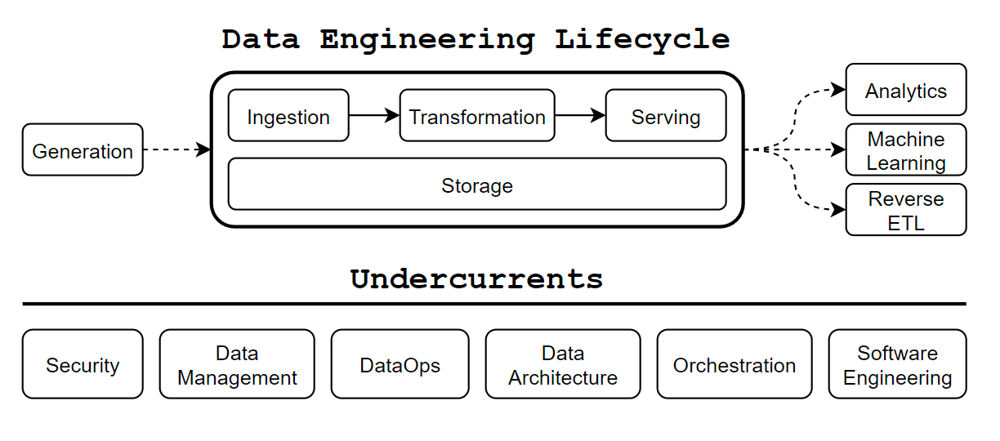
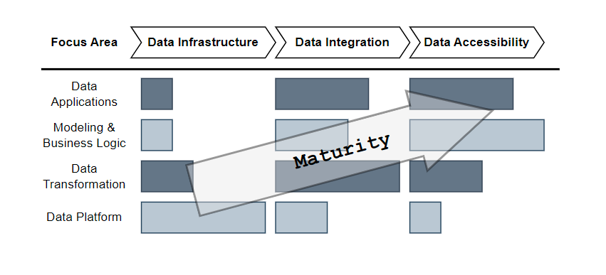

# **Data Develop & Engineer**

> **_ต้องขอบอกไว้ก่อนว่า_**: เรื่องราวทั้งหมดเกิดจากความคิดเห็นส่วนและมุมมองตัวของผมเองเกือบทั้งหมดที่ได้
> เริ่มทำงานและเรียนรู้ในสายงาน data engineer ประมาณ 6 ปี (ตั้งแต่ปี 2019)

โปรเจคนี้จะเป็นการสรุปและแนะนำหลักการและความรู้ทั้งหมดในสายงาน **Data Developer and Engineer**.

---

## :material-arrow-down-right: Getting Started

:material-page-last: First, ^^**Data Engineering** is a critical part of the
==Data Lifecycle== that enables organizations to manage and process large volumes
of data efficiently and reliably^^[^3].

By these concepts, **Data Engineer** should design and implement **Data Pipeline**
and **Data Management Strategy** that meet the requirements and KPI of their
organizations and ensure that your data was managed _Consistently_ and _Reliably_.

!!! quote "What is DE do?"

    **Data Engineer** is who able to ==_**Develop**_, _**Implement**_, _**Operate**_,
    and _**Maintain**_== any tools on the current **Data Infrastructure** that
    your organization use, either On-premises or Cloud providers, comprising databases,
    storages, compute engines, and pipelines.[^1]

<figure markdown="span">
  { loading=lazy width="650" }
  <figcaption><a href="https://www.techment.com/unlocking-the-power-of-data-a-beginners-guide-to-data-engineering/">Life Cycle of Data Engineering</a></figcaption>
</figure>

!!! quote "Fundamentals of Data Engineering"

    **Data Engineering** is the development, implementation, and maintenance of
    systems and processes that take in raw data and produce high-quality, consistent
    information that supports downstream use cases, such as analysis and machine
    learning.

    **Data engineering** is the intersection of security, data management, DataOps,
    data architecture, orchestration, and software engineering.

    A **Data Engineer** manages the ^^Data Engineering Lifecycle^^, beginning with
    getting data from source systems and ending with serving data for use cases,
    such as analysis or machine learning.

    — Joe Reis and Matt Housley in [Fundamentals of Data Engineering](https://www.oreilly.com/library/view/fundamentals-of-data/9781098108298/)

You will see that stages of the cycle include _Data Ingestion_, _Data Transformation_,
_Data Serving_, and _Data Storage_ components.

| Best practice               | Importance                                                                                                                                      |
|-----------------------------|-------------------------------------------------------------------------------------------------------------------------------------------------|
| Proactive data monitoring   | Regularly checks datasets for anomalies to maintain data integrity. This includes identifying missing, duplicate, or inconsistent data entries. |
| Schema drift management     | Detects and addresses changes in data structure, ensuring compatibility and reducing data pipeline breaks.                                      |
| Continuous documentation    | Manages descriptive information about data, aiding in discoverability and comprehension.                                                        |
| Data security measures      | Controls and monitors access to data sources, enhancing security and compliance.                                                                |
| Version control and backups | Tracks change to datasets over time, aiding in reproducibility and audit trails.                                                                |

:material-page-last: Since I started on this role, I got the idea about the future
of my responsibilities. I know the Data Engineering tools shifts so fast because
the last three year I started with the Map-Reduce processing on the **Hadoop HDFS**
but nowadays, it changes to In-Memory processing like **Impala** or **Spark**.
The knowledge I gained from Map-Reduce will be wasted :boom:.

{ loading=lazy width="370" align=right }

The right picture, the [**2023 MAD (ML/AI/Data) Landscape** :material-land-plots:](https://mad.firstmark.com/)[^2],
that show about how many possibility tools that able to use on your project.
It has many area that you should to choose which one that match with the current
architect or fit with your cost planing model.

---

:material-page-last: Finally, the below diagram shows ^^how the focus areas of
**Data Engineering Shift** as the analytics organization evolves^^.
That mean Data Engineer does not create a part of data ingestion or serving only.
When data engineering tools change very quickly, The focus of data engineers has
changed as well.

<figure markdown="span">
  { loading=lazy width="700" }
  <figcaption><a href="https://medium.com/@AnalyticsAtMeta/the-future-of-the-data-engineer-part-i-32bd125465be">Data Engineering Shift</a></figcaption>
</figure>

Based upon this illustration, we can observe three distinct focus areas for the
role:

- **Data Infrastructure**: One example of a problem being solved in this instance might
  be setting up a spark cluster for users to issue HQL queries against data on S3.

- **Data Integration**: An example task would be creating a dataset via SQL query,
  joining tens of other datasets, and then scheduling the query to run daily using
  the orchestration framework.

- **Data Accessibility**: An example could be enabling end-users to analyze significant
  metrics movements in a self-serve manner.

---

:material-page-last: The trend of ^^**Modern Data Stack**^^ will make a data
engineering process so easy to implement and maintenance that making you have
the time to focus on **business problem** instead technical problem.

In the another side, **Business users** able to use less of technical knowledge
to interact the serving data in their **data contract platform**.
It decrease SLA to require the **data engineer** for need support a lot! :partying_face:

You can follow the modern data stack on the below topics:

- [**Services**](./services/index.md)
- [**Tools**](./tools/index.md)

---

## :material-account-arrow-right-outline: Roles

:material-page-last: In the future, if I do not in love with communication or management
skill that make me be :material-face-agent: [**Lead Data Engineer**](lead-data-engineer.md),
I will go to any specialize roles such as,

-   :material-face-man: **Data Platform Engineer**

    ---
    Data Platform Engineer

    [Read More about **Data Architect**](./abstract/data_architecture/index.md)

-   :material-face-man-shimmer: **DataOps Engineer**

    ---
    DataOps Engineer

    [Read More about **DataOps**](./abstract/dataops/index.md)

-   :material-face-man-profile: **MLOps Engineer**

    ---
    MLOps Engineers Build and Maintain a platform to enable the development
    and deployment of machine learning models. They typically do that
    through standardization, automation, and monitoring.

    MLOps Engineers reiterate the platform and processes to make the machine
    learning model development and deployment quicker, more reliable, reproducible,
    and efficient.

    [Read More about **MLOps**](./abstract/mlops/index.md)

-   :material-face-woman: **Analytic Engineer**

    ---
    Analytic Engineer is who make sure that companies can understand their data
    and use it to _Solve Problems_, _Answer Questions_, or _Make Decisions_.

    [Read More about **Analytic Engineer**](https://towardsdatascience.com/analytics-engineering-8b0ed0883379)

The role from above, I reference from ^^Types of Data Professionals^^[^4].

---

## :material-account-supervisor-outline: Communities

:material-page-last: This below is the list of Communities that you must join for
keep update knowledge for [Developer and Data Engineer trends](./abstract/emerging_trends/index.md).

-   [:simple-medium: **Data Engineering**](https://medium.com/tag/data-engineering)

    ---
    The **Medium Tag** for Data Engineering knowledge and solutions :octicons-share-android-24:

-   [:material-coffee-to-go-outline: **Data Engineer Cafe**](https://discuss.dataengineercafe.io/)

    ---
    An **Area of Discussing Blog** for Data Engineer like talk to your close friend
    at the Cafe :material-coffee-maker-outline:

-   [:simple-medium: **ODDS Team**](https://medium.com/tag/data-engineering)

    ---
    The **Medium Group** that believes software development should be joyful and
    advocates deliberate practice :material-human-greeting-proximity:

-   [:material-map-marker-path: **TPA Roadmap**](https://roadmap.thaiprogrammer.org/)

    ---
    **Community Driven Roadmaps, Articles and Resources** for developers in Thailand

-   [:material-package-variant-plus: **TestDriven**](https://testdriven.io/)

    ---
    Learn to build high-quality web apps with **best practices**

-   [:material-brain: **Second Brain**](https://www.ssp.sh/brain/data-engineering/)

    ---
    My inspiration Data Engineering document website.

[^1]: Information of this quote reference from [:simple-medium: What is Data Engineering?](https://medium.com/codex/what-is-data-engineering-407bcf860baf)
[^2]: [:material-land-plots: The 2023 MAD (ML/AI/DATA) Landscape](https://mad.firstmark.com/)
[^3]: Unlocking the Power of Data: [:material-web:A Beginner’s Guide to Data Engineering](https://www.techment.com/unlocking-the-power-of-data-a-beginners-guide-to-data-engineering/)
[^4]: Types of Data Professionals, credit to [:material-linkedin: Kevin Rosamont Prombo](https://www.linkedin.com/in/krosamont/) for creating the [Infographic](https://kevros.shinyapps.io/radar_skills/)
