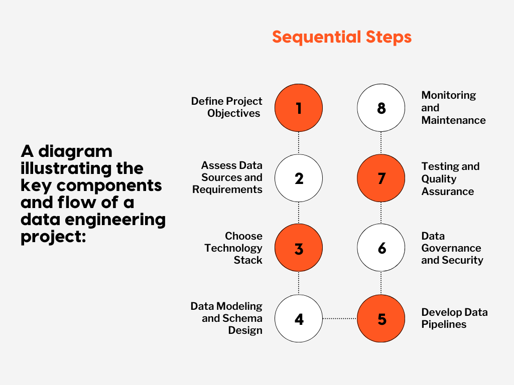

# Methodology of Data Engineer

## :material-arrow-down-right: Getting Started

The data engineering process covers a sequence of tasks that turn a large amount
of raw data into a practical product meeting the needs of analysts, data scientists,
machine learning engineers, and others.

### Discovery Phase

At this early stage, flexibility is crucial because requirements in large
enterprises often evolve.

!!! note

    Identify the ^^primary^^ and ^^secondary^^ stakeholders.

Meet them, and get their avatar into an orientation diagram or slide deck.
These are ultimately your customers; engagement with them will make or break
your project.

Identify the product owner. This person, or people, will own the delivery and
operations for this data product. They will be your tiebreakers and demo audience,
and they are the ones who will sign off on your project's delivery.

### Requirements Gathering

The process of gathering requirements from various stakeholders can be technically
and inter-personally challenging. Not everyone will have the same understanding
of the problem or its solutions. Techniques such as interviews, surveys,
and workshops will help expose these differences so that we can work towards
getting everyone on the same page. Mock-ups and wireframes can also help
flush out requirements at this phase.

[Read More about Requirements Gathering](./requirements-gathering.md)

### Design and Planning

Data engineers should plan the architecture, data pipelines, and infrastructure
based on the gathered requirements. This phase should stress the importance of
designing for scalability and maintainability. Deciding to buy or build happens
here. Will there be legacy code to deal with, existing system integrations, or greenfield? Consider which systems will consume the data when selecting a data store. Web apps will need low-latency data stores and will benefit from caching (think MemCacheD). Dashboards usually work best with relational database systems such as PostGres or MySQL, and caching may not be ideal for real-time or near-real-time data, but read replicas may help fan out the read load. Most data projects will benefit from an ETL (Extract, Transform, Load) pattern, where each step is a discrete, independent step that can be run and tested in isolation and end to end. The artifacts from this design process should include diagrams, documentation, and, hopefully, the beginnings of test cases. It would also be a good idea to start a source-to-target mapping that defines the data points in the consuming application (dashboard, web app, etc.) and shows their lineage all the way back to their original source.

### Story grooming and Backlog building

Once we have a design and some test cases, we identify the Minimum Viable Product (MVP).
This could be a thin slice of functionality where a subset of data is exposed
end to end or a single data source end to end, the idea is to break up the work
into phases or chunks that are more manageable.

Features are written to encapsulate the required work for each part of the MVP,
those features are filled in with the user stories that make that feature work.
At this point, you will want a detailed design for the MVP, including data flows,
expected inputs and outputs, API contracts, etc.
The components not in scope for MVP can have epics and even features at this point,
but since you will learn as you build out MVP, it might make sense to leave the
detail for non-MVP components until closer to the delivery of the MVP.

### Implementation and Testing

Once we have user stories, engineers can fill out the tasks that will satisfy
the user story requirements.
We can take these requirements and start writing tests that our production code
will then satisfy.
Some organizations will open a pull request with just the test cases to facilitate
the conversation with the technical team and stakeholders.
Initial development artifacts should include production code and unit tests.
As complete functionality is deployed, integration tests can be built out where
real data moves through the pipeline and is measured at critical points during
its journey for accuracy and completeness.

Once the entire pipeline is in place, we develop our end-to-end tests that cover
the complete pipeline with checks to ensure we push the right data to the correct
place. Using this test-driven development (TDD) approach, we can ensure the person
writing the software feature is writing just the code needed to satisfy requirements
and nothing more. This goes a long way to cut down the number of defects and missed
requirements.

### Validation and Quality Assurance

**Tracking row counts at every point in the pipeline and automated tests for known
business rules will eliminate many validation issues**

Having Subject Matter Experts (SMEs) or Business analysts with domain knowledge
get eyeballs on the data will identify problems before production.
This means providing a stable, consistent, accessible place for validations.
A good artifact from this process is a data quality report that shows the health
or quality of data at each step in the pipeline. Things like anomaly detection
on the values can automate the detection of bugs or drift.

### Feedback Loops

Throughout each phase of this methodology, stakeholders should establish feedback
loops to ensure alignment and address evolving requirements.
Initially, initial diagrams, documentation, and story grooming can help establish
feedback loops. Later, regular and frequent demos and design reviews will help
shape conversations around expectations and functionality.

### Hand-off

Once the functionality is delivered, an operations team must be trained to
support and maintain the application. Clear diagrams and documentation will
aid this process. Run-books and troubleshooting guides are also invaluable at
this point. Ideally, most of the invasive maintenance has been automated,
and the operations team is left to handle support requests, such as requests for
access, data issues, etc. Metrics such as the number of incidents and their root
causes will help illuminate where future development work might need to happen.

---

## Conclusion

- Know your customers: Strong stakeholder and product owner relationships are
  often at the crux of a successful data project.
- Drive consensus using diagrams, documentation, and test cases.
  The availability of such intellectual artifacts will likely shape the project
  delivery.
- Focus on repeatability and testing: time spent here early on will pay dividends
  later in the development lifecycle.

## Read Mores

- [A Comprehensive Guide on Planning a Data Engineering Project](https://www.fissionlabs.com/blog-posts/a-comprehensive-guide-on-planning-a-data-engineering-project)
