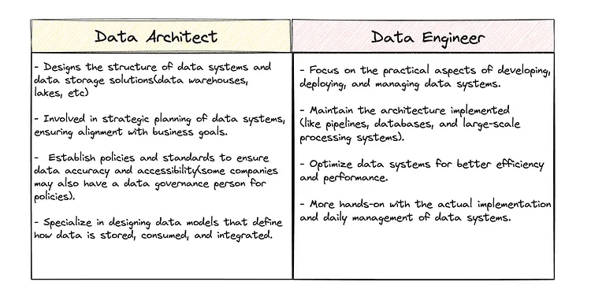
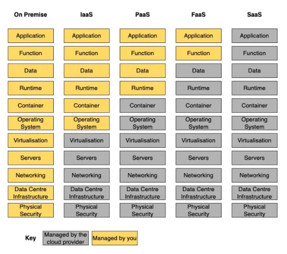

# Data Platform Engineer

## Why?

- สามารถออกแบบ Data Platform Architecture ให้เหมาะสมกับการใช้ data ในบริษัทได้
- สามารถสร้างและดูแล Data Platform ให้ scalability และ reliability โดยใช้ resource/cost ให้คุ้มค่าที่สุด

---

- [Building a Data Platform in 2024](https://towardsdatascience.com/building-a-data-platform-in-2024-d63c736cccef)
- https://life.wongnai.com/get-to-know-data-platform-engineer-role-at-lmwn-4b43443eaca8
- [Medium: Cloud Agnostic Data Platform](https://medium.com/@mariusz_kujawski/cloud-agnostic-data-platform-3aedd6d0eb3b)
- [Modern Architecture for Emerging Data Infrastructures](https://premvishnoi.medium.com/modern-architecture-for-merging-data-infrastructures-8223a6dda911)
- [Modern Architecture for Emerging Data Infrastructures](https://premvishnoi.medium.com/modern-architecture-for-merging-data-infrastructures-8223a6dda911)

## What is Data Architecture?

**Data Architecture** is the blueprint of a data system that serves the business
requirements of a product and describes how data is collected, stored, transformed
and distributed.
It consists of data models, governance policies, rules and standards that need
to be implemented and followed to build a robust and secure data system.

## Data Platform Architect

- [Data Platforms : Good Architect — Bad Architect](https://medium.com/dcsfamily/data-platforms-good-architect-bad-architect-cb9bdee35c34)

## Knowledge

- [My key takeaways after building a data engineering platform](https://medium.com/datamindedbe/my-key-takeaways-for-building-a-data-product-307ad06e529f)
- [Microservices vs. Monolithic Approaches in Data](https://towardsdatascience.com/microservices-vs-monolithic-approaches-in-data-8d9d9a064d06)

## Use Cases

- https://medium.com/cj-express-tech-tildi/journey-of-tildi-data-engineer-in-2023-%E0%B8%81%E0%B8%B2%E0%B8%A3%E0%B8%9E%E0%B8%B1%E0%B8%92%E0%B8%99%E0%B8%B2-data-platform-%E0%B8%AD%E0%B8%A2%E0%B9%88%E0%B8%B2%E0%B8%87%E0%B8%95%E0%B9%88%E0%B8%AD%E0%B9%80%E0%B8%99%E0%B8%B7%E0%B9%88%E0%B8%AD%E0%B8%87-fd8a795f3942
