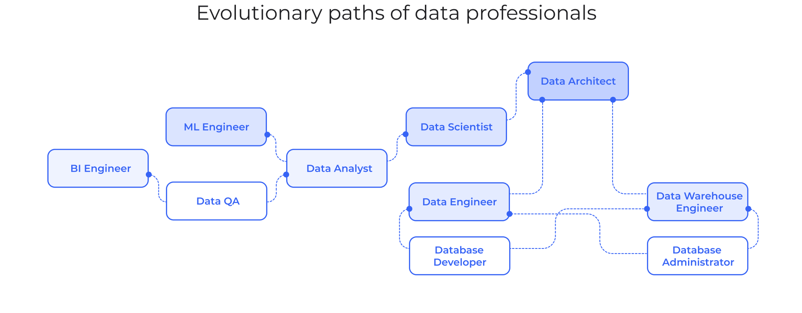
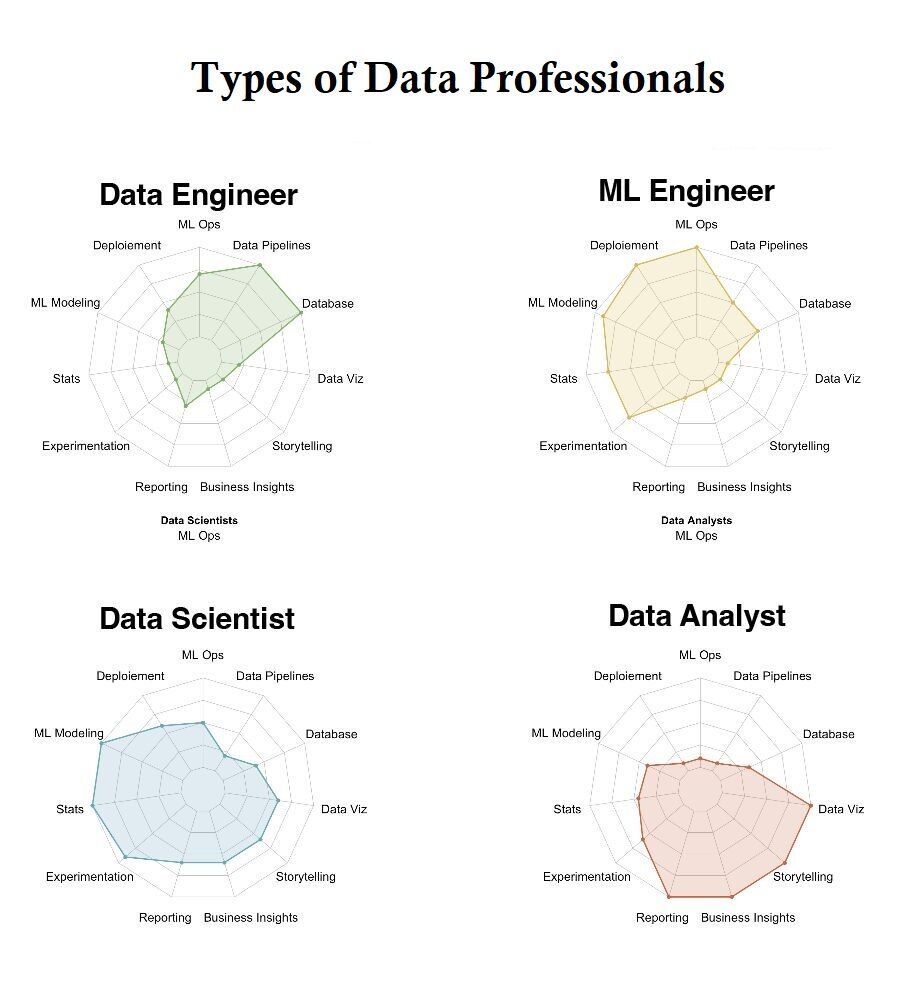

# Roles

<figure markdown="span">
  { loading=lazy }
  <figcaption>Evolutionary Paths of Data Professionals</figcaption>
</figure>

<figure markdown="span">
  { loading=lazy }
  <figcaption>Types of Data Professionals</figcaption>
</figure>

[^1]: Types of Data Professionals, credit to [:material-linkedin: Kevin Rosamont Prombo](https://www.linkedin.com/in/krosamont/) for creating the [infographic](https://kevros.shinyapps.io/radar_skills/)
[^2]: [Data Professionals -- An Overview](https://www.ssa.group/blog/data-professionals-an-overview/)
