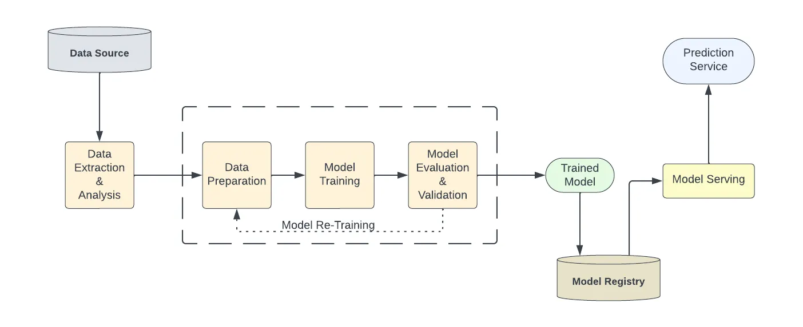

# MlOps Engineer

!!! quote

    MLOps = DevOps + DataOps + ModelOps[^1]

{ loading=lazy }

## References

- [MLOps — What, Why and How](https://medium.com/@anup0999/mlops-what-why-and-how-7c1e0eb39ca1)

[^1]: [Architecting MLOps on the Lakehouse](https://www.databricks.com/blog/2022/06/22/architecting-mlops-on-the-lakehouse.html)
