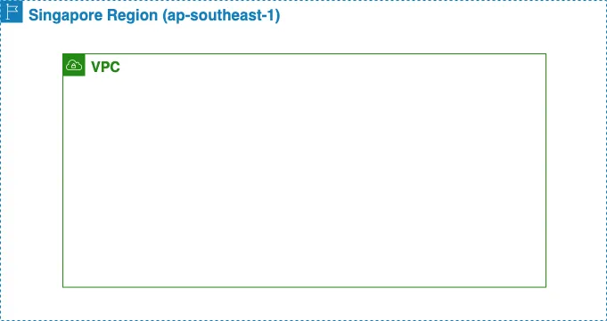

# VPC

**Virtual Private Cloud (VPC)** is service to manage all networks in AWS in virtual,
that mean you do not need to do anything on the physical layer.

!!! note

    The reason why it is named VPC instead of the more meaningful term "virtual
    network" is that the Cloud wants to convey that
    ^^"users can create their own private network"^^.[^1]

## :material-arrow-down-right: Getting Started

VPC เป็นตัวช่วยในการจัดการส่วน Network แทบจะทั้งหมดที่อยู่บน AWS Cloud. Region คือภูมิภาคที่ทาง AWS
ให้บริการ โดยเราสามารถเลือก region ที่ใกล้กับประเทศเรามากสุดได้ เพื่อให้ user ใช้งานได้อย่างรวดเร็วและมีประสิทธิภาพ

ซึ่ง VPC อยู่ภายใต้ Region ถ้าเราลองแปลงเป็นรูปภาพง่ายๆ จะได้ดังนี้



### Create

-   Go to **VPC** > Click **Your VPCs** > Start **Create VPC**
-   Add `Name tag` that is your VPC name and its naming convention should be;

    ```text
    Name tag: <prefix>-<resource>-<project>-<environment>-vpc
    ```

    - `<prefix>`: คือคำขึ้นต้นเจ้าของใช้ชื่อ ลูกค้าหรือบริษัทเป็นตัวกำหนด
    - `<resource>`: คือชื่อของ service ที่เราใช้เช่น ec2, radis, rds เป็นต้น
    - `<project>`: คือชื่อ project ที่เราจะใช้ vpc ตัวนี้ในการจัดการ
    - `vpc`: คือ suffix หรือคำลงท้ายเพื่อให้ง่ายต่อการใช้งานเวลาใช้ vpc ร่วมกับตัวอื่น

-   Add `IPv4 CIDR block` value for your VPC

    คือตัวกำหนด IPv4 CIDR block ให้กับ VPC ในช่วง /16 ถึง /28
    โดยเจ้าของบทความใช้ 10.0.0.0/16 ซึ่งสามารถใช้ IPs ได้ถึง 65,536 IPs เลยทีเดียว [<<อ่าน CIDR เพิ่มเติม>>](https://kubeopsskills.medium.com/cidr-a9dd71921aa2)

เมื่อเราสร้าง VPC เสร็จแล้ว เราจะพบว่าเราสามารถจัดการ resource ที่อยู่ภายใน VPC ได้ หนึ่งใน resource
นั้นก็คือ AZ หรือ Availability Zone ทางเจ้าของบทความนั้นในตอนแรกได้เลือก region: Singapore
ซึ่งทำให้เราสามารถจัดการ AZ ได้ 3 Zone คือ ap-southeast-1a, ap-southeast-1b และ ap-southeast-1c

### Availability Zone

Availability Zone (AZ) ก็คือ data center ของ cloud ที่ตั้งเป็นตึกหรือสำนักงานอยู่ใน region นั้น
โดยส่วนใหญ่แล้วในหนึ่ง region จะมี data center อยู่ประมาณ 2–3 แห่ง จุดประสงค์คือ เพื่อป้องกันภัยธรรมชาติ
หรือเหตุการณ์ไม่คาดฝัน เมื่อแห่งนึงล่มไป ยังมีอีก 1–2 แห่งคอย support อยู่

ซึ่งเราสามารถเลือกที่จะ**ใช้ AZ เดียวก็ได้** แต่เราต้องยอมรับนะ ว่าหากเกิดเหตุการณ์ไม่คาดฝันเกิดขึ้น
**ข้อมูลของเราสามารถสูญหายได้เช่นกัน**

[^1]: [:simple-medium: AWS VPC คืออะไร? มาทำความรู้จักกัน](https://jumpbox.medium.com/aws-vpc-%E0%B8%84%E0%B8%B7%E0%B8%AD%E0%B8%AD%E0%B8%B0%E0%B9%84%E0%B8%A3-%E0%B8%A1%E0%B8%B2%E0%B8%97%E0%B8%B3%E0%B8%84%E0%B8%A7%E0%B8%B2%E0%B8%A1%E0%B8%A3%E0%B8%B9%E0%B9%89%E0%B8%88%E0%B8%B1%E0%B8%81%E0%B8%81%E0%B8%B1%E0%B8%99-ep-1-588c5a2a0d91)
